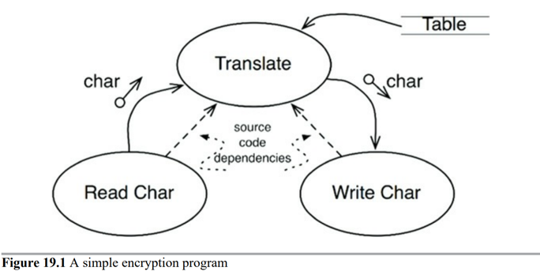

https://www.oreilly.com/library/view/clean-architecture-a/9780134494272/

소프트웨어 시스템은 정책을 기술한 것. 

아키텍쳐 개발은 같은 정책으로 묶인 모듈들을 비순환 방향 그래프로 구성하는 기술을 포함 (DAG)

# 1. 문자를 읽어서, 테이블을 참조해 문자를 번역한 뒤, 번역된 문자를 출력장치로 기록한다.

현재의 소스코드 의존성이 다음과 같이 가리키는데, 어떻게 호출되는것일까? 데이터 흐름은 아래처럼일테고.

text = readChar()

translated_text = translate(text)

file.write(translated_text)

[문자읽기] -> [번역] -> [문자쓰기]

translate(){
    text = readChar()
    translated_text = dictionary.get(text)
    writeTranslated(translated_text)
}

고수준인 translate 함수가 저수준인 stdin이랑 writeTranslated에 의존하고 있다.   

