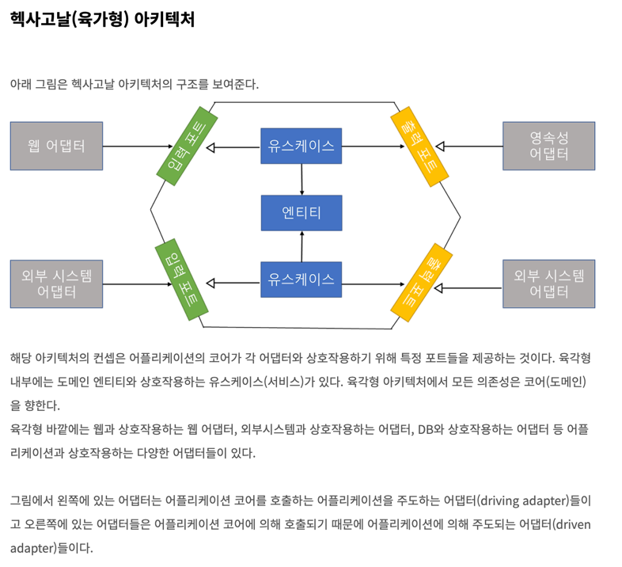
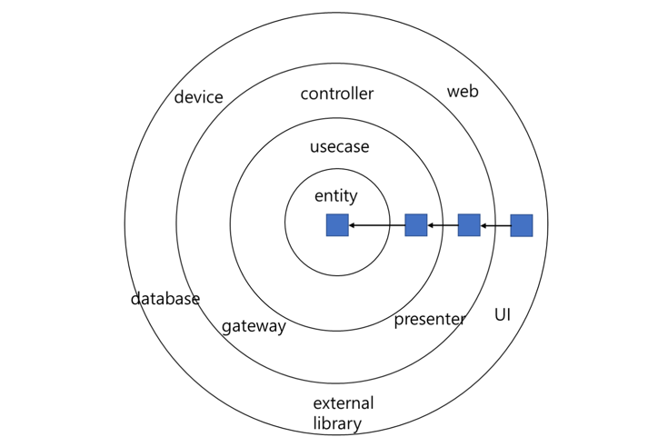

# 22. 클린 아키텍쳐

아키텍쳐 아이디어

- Hexagonal Architecture
- Data, Context and Interaction
- Boundary-Control-Entity

# 1. 육각형 아키텍쳐와 같은 위 아키텍쳐 아이디어들은 어떤 특징을 중시하는가?

 정답 

- UI, DB, 프레임워크 독립성
- 육각형 아키텍쳐는 그중에서도 특정 adapter가 usecase 사용을 위한 포트(인터페이스)를 사용하는 방식이다.
  - 입력이 들어오는 Controller가 어댑터가 되고, 특정 usecase 호출하는 포트(라고는 하지만 그냥 인터페이스 함수)를 사용한다.
  - https://devkingdom.tistory.com/341?category=838914
  - https://devkingdom.tistory.com/342

# 2. 컨트롤러에서 사용자가 원하는 데이터를 담아서 리턴하려고 DTO를 만들었다. 마침 UI에서도 같은 데이터를 사용하면 좋을 것 같아서 해당 DTO의 요소들을 렌더링하도록 했다. 무엇이 문제일까?

 정답 

의존성 규칙은 잘 준수했다. 고로 일단 문제없음?

# 3. 때로는 유즈케이스에서 view의 데이터를 채워주는 역할인 프리젠터를 호출해야할 때가 있다. 문제인 이유와 어떻게 문제를 해결할 수 있는가?

 정답 

- 유즈케이스가 더 내부의 원 (고수준)이기 때문이다. 
- 제어흐름이 유즈케이스 -> 프리젠터 & 의존성도 유즈케이스 -> 프리젠터 가 된다. 
- 엔티티단에 인터페이스를 두어서 내부계층으로 호출을 하게 하고, 프리젠터가 해당 인터페이스를 구현해 의존성 역전을 시킨다.
  - 제어흐름이 유즈케이스 -> 유즈케이스 인터페이스  <- 프리젠터

# 4. 데이터 횡단할때 원 내부에 있는 객체의 수요에 맞춰서 데이터를 리턴하는 것이 좋은가, 혹은 raw한 상태로 내부의 객체들을 호출하는 것이 좋은가? 

 정답 

- 내부의 원에서 외부의 원의 데이터 구조를 알아야 한다면 안된다.
- ex.) DB에서 row 구조로 데이터 반환한다고 하면 내부 자료구조가 알수있는 형태로 데이터 전달해야 한다. 

