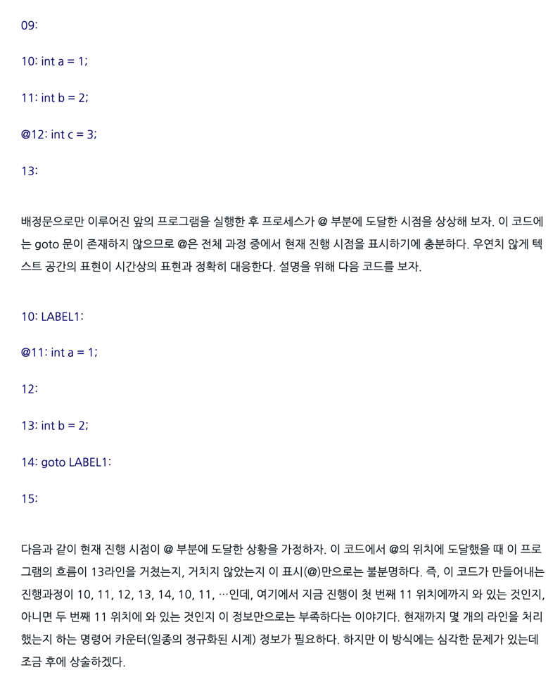

## 1. 다익스트라(데이크스트라)가 제시한 goto문의 해로움의 요지는 무엇일까요?

- https://zdnet.co.kr/view/?no=00000010060491

공간적으로 위치했을 때와 시간적으로 일치했을때 차이가 줄어들었으면 좋겠다. 
- 문제가 터졌을때 어디인지 알 수 있어야 한다. 

## 2. 구조적 프로그래밍에서 테스트의 의미는?

- 오류가 없음을 증명하는 정도이다. 
- 

