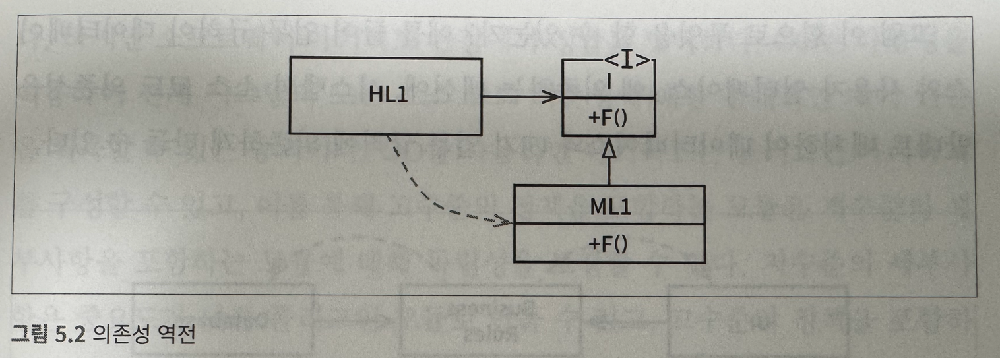

# 5장 객체 지향 프로그래밍

객체지향 설계 원칙
- 데이터와 함수의 조합?
  - 근데 o.f() == f.o() 인걸 
- 실제 세계 모델링
  - 불분명
- 캡슐화, 상속, 다형성


# 1. 아래 C++ 코드가 완전한 캡슐화를 깨뜨리게 되는 이유는?

```c++
// point.h
class Point {
public:
    Point(double x, double y);
    double distance(const Point& p) const;
 
private:
    double x;
    double y;
};

//point.cc

#include "point.h"
Point::Point(double x, double y)
: x(x) , y(y)
{}

double Point::distance(const Point& p) const {
    double dx = x-p.x;
    double dy = y-p.y;
    return sqrt(dx*dx + dy*dy);
}
```

<details>

point.h 헤더 파일을 사용하는 측에서 멤버 변수가 어떤 것이 있는지 알게된다. == 캡슐화 깨짐

즉, c언어였다면 사용자는 point.h에서 
- `struct Point* makePoint(double x, double y)` 
- `double distance (struct Point *p1, struct Point *p2) `

만 보고 사용했어야 했는데, 이제 Point의 멤버변수가 x,y가 있으니 이걸로 조작을 해야하는 지 알게 된다. 

</details>


## 다형성 개념
- UNIX 운영체제는 모든 입출력 장치 드라이버가 5가지 표준 함수 제공할 것 요구
  - Open, Close, Read, Write ,Seek
  - 파일 데이터 구조는 이 다섯 함수 가리키는 포인터 포함.
  - STDIN에 대해서 파일 데이터구조를 선언하면, STDIN에 대해 정의되어있는 저 5가지 코드에 대한 각각의 시작주소를 이 FILE 구조체에 담아서 함수 쓸 수 있게
- C++에서는 모든 가상 함수(구현안되고 상속된 후에 구현되는 함수)들이 vtable에 포인터를 가지고 있고, 모든 호출이 이 테이블 거친다.
  - 상속하면 이 vtable을 오버라이드 하면 된다. 
  - https://stackoverflow.com/questions/31300635/is-virtual-table-per-object-or-per-class
  - per class로 vtable을 두고 (static variable) 다른 상속 들어오면 override


# 2. 다음 사진은 HL1 이란 모듈이 I라는 인터페이스의 F함수를 부르는 것을 나타낸다. 왜 의존성 역전일까?



<details>

사실 H1은 ML1의 F를 부르는 것이기 때문에 , HL1이 직접적으로 ML1의 F함수를 부르는 것처럼 되야한다.

그런데 ML1은 실제로는 I를 상속하고 있다. 

HL1 -> I -> ML1 형식으로 되야 제어흐름이랑 소스코드의 의존성이 똑같은데

HL1 -> I <- ML1 형식이라서 제어흐름과 소스코드의 의존성이 역전관계이다.

제어흐름: HL1 -> I -> ML1 

소스코드 의존성: I <- ML1 

</details>

# 3. 의존성 역전이 좋은 이유는?

<details>

- 직접적으로 호출 당해야 하는 모듈을 호출하지 않기 때문에 모듈을 언제든지 갈아낄 수 있다.
- 특정 컴포넌트의 소스코드를 변경하게 된다면 해당 소스코드만 독립적으로 배포할 수 있다 (independent deployability)
- 각 모듈에 대한 독립적 개발도 가능 (independent developability)

</details>


