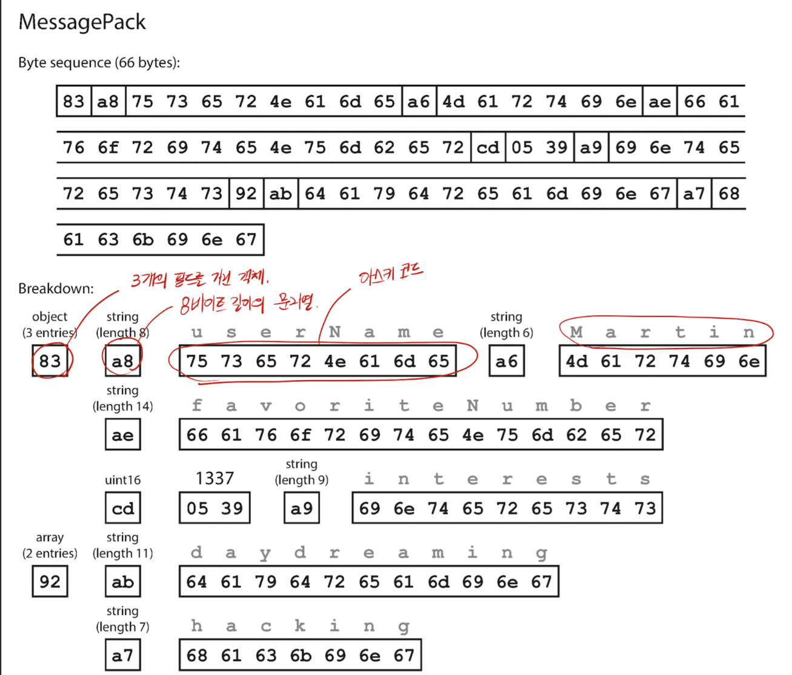
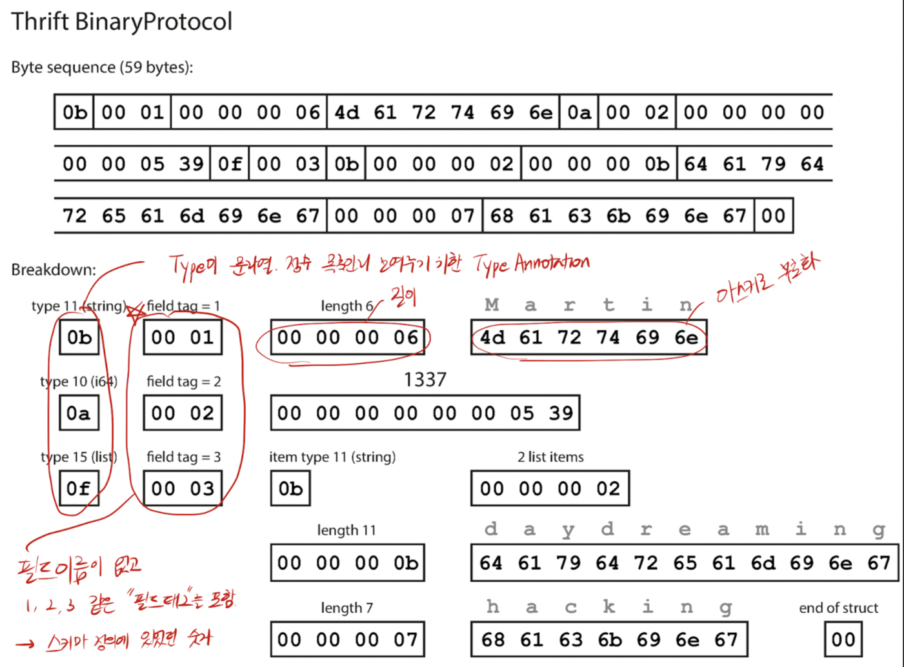

## 자바 직렬화 (마셜링)이 성능 안좋고 느린 이유

Serializable 인터페이스 구현은 매우 느리고, 사용을 지양한다. 

- Reflection을 과하게 사용 (필드정보를 런타임에 읽어오기)
- 데이터 뿐만 아니라, 패키지 정보, 타입 정보, 필드 메타데이터 등을 모두 바이트 스트림에 포함해서 파일 크기가 커짐
- 객체 간 복잡한 참조 관계 (Circular Reference) 등을 풀기 위해 많은 메모리 항당 및 탐색이 느림
- 최신 하드웨어 및 SIMD(Single Instruction, Multiple Data) 같은 최적화 기법사용 못함

단점은

- 클래스 구조 변경되면 이전 버전에서 직렬화한 데이터 역직렬화 못함
- java끼리만 통신가능.타 언어로 못넘김


그래서 대안은 

- Jackson/Gson (JSON)
- Kryo (spark 등 대용량 데이터 처리)
- Protocol Buffers (마이크로서비스간 통신, 고성능 네트워크 전송)

## 트위터 이야기

```
{
  "id": 1234567890123456789,
  "id_str": "1234567890123456789"
}
```

트위터는 위처럼 트윗 ID를 보내는데, javascript의 숫자 정밀도 문제가 있어. 

JS의 number는 64비트 double이라서, 2^53까지의 정수만 정확히 표현가능함.

BigInt를 지원하기 시작했지만 (ES2020) 내장 JSON 파싱시 자동 변환 안되는 문제가 존재한다.  (json-bigint 라는 라이브러리 존재함)


## 메시지 팩 

JSON을 어떻게 이진 부호화(binary로 직렬화) 할 것인가?  메시지 팩이다. 



## thrift와 protocol buf 

아래는 thrift binanry protocol인데 



어차피 thrift와 protocol buf는 아래처럼 순서를 정의해놨기 때문에, 순서대로 읽어주기만 하면 된다. 

```
message Person {
    required string user_name = 1;
    optional int64 favorite_number = 2;
    repeated string interests = 3; 
} 

```

protocol buffer 는 여기서 필드 타입이나 길이를 1바이트로만 표현해서 더 줄이게 된다.


## proto buf를 활용할 때 

데이터 스키마에 변경이 생긴다고 해도, 항상 대응 가능하게 됨

무조건 신규 필드 추가할 때는 optional 하거나 default값을 명시해야한다.

- writer는 backward compatibility가 된다. 
  - reader는 항상 읽을 수 있음.
- writer는 forward compatiblity가 된다
  - 새로운 코드도 optional이나 default값을 알고 있으니까. 

protobuf로 쓰여진 코드는, protobuf 이진부호로 내보내질테고, 반드시 reader측도 protobuf를 적용해야만 데이터를 읽을 수 있게 될 것.

즉, C++, 자바, C# 처럼 정적 타입 언어에서 유용함. 

### 왜 protobuf 같은게 나왔나?

마이크로서비스 체계에서는 옛날 버전과 새로운 버전의 서버 클라이언트가 동시에 실행되는 환경이 많음. 
  - 계속해서 버전이 달라지면서, 계속해서 버전을 맞춰야 하는 문제가 있음.
  - 닭이 먼저냐 달걀이 먼저냐? A가 먼저 배포했을때에도 중단이 일어나고, B가 먼저 배포하더라도 중단이 일어날 수 있음 

차라리 메시지 브로커를 통해서, 비동기식으로 메시지를 받는게 나을 수도 있다. 

신규버전 토픽과 구버전 토픽 두개에 모두 쓰다가, 신규버전 토픽을 구독하는 소비자가 배포된다면 이제 구버전 토픽에 publish 하는걸 지울 수 있다.

## 질문 
어떻게 새로운 칼럼을 도입하는가? DDL을 어떻게 변경하는가? 

우리팀은 현재는 liquibase-spring-boot-starter 을 사용해서 liquibase로 써둔 sql문들이 모두 실행되어있는 상태인지, 실행이 안되어있다면 실행시키고, 

만약 오류발생하면 롤백하고 새로운 배포버전이 배포되지 않도록 함


# 데이터 플로 모드

하나의 프로세스에서 다른 프로세스로 데이터 전달

## RPC 문제 

네트워크 요청이기 때문에 실패한게 네트워크 때문인지 앱의 예외때문인지 알 수 없다. 

다른 언어를 이용해 RPC 콜을 구현할 수는 있지만 트위터 ID 식별문제처럼 특이한 문제가 생길수도 있다. 

REST API에서는 URL이나 HTTP Accept 헤더에 버전 번호를 사용하는 방식이 일반적이다. 

API key를 사용한다면 API key 별 버전을 서버에 저장한다음, 버전이 별도 관리 인터페이스를 통해 갱신될 수 있게 설계가능하다.


## actor 
https://chatgpt.com/share/699965f4-63f8-8012-b8a2-c80e85270c7c

actor에 대해서 고찰