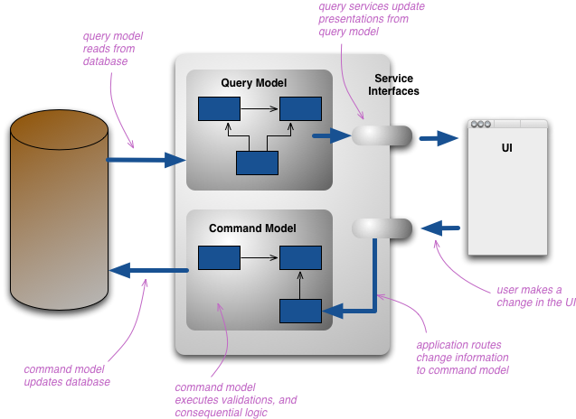

ACID

A: Atomicity - 연산이 일어나기 전과 후가 존재할뿐, 중간상태의 연산은 보이지 않는다. 

- 됐거나 안됐거나이니까 abortability라고 하면 어울릴수있다.

C: Consistency - 일관성이 있는지. 내가 수정했으면 수정된 버전의 데이터를 읽어올 수 있는지 

- 데이터에 대한 어떤 선언(불변식)이 있다는 아이디어다. - 항상 특정 데이터가 이 규칙을 따라야 한다는. 즉 DB쪽이 아니라, 어플리케이션 레벨의 일관성이다.

I: Isolation - 하나의 row에 대한 변경이 다른 row에 대한 변경으로 영향이 미치지 않아야 한다.

- 여러 트랜잭션이 동시에 실행되었더라도, 트랜잭션이 순차적으로 처리되었을 때와 결과가 동일함을 보장한다. 

D: Durability - 내결함성으로, 프로그램이 갑작스럽게 꺼지더라도, 트랜잭션이 완료된 데이터는 남아있음을 보장한다. 
 

### 다중 객체 트랜잭션

- table A를 바꿔야하고 table B를 바꿔야 할 떄 
  - 비관계형 DB는 보통 연산 묶는 방법이 없다.
    - 하지만 몽고 DB는 있군

#### dirty read

table A만 바뀐 데이터를 다른 사용자가 보는 상태.

### 🙋torn write 질문
데이터베이스가 디스크에 저장된 기존 값을 덮어쓰는 도중에 전원이 나가면 기존 값과 새 값이 함께 붙어 있게 될까? 

하드디스크에 저장해야할때, 아래와 같은 메타데이터를 줄 거아냐

써야하는 주소: 0xbb 
크기: 10byte 

5byte를 쓰다가 전원이 꺼졌으면, 내 생각에는 OS가 다시켜질때, 하드디스크에 쓰기전 로깅하던 

써야하는 주소: 0xbb 
크기: 10byte 

이 저널을 보고서 다시 쓰려고 할거라서, 기존값과 새 값이 일시적으로는 붙어있겠지만, 아무튼 최종값은 동일하다 라고 생각하는데 맞을까?

```
Write-ahead logging (WAL) 방식
1. 저널에 먼저 기록:  [새값 B×10, 주소 0xbb, 크기 10] → 커밋 마크
2. 실제 블록에 기록
3. 저널 정리
```

맞다. 

다만, DB에서는

```
DB 페이지 8KB = 섹터 2개 (각 4KB)

쓰기 도중 전원 꺼짐:
섹터1: [새값 ✓]
섹터2: [기존값 ✗]  ← 이 상태로 재부팅
```

이 페이지 기준으로 delta만 기록하기 때문에 

`WAL: "페이지 #7, offset 200, 값 A → B로 변경"` 

```
disk 페이지 #7: [섹터1=새값 | 섹터2=기존값]  ← 반쪽짜리

WAL: "offset 200, A → B"

replay 시도:
→ 페이지 #7의 현재 상태가 뭔지 알 수 없음
→ delta를 어디에 적용해야 할지 모름
```

WAL에 있는데이터가 쓸모가 없어진다. 그래서 Full Page Write 와 같이 WAL에 Full Page 기록을 남기는 방식을 취한다

PostgreSQL이 full page write

Mysql InnoDB는 DoubleWrite Buffer

```
1단계: 수정된 페이지를 doublewrite buffer (연속된 별도 영역)에 먼저 씀
       [DWB: 새값 8KB 완전히 기록] ← 여기서 끊기면 원본 페이지 멀쩡
       
2단계: 실제 data file 위치에 씀
       [data file: 쓰다가 전원 꺼짐 → torn page 발생 가능]
```


### 다중 객체 트랜잭션 

- 여러 문서를 변경해야 하는 순간, 비정규화를 해서 차라리 하나의 문서만 바꾸게 하는게 도움될 수 있다.

그러고보니 MSA는 '중간상태'를 겪을수밖에 없을텐데 어떻게 부작용을 방지할까? 

<details>

1️⃣ 상태(Status) 기반 설계 (가장 흔함)

각 서비스의 데이터에 transaction 상태 필드를 둡니다.

예시 (주문 Saga):

Order Service → 주문 생성 (status = PENDING)

Payment Service → 결제 처리

Inventory Service → 재고 차감

모두 성공 → status = COMPLETED

실패 → status = CANCELLED

사용자에게 보여줄 때는

```
SELECT * 
FROM orders
WHERE status = 'COMPLETED'
```

즉 중간 상태(PENDING)는 사용자에게 노출하지 않음.

실제 서비스에서 가장 흔한 방법입니다.

4️⃣ Read Model 분리 (CQRS)

Command (Saga 진행)
   ↓
Event
   ↓
Read Model 업데이트

실제로 사용자가 읽어가는건 read model이고, 읽기 부하를 쓰기 부하랑 분리할 수 있는 장점이 생긴다 

command model은 DB를 변경하고 

query model은 DB에서 읽어들여 




<details>

```
Client
   ↓
Command API
   ↓
Command Model (write DB)
   ↓
Domain Event 발생
   ↓
Event Broker (Kafka 등)
   ↓
Projection / Read Model Updater
   ↓
Read DB (Query Model)
```

1️⃣ Event 기반 projection (가장 정석)
OrderCreated
PaymentCompleted
InventoryReserved

이 이벤트를 소비해서 read model을 업데이트합니다.

2️⃣ CDC (Debezium 등)

말씀하신 방식입니다.

```
Write DB
   ↓
CDC
   ↓
Kafka
   ↓
Projection
   ↓
Read Model
```

CDC는 보통 다음 상황에서 사용합니다.

기존 monolith DB 활용

이벤트를 직접 발행하기 어려움

3️⃣ 직접 projection 업데이트

Command 처리 후 바로 projection DB 업데이트

```
Command Service
   ↓
Write DB update
   ↓
Event publish
   ↓
Read model update
```

</details>

5️⃣ UI 레벨 처리

</details>


### read committed

트랜잭션에서 내가 쓴 변경사항은 어떻게 보일까? 

MVCC (multiversion concurrency control)

postgresql, oracle, mysql 

트랜잭션을 시작하면, 기존 스냅샷 버전, 내가 새로 쓴 버전이 생긴다. commit을 하면 내가 새로 쓴 버전이 최신 버전이 되는거고, 그동안 read같은 데에서는 기존 스냅샷 버전을 사용 

데이터 잠금이 없어서, 빠르다. 


## 스냅숏 격리 구현 

핵심원칙은 읽는 쪽에서 쓰는 쪽 차단 안하고, 쓰는 쪽에서 읽는 쪽 차단 안하고 

mvcc를 어떻게 구현했을까?

일단 transactionId가 read요청, write요청에 대해서 계속 increment된다. 

- DB는 요청이 들어왔을때 현재 진행중인 transaction 목록이랑 각 transactionId별로 만든 변경사항들을 기록한 테이블을 갖고있다.
- 일단 read 요청이 들어오면 해당 transactionId 보다 낮은 transactionId들이 적혀있는 row에 대해서만 보여주고, 
- 더 높은 transactionId 는 DB의 transaction테이블의 변경사항을 적용하지 않았을때의 row값을 보여주는 식이다. 
- 삭제의 경우도 해당 transactionId 보다 낮은 transaction이 남아있지 않으면 garbage collection을 한다고 한다. 

postgresql 은 새 버전 append 하는 방식으로 작동하고, mysql은 변경분만큼만 undo 시킨다. 


|     | 네가 상상한 방식 | PostgreSQL MVCC 실제 |
| --- | --- | --- |
| 저장 구조 | delta log (txId → 변경분) | heap에 버전 append |
| 읽기 시 | delta 역순 적용해서 복원 | snapshot 조건으로 heap 직접 필터 |
| 복잡도 | 읽기 시 연산 O(version 수) | 읽기 시 단순 조건 비교 |


## 쓰기 skew 와, dirty update 

쓰기 skew: 둘다 operation이 성공함 (2명의 의사가 where절 확인할때까지는 둘다 가능했음)

갱신 손실: 같은 row에 대해 operation이 둘다 성공함 (1명의 의사에 대한 정보를 2명이 업데이트)

dirty update: 커밋되지 않은 결과를 다른 트랜잭션이 덮어씀 (1개는 업데이트 쳤는데 1개는 롤백됨. 롤백이 나중에 적용된 케이스)

## 직렬성

redis는 단일 스레드 트랜잭션 사용해서 직렬성 구현. 이벤트루프를 도는 스레드가 단일 스레드라서, 순차적으로 트랜잭션이 진행되게 해. 

redis는 락을 걸 필요가없으니까 락을 걸때보다 빠르다. key가 달라도 싱글 스레드에서 처리된다.

2PL의 경우는 쓰기 트랜잭션이 읽기 트랜잭션을 막는다. 

shared mode, exclusive mode 2개의 락이 존재해서, exclusive lock을 누가 얻으면 shared mode를 못 얻는다. 


### 직렬성 스냅숏 격리 

Serializable Snapshot Isolation (SSI)
- 2PL은 비관적 동시성 제어 : 뭔가잘못될 가능성 있으면 그냥 막아두자. 
- 단일 스레드 직렬성 또한 비관적 동시성 제어 

SSI는 낙관적 동시성 제어 
- 트랜잭션이 커밋될 때 격리 위반됐는지 확인 
- 쓰기는 각 스냅샷에다가 쓰게되고, 만약 쓰기작업 사이의 직렬성 충돌이 있으면 abort 시킬 트랜잭션을 결정

특정 트랜잭션이 관련 있다는걸 어떻게 알고 커밋하지? 
- 오래된 MVCC 객체 버전 읽었거나 (읽기 전에 커밋되지 않은 쓰기가 발생했다 - 미래의 데이터 위에 썼다.)
  - 읽을때는 커밋되지 않은 데이터 무시하니까 이런일 벌어지지 않는다. 
- 과거의 읽기에 영향을 미치는 쓰기 감지 (읽은 다음에 쓰기가 실행되었다. - 과거의 데이터 위에 썼다.)
  - 같은 데이터 수정되는지, 동일한 row에 접근하는 트랜잭션이 여러개인지 확인해서, 한쪽만 성공시킨다. abort되고 몇초후 다른쪽이 재실행되면 최신 데이터 읽을것.


