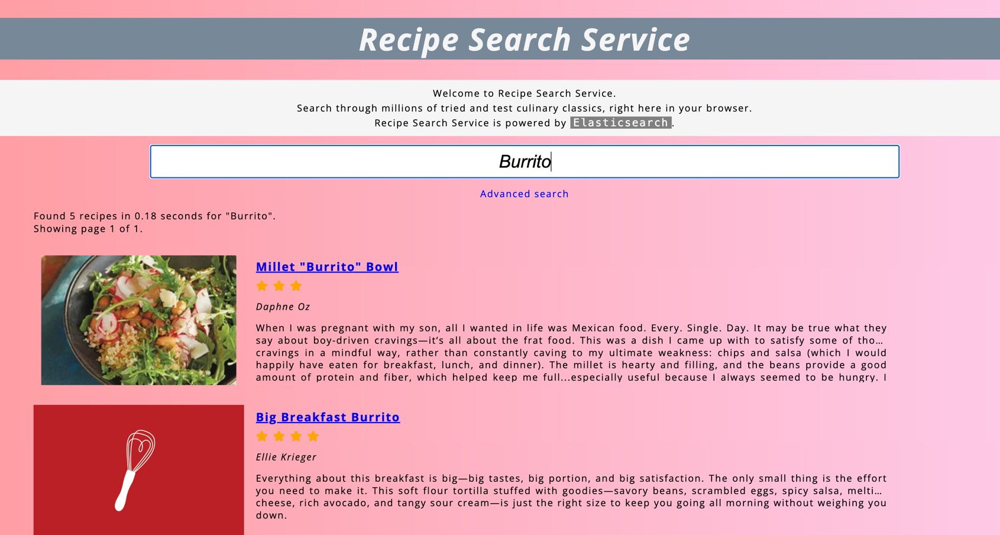
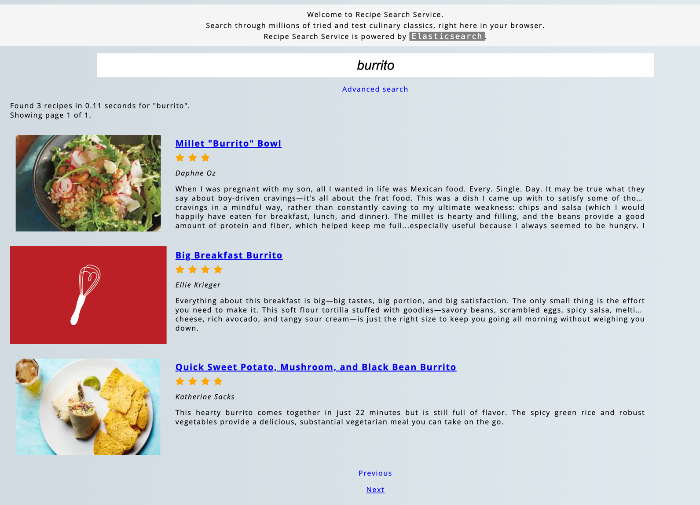
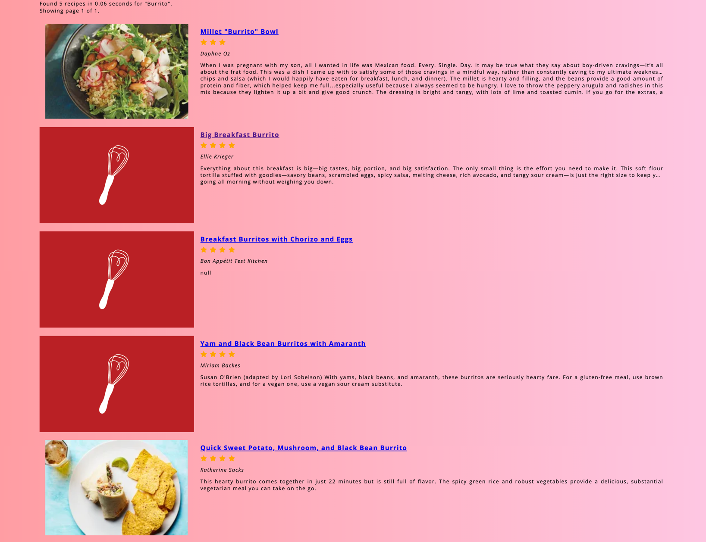

# 검색 경험 구축 



대충 title에 대해서는 buritto가 들어있는것을 볼 수 있다.

```
{
    "aliases": {},
    "mappings": {
      "properties": {
        "author": {
          "type": "keyword",
          "eager_global_ordinals": true,
          "fields": {
            "text": {
              "type": "text"
            }
          }
        },
        "date": {
          "type": "date",
          "format": "[MMMM yyyy]",
          "fields": {
            "keyword": {
              "type": "keyword"
            }
          }
        },
        "description": {
          "type": "text",
          "analyzer": "english"
        },
        "ingredients": {
          "type": "text",
          "analyzer": "english"
        },
        "instructions": {
          "type": "text",
          "analyzer": "english"
        },
        "picture_link": {
          "type": "keyword"
        },
        "rating": {
          "properties": {
            "bestRating": {
              "type": "float"
            },
            "prepareAgainPct": {
              "type": "float"
            },
            "ratingValue": {
              "type": "float"
            },
            "worstRating": {
              "type": "float"
            }
          }
        },
        "recipe_id": {
          "type": "text",
          "fields": {
            "keyword": {
              "type": "keyword",
              "ignore_above": 256
            }
          }
        },
        "summary": {
          "properties": {
            "active-time": {
              "type": "keyword"
            },
            "total-time": {
              "type": "keyword"
            },
            "yield": {
              "type": "keyword"
            }
          }
        },
        "title": {
          "type": "text",
          "analyzer": "english",
          "fields": {
            "keyword": {
              "type": "keyword"
            },
            "suggestion": {
              "type": "completion",
              "analyzer": "english",
              "preserve_separators": false,
              "preserve_position_increments": false,
              "max_input_length": 50
            }
          }
        },
        "url": {
          "type": "text",
          "fields": {
            "keyword": {
              "type": "keyword",
              "ignore_above": 256
            }
          }
        }
      }
    }
  }
```

keyword로 정의한 대상에 대해서는 검색이 가능하다. 만약 title에서 keyword 필드가 안나오게 한다면 어떻게될까?



바로 Burito 검색결과가 3개로 줄어들었는데, 검색이 가능하긴 한 이유는 

```
  "title": {
          "type": "text",
          "fields": {
            "keyword": {
              "type": "keyword",
              "ignore_above": 256
            }
          }
```

이런식으로 매핑을 자동으로 생성하기 때문이다. 



이 이미지가 title analyzer를 english 로 사용한 결과이다.

결정적 차이는 형태소 분석기를 통해서, Burritos -> Burrito로 keyword가 만들어졌는지의 유무이다.


tomato soup -> tomato stew, vegetable soup, tomatillo soup 도 나오게 하려면 ? 

또는 melted butter -> melting butter, melt butter 도 나오게 하려면? 

이런건 `전문` 검색이라서 full-text-queries 를 사용해야 한다.


### 텍스트 분석 방법

ES의 모든 text 필드는 색인할 때 분석된다. keyword나 date 같은거에 비해 더 높은 성능과 메모리 오버헤드가 필요해.

ES가 `text`를 분석하는 방법은 두가지 process
-  토큰화 : 토큰으로 나누기 (하나의 단어?) - 토크나이저 dependent
- 정규화를 한다 : 소문자화, melting -> melt 등으로 변환 

`POST _analyze` 쿼리로 특정 analyzer가 어떻게 동작할지 알아낼 수 있다. 

### 검색 방법 

- fuzziness : 오타 1개만큼 (편집거리 사용)
- multi_match : 많이 매치될 수 있는만큼 
  - minimum_should_match : 부가조건 걸 수 있다. 
- title^5 라고 하면 히트에 대해 해당필드에 가중치를 줄 수 있다. (5배의 가중치 제공)

### 쿼리에 대한 검색어 제한 

검색결과가 없는 경우 어떻게 할까? 

suggest 를 검색할 수 있다. 색인된 텀들을 바탕으로, 검색된 텀과의 거리를 통해 추천을 하는듯 하다. (frequency도 중요한듯)

### 필터를 통해 검색 결과 줄이기 


