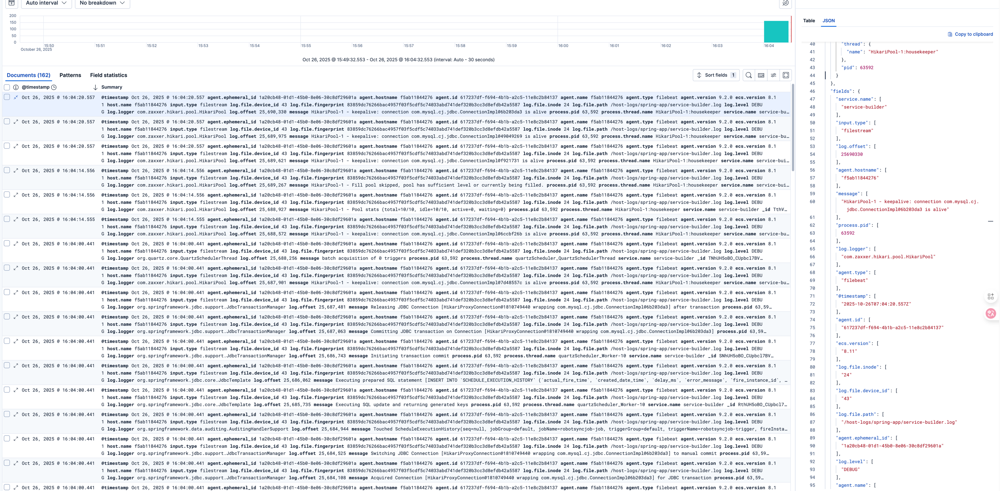

# 1. 비츠를 이용한 데이터 수집과 전송 

- 비츠 에이전트로 이벤트 수집하고 엘라스틱 서치로 전송하기 
- 이벤트의 특성(로그 or 메트릭) 과 추출 방법 (rest API | 파일 추적 | 어플리케이션 계측 )에 따라 다른 비츠를 사용함. 
- 그리고 비츠 모듈은 어떻게 데이터 스키마랑 형식을 일관되게 유지할까? 


### 비츠 종류

- 파일 비트 
  - 파일 또는 REST API 엔드포인트
  - 카프카 등 메시지 스트림
  - syslog 리스너
- 메트릭 비트
- 오딧비트
  - 운영체제 감사 데이터 (auditd 로 발생되는)
- 하트비트
- 패킷비트
  - 네트워크 패킷 정보 
- 윈로그비트 
  - 윈도우 시스템 이벤트 
- 펑션비트
  - lambda 처럼 서버리스 플랫폼에서 함수로배포.


### 파일 비트 설치

docker 기반으로 진행하고 싶다

```
docker run --rm \
docker.elastic.co/beats/filebeat:9.2.0 \
setup -E setup.kibana.host=localhost:5601 \
-E output.elasticsearch.hosts=["localhost:9200"] \
```

이렇게 하면, localhost가 docker 내부의 localhost를 사용해서 

1. --add-host 옵션을 사용하던가
2. --network 옵션을 줘서 docker filebeat가 kibana 혹은 elastic search와 같은 네트워크에 속하게 해야한다. 

기존에 docker compose로 설치하니까

각 도커의 네트워크 모드가 이렇게 설정되어있어서 "NetworkMode": "elastic-start-local_default" Docker Compose가 만든 네트워크 이름이 존재하더라.

즉, --network 옵션을 줘서 해당 network 영역에서 filebeat가 실행되기만 하면된다. 

```
docker run --rm \
  --network elastic-start-local_default \
  docker.elastic.co/beats/filebeat:9.2.0 \
  setup -E setup.kibana.host=kibana:5601 \
  -E output.elasticsearch.hosts=["http://elasticsearch:9200"]
```

```
여기서, kibana:5061 이라고 쓰는데, ⚠️ 주의
여기서 kibana, elasticsearch는
각각 docker-compose.yml 안의 service name과 같아야 합니다.
(container_name이 아니라 service 이름을 써야 DNS로 인식됩니다)
```

근데 볼륨마운트도 해야하는거 아닌가? 

들어보니, 현재는

```yaml
filebeat.config:
  modules:
    path: ${path.config}/modules.d/*.yml
    reload.enabled: false

filebeat.autodiscover:
  providers:
    - type: docker
      hints.enabled: true

processors:
- add_cloud_metadata: ~

output.elasticsearch:
  hosts: '${ELASTICSEARCH_HOSTS:elasticsearch:9200}'
  username: '${ELASTICSEARCH_USERNAME:}'
  password: '${ELASTICSEARCH_PASSWORD:}'

```

이게 기본값인데, `/Users/user/projects/service/log` 에 로그가있다면, 마운트를 시키고,


```
docker run --rm -d \
  --name=filebeat \
  --user=root \
  --network=elastic-start-local_default \
  --volume="$(pwd)/filebeat.docker.yml:/usr/share/filebeat/filebeat.yml:ro" \
  --volume="$(pwd)/modules.d:/usr/share/filebeat/modules.d:ro"\
  --volume="/var/lib/docker/containers:/var/lib/docker/containers:ro" \
  --volume="/var/run/docker.sock:/var/run/docker.sock:ro" \
  --volume="filebeat-data:/usr/share/filebeat/data:rw" \
  --volume="/Users/user/projects/service/log:/host-logs:ro" \
  docker.elastic.co/beats/filebeat:9.2.0 \
  filebeat -e --strict.perms=false \
  -E setup.kibana.host=kibana:5601 \
  -E output.elasticsearch.hosts='["http://elasticsearch:9200"]' 
```

```
filebeat.config:
  modules:
    path: ${path.config}/modules.d/*.yml
    reload.enabled: false
filebeat.inputs:
  - type: log
    enabled: true
    paths:
      - /host-logs/*.log
    fields:
      service: abc-service
      source: host
    fields_under_root: true
```

filebeat.config.modules.path 는 filebeat.yaml 파일의 위치를 알려주는것. default로 읽는건 /usr/share/filebeat/filebeat.yml 이 경로고, nginx, spring 등 개별적인 logging yaml이 있다면 요 경로를 참고한다.


내 spring.yaml은 아래처럼 설정했는데,

```yaml
# modules.d/spring.yml
- module: spring
  app:
    enabled: true
    var.paths: ["/host-logs/spring-app/*.log"]

    input:
      type: log
      paths: ["/host-logs/spring-app/*.log"]
      json.keys_under_root: true       # JSON 키를 _source 아래로 바로 넣음
      json.add_error_key: true         # JSON 파싱 실패 시 에러 필드 추가
#      multiline.pattern: '^\d{4}-\d{2}-\d{2}'  # (선택 사항) 멀티라인 시작 패턴
#      multiline.negate: true
#      multiline.match: after

    processors:
      - add_fields:
          target: ""
          fields:
            service: service-builder-local
            source: host

```


```
#      multiline.pattern: '^\d{4}-\d{2}-\d{2}'  # (선택 사항) 멀티라인 시작 패턴
#      multiline.negate: true
#      multiline.match: after
```

이부분은, 스택트레이스처럼 멀티라인이라면, 파일비츠는 한줄씩만 읽기 때문에 합치는 기능인거다. 

```
옵션	값	의미
pattern	'^\d{4}-\d{2}-\d{2}'	이벤트 시작을 식별할 정규식 (날짜 패턴)
negate	true	패턴 일치하지 않는 줄을 이전 이벤트와 합침
match	after	이벤트 시작을 패턴 줄 기준으로 설정 (before도 가능)
```

```
2025-10-26 14:00:00.123  INFO 1 --- [main] c.e.MyApp : Application started
2025-10-26 14:00:05.456 ERROR 1 --- [main] c.e.MyApp : Exception occurred
java.lang.NullPointerException: Something was null
	at com.example.MyApp.doSomething(MyApp.java:42)
	at com.example.MyApp.run(MyApp.java:30)
Caused by: java.lang.IllegalArgumentException: Invalid argument
	at com.example.MyService.validate(MyService.java:55)
	at com.example.MyApp.doSomething(MyApp.java:40)
```

이런게 합쳐지게된다. 하지만 나는 한줄한줄을 json으로 구성해놨기 때문에 괜찮다. (ecs 포맷으로 출력할 것)


```
      json.keys_under_root: true       # JSON 키를 _source 아래로 바로 넣음
      json.add_error_key: true         # JSON 파싱 실패 시 에러 필드 추가
```

```
{"log.level":"error","@timestamp":"2025-10-26T06:07:57.328Z","log.origin":{"function":"github.com/elastic/beats/v7/libbeat/cmd/instance.handleError","file.name":"instance/beat.go","file.line":1363},"message":"Exiting: Failed to start crawler: creating module reloader failed: could not create module registry for filesets: error getting filesets for module spring: open /usr/share/filebeat/module/spring: no such file or directory","service.name":"filebeat","ecs.version":"1.6.0"}
Exiting: Failed to start crawler: creating module reloader failed: could not create module registry for filesets: error getting filesets for module spring: open /usr/share/filebeat/module/spring: no such file or directory
```

이렇게했더니 에러가 난다. modules.d 에서 spring.yaml을 선언했다면,

```
/usr/share/filebeat/
├─ modules.d/
│  ├─ spring.yml          # enable/disable config 파일
├─ module/
   ├─ spring/
      ├─ _meta/
      ├─ access/          # 파일셋
      ├─ error/           # 파일셋
      └─ manifest.yml
```

이런식으로 모듈을 구성해줘야지만 동작한다고 한다.

그래서 filebeat.yaml에다가 설정을 추가해보니까 

```
filebeat.config:
  modules:
    path: ${path.config}/modules.d/*.yml
    reload.enabled: false

filebeat.inputs:
  - type: filestream
    enabled: true
    paths:
      - /host-logs/spring-app/*.log
    parsers:
      - ndjson: {}           # JSON 로그 자동 파싱
    fields:
      service: spring-app
      source: host
    fields_under_root: true
filebeat.autodiscover:
  providers:
    - type: docker
      hints.enabled: true

processors:
- add_cloud_metadata: ~

output.elasticsearch:
  hosts: '${ELASTICSEARCH_HOSTS:elasticsearch:9200}'
  username: '${ELASTICSEARCH_USERNAME:elastic}'
  password: '${ELASTICSEARCH_PASSWORD:Bys3gnKS}'
```

```
{"log.level":"error","@timestamp":"2025-10-26T06:33:46.965Z","log.origin":{"function":"github.com/elastic/beats/v7/libbeat/cmd/instance.handleError","file.name":"instance/beat.go","file.line":1363},"message":"Exiting: Failed to start crawler: starting input failed: error while initializing input: Found log input configuration: Log input is deprecated. Use Filestream input instead. Follow our migration guide https://www.elastic.co/guide/en/beats/filebeat/current/migrate-to-filestream.html\n{\n  \"enabled\": true,\n  \"fields\": {\n    \"service\": \"spring-app\",\n    \"source\": \"host\"\n  },\n  \"fields_under_root\": true,\n  \"json\": {\n    \"add_error_key\": true,\n    \"keys_under_root\": true\n  },\n  \"paths\": [\n    \"/host-logs/spring-app/*.log\"\n  ],\n  \"type\": \"log\"\n}","service.name":"filebeat","ecs.version":"1.6.0"}
Exiting: Failed to start crawler: starting input failed: error while initializing input: Found log input configuration: Log input is deprecated. Use Filestream input instead. Follow our migration guide https://www.elastic.co/guide/en/beats/filebeat/current/migrate-to-filestream.html
```

type: log 는 deprecated 되어서 filestream으로 이전해야한다고 하더라. 그래서 위처럼 yaml 변경

### 결과

log가 쌓이긴하는데, docker 관련 메타정보가 더 많이 들어있고, message는 그냥 text처럼 처리된다. 

<details>

```
{
  "_index": ".ds-filebeat-9.2.0-2025.10.26-000001",
  "_id": "i9c8H5oBO_CUpbcln0hX",
  "_version": 1,
  "_source": {
    "@timestamp": "2025-10-26T06:37:37.685Z",
    "host": {
      "name": "9bc65f0817ce"
    },
    "agent": {
      "id": "617237df-f694-4b1b-a2c5-11e8c2b84137",
      "name": "9bc65f0817ce",
      "type": "filebeat",
      "version": "9.2.0",
      "ephemeral_id": "968958a9-fd2e-43fa-bc01-20d3125e6399"
    },
    "input": {
      "type": "filestream"
    },
    "ecs": {
      "version": "8.0.0"
    },
    "log": {
      "offset": 977218,
      "file": {
        "fingerprint": "7f97b9669907bae0d4a668e0b7b684bcbd11491ccc3eb7cb433151f51b614028",
        "path": "/var/lib/docker/containers/f53ed3a60225b1a8e202228b762b706f15d35d9f67a458d884183b510b562d7a/f53ed3a60225b1a8e202228b762b706f15d35d9f67a458d884183b510b562d7a-json.log",
        "device_id": "65025",
        "inode": "498513"
      }
    },
    "stream": "stdout",
    "tags": [
      "take_over"
    ],
    "message": "{\"@timestamp\":\"2025-10-26T06:37:37.685Z\", \"log.level\": \"INFO\", \"message\":\"[.ds-filebeat-9.2.0-2025.10.26-000001/j65sM65wSKuitwCT-ImRjw] update_mapping [_doc]\", \"ecs.version\": \"1.2.0\",\"service.name\":\"ES_ECS\",\"event.dataset\":\"elasticsearch.server\",\"process.thread.name\":\"elasticsearch[f53ed3a60225][masterService#updateTask][T#74]\",\"log.logger\":\"org.elasticsearch.cluster.metadata.MetadataMappingService\",\"elasticsearch.cluster.uuid\":\"bKaAbChERimkP4-BEdIZOw\",\"elasticsearch.node.id\":\"nbwPNfD1TFqY5KdTC1tCFQ\",\"elasticsearch.node.name\":\"f53ed3a60225\",\"elasticsearch.cluster.name\":\"docker-cluster\"}\n",
    "container": {
      "image": {
        "name": "docker.elastic.co/elasticsearch/elasticsearch:9.1.5-arm64"
      },
      "id": "f53ed3a60225b1a8e202228b762b706f15d35d9f67a458d884183b510b562d7a",
      "name": "es-local-dev"
    },
    "docker": {
      "container": {
        "labels": {
          "com_docker_compose_image": "sha256:49daf71a92130e0ee81a45f1eb1c810fd146bee98534d7a4d1ddf65739f793d3",
          "org_opencontainers_image_documentation": "https://www.elastic.co/guide/en/elasticsearch/reference/index.html",
          "url": "https://catalog.redhat.com/en/search?searchType=containers",
          "vcs-type": "git",
          "org_label-schema_usage": "https://www.elastic.co/guide/en/elasticsearch/reference/index.html",
          "build-date": "2025-09-18T08:39:36Z",
          "org_opencontainers_image_licenses": "Elastic-License-2.0",
          "distribution-scope": "public",
          "org_label-schema_vendor": "Elastic",
          "org_opencontainers_image_url": "https://www.elastic.co/products/elasticsearch",
          "release": "1",
          "architecture": "aarch64",
          "io_openshift_expose-services": "",
          "org_label-schema_vcs-url": "https://github.com/elastic/elasticsearch",
          "description": "You know, for search.",
          "com_docker_compose_version": "2.36.1",
          "desktop_docker_io/ports/9200/tcp": "127.0.0.1:9200",
          "org_label-schema_license": "Elastic-License-2.0",
          "name": "Elasticsearch",
          "com_docker_compose_oneoff": "False",
          "org_opencontainers_image_title": "Elasticsearch",
          "org_opencontainers_image_created": "2025-10-02T22:07:12.966975992Z",
          "org_opencontainers_image_source": "https://github.com/elastic/elasticsearch",
          "com_docker_compose_container-number": "1",
          "summary": "Elasticsearch",
          "io_openshift_tags": "minimal rhel9",
          "org_opencontainers_image_version": "9.1.5",
          "org_label-schema_name": "Elasticsearch",
          "org_opencontainers_image_revision": "90ee222e7e0136dd8ddbb34015538f3a00c129b7",
          "io_k8s_description": "The Universal Base Image Minimal is a stripped down image that uses microdnf as a package manager. This base image is freely redistributable, but Red Hat only supports Red Hat technologies through subscriptions for Red Hat products. This image is maintained by Red Hat and updated regularly.",
          "org_label-schema_build-date": "2025-10-02T22:07:12.966975992Z",
          "vendor": "Elastic",
          "io_k8s_display-name": "Red Hat Universal Base Image 9 Minimal",
          "com_redhat_license_terms": "https://www.redhat.com/en/about/red-hat-end-user-license-agreements#UBI",
          "org_label-schema_schema-version": "1.0",
          "maintainer": "infra@elastic.co",
          "com_docker_compose_project_config_files": "/Users/user/projects/study/elastic/elastic-start-local/docker-compose.yml",
          "org_label-schema_url": "https://www.elastic.co/products/elasticsearch",
          "com_docker_compose_project": "elastic-start-local",
          "com_docker_compose_project_working_dir": "/Users/user/projects/study/elastic/elastic-start-local",
          "com_redhat_component": "ubi9-minimal-container",
          "com_docker_compose_depends_on": "",
          "com_docker_compose_service": "elasticsearch",
          "version": "9.1.5",
          "com_docker_compose_config-hash": "101d386deef41f1581fc612ba5d3b15b47700b6b630e1a4b73bef08d65337a0d",
          "org_opencontainers_image_vendor": "Elastic",
          "org_label-schema_version": "9.1.5",
          "io_buildah_version": "1.40.1",
          "desktop_docker_io/ports_scheme": "v2",
          "org_label-schema_vcs-ref": "90ee222e7e0136dd8ddbb34015538f3a00c129b7",
          "vcs-ref": "0c20ee48321f5d64135f6208d1332c0b032df6c3"
        }
      }
    }
  },
  "fields": {
    "docker.container.labels.desktop_docker_io/ports/9200/tcp": [
      "127.0.0.1:9200"
    ],
    "docker.container.labels.org_label-schema_build-date": [
      "2025-10-02T22:07:12.966975992Z"
    ],
    "docker.container.labels.description": [
      "You know, for search."
    ],
    "docker.container.labels.org_label-schema_vendor": [
      "Elastic"
    ],
    "docker.container.labels.com_docker_compose_version": [
      "2.36.1"
    ],
    "docker.container.labels.com_docker_compose_project_config_files": [
      "/Users/user/projects/study/elastic/elastic-start-local/docker-compose.yml"
    ],
    "docker.container.labels.url": [
      "https://catalog.redhat.com/en/search?searchType=containers"
    ],
    "container.id": [
      "f53ed3a60225b1a8e202228b762b706f15d35d9f67a458d884183b510b562d7a"
    ],
    "docker.container.labels.org_opencontainers_image_licenses": [
      "Elastic-License-2.0"
    ],
    "docker.container.labels.org_label-schema_version": [
      "9.1.5"
    ],
    "container.name": [
      "es-local-dev"
    ],
    "container.image.name": [
      "docker.elastic.co/elasticsearch/elasticsearch:9.1.5-arm64"
    ],
    "docker.container.labels.io_buildah_version": [
      "1.40.1"
    ],
    "agent.name": [
      "9bc65f0817ce"
    ],
    "docker.container.labels.org_label-schema_usage": [
      "https://www.elastic.co/guide/en/elasticsearch/reference/index.html"
    ],
    "host.name": [
      "9bc65f0817ce"
    ],
    "docker.container.labels.io_openshift_expose-services": [
      ""
    ],
    "docker.container.labels.com_docker_compose_service": [
      "elasticsearch"
    ],
    "docker.container.labels.vcs-ref": [
      "0c20ee48321f5d64135f6208d1332c0b032df6c3"
    ],
    "docker.container.labels.org_opencontainers_image_vendor": [
      "Elastic"
    ],
    "docker.container.labels.org_label-schema_vcs-url": [
      "https://github.com/elastic/elasticsearch"
    ],
    "docker.container.labels.org_opencontainers_image_documentation": [
      "https://www.elastic.co/guide/en/elasticsearch/reference/index.html"
    ],
    "input.type": [
      "filestream"
    ],
    "log.offset": [
      977218
    ],
    "agent.hostname": [
      "9bc65f0817ce"
    ],
    "docker.container.labels.org_opencontainers_image_title": [
      "Elasticsearch"
    ],
    "docker.container.labels.distribution-scope": [
      "public"
    ],
    "tags": [
      "take_over"
    ],
    "docker.container.labels.org_label-schema_url": [
      "https://www.elastic.co/products/elasticsearch"
    ],
    "docker.container.labels.vendor": [
      "Elastic"
    ],
    "agent.id": [
      "617237df-f694-4b1b-a2c5-11e8c2b84137"
    ],
    "docker.container.labels.org_opencontainers_image_version": [
      "9.1.5"
    ],
    "ecs.version": [
      "8.0.0"
    ],
    "docker.container.labels.com_docker_compose_config-hash": [
      "101d386deef41f1581fc612ba5d3b15b47700b6b630e1a4b73bef08d65337a0d"
    ],
    "agent.version": [
      "9.2.0"
    ],
    "docker.container.labels.com_docker_compose_image": [
      "sha256:49daf71a92130e0ee81a45f1eb1c810fd146bee98534d7a4d1ddf65739f793d3"
    ],
    "docker.container.labels.vcs-type": [
      "git"
    ],
    "docker.container.labels.org_label-schema_vcs-ref": [
      "90ee222e7e0136dd8ddbb34015538f3a00c129b7"
    ],
    "docker.container.labels.com_docker_compose_container-number": [
      "1"
    ],
    "docker.container.labels.desktop_docker_io/ports_scheme": [
      "v2"
    ],
    "docker.container.labels.org_opencontainers_image_source": [
      "https://github.com/elastic/elasticsearch"
    ],
    "docker.container.labels.summary": [
      "Elasticsearch"
    ],
    "docker.container.labels.version": [
      "9.1.5"
    ],
    "docker.container.labels.com_docker_compose_oneoff": [
      "False"
    ],
    "docker.container.labels.name": [
      "Elasticsearch"
    ],
    "docker.container.labels.build-date": [
      "2025-09-18T08:39:36Z"
    ],
    "docker.container.labels.architecture": [
      "aarch64"
    ],
    "docker.container.labels.org_label-schema_name": [
      "Elasticsearch"
    ],
    "agent.type": [
      "filebeat"
    ],
    "docker.container.labels.com_docker_compose_depends_on": [
      ""
    ],
    "docker.container.labels.com_redhat_component": [
      "ubi9-minimal-container"
    ],
    "stream": [
      "stdout"
    ],
    "log.file.device_id": [
      "65025"
    ],
    "docker.container.labels.org_opencontainers_image_url": [
      "https://www.elastic.co/products/elasticsearch"
    ],
    "docker.container.labels.io_openshift_tags": [
      "minimal rhel9"
    ],
    "docker.container.labels.maintainer": [
      "infra@elastic.co"
    ],
    "docker.container.labels.org_opencontainers_image_created": [
      "2025-10-02T22:07:12.966975992Z"
    ],
    "docker.container.labels.com_docker_compose_project_working_dir": [
      "/Users/user/projects/study/elastic/elastic-start-local"
    ],
    "docker.container.labels.io_k8s_display-name": [
      "Red Hat Universal Base Image 9 Minimal"
    ],
    "docker.container.labels.org_label-schema_license": [
      "Elastic-License-2.0"
    ],
    "docker.container.labels.org_label-schema_schema-version": [
      "1.0"
    ],
    "message": [
      "{\"@timestamp\":\"2025-10-26T06:37:37.685Z\", \"log.level\": \"INFO\", \"message\":\"[.ds-filebeat-9.2.0-2025.10.26-000001/j65sM65wSKuitwCT-ImRjw] update_mapping [_doc]\", \"ecs.version\": \"1.2.0\",\"service.name\":\"ES_ECS\",\"event.dataset\":\"elasticsearch.server\",\"process.thread.name\":\"elasticsearch[f53ed3a60225][masterService#updateTask][T#74]\",\"log.logger\":\"org.elasticsearch.cluster.metadata.MetadataMappingService\",\"elasticsearch.cluster.uuid\":\"bKaAbChERimkP4-BEdIZOw\",\"elasticsearch.node.id\":\"nbwPNfD1TFqY5KdTC1tCFQ\",\"elasticsearch.node.name\":\"f53ed3a60225\",\"elasticsearch.cluster.name\":\"docker-cluster\"}\n"
    ],
    "docker.container.labels.com_docker_compose_project": [
      "elastic-start-local"
    ],
    "docker.container.labels.io_k8s_description": [
      "The Universal Base Image Minimal is a stripped down image that uses microdnf as a package manager. This base image is freely redistributable, but Red Hat only supports Red Hat technologies through subscriptions for Red Hat products. This image is maintained by Red Hat and updated regularly."
    ],
    "@timestamp": [
      "2025-10-26T06:37:37.685Z"
    ],
    "log.file.inode": [
      "498513"
    ],
    "log.file.path": [
      "/var/lib/docker/containers/f53ed3a60225b1a8e202228b762b706f15d35d9f67a458d884183b510b562d7a/f53ed3a60225b1a8e202228b762b706f15d35d9f67a458d884183b510b562d7a-json.log"
    ],
    "docker.container.labels.com_redhat_license_terms": [
      "https://www.redhat.com/en/about/red-hat-end-user-license-agreements#UBI"
    ],
    "agent.ephemeral_id": [
      "968958a9-fd2e-43fa-bc01-20d3125e6399"
    ],
    "log.file.fingerprint": [
      "7f97b9669907bae0d4a668e0b7b684bcbd11491ccc3eb7cb433151f51b614028"
    ],
    "docker.container.labels.org_opencontainers_image_revision": [
      "90ee222e7e0136dd8ddbb34015538f3a00c129b7"
    ],
    "docker.container.labels.release": [
      "1"
    ]
  }
}
```

</details>

일단 kibana 들어가서 index를 reset시킨다음에, docker 관련 로그 없애고, message가 파싱되게 해야겠다.

```
POST /인덱스이름/_delete_by_query
{
  "query": {
    "match_all": {}
  }
}
```

그리고 filebeat.yaml은 다시 filestream 보고 정의함

```
filebeat.config:
  modules:
    path: ${path.config}/modules.d/*.yml
    reload.enabled: false

filebeat.inputs:
  - type: filestream
    enabled: true
    paths:
      - /host-logs/spring-app/*.log
    parsers:
      - ndjson:            # JSON 로그 자동 파싱
        target: ""
        add_error_key: true

    fields_under_root: true
#filebeat.autodiscover:
#  providers:
#    - type: docker
#      hints.enabled: true
#
#processors:
#- add_cloud_metadata: ~

output.elasticsearch:
  hosts: '${ELASTICSEARCH_HOSTS:elasticsearch:9200}'
  username: '${ELASTICSEARCH_USERNAME:elastic}'
  password: '${ELASTICSEARCH_PASSWORD:Bys3gnKS}'

```

custom field를 추가했었더니, ecs 공통포맷과 다르고, key가 내 json이랑 중복이라서 다시 실행함.

```
{"log.level":"warn","@timestamp":"2025-10-26T06:52:57.820Z","log.logger":"elasticsearch","log.origin":{"function":"github.com/elastic/beats/v7/libbeat/outputs/elasticsearch.(*Client).applyItemStatus","file.name":"elasticsearch/client.go","file.line":533},"message":"Cannot index event '{\"@timestamp\":\"2025-10-26T06:52:47.802Z\",\"log\":{\"file\":{\"path\":\"/host-logs/spring-app/service-builder.log\",\"device_id\":\"43\",\"inode\":\"24\",\"fingerprint\":\"83859dc76266bac4957f03f5cdf5c74033abd741def320b3cc3d8efdb42a5587\"},\"level\":\"DEBUG\",\"logger\":\"org.springframework.jdbc.support.JdbcTransactionManager\",\"offset\":24601916},\"process\":{\"pid\":63592,\"thread\":{\"name\":\"quartzScheduler_Worker-8\"}},\"message\":\"Acquired Connection [HikariProxyConnection@433522450 wrapping com.mysql.cj.jdbc.ConnectionImpl@4938e885] for JDBC transaction\",\"ecs\":{\"version\":\"8.11\"},\"input\":{\"type\":\"filestream\"},\"host\":{\"name\":\"67310a132323\"},\"agent\":{\"type\":\"filebeat\",\"version\":\"9.2.0\",\"ephemeral_id\":\"8c75bded-9d7d-41f3-bd5a-cf3d2b221a6f\",\"id\":\"617237df-f694-4b1b-a2c5-11e8c2b84137\",\"name\":\"67310a132323\"},\"service\":\"spring-app\",\"source\":\"host\"}\n, Meta: none' (status=400): {\"type\":\"document_parsing_exception\",\"reason\":\"[1:791] object mapping for [service] tried to parse field [service] as object, but found a concrete value\"}, dropping event!","service.name":"filebeat","log.type":"event","ecs.version":"1.6.0"}
```




이런식으로 fields 밑에 내 json들이 출력되게 된다. 


# 메트릭 비트 

- 특정 시점의 컴포넌트의 내부 상태 
  - cpu, memory, disk, process수 등 


# 오딧 비트 
- host 로그인 이벤트, 가동된 프로세스랑 중지된 프로세스, 열린 소켓, 닫힌 소켓 등 


# 하트 비트
- 그냥 어플리케이션 살아있는지 정보 수집 (uptime kuma 역할) 

# 패킷 비트
- 네트워크 패킷 분석 

