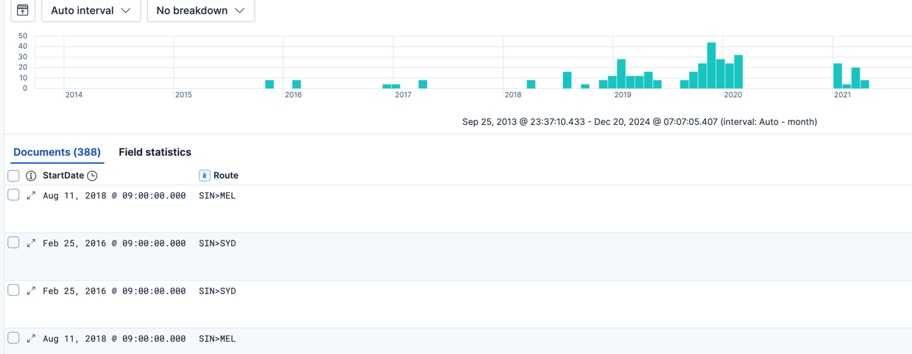
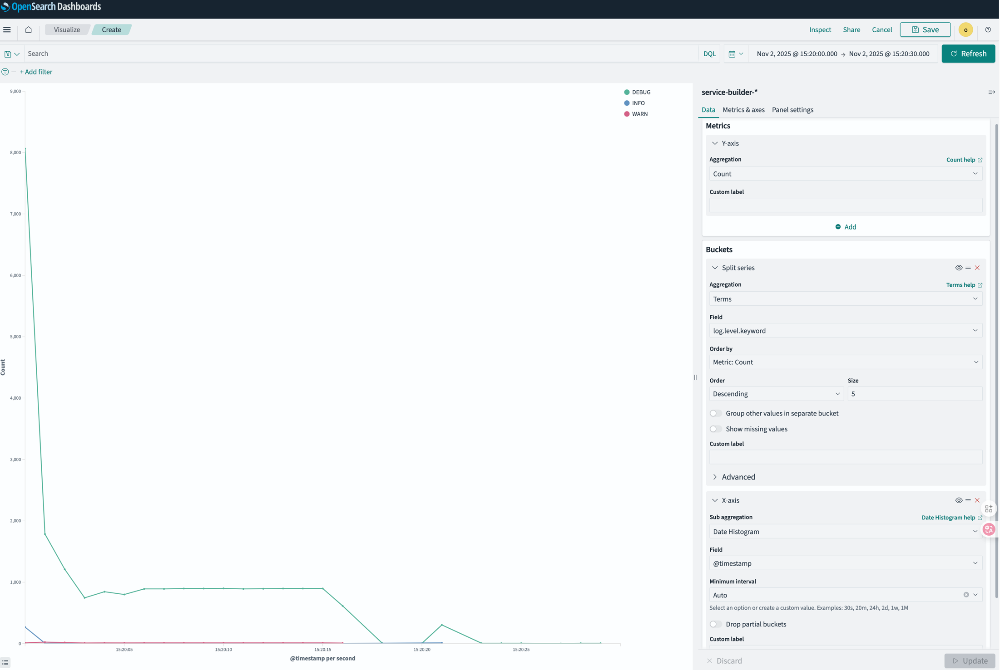

# Kibana 

Elastic Search는 데이터 저장, 쿼리, 집계. 

문제점
- 상호작용방법은 REST API.
- 시각화 안됨 

kibana는 ES 로부터 데이터 소스를 가져와서 stateless함. 

키바나 인스턴스는 클러스터된 컴포넌트가 아니라 작업이나 워크로드를 공유하기 위해 다른 키바나 인스턴스랑 상호작용 하지 않음. - stateless니까 아무래도..

여러 키바나 인스턴스가 같은 ES를 가리키고 있을수는 있지. 


# 사용성 좋은 메뉴들

- Discover : 로그 찾기, 필터 
- Dashboard : 로그 추세 확인
- Canvas : 실시간 데이터로 그래픽 프레젠테이션. Dashboard는 분석 단계정도, 캔바스는 경영진이나 사용자에게 통찰력 제공용도
- Maps: 지리공간 시각화, 작업 


# 데이터 뷰 

데이터 뷰는 쿼리나, 대시보드에 데이터 소스가 되는 엘라스틱 서치의 기본 인덱스에서 어떤 인덱스를 가져와서 볼 지 결정한다.

해당 인덱스 그룹의 데이터 필드 이름 별 스키마를 포함해 메타데이터 일부를 캐싱한다. 
    - 이 캐시를 업데이트하지 않으면, 로깅 필드를 추가했을 때 처음에는 그 필드로 검색할 수가 없다. 스키마는 데이터 뷰 별로 캐시되어 있기 떄문에. 
`kibana 데이터뷰` == `kibana index pattern` 옛날에는 index pattern이라고 했다. 

## 만약 런타임 필드를 만들고 싶으면? 

런타임 필드 :원래 데이터에는 정의되어있지 않지만, 추가적으로 묶어서 보고 싶은 대상.

예를들면, 출발 공항이랑 도착 공항을 하나의 값으로 나타내는 Route라는 필드가 유용할 수도 있다. 

```
emit(doc['StartAirport'].value + ">" + doc['EndAirport'].value);
```

kibana data view에서 세팅을 할 수가 있다. 




훨씬 깔끔하구만 


## 커스텀 필드 

```
if (doc['message'].size() == 0) return null;
def m = /@REQUEST@:\s+(\w)+\s+([^\s,]+)/.matcher(doc['message'].value);
if (m.find()) {
  return m.group(1) + m.group(2);
}
return null;

```

내가 뭔가 'message'필드에 @REQUEST@: POST /abc/create_new blabla  이렇게 남기고있는 게 있어서 이렇게 해보려니까, 'message' 필드는 'text' 필드라서 안된다고 한다. 

🔹 message

분석된 텍스트 (analyzed)

검색엔진이 단어 단위로 분리해서 색인

doc['message']로 집계나 sort하려고 하면 ❌ 오류남

(“text field can’t be used for aggregations or scripting”)

🔹 message.keyword

비분석 문자열 (not analyzed)

원본 그대로 저장

정렬, 집계, scripted field 처리에 ✅ 안전하게 사용 가능


즉, 이미 message는 단위 단위로 쪼개져 있어서, 내 방식처럼 접근이 불가능한 형태인 것.  


## Elastic Search에서의 Break down by 



이런식으로 split series로 구현하면 된다.

count of record를 logger.level 에 따라서 보고싶다면 이처럼 할 수 있겠다. 


