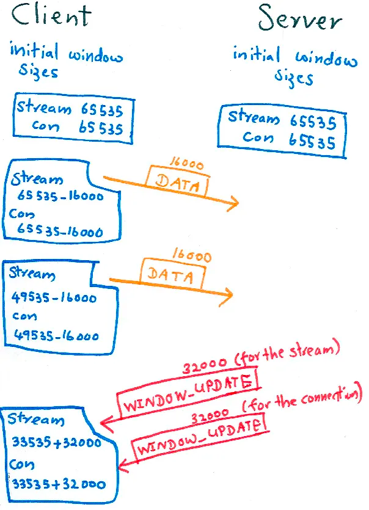
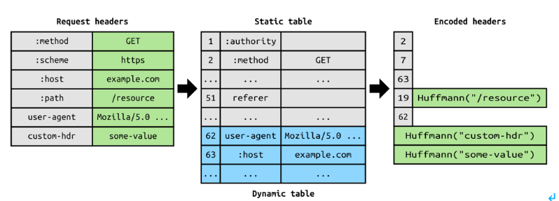

# 10장 HTTP/2.0

# 10.1 등장 배경

HTTP/2.0 왜 나와?
- HTTP/1.1의 메시지 포맷이 구현의 단순성과 접근성에 주안점을 두고 최적화되어있었다. 
  - 성능이 희생됨.
    - 요청 하나 보내고 응답 하나만 받기. == 응답 받아야 다음 요청 (회전 지연)
    - 병렬 커넥션 or 파이프라인 커넥션 사용

SPDY (구글의 프로토콜)
- 헤더를 압축
- 하나의 TCP 커넥션에 여러 요청 동시에 보내기
- 클라이언트 요청 없이도 서버가 push가능
  
# 10.2 HTTP/2.0 개요

TCP 커넥션 위에서 HTTP/2.0가 작동.
- TCP가 커넥션을 initialize한다.
- HTTP/2.0 요청 응답은 한 개 이상의 프레임에 담기고, HTTP 헤더가 압축되어 보관된다.
- 하나의 스트림이 한 쌍의 요청과 응답 처리.
- 하나의 커넥션 위에 여러 개의 스트림이 동시에 만들어지는 것이 가능.

# 10.3 HTTP/2.0과 1.1의 차이

프레임
- HTTP/2.0에서 모든 메시지는 프레임에 담겨 전송
- 프레임은 8바이트 크기 헤더로 시작, 최대 16383 바이트(2^14 == content length 비트수) 크기 페이로드가 온다.
  - 스트림 식별자 헤더가 있다.
- 종류:
  - DATA
  - HEADERS
  - PRIORITY 
  - PING ...
- 프레임 종류에 따라 페이로드의 형식이나 내용이 다르다.

## 10.3.2 스트림과 멀티플렉싱
한 쌍의 HTTP 요청과 응답이 하나의 스트림으로 이뤄짐
- 즉, 클라이언트는 새 스트림을 만들어 HTTP 요청을 보낸다. 해당 스트림 응답이 오면 스트림이 닫힌다.
- HTTP/1.1 에선 여러 TCP connection을 맺었는데, 이제 하나의 커넥션에 여러 개의 스트림이 동시에 열릴 수 있다.
- 스트림 우선순위도 가질 수 있다
  - ex. 이미지 파일 나중, html 페이지 먼저
- 스트림 만들 때 협상없이 일방적으로 만들 수 있다.
- 한번 사용한 스트림 식별자는 재사용 불가 but 다시 TCP를 맺으면 초기화

각 스트림마다 서버가 보낼 수 있는 데이터 총량, 각 연결별로 서버가 보낼 수 있는 데이터 총량이 정해져 있다.

### WINDOW_UPDATE 흐름 제어 (https://undertow.io/blog/2015/04/27/An-in-depth-overview-of-HTTP2.html)

각 스트림마다 보낼 수 있는 데이터의 총량인 send window가 다 쓰여서 더이상 보낼 수 없을때,

WINDOW_UPDATE 프레임을 보내는 것은 send window의 크기를 늘린다. 

만약 우리가 서버측에서 POST로 큰 데이터를 받아야 한다고 해보자. 웹서버가 처리능력이 느려서 패킷이 쌓이고 있다.

이 경우, 

1. 다 버퍼를 해서, web application이 요청할 때까지 메모리에 둔다.
2. 버퍼에 저장하다가 일정 수준 넘으면 socket에서 읽지 않는다.  Head of Line blocking 발생 (다른 request들이 막힌다)

이런 경우, 특정 stream마다 보내지는 데이터 양을 한정시켜서 web application이 실제로 처리할 때까지 stream에 데이터가 들어오는 걸 막을 수 있다.

(서버측이 WINDOW_UPDATE 를 천천히 보내면 stream은 계속 안보내고 기다려야 한다.)

https://medium.com/coderscorner/http-2-flow-control-77e54f7fd518

유명한 http2 라이브러리는 50%정도를 사용했을 때 보낸다고 한다.

근데 이 기법은 stream prioritization이랑은 같이 쓰면 안 된다고 한다.

### 10.3.3 헤더 압축
- 웹페이지 하나 보려면 수십 수백번의 요청 필요
- HPACK : 헤더 블록 조각들로 쪼개져서 전송됨. 
  - 압축 컨텍스트 사용 == 허프만 코딩, static table dynamic table 
    - 자주 나오는 문자열 순서대로 bitmap (huffman)
    - http2 header로 사용되는 key value table (static)
    - dynamic table은 cache처럼 한번 전송된 key value값 쌍을 저장해둬서 만약 같은 비트맵날라왔으면 그대로 풀 수 있게.
      - 특정 연결에서 교환되는 값에 따라 업데이트된다.

https://velog.io/@fnrkp089/HTTP%ED%86%B5%EC%8B%A0-%ED%86%B5%EC%8B%A0-%ED%94%84%EB%A1%9C%ED%86%A0%EC%BD%9C

quic도 보고갈까여

### 10.3.4 서버 푸시

서버는 먼저 클라이언트에게 PUSH_PROMISE 프레임을 보내서 미리 알려줘야 한다. (클라이언트가 그 리소스 요청하지 않게.)
- 해당 프레임의 스트림이 클라이언트 입장에서 예약됨 상태가 된다.
- 클라이언트는 RST_STREAM을 보내서 푸시를 거절할 수도 있다.
- 클라이언트는 Same-origin policy로 어디서 보내는지 다시 검사해야 한다. example.org에서 보낸거면 www.example.org에서는 거절해야

