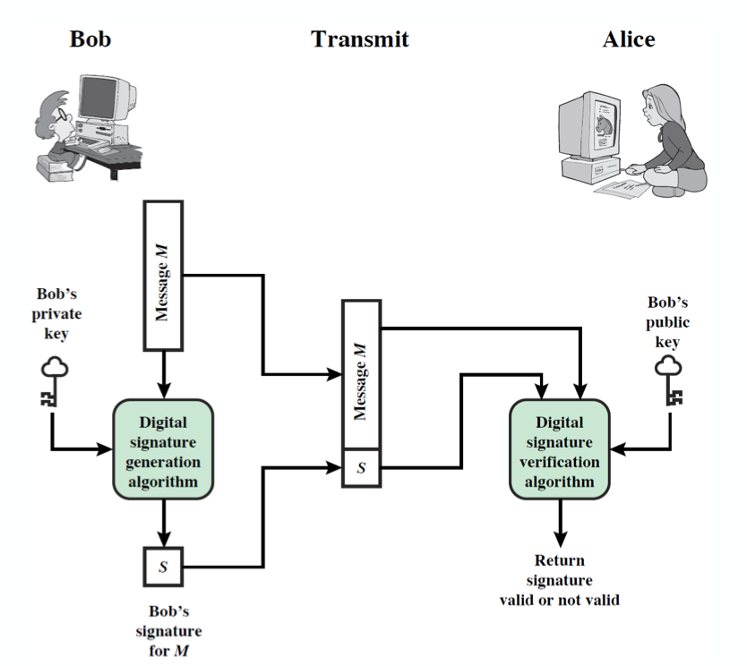

# 14 보안 HTTP

# 14.1 HTTP 안전하게 만들기

도청이나 위조로부터 HTTP 트랜잭션을 보호하자.

HTTPS 요구사항 분석
- 서버 인증: 클라이언트가 서버가 위조된 서버가 아님을 알아야 함
- 클라이언트 인증: 서버는 클라이언트가 가짜 사용자가 아님을 알아야 함
- 무결성: 클라이언트와 서버는 메시지가 위조되지 않음을 확인해야함
- 암호화: 클라이언트와 서버가 도청 걱정이 없어야 함
- 효율: 알고리즘이 빨라야
- ubiquity - 모든 서버와 클라에서 지원되야 한다.
- 관리상 확장성 - 보안 통신을 할 수 있어야 한다.
- 적응성 - 현재 알려진 최선의 보안 방법 지원해야
- 사회적 생존성 - 사회의 문화적, 정치적 요구 만족해야 
  - 국감 안불려가는지?

## 14.1.1 HTTPS

- 모든 HTTP 요청과 응답 데이터는 네트워크로 보내지기 전에 암호화된다. 
  - HTTPS는 HTTP 하부에 전송 레벨 암호 보안 계층을 제공해서 동작한다. 
    - Secure Socket Layer, SSL
    - Transport Layer Security, TLS (SSL 계승)
  - TCP 연결 위에서 암호화 레이어가 있고, 그 위에 HTTP 통신이 이뤄진다.
- HTTP 어플리케이션은 기존에 TCP로의 입력 , 출력함수를 SSL(TLS) 입력, 출력함수로 변경해주면 된다.

# 14.2 디지털 암호학
대칭키 암호 체계
- 인코딩과 디코딩에 같은 키 사용 (서버 클라이언트 둘다 가지고 있어야 할 것)

비대칭키 암호 체계
- 인코딩과 디코딩에 다른 키 사용 
  - ex. 서버 클라 둘다 가지고 있어야 하긴 하는데, 서버가 decode할때 private키 사용하고 클라이언트한테는 public key를 줘서 해당 서버만 해석할 수 있게됨.)

디지털 서명
- 메시지 위변조 안되었음을 인증하는 체크섬

디지털 인증서
- 신뢰할만한 조직에 의해 서명되고 검증된 신원 확인 정보

## 14.2.5 디지털 암호
- 복잡한 인코딩 디코딩 알고리즘이 가능해지고
- 매우 큰 키(암호화 함수 argument) 사용가능하다. 

# 14.3  대칭 키 암호화

인코딩할 때 쓰이는 키가 디코딩 할 때와 같은 키. (DES)

## 14.3.1 키 길이와 열거 공격
- 모든 키를 트라이 해보는 것이 enumeration attack 
  - 40비트 키이기만 해도 1조 개의 가능성.
  - 128bit DES 보다는 AES쓰는게 낫다. (대칭형 블럭 키 알고리즘)
    - Rijndael 알고리즘은 크게 보아 네 단계로 이루어진다.
      - KeyExpansion: key schedule(키 스케줄)이라고도 부른다. 128, 192 또는 256비트 길이인 하나의 주 암호화 키를 받아서 아래 라운드들에서 사용할 여러 개의 128비트 라운드 키를 생성한다.
      - 0 라운드: 위의 단계에서 생성한 라운드 키 중 첫번째 키를 사용, AddRoundKey를 한 번 실행한다.
      - 1~(9, 11, 13) 라운드: SubBytes, ShiftRows, MixColumns, AddRoundKey를 순서대로 실행한다. 이것을 AES-128, 192, 256에 따라 각각 9번, 11번, 13번 반복한다.
      - 마지막 (10, 12, 14)번째 라운드: SubBytes, ShiftRows, AddRoundKey를 순서대로 실행한다.

## 14.3.2 공유키 발급하기
- 둘다 공유키 가져야 하는데, N명과 대화하면 N개의 공유키 배포해야?

# 14.4 공개키 암호법
- 두 개의 비대칭 키 사용
  - 인코딩 용, 디코딩용
    - 디코딩용은 서버만 갖고 있고 인코딩용은 공개 배포. 모두가 서버로 메시지 보낼 수 있고, 해석할 수 있는건 서버뿐.

공개 키를 표준화해서 한 서버에 두면 각 사용자들은 이 공개키 받아서 자신이 보내고 싶은 서버에게 보내기 쉬울 것 - PKI(Public-Key Infrastructure)
- X.509 표준 
- 특정 서버로의 통신을 막고싶으면 PKI를 private 한 서버를 사용하자.

## 14.4.1 RSA
- 비대칭 암호의 과제는, 공개키, 암호문 일부, 메시지와 그것을 암호화한 암호문 을 알아도 private key를 알 수 없어야 하는 것이다.

## 14.4.2 혼성 암호 체계와 세션 키

공개키 암호화는 계산이 느린 경향이 있다.

- 비대칭 키 안전한 채널로 대칭키 만들어서 공유 후 대칭키로 통신하는게 흔하다. 

# 14.5 디지털 서명
- 메시지가 위조되었는지 아닌지는 어떻게 알까?

## 14.5.1 체크섬

- 메시지 작성한 사람의 서명이 메시지에 붙어있다면
  - 메시지 위조 방지 가능 ( 송신 중인 메시지가 수정되었으면 체크섬이 메시지 본문이랑 안 맞을 것)
- 비대칭 공개키로 디지털 서명을 생성
  - "성진"이란 서명을 공개키로 암호화하면, 이 서명을 이용해 체크섬을 만들어서 서버만 해독이 가능하게. 

서버 A -> 클라이언트 B에게 메시지 보낸다.
1. 가변 길이 메시지 -> 고정된 길이의 요약(digest)
2. 사용자의 개인 키(private key)를 argument로 해서 서명함수를 실행
3. 나온 서명을 메시지 뒷부분에 붙여서 전송
4. 받은 클라이언트는 메시지 셀프 요약한거랑, 서명을 A의 공개키로 해독한거랑 일치하는 지 확인해서 메시지의 위변조 가능성을 파악할 수 이싿.

# 14.6 디지털 인증서
- 인증 기관에 의해 서명된 정보의 집합이 들어있다.
  - 대상 이름(사람, 서버 , 조직 등)
  - 유효 기간
  - 인증서 발급자
  - 인증서 발급자의 디지털 서명
  - 보통 대상의 공개키 정보까지.
    

https://www.jscape.com/blog/what-is-a-digital-certificate 아직 X.509 로 저장되고 있는듯 하다.

## 14.6.3 서버 인증위한 인증서 사용
- 사용자가 HTTPS쓰면, 최신 부라우저는 접속한 서버의 디지털 인증서 가져와
  - 서명 기관을 검사해서, 신뢰할만한 서명 기관이면 해당 서명기관의 공개키를 미리 갖고있게 해놨기 때문에, 브라우저는 서명을 해당 기관에 요청해서 가져온다. 
  - 서명 기관 모르는 곳이라면 브라우저는 확신할지 말지 대화상자 보여준다.

# 14.7 HTTPS 세부사항
- 443 포트로 연결, 
  - SSL은 바이너리 프로토콜이라서, 트래픽이 80번 포트가 아닌 443으로 가는 것.

## 14.7.3 보안 전송 셋업
- 처음부터 443 포트로 TCP 커넥션 수립
- SSL 보안 매개변수 핸드셰이크 (암호화 방법 & 교환 키)
  - 프로토콜 버전 번호 교환 (SSL 1.0? 1.1?)
  - 공통 암호 선택 (나 이런이런 알고리즘들 지원되는데~  https://aws-hyoh.tistory.com/entry/HTTPS-%ED%86%B5%EC%8B%A0%EA%B3%BC%EC%A0%95-%EC%89%BD%EA%B2%8C-%EC%9D%B4%ED%95%B4%ED%95%98%EA%B8%B0-3SSL-Handshake)
  - 대칭 키 선택 
  - 양쪽 신원 인증
    - 서버는 서버 인증서를 보낸다.
    - 클라이언트는 클라이언트 인증서를 보내야 하지만 클라이언트는 보통 인증서 없다.
      - 서버 인증서를 클라이언트는 날짜 검사, ROOT CA 신뢰도 검사, 서명기관의 공개키를 이용해 서버 인증서의 무결성 검사, 인증서 도메인과 서버 도메인 검사
  - 채널 암호화 위한 임시 세션 키 생성
- 클라이언트의 웹어플리케이션에서 TCP로 보내지기전에 SSL로 암호화
- SSL close 요청 - TCP 커넥션 닫힘

 
## 14.7.7 가상 인증서 
웹서버가 하나의 인증서만 보통 지원해서 가상 호스팅하는 경우 도메인 이름이 안맞을 수도 있어. 
- 그래서 보안 트랜잭션 시작하는 모든 사용자를 CA에 있는 url 로 리디렉트 시킬수도 있다.

# 14.8 HTTPS 클라이언트 
OpenSSL
- SSL와 TLS 구현

C코드
- socket을 열고, TCP 맺고, TCP 맺은 소켓 fd를 ssl에 넣고, SSL_connect를 또 호출한다. . 
- SSL handshake가 끝나면 어떤 암호 쓰기로 결정했는지, 인증서는 뭔지 다 받아놨어. 

# 14.9 방화벽 프록시

방화벽 라우터가 있다면, 서버로 보낼 데이터를 서버의 공개키로 암호화했을 때 문제가 된다.
- 프록시가 HTTP 헤더를 읽지 못하기 때문에. 
- HTTPS SSL 터널링을 사용해서, 한번 클라이언트가 연결을 맺었을 때 어떤 호스트 어떤 포트로 가야하는지 미리 알려주는 것.

https://com-on-bappool.tistory.com/121

TLS 1.3 에서는 RSA는 빠졌다.

https://blog.cloudflare.com/rfc-8446-aka-tls-1-3/
에러코드 difference로 private key를 몇천개만에 해독할 수 있게 되었다..고? 

+ forward secrecy가없다. 
+ 뭐냐면, 공개키를 보통 오래 사용하게 되는데, 지금 서버의 private key가 leak되었다고 해서 막 1년전까지의 메세지가 다 해독 되면 안된다는 게 요지.

