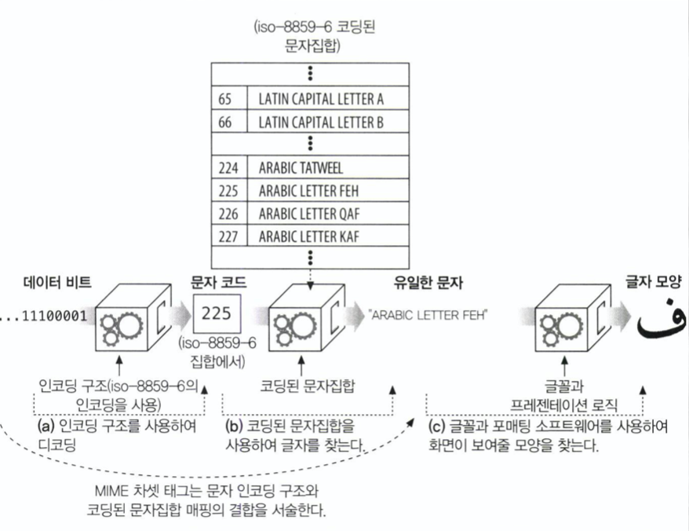

# 16장 국제화

HTTP 어플리케이션은 여러 언어의 문자로 텍스트 보여주고 요청하기 위해 문자집합 인코딩을 사용한다. 그리고 각 인코딩 별로 언어 태그를 사용한다.

- 어떻게 언어 문자 체계 및 표준과 상호작용하는가?

# 16.1 국제적 컨텐츠를 다루기 위한 HTTP 스펙

HTTP에서 엔티티 본문은 비트로 가득 찬 상자이다.

다만, 서버는 클라이언트에게 각 문서의 문자랑 언어를 알려줘서, 클라이언트가 올바르게 사용자에게 컨텐츠를 제공할 수 있게 해야 한다.

서버는 
- HTTP Content-Type charset 매개변수와 
- Content-Language 헤더를 통해 클라이언트에게 문서의 문자와 언어를 알려준다.

클라이언트는 어떤 차셋 인코딩 알고리즘, 언어 이해하고, 무엇을 선호하는 지 말해준다.
- Accept-Charset: iso-8859-1, utf-8
- Accept-Language: fr, en;q=0.8

영어의 quality factor == 낮은 우선순위 0.8

# 16.2 문자 집합과 HTTP

국제 알파벳 스크립트 및 그들의 문자집합 인코딩

## 16.2.1 Charset == 글자를 비트로 변환하는 인코딩 방법

각 charset tag는 비트를 글자로 변환 또는 그 반대로 변환
- MINE 문자집합에 표준화되어 있다. (IANA의 관리를 받음)
- Content-Type: text/html; charset=iso-8859-6 

인코딩 기법 저거 사용. 

UTF-8 이나 iso-2022-jp는 글자 당 비트수가 일정하지 않는 가변길이 코드
- 다른 iso-8859-6 처럼 문자개수적으면 8bit로 표현가능한데.. 한중일은 절레절레

## 16.2.2 문자집합 & 인코딩 동작 방식

a, b 단계는 MIME 차셋 태그(utf-8 등)

글자의 모양을 어떻게 표시할지는 사용자의 브라우저, 운영체제, 글꼴이 결정하는 것.

## 16.2.3 잘못된 차셋은 잘못된 글자들을 낳는다.

잘못된 charset 사용하면 다른 char 보여준다.

## 16.2.4 표준화된 MIME charset 값

특정 문자 인코딩과 특정 코딩된 문자집합의 결합을 MIME charset으로 부른다 (a,b 단계)

## 16.2.5 Content-Type charset 헤더와 META 태그
문자집합이 명시적으로 Content-Type에 안 담겨 오면, 컨텐츠로부터 추측해보려 한다. 
- HTML 자체적으로 <META HTTP-EQUIV="Content-Type" CONTENT="text/html; charset=iso-2022-jp"> 이런식으로 명시가능.
- 아니면 인코딩 패턴 찾으려고 실제 텍스트 스캔한다. 
- 추측 못했으면 iso-8859-1 으로 가정
  - 아하, 10년전에 캐나다 pc로 인터넷 접속해보니 naver가 다 깨졌는데..  

## 16.2.6 Accept-Charset 헤더
클라이언트가 어떤 인코딩 지원하는지 보내줌. 
- Content-Type에 어떤거 썼다 하고 서버가 보내줌.

# 16.3 다중언어 문자 체계를 배우는 것

- 문자: 알파벳 같은거. Unicode == Universal Character Set 계획에 따라 LATIN CAPITAL LETTER S 이런 이름이 정해졌다. 
- 글리프: glyph 하나 글자의 표현형태 (이미지)
- coded character : 각 글자에 할당된 숫자
- coding space: 문자 코드값 정수 범위
- code with 각 문자 코드의 (고정된 크기의) 비트 개수
- character repertoire: 세상에 존재하는 모든 글자의 부분집합
- coded character set: 실제 글자에 숫자로 된 문자 코드를 대응시키기. (인코딩된 상태 - unicode에서 말하는 글자로)
- 문자 인코딩 구조: encoding algorithm

## 16.3.2 charset != 문자집합 

## 16.3.6 문자 인코딩 구조
고정폭 인코딩 == 공간낭비

가변폭(비모달) : 다른 문자 코드 별로 다른 길이 비트

가변폭(모달): 특별한 escape 패턴을 사용한다. 

UTF-8 : UCS를 위해 설계된 문자 인코딩 구조 (UCS Transformation Format) universal character set은 상업 컨소시엄.
- 비모달 가변폭 
- 각 바이트의 선두 비트가 인코딩된 문자의 길이를 바이트 단위로 나타낸다. 각 바이트는 6비트의 코드 값을 담는다. 
  - 예를들어 110ccccc 라면 1이 두개니까 2개바이트를 읽어들여야 한다는 것.

euc-kr:
- 가변길이 인코딩

# 16.4 언어 태그와 HTTP
- 언어에 이름 붙이기.
- Content-Language: fr
- Accept-Language: es 
  - 우리가 선호하는 lang

# 16.5 국제화된 URI
- URI는 US-ASCII 부분집합으로 구성되어 있다.
- URI 저자들은 리소스 식별자의 가독성과 공유 가능성의 보장이 더 중요하다 여겼음. (지원되지 않는 인코딩의 URI오면 망하니까!)

예약 문자들: , / ? : @ & = + $ , 

이스케이프 문자들: % `<HEX>`

## 16.5.3 이스케이핑 역이스케이핑

% 뒤에 16진수 글자 두개로 US-ASCII 문자의 코드 나타낸다. 

# 16.5.4 국제 문자를 이스케이프
이스케이프 값은 US-ASCII 코드 범위인 0-127 사이에 있어야 한다. 

국제화 도메인 이름은 punycode로 웹브라우저가 지원한다.
- 다국어 도메인이름을 알파벳과 숫자 등으로 된 도메인 이름으로 변환한다. 

