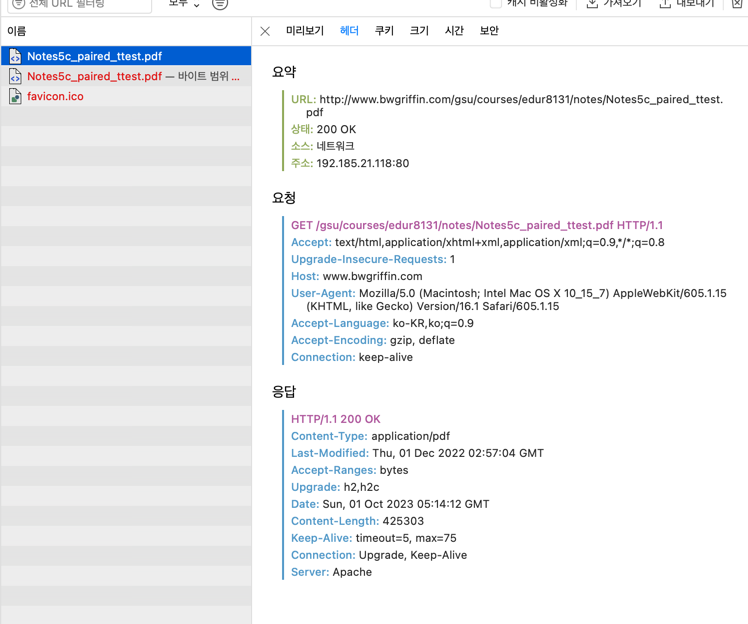
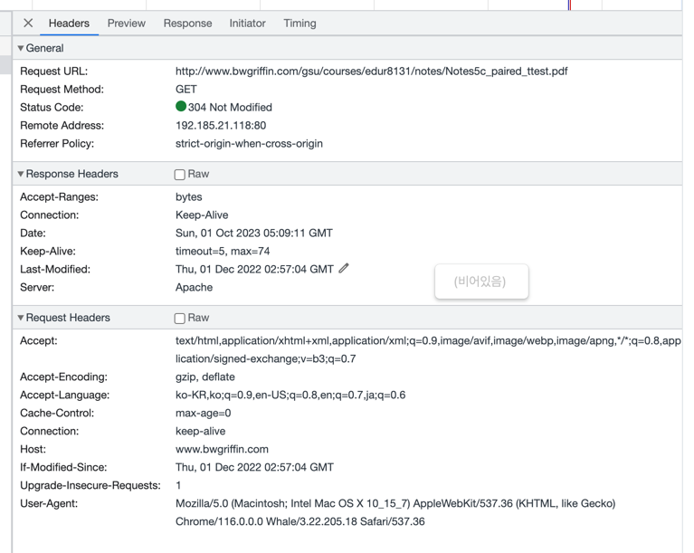

# 3장 HTTP 메시지

## 3.2 메시지 구조

시작줄과 헤더는 줄 단위로 분리된 아스키 문자열이다

```html
HTTP/1.0 200 OK
Content-type: text/plain
Content-length: 19

"hi hewllo"

```

(캐리지 리턴)ASCII 13 + (개행 문자)ASCII 10 == CRLF

\r\n 으로 시작줄, 헤더와, 본문이 구분된다. 본문없으면 CRLF로 끝난다.


시작줄은 
- 요청할 때에는 
  - 요청 메서드, 요청 메시지, HTTP 버전 (HTTP/1.0 이전엔 버전 필요없음)
- 응답할 때에는
  - HTTP버전, 상태 코드, 사유 구절(Human readable로 사용안됨)


## 역사

HTTP 0.9 시절엔 헤더도 없음, HTTP 버전 정보도 없음. 


## HTTP 메서드

메서드는 구현이 자유로워서 본인 서버만의 HTTP 메서드를 만들어도 된다.

- GET:
  - 일반적으로 GET 구현시 HEAD메서드를 구현해야 한다. (GET과 같은 응답인데 content없이 헤더만을 뱉을 수 있게.)

- TRACE:
  - 프록시 등 거치는 모든 곳을 본문에 기록하게 한다음에, 응답메시지 본문에 넣어주게 한다. 


## 상태코드

지난번에 304 코드가 나온 것은, 내가 If-modified-since를 가진채로 요청을 보내게 된 것이라 그렇다.

내 로컬에 저장된 로컬 리소스가 valid하다면 그냥 그걸 반환해주면 되기 때문에 실제 서버에는 If-Modified-Since로 언제 수정되었는지 알아낸 것이다.

SAFARI로 다시 접속해보면 200 OK가 나온다. ( 아직 해당 pdf를 한번도 다운 받은 적이 없기 때문)  http://www.bwgriffin.com/gsu/courses/edur8131/notes/Notes5c_paired_ttest.pdf





