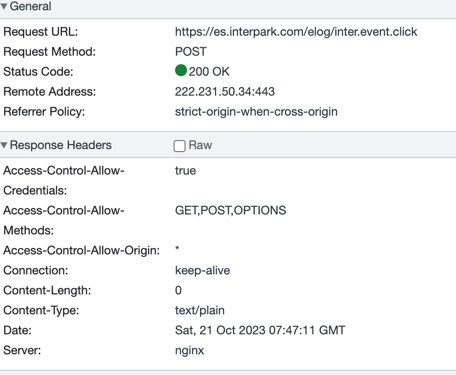

# 5장 웹서버

# 5.1 웹서버들

- HTTP 요청 처리하고 응답하는 서버 
  - 소프트웨어
  - or physical machine

## 5.1.1 웹서버 구현

웹 리소스 관리 , 웹 서버 관리 기능 제공.
- 운영체제의 TCP 커넥션 관리 역할 
  - TCP/IP 네트워크 지원
  - 파일 시스템
  - 프로세스 관리 

다양한 웹서버 존재
- apache
- nginx

pearl 로 만들기
- 소켓 열고
- bind
- listen
- accept

# 5.3 웹서버 역할
- 커넥션 맺기
- 요청 받기
- 요청 처리
- 리소스 접근(message에서 리소스 요청시)
- 응답 만들기
- 응답 보낸다
- 트랜잭션을 로그로 남기는 등.

# 5.4 단계 1. 커넥션 맺기
client -> webserver TCP 커넥션 요청시, 웹서버는 TCP 커넥션에서 IP 추소를 추출해서 어떤 클라이언트가 있는지 확인한다.

- 이 단계에서 악성 IP인경우 IP 차단같은거.

## 5.4.2 클라이언트 호스트 이름 식별
- 역방향 DNS 사용해서 클라이언트의 호스트 명으로 변환
  - 왜?
    - 느리다. 특정 컨텐츠에 대해서만 켜둔다.
    - 구체적인 접근 제어, 로깅

## 5.4.3 ident로 클라이언트 사용자 알아내기
- HTTP 커넥션을 하나 더 맺어서, 특정 커넥션에 대응하는 사용자 이름을 알아낸다.
- 즉, 클라이언트측에서 해당 프로토콜 대응해줘야함. 안쓴다.

# 5.5 단계 2: 요청 메시지 수신
- TCP 커넥션에서 들어온 메시지 파싱해야 한다.
  - 요청 줄 파싱 (GET /자원이름.html HTTP/1.1)
  - 요청 헤더 파싱
  - 헤더 끝 CRLF CRLF 라면 거기부터 요청 본문. (길이가 content-length)
- 웹서버의 요청 처리 능력이 수신 속도보다 느릴 수도 있기 때문에, 메시지 일부를 네트워크로부터 읽어서 메모리에 임시저장할 필요 있다.

## 5.5.2 커넥션 입출력 아키텍쳐
좋은 웹서버는 수천개 커넥션 동시에 연다 
- 단일 스레드 웹서버는 하나의 커넥션만 처리하고, 그뒤에야 커넥션 새로 맺는다.
- 멀티 프로세스/스레드 웹서버는 여러개 프로세스, 스레드를 둬서 커넥션이 각 프로세스나, 스레드에 연결될 수 있게 한다. 
  - 연결이 많으면 프로세스나 스레드 개수가 너무 많이 늘어나니 최대 개수에 제한을 둔다.
    - 콘서트 예매가 어려운 이유
      - 어떤 웹서버 사용하는지 알고 싶으면 백엔드 서버에 요청 가는 것을 확인해야 될텐데, 대충 로그인서버는 nginx인듯하다.
- 다중 I/O서버 
  - 쓰레드들이 보면서, 각 커넥션에서 무슨일이 있다면 처리 queue로 올라가고, 아니면 다시 열린 커넥션 목록으로 돌아간다.
- 다중 멀티스레드 웹 서버
  - 여러개의 스레드가 각 열려있는 커넥션들의 부분집합들을 감시해서, 각 커넥션의 요청 처리

# 5.6 단계 3. 요청 처리
- 메서드(GET,POST) , 리소스, 헤더, 본문 얻어서 처리. 
# 5.7 단계 4. 리소스 매핑 및 접근
- 클라이언트에게 컨텐츠 전달하려면, URI에 대응하는 알맞은 콘텐츠나 콘텐츠 생성기를 웹 서버에서 찾아야 한다.
  - Docroot
    - 특별한 폴더를 document의 root로 지정하면, 그 URI가 docroot로부터의 상대경로가 된다.
    - Apache의 DocumentRoot
    - 가상 호스팅 웹 서버를 하면, URI에서 어떤 호스트명이나 IP로 온 요청인지 식별해서 다른 Docroot 쓰게 한다.
      - Apache의 Virtualhost
- 디렉토리에 접근하려고 하면?
  - 색인 파일 반환 (vi directory_name 할때처럼)
  - 디렉토리의 내용 담은 HTML 페이지 반환
    - 어떤 directory file을 내보낼지를 DirectoryIndex 지시자로 선택할 수 있다. (ex. .Directory.html, .index.html (여러개 가능 ))
  - 에러 반환

## 5.7.3 동적 컨텐츠 리소스 매핑?
- application server 
  - spring 의 경우는 아파치를 앞에 두고, 특정 URI들은 스프링을 호스트하는 tomcat과 연결하는 apache tomcat connector 모듈을 사용한다.

## 5.7.4 SSI (Server Side Includes)
- server side에서 리소스 내보낼때 리소스 검사해서 특정 script 있으면 실행시키는 등

## 5.7.5 접근 제어 
- 특정 리소스 접근할때 ID PW, 또는 IP 근거 접근제어가능

# 5.8 단계 5. 응답 만들기

응답 메시지 제작

## 5.8.2 MIME타입 결정
- 확장자별 MIME TYPE hash map 사용하는게 보통.
- apache는 매직 타이핑 ( 파일 내용으로 패턴 검색 )
- 유형 명시 (서버에서 특정 디렉토리 파일들 명시해서 )

## 5.8.3 리디렉션
리디렉트할거면 Location 응답 헤더에 새 URI

- 301 Moved Permanently
- 303 See other, 307 Temporarily Redirect
  - 여기 북마크 쓰지말라
  - 혹은, 상태 정보 포함된 URL로 redirect시킨다.
  - 부하 덜 걸린 서버
  - 디렉토리 이름 정규화 (끝에 / 붙이기)

## 5.9 단계6. 응답 보내기
- 지속적인 커넥션이라면 Content-length를 신경써야 한다.
  - content-legnth만큼 안 왔으면 연결 끊어졌을때 클라이언트는 다시 커넥션맺으려고 할 것.

