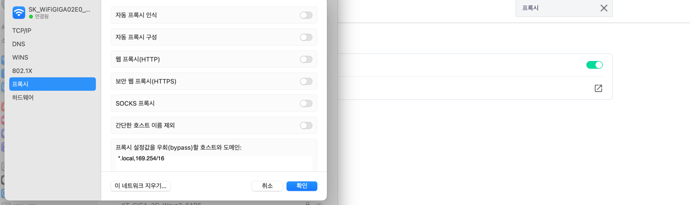

# 6장 프락시

- 클라이언트와 서버 사이 위치.
- HTTP 메시지 정리해주는 중개인처럼 동작.


# 6.1. 웹 중개자

웹 프록시 없으면 
- HTTP 서버와 클라이언트 직접 통신

웹 프록시 있으면
- 클라이언트는 프락시 서버와 통신


웹 프록시는 서버의 역할 + 클라이언트 역할

## 6.1.1 개인 프락시 vs 공유 프락시

개인 프락시: 하나의 클라이언트 만의 프락시
- 브라우저 기능 확장 or 성능 개선 or 무료 ISP 서비스를 위한 광고를 운영하기 위해
  

공유 프락시 : 여러 클라이언트가 함께 사용하는 프락시
- 보통 공유 프락시
- ex.) 캐시 프락시 등


## 6.1.2 프락시 대 게이트웨이

프락시
- 프락시는 같은 프로토콜 사용하는 두 어플리케이션 연결

게이트웨이
- 서로 다른 프로토콜 사용하는 둘 이상 연결
  - ex.) 디폴트 게이트웨이는 IP를 이용해 통신하던 우리의 패킷이 라우터를 통해 mac주소 기반으로 이동하게 하기 때문에?
  - ex.) 응용프로그램단 게이트웨이는 HTTP/POP 게이트웨이. (POP 메일 프로토콜로 변환)

# 6.2 왜 프록시 써


1. 보안 개선
2. 성능 높이기
3. 비용 절약 
4. 트래픽 감시 등

- 어린이 필터 (성인 컨텐츠)
- 문서 접근 제어자
  - 사내에서 이상한 사이트 못들어가게
  - 특정 서버 B 접근시 비밀번호 요구
  - 프록시서버에서 오는 요청만 valid로 판단가능
- 보안 방화벽
  - 바이러스 컨텐츠 차단
- 웹 캐시
  - CDN 서버 (인기있는 문서 서버 로컬 사본 관리)
- 대리 프록시 (surrogate) == 리버스 프록시
  - 웹 서버 요청을 받아서 처리하는데, 요청 컨텐츠를 찾으려고 다른 서버랑 통신해야 함. 
    - (뒷단의 서버의 리소스를 대신 받아서 모아서 보내주는 느낌. - 서버 가속기 역할 )
- 콘텐츠 라우터
  - 트래픽 조건이나 콘텐츠 종류에 따라 요청을 특정 웹 서버로 유도
    - 어린이 필터를 거치고 오도록 추가, 가까운 웹캐시 있는 서버로 보내기 등등
- 트랜스코더
  - 컨텐츠 본문 포맷 수정해서 보내기.
    - 본문 포맷하는게 성능이 많이 필요하다면 서버의 로드를 감소시키는 역할을 할 듯.
  - ex.) 
    - GIF를 JPG로 변환 
    - 이미지 크기 줄이기
    - 텍스트 파일 압축
  - 서버 -> 프락시 -> 클라이언트 이렇게도 사용가능
- 익명화 프락시 (Anonymizer)
  - HTTP 메시지의 신원파악 특성들을 제거해 개인정보보호 + 익명성 보장
    - ex.)
      - User-Agent 헤더에서 사용자 컴퓨터, OS 제거
      - 이메일 주소 보호  (FROM 헤더 제거)
      - Referer ( 어느 사이트 거쳐서 왔다 ) 제거
      - 프로필과 신원 정보 없애는 cookie 헤더 제거

# 6.3 프록시 어디에 둘까?

## 6.3.1 프락시 서버 배치

출구 (Egress) 프록시
- 로컬 네트워크에서 바깥 인터넷으로 오가는 트래픽 제어 위함
- 인터넷 요금 절약 및 인터넷 트래픽 성능 개선 위함
  - ex. 컴퓨터실에서 게임사이트 접속 안되는..

접근(Ingress) 프록시
- ISP 접근 지점에서 다운로드 속도 개선, 인터넷 대역폭 비용 줄이기 위한 캐시 프록시 (문서 사본 저장)

대리 프록시 (리버스 프록시)
- 가장 끝단 웹서버의 앞에 위치
  - 필요할 때만 특정 웹서버에 자원 요청 가능한 장점
  - 보안 기능 추가 + 캐시 같이 동작시킬 수 있음.

네트워크 교환 프록시
- 라우터와 라우터 사이 트래픽 흐름 감시 및 캐시 역할하는 프락시


## 6.3.2 프락스 계층
여러 프락시 서버를 둬서 프락시 계층을 둘 수 있다.
- 갈 때 거친 프락시 모두 거쳐서 응답 반환
- 프락시 서버는 부모 자식 관계
  - 인바운드 프록시(서버에 가까운 쪽)이 부모
  - 아웃바운드 프록시(클라이언트 가까운 쪽)이 자식

```
A <-> P1 <-> P2 <-> P3 <-> B
```

프락시 계층 콘텐츠 라우팅
- 항상 저 순서로 가는건 아니다.
- P1에서 캐시가 있는거같은데~ 하고 다른 캐시로 보낼 수 있고 (CDN으로)
- 요청이 이미지면 특정 압축 프록시로 보낼 수 도 있다.
- 요인들
  - 부하 균형 (현재 부모 프록시들의 부하)
  - 지리적 인접성 (미국 서버 프록시? 한국 서버 프록시?)
  - 프로토콜/타입 라우팅 (특정 URI는 특정 프락시로)
  - 유료 서비스 가입자 라우팅 (나는 더 빨리 가게 해줘 - 대형 캐시로)

## 6.3.3 어떻게 프락시가 트래픽 처리하나?

HTTP 트래픽이 프록시로 향하는 길은 어떻게 찾아낼까? DNS조회하면 그냥 프록시 알려주는게 아니야?

클라이언트 수정
- 웹 브라우저 클라이언트는 수동/자동 프록시 설정 지원
- 클라이언트가 아에 특정 프록시로 요청을 전송

네트워크 수정 (인터셉트 프록시)
- 스위치나 라우터를 조작해서 특정 IP로 가는건 이 프락시 서버로 보낸다

DNS 이름 공간을 수정
- 리버스 프록시는 웹 서버 이름과 IP가 자기 거라서 모든 요청이 이 대리 프록시한테 온다.
- 동적 DNS 서버 등.

웹 서버
- HTTP 리디렉션 명령을 클라이언트에게 돌려줘서 이 프록시로 요청해라~


# 6.4 클라이언트 프록시 설정

브라우저들이 프록시 어떻게 설정하는가
- 수동 설정
  - 내가 프록시 쓸거다
    - 모든 컨텐츠에 대해 하나의 프록시 서버만 지정
- 브라우저 기본 설정
  - 브라우저 소비자에게 전달할 때 프록시 목록 설정 가능
- 프록시 자동 설정 (proxy auto configuration)
  - 자바스크립트 파일 URI를 제공하면 어떨 때마다 프락시 서버 어떻게 써야하는지 script실행
  - FindProxyForUrl(url,host) 이걸로 반환하게 하면 돼.특정 트랜잭션 빼고는 "DIRECT" 리턴해서 원래대로 가라~ 할 수 있음.
- WPAD 프록시 발견
  - 자동 설정 파일을 다운받을 수 있는 설정 서버를 자동으로 찾아주는 웹 프록시 자동발견 프로토콜 제공
  - PAC 파일을 자동을 ㅗ찾아준다.
    - (PAC URI 찾으려고 WPAD 사용, PAC 파일 가져와서 그거 실행)
    - 리소스 발견 기법 (여러가지 사용. 뭐 DHCP, 서비스 위치 규약, DNS 잘 알려진 호스트명 등등)

약간 내 IP 가리기 위한 용도로 프록시를 많이 쓰는 듯 하다. 내 IP를 프록시 서버 중개자만 알 수 있는 것. (응답받은 서버는 몰라)

또 기업에서 특정 proxy 통하게 하라고 설정할 수 있다 (my experience)


# 6.5 프록시 요청의 미묘한 특징들

- 프락시 요청의 URI는 서버 요청과 어떻게 다른가
  - 요청의 URI 가 달라진다. (클라이언트 -> 프락시  vs 클라이언트 -> 서버)
    - 클라이언트 -> 프락시
      -  완전한 URI
        - ex. GET http://www.marys-antiques.com/index.html HTTP/1.0
          - 프록시는 목적 서버랑 커넥션 맺어야 해서 서버의 이름 알아야 해. + 프록시 기반 게이트웨이는 URI 스킴 필요
          - 명시적인 프록시만 request 이렇게 보내게 된다.
          - 나머지 리버스 프록시, 인터셉트 프록시는 부분 URI만 보내게 됨.
            - (리버스 프록시랑, )인터셉트 프록시는 클라이언트가 프록시로 보내는지 모른다. 
    - 클라이언트 -> 서버
      - 스킴, 호스트, 포트번호 없는 부분 URI
        - ex. GET /index.html  HTTP/1.0

?? 근데 그러면 가상 호스트 프록시들은 부분 URI 어떻게 받았을까? 
- 클라이언트 측이 보낼때 HOST 헤더를 포함시키도록 요구한다. (호스트 + 포트정보) 
  - 다른 방식으로 해결했다.

## 6.5.5 전송 중 URI 변경
일반적으로 URI 전달시 절대 경로 고치지 말도록

## 6.5.6 URI 클라이언트 자동확장과 호스트 명 분석
Hostname Resolution
- 호스트 명에 대응되는 IP 주소 찾기.
- www나 .com붙여서 IP 주소 찾아보기 등등

## 6.5.8 명시적인 프록시 사용시 URI 분석 (URI Resolution)
명시적 프록시 있으면 부분 호스트명 자동확장 안 함. `http://oreilly/` 자체가 proxy 서버의 도메인 네임일 수 있음.

## 6.5.9 인터셉트 프록시 URI 분석
클라이언트 입장에서 프록시 없음. 

어차피 실제 서버로 요청하니까 DNS probe는 성공. 다만 서버로 보내는 도중에 인터셉터에게 요청이 뺏겨서 프록시로 전달됨.

1. 만약 실제 IP주소가 다운된 서버라면?
   - 프록시 서버가 알아서 fault tolerant 해야 한다. 
     - 다시 host 명 분석 or IP 주소 역방향 DNS 룩업 등으로 다른 IP주소 시도해야. 
       - 왜 그럴까? 일반적으로는 IP 주소 여러개라서 모든 IP 주소로 접속을 시도할 것.
       - 다만 인터셉트 프록시에는 접속이 되었으니까 클라이언트는 웹 서버의 누군가랑 대화가 성공했다고 생각하게 된다. 
         - (그냥 프록시에서 응답 안하면 되는거아닌가?)


# 6.6 메시지 추적
- 프록시 메시지 흐름 어떻게 추적하는가 (대형 ISP들이 점점 프록시 캐시 많이 사용함)

## 6.6.1 Via 헤더 
중간 노드의 정보를 나열한다. 중간 노드들은 Via 목록 끝에 추가해야한다. 

요청 메시지랑 응답 메시지 는 서로 반대로 가는 via 헤더 루트.

Server 헤더는 원 서버에 의해 사용되는 소프트웨어 알려줌

```
Server: Apache/1.3.14 PHP/4.0.4
Server: Microsoft-IIS/5.0
```

프록시가 이걸 수정하면 안된다. 이건 `원` 서버 가 사용하는 프로그램이야.


Via 헤더는 근데 수신된 프로토콜 값들이 동일한 여러 via값을 합칠 수 있다.
- 조직에서 네트워크 구조 숨기기 위해서 "일정 호스트들의 연속" via를 하나로 합칠 수 있다.


## 6.6.2 TRACE 메서드
전체 요청메시지를 HTTP 응답 메시지 본문에 포함시켜서 돌려보내도록 서버가 응답.

스프링 부트에서는 actuator에서 

```<dependency>
  <groupId>org.springframework.boot</groupId>
  <artifactId>spring-boot-starter-actuator</artifactId>
</dependency>

management.endpoints.web.exposure.include=httptrace
```

actuator (metric 보고 헬스체크하고 할 수 있던)

# 6.7 프록시 인증
- 제한된 콘텐츠에 대한 요청이 도착하면, 프록시 서버는 접근 자격을 요구하는 407 Proxy Authorization Required 상태 코드를
  - 어떻게 제출하는지는 Proxy-Authentication 헤더 필드랑 반환
  - 클라이언트는 로컬 DB나 사용자에게 물어봐서 자격 수집
  - 클라이언트는 Proxy-Authorization 헤더 필드에 담아서 자격 보낸다.
  - 인증에 참겨하는 프록시가 프록시 연쇄 상에 여러개 있으면 잘 동작 안함.

# 6.8 프록시 상호운용성

클라이언트, 서버, 프록시는 여러 벤더에 의해 만들어진다. 

## 6.8.1 지원하지 않는 헤더와 메서드 다루기
- 헤더 필드 이해 못하면?
  - 이해할 수 없는건 그대로 전달
  - 같은 이름 헤더 필드 여러개는 상대 순서 유지.
  - 지원하지 않는 메서드 (GET, POST 말고 등등)는 무조건 전달시켜야 한다. HTTP 1.1은 메서드 확장 허용하기 때문

## 6.8.2 OPTIONS: 어떤 기능 지원하는지 보는 메서드
- 서버가 지원하는 메서드 다 써서 요청 본문 반환
- 특정 URI나 (모든 자원)*에 대해서 어떤 것이 가능한지 리턴해줘야함.
## 6.8.3 ALLOW 헤더 
- Allow: GET, HEAD, PUT
- 서버에서 이거 허용한다고 리턴해줄 수도 있다. 
- 또는 요청헤더로 사용해서 이것 허용해달라고 말할 수도 있다. (프록시는 Allow 헤더 수정 못한다)


- 인터셉트 프록시와 리버스 프록시가 서버 호스트 정보 알아내기 어렵게 하는 이유

