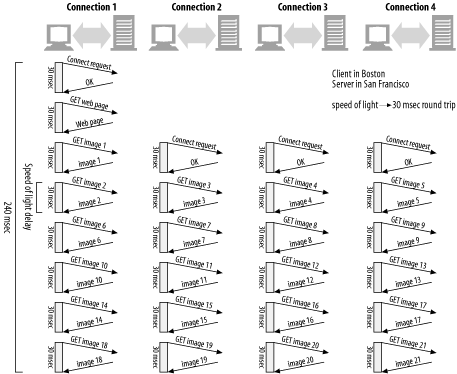

# 7장 캐시

자주 쓰이는 문서의 사본을 저장하는 HTTP 장치. 
- 웹 요청이 캐시로 도착했을 때 캐시된 로컬 사본 존재하면 원 서버가 아니라 캐시에서 제공한다.

- 캐시는 불필요한 데이터 전송을 줄여서, 네트워크 요금으로 인한 비용을 줄여준다.
- 네트워크 병목을 줄인다 (대역폭 안 늘려도 페이지를 빨리 불러온다. 절대적인 hop 개수가 차이나서)
- 원 서버의 요청을 줄여 서버는 부하를 줄이고 빨리 응답
- 거리 지연 감소 (distance delay)


# 7.1 불필요한 데이터 전송
똑같은 바이트들이 여러번 전송되며 네트워크 대역폭 잡아먹고 웹서버에 부하. -> 이게 감소

원래는 요청이 더 많은 hop을 뛰게된다.

# 7.2 대역폭 병목
대역폭 병목을 줄인다. 
- 한국에 CDN이 있어서 LAN으로만 연결될 수 있는 네트워크면, LAN 네트워크 속도로 가져올 수 있으나,
- WAN을 거쳐 미국으로 간다면 WAN의 속도로 문서를 받아오게 된다.

# 7.3 갑작스러운 요청 쇄도 (Flash Crowds)
불필요한 트래픽 급증 - 평소의 50배 == 웹서버에 과부하
- 일반적인 tomcat - spring boot 서버는 1 요청당 1 스레드 만들기 때문에 급격한 성능 thrashing이 일어난다.

지난 지진났을 때 평소 검색 트래픽의 1000배가 몰렸었음.

# 7.4 거리로 인한 지연
대역폭 문제가 아니더라도 ( WAN을 거쳐야 하는게 아니더라도 ) 거리 자체가 문제가 될 수 있다.



빛의 속도 지연만 샌프란시스코 <-> 보스턴 ==240ms   샌프란시스코<-> 일본 == 600ms

# 7.5 적중과 부적중

캐시가 모든 문서를 저장하자는게 아니다. 

- cache hit, miss 
  - 재검사 과정이 있다. (때때로 사본이 여전히 최신인지 검사해야 한다.
    - 전체 객체를 가져오지 않아도 빠르게 신선도 검사할 수 있는 요청 정의됨


## 7.5.1 재검사
조건
- 클라이언트가 요청
- 사본이 검사할 필요 있을정도로 오래됨.

캐시는 원 서버에 재검사 요청 보내면 
- 304 Not Modified (느린 적중, 재검사(revalidation) 적중)
  - 데이터를 받아올 필요는 없어서 cache miss 보단 빠름.
  - 보통 If-Modified-Since 헤더 사용.
    - 캐시된 시간 이후의 변경 있을때만 보내달라!
      - 3가지 적중 케이스
        - 재검사 적중
          - 304 NOT MODIFIED 응답
        - 재검사 부적중
          - 서버 콘텐츠 전체와 HTTP 200 OK
        - 객체 삭제
          - 404 NOT FOUND - 캐시는 사본 삭제

캐시 적중률 , 문서 적중률  
- 적중률 40%라면 웹 캐시로 괜찮은 편

바이트 적중률
- 문서들이 모두 같은 크기가 아니니까, 실제 트래픽에 기여한 양은 바이트 적중률


## 7.5.4 적중과 부적중의 구별
HTTP 클라이언트에게 응답이 캐시 적중이었는지 아닌지 방법 없음. 다 200 OK , 단 사용 proxy 캐시중 일부는 via 헤더에 추가 정보.

한가지 방법은 응답의 Date 헤더 - 응답의 생성일이 더 오래되었다면 캐시.


# 7.6 캐시 토폴로지

## 7.6.1 한명에게 할당된 캐시는 개인 전용 캐시 (private cache) 
웹 브라우저가 내장 하고 있음.
- 캐시된 파일은 임시 파일이라 부른다. 


## 7.6.2 공유된 캐시는 공용 캐시 (public cache)
- 프락시 캐시 == 프락시 서버
- 브라우저가 프록시 캐시를 사용하도록 설정하는 방법을 따르거나 인터셉트 프록시로 HTTP 요청이 캐시 통하도록 강제할 수도.

## 7.6.3 프락시 캐시 계층들
- 작은 캐시 부적중 -> 부모 캐시가 처리 하는게 합리적인 경우가 많다. 
  - 결국 광역 통신망을 통하기 전에 최종적으로 한번 더 cache hit 해보기.

## 7.6.4 캐시망, 콘텐츠, 라우팅, 피어링

복잡한 캐시망에 대한 이름들이다.

이런 기능들을 제공할 수 있다.
- url에 따라 부모 캐시, 원 서버중 하나 동적 선택
- URL에 따라 특정 부모 캐시 선택
- 부모 캐시 가기전에 캐시 사본 로컬에서 찾아본다.
- 다른 캐시들에 부분적 접근은 되지만 (peering), 그 캐시를 타고 원서버로 가는것은 허용 안함


선택적인 피어링 지원하는 캐시는 형제 캐시. 캐시끼리 연결해서 서로 찾아볼 수 있게 한다.
- 다만 HTTP는 형제 캐시 지원 안해서, ICP(Internet Cache Protocol) or HTCP (Hypertext Cache Protocol) 라는 프로콜로 HTTP 확장


# 7.7 캐시 처리 단계

HTTP GET 메시지 하나를 처리한다고 해보자

1. 요청 받기
   - 메시지 전체가 도착하기 전에 트랜잭션 처리를 시작하는 것도 좋은 방법
2. 파싱 (URL, 헤더 검출)
   - 헤더 to 자료 구조 -> 캐싱 소프트웨어 편하게
   - 상대 URL to 절대 URL 등
3. 검색- 로컬 복사본 검사, 사본 없으면 사본 받아온다.
   - 메모리 or 디스크 or 근처 다른 pc
   - 캐시된 객체는 서버 응답 본문 + 원 서버 응답 헤더까지 포함. 
4. 신선도 검사(if needed) 
   - 복잡, 후술. 캐시 제품별 설정 옵션이 많다.
5. 응답 생성
   - 서버 응답 토대로 응답 헤더 생성.
   - 캐시 신선도 정보 삽입 (Cache-Control, Age, Expires)
   - Date 헤더는 불변(최초 원서버 응답)
6. 발송
   - 프록시 서버니까 , 클라이언트와 커넥션 유지해야함.
   - 좋은 장비는 로컬 저장장치랑 네트워크 I/O 버퍼 사이 문서의 콘텐츠 복사 피하기 
     - 저장장치 -> 읽기 -> 메모리에서 네트워크 I/O 버퍼에 복사해서 넣기 말고, 저장장치 -> 읽기 -> 읽어온 메모리 공간을 네트워크 I/O 버퍼에 매핑해줌
7. 로킹(optional)
   - 보통 캐시 적중, 부적중 횟수 통계 등.


# 7.8 캐시(사본) 신선하게 유지

## 7.8.1 문서 만료
HTTP는 Cache-Control과 Expires 헤더로 원 서버가 각 문서에 유효기간 붙일 수 있게 해준다. 
- 캐시는 서버와의 접촉 없이 사본을 제공해도 된다. 
  - 클라이언트는 캐싱 or 검사되지 않은 리소스 거부 헤더 넣을 수 있음.
  - 새 사본 검사해서 Cache-Control, Expires 업데이트


## 7.8.2 유효기간과 나이
- HTTP/1.1 Cache-Control:max-age 응답 헤더로 유효기간 명시.
  - 문서 처음 생성 이후 최대값(초 단위)
- HTTP/1.0+ Expires
  - 절대시간 


## 7.8.3 서버 재검사
캐시 만료되었다고 문서 삭제 ㄴㄴ
- 캐시가 원서버에게 문서 변경 물어보는
  - 변경되었다 : 사본을 가져와 저장한 뒤, 클라이언트에게도 전송
    - 전송하는건 캐시 프록시
  - 변경 안되었다: 새 만료일을 포함한 새 헤더만 가져와서 캐시 안의 헤더를 갱신한다

캐시가 재검사 해야 하는데 원 서버 접근 불가능하다면? 통신 실패 에러를 반환해야 한다. 
- 다만, 해당 서버 페이지 정도는 네트워크 캐시에 살아 있을 수도


## 7.8.4 조건부 메서드와 재검사
HTTP중 조건부 메서드 있음. 조건부 GET == 캐시랑 다른 경우만 본문 보내달라.

5가지 조건부 요청 헤더. 2개만 유명, 유용

`If-Modified-Since: <date>` (IMS 요청) 
- 안 바뀌었어도 응답 헤더는 변경될 수 있다. 새 만료 날짜 같이 갱신된 것만 보내줌 
- date에 대한 string equivalence check로 하기도 한다. 

`If-None-Match: <tags>` : 마지막 변경 날짜 맞춰보는 거 대신, 문서 일련번호처럼 동작하는 태그가 다를때만
- 어떤 문서는 일정 간격으로 다시 쓰이지만 실제로는 같은 데이터다. 이런경우 tag가 유용
- 너무 사소한 변경이거나 (주석 변경)
- 최근 변경 일시 정확히 판별 불가
- 1초보다 작은 간격으로 갱신되는 문서들

ETag: "v2.6" 이런식으로 가지고 있는 헤더가 아닐경우에만 새 객체 달라. 
- 여러 사본 가진 경우에는 여러개 나열 가능. 
  - 아마 서버에서 보내주는 태그로 클라이언트에게 전달

## 7.8.7 약한 검사기, 강한 검사기
- 모든 캐시 사본 무효화 안하고 문서 조금 변경하고 싶어
  -  HTTP/1.1은 약한 검사기 (weak validator) == 이정도 변경은 같은 문서
  - `ETag: W/"v2.6" `
  - `If-None-Match: W/"v2.6"` 이런식으로 W/를 붙여서 약한 검사기 비교. 다만 진짜 컨텐츠 바뀐거면 태그 버전업해야 
- 강한 검사기 (strong validator) - 콘텐츠가 바뀔때마다 바뀐다.


## 7.8.8 언제 엔티티 태그, Last-Modified 일시 사용?
사실 클라이언트는 엔티티 태그 반환했으면 엔티티 태그 검사기 사용

서버가 Last-Modified 값만 반환하면 If-Modified-Since 사용


둘다면?
- 두가지 재검사 정책 모두 사용

HTTP/1.1 original contents server는 엔티티 태그 검사기 보내야. (Last Modified 같이 보내면 좋고)

만약 캐시나 서버가 태그, modified 다 있다면, 원서버는 모든 조건에 부합하지 않을때에만 304 Not Modified 보내야.


# 7.9 캐시 제어
- HTTP는 문서가 만료되기 전까지 서버가 얼마나 오래 캐시되게 할것인지 정의하게 해준다.

## 7.9.1 no-cache, no-store
- 캐시 검증되지 않은채로 응답하는걸 막는다.

no-store: 캐시가 사본 만드는것 금지 - 문서 응답 보내주고 삭제함

no-cache: 재검사 하고 클라이언트로 전달하라.

pragma: HTTP/1.0에서는 `Pragma:no-cache` 만 이해 가능


## 7.9.2 Max-Age 응답 헤더
Cache-Control: max-age 헤더는 서버로부터 문서가 캐시로 온 이후로 흐른 시간이 초단위로 지났는지 체크한다. 
- max-age=3600
- s-maxage=3600 (공용 캐시에만 적용)

## 7.9.3 Expires 응답 헤더
- deprecated
- 실제 만료 날짜 명시
  - 많은 서버가 실제 시간과 달라서 경과시간이 낫다 생각되어 deprecate

## 7.9.4 Must-Revalidate 응답 헤더
- 캐시는 성능 개선을 위해 만료된 객체 제공할 수도 있다. 하지만 신선하지 않은 사본을 재검사 없이 제공해서 안된다면 이 헤더.


## 7.9.5 휴리스틱 만료
- 응답이 Cache-Control: max-age 헤더나, Expires 헤더 중 어느 것도 없으면 그냥 적당히 heuristic한 최대 나이 사용.
- 최대 나잇값이 24시간 보다 크다면 heuristic Expiration 경고 헤더를 응답 헤더에 추가.
 
LM 인자 알고리즘
- 최근 변경 일시로 문서 얼마나 바뀌는지 추정
- 캐시된 문서가 마지막으로 변경된게 예전이면 아마 바뀔 가능성 x
- 캐시된 문서 최근 변경시 짧은 시간만 캐시

보통 신선도 유지기간 상한을 놓는다. 1주일정도?

근데 최근 변경일도 없으면, 그냥 기본 신선도 유지기간 (default로 대충 둔다)

## 7.9.6 클라이언트 신선도 제약
- 웹 브라우저는 강제 캐시 갱신 버튼 있음. (브라우저나 프록시 캐시의 컨텐츠 갱신)
  - Cache-control 요청 헤더가 추가된 GET 요청 발생시킨다.
  - 만료 제약을 업격하게 하거나, 느슨하게 할 수 있다.
    - 흠..? DDOS 공격할때는 캐시타면 안되니까 캐시 안타는 헤더를 넣을 것이고
    - 그럼 캐시 자체를 공격할 수도 있는건가? (캐시에 있는 정보가 계속 업데이트 되게 하니까?)

- `max-stale = <s>` : s초만큼 지난 문서도 캐시에서 받는다
- `min-fresh = <s>` : s초 후까지의 신선한 문서만 받아들인다.
- `max-age = <s>` : s초보다 오래 캐시된 문서 반환 
- `no-cache`
- `no-store`
- `only-if-cahced`: 클라이언트는 캐시에 들어있는 사본만을 원한다

유효기간 너무 길게 잡을까봐 max-age설정 안하는 경우도 많음

# 7.10 캐시 제어 설정

## 7.10.1 아파치로 HTTP 헤더 제어
- mod_headers: 개별 헤더 설정 가능

```
<Files *.html>
    Header set Cache-control no-cache
</Files>
```

- mod_expires: expire 날짜 자동생성 - 최종 수정 이후 + 며칠로 유효기간 설정하게 해줘.

- mod_cern_meta: 각 파일별 메타파일을 생성하게 되어, 각 메타파일에 헤더 추가. 그걸로 줄것.


## 7.10.2 HTTP-EQUIV 통한 HTML 캐시 제어

HTTP 서버 응답 헤더는 문서의 만료와 캐시 제어 정보를 돌려주기 위해 사용된다.

근데 그냥 문서에 적으면 안될까? 

HTML 2.0에서 <META HTTP-EQUIV> 태그 정의. 

ex.

```html
<META HTTP-EQUIV="Cache-Control" CONTENT="no-cache">
```

HTTP 서버가 문서를 처리할 때 이 정보를 사용한다. 이 문서에 대한 응답을 할 때 여기 써있는 걸 헤더 필드로 포함.
- 보면 알다시피, 문서를 읽어서 헤더를 제작해야 하는 특성상 서버 부하 가중, 설정값이 정적이라 사용 잘 안됨.
  - cache control 바꾸겠다고 배포 다시 할 것인가?
    - SK 데이터센터 불나서 cache를 사라지지 않게 해야 한다면? 
- 또한, 브라우저가 이런 기능을 사용한다면, 프록시에서 온 응답 헤더랑, 문서의 응답 헤더랑 다르다면 캐시 만료에 대한 동작에 혼란 초래
- 일반적으로 무시하도록 개발

# 7.11 HTTP 신선도 계산

## 7.11.1 나이와 신선도 수명
- 캐시된 사본의 나이와 신선도 수명만 계산하면 된다.
  - 사본의 나이
    - 서버에 대해 마지막 재검사 한 후(문서 보낸 후) 문서가 보낸 시간이다. (물론 Date 헤더나 원서버의 Age헤더 등으로 문서 나이 파악)
  - 신선도 수명
    - 서버의 만료 정보랑, 요청을 보낸 클라이언트의 신선도 요구사항이 결정 (max-stale이면 좀 지났어도 그냥 받아, min-stale이면 조금 남았으면 안 받아)

- Age헤더는 얼마나 문서가 나이들었는지를 알려주는 건데,
  - Date헤더를 사용할 때에는 네트워크 지연이나, clock skew 같은 상황때문에 실제나이는 더 먹었을 수도 있다.
  - Age 헤더는 문서가 프록시나 캐시 통과할 때마다 장치들이 Age에 상대적 나이를 누적해서 더하도록 한다.  
  - 다만 HTTP 1.1 지원안하면 Age 충분히 안 더해진 채로 넘어올 수도 있다. 
  
모든 컴퓨터가 똑같이 정확한 시간을 갖고 있다면, 그냥 현재시간 - 서버가 문서 보낸 시간(Date 헤더) 하면 되지만

실제로는 저만큼 더 age가 들었다고 생각하는 것이 나은 것. 물론 우리 컴퓨터 시간이 더 빠르면 그냥 0으로 취급해도 될 것.
- 원서버가 예상했던 것보다 일찍 expire될 거니까.


서버에다 요청을 보내고 캐시가 받은데 까지의 응답 지연시간도 생각해야 한다.
- 다음에 요청을 해야할 때에 이런 네트워크 딜레이까지 생각해서 원 서버에 요청해야 한다. 
  - 캐시된 문서가 실제 나이보다 응답 지연 시간만큼 더 나이든 것으로 본다 

    
# 7.12 캐시와 광고

광고 회사의 딜레마
- 캐시로 미디어 소모가 많아지고, 광고를 더 빠르게 팔 수 있게 되었다.
- 캐시에 광고가 몇번 나갔는지 모른다.
- 캐시가 광고를 가로채지 못하도록 한다.
- 광고를 CGI 게이트웨이로 제공해서 매 접근마다 광고 URL을 바꾼다.
  - 캐시 무력화 기법. (URL을 안바꾸면 언제 캐시될지 모른다.)

실제로는 URL 안바꿔도 얼마나 적중되었는지 알려주면 된다.
- 모든 접근에 대해 원 서버와 재검사 하도록 하면 된다. - 트랜잭션이 느려지잖아. (원 서버의 접근을 유발해 네트워크 부하)
- 로그 마이그레이션: 모든 적중 로그를 전달하자.
- 적중 측정과 사용량 제한 RFC 2227. 특정 URL에 대한 캐시 적중 횟수를 정기적으로 서버에게 돌려주는 Meter 헤더를 추가. 
  - 캐시서버가 얼마 걸렸는지 광고서버에 전달해줌.


  


