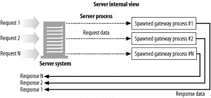
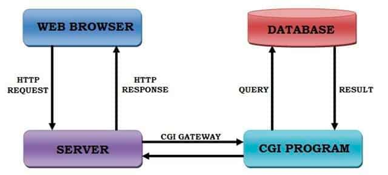
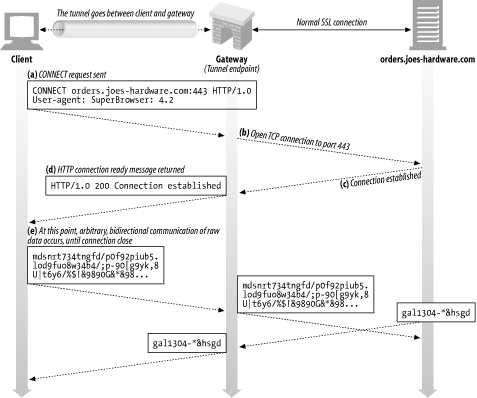

8장 통합점: 게이트웨이, 터널, 릴레이

온라인에 DB 콘텐츠나 동적 생성된 HTML 페이지 내보내고 싶었다. 
- HTTP 위에 다른 프로토콜 얹으려면 HTTP가 기본 구성요소일 수 밖에 없다.
  - HTTP만 허용하는 방화벽이 있는 회사에서 다른 프로토콜로 통신하는 트래픽을 HTTP로 감싸기
    - GRPC? RPC 등

용어 설명
- 게이트웨이: 다른 프로토콜과 애플리케이션 간 HTTP 인터페이스
- 애플리케이션 인터페이스: 서로 다른 형식의 웹 앱이 통신하는데 사용
- 터널: HTTP 커넥션으로 HTTP 아닌 트래픽 전송하기 위해 사용
- 릴레이: 단순한 HTTP 프록시로, 한번에 한개의 홉에 데이터 전달하는데 사용한다.

# 8.1 게이트웨이

웹에 복잡한 리소스 -> 굳이 한 개의 어플리케이션으로 해결해야하나?
- NO

리소스 게이트웨이
- 리소스 받기 위한 경로를 안내.

클라이언트 <-> 서버 <-> 게이트웨이 <-> DB
- 클라이언트는 HTTP로만 요청하지만 실제로는 sql로 쿼리를 하는 효과

클라이언트 <-> HTTP/FTP 서버 측 FTP 게이트웨이 <-> FTP 서버
- 클라이언트는 HTTP로 FTP 요청을 날리지만, 게이트웨이가 FTP 서버랑 FTP 커넥션을 맺는다.
- 클라이언트는 HTTP로만 응답 받는다

HTTPS 클라이언트 <-> HTTPS/HTTP 클라이언트 측 보안 게이트웨이 <-> 웹 서버
- 게이트웨이는 암호화된 SSL 요청을 받아서 해독해 일반 HTTP 요청을 웹 서버로 보낸다.
- 보안만 인증하는 서버가 있다면 (보안 가속기) 웹 서버 앞단에 위치시켜서 성능 향상

HTTP 클라이언트 <-> HTTP/API 서버 측 어플리케이션 게이트웨이
- 어플리케이션 서버 게이트웨이 API를 통해서 서버측 어플리케이션 프로그램에 연결
  - API게이트웨이에서만 오는 요청을 처리한다면 보안성이 좋을듯?

## 8.1.1 클라이언트 측 게이트웨이와 서버 측 게이트웨이

`< 클라이언트 프로토콜 / 서버 프로토콜 >` 형식으로 나타냄

# 8.2 프로토콜 게이트웨이
게이트웨이 타는 법 2가지
- 브라우저에 명시적 게이트웨이 설정 -> 트래픽이 게이트웨이 거치게
- 서버측에서 게이트웨이를 리버스 프록시로 설정

## 8.2.1 HTTP/* 서버측 웹 게이트웨이
- HTTP 요청이 게이트웨이로 들어올때 외래 프로토콜로 전환된다. ex. FTP 프로토콜로.
- 게이트웨이가 모든 요청 처리해서 응답을 HTTP로 리턴해줄 것.

## 8.2.2 HTTP/HTTPS 서버 측 보안 게이트웨이
- HTTP로 접근하더라도 HTTP/HTTPS 인바운드 보안 게이트웨이가 실제 보안웹서버 443 port로 HTTPS 통신을 할 것이다.

## 8.2.3 HTTPS/HTTP: 클라이언트 측 보안 가속 게이트웨이
- HTTPS 트래픽을 받아 복호화 해서 HTTP 요청을 원서버에 보낸다.
  - 암호화 복호화 빨리하는 하드웨어 내장해서 원 서버 부하 줄이기

# 8.3 리소스 게이트웨이
게이트웨이의 가장 일반적인 형태 == 어플리케이션 서버
- 어플리케이션 서버는 클라이언트에게 API를 열어주고, API를 통해서 요청을 서버에 동작하고 있는 어플리케이션에 전달한다.
- 최초의 API로 유명했던건 CGI (Common Gateway Interface == CGI)
  - URL에 대한 HTTP 요청에 따라 프로그램 실행, 출력 수집, HTTP 회신할 때 웹 서버가 사용하는 표준화된 인터페이스 집합
    - 서버가 요청 받았을 때 per 요청당 게이트웨이 프로세스를 런치시켜서 여기에 특정 데이터를 요청하고, 이 게이트웨이 프로세스가 답변을 제작하게 한다.

## 8.3.1 공용 게이트웨이 인터페이스 (CGI)
다만, 모든 CGI 요청마다 새로운 프로세스 만드는 부담이 크고, CGI 사용하는 서버의 성능 제한 및 서버 장비의 부담.
- Fast CGI가 개발.
  - 백그라운드에서 처리하는 데몬 방식 -> 새 프로세스 생성 제거 성능저하 해결

- https://live-everyday.tistory.com/197

이러니 CGI 요청시마다 DB 커넥션을 새로 여는 등 문제가 있었다. 이게 문제라 servlet이 나온것? (추정)

## 8.3.2 서버 확장 API
- 서버 자체의 동작을 바꾸고 싶거나 서버의 처리능력 끌어올리기
  - query param 파싱이 필요없는데 파싱하려고 해서 성능이슈가 발생한다 -> 오버라이드 및 추가할 수 있는 확장 api 제공
    - 다만 웹서버 specific API가 존재

# 8.4 애플리케이션 인터페이스와 웹 서비스
HTTP를 어플리케이션을 연결하는 도구로 사용
- 어플리케이션 간 연결할 때 프로토콜 인터페이스 맞추는게 까다로움 
  - 웹 어플리케이션이 서로 통신하는데 사용할 표준과 프로토콜 집합 개발됨 == `웹 서비스`라고 함
    - Simple Object Access Protocol - XML 데이터를 HTTP메시지에 담는 표준

# 8.5 터널
웹 터널도 HTTP 프로토콜 지원 안하는 앱에 HTTP 앱 사용해 접근하는 방식 제공
- HTTP 커넥션으로 HTTP가 아닌 트래픽 전송하기!

## 8.5.1 CONNECT로 HTTP 터널 커넥션 맺기 
CONNECT:
- 터널 게이트웨이가 임의의 목적 서버와 포트에 TCP 커넥션을 맺고 (IP + PORT) 클라이언트와 서버 간에 오는 데이터를 무조건 전달하기를 요청

- 클라이언트는 게이트웨이에 터널 연결하려고 함. 
- 클라이언트의 CONNECT는 게이트웨이와 서버간의 TCP 커넥션을 생성한다. 
  - 8-10 b 8-10c
- 이때부터 HTTP 터널로 클라이언트의 모든 데이터는 위의 TCP 커넥션으로 모두 전송됨 (헤더가 HTTP 아니라고 해서 자르지 않음)
- 게이트웨이는 터널을 통해 전달되는 데이터를 볼 수 없다. 

## 8.5.3 SSL Tunneling
원래 웹 터널은 방화벽 통해서 암호화된 SSL 트래픽 전달하려고 개발되었다. 
- 원 서버랑 클라이언트 사이에 HTTP만을 허용하는 프록시가 있으면, 암호화 되어 있는 패킷을 읽을 수 없어 처리가 불가능하다.
  - 그래서 HTTP만 허용하는 방화벽을 통과할 수 있게 tunneling 후 ssl 커넥션을 사용한 것

## 8.5.4 SSL 터널링 vs HTTP/HTTPS 게이트웨이
HTTPS 프로토콜(SSL상의 HTTP) -> 다른 프로토콜과 같은 방식으로 게이트웨이 통과가능
- 클라이언트 측에 SSL 세션을 시작하는 게이트웨이를 두고 원격 HTTPS 서버와 HTTPS트랜잭션을 하면 된다.
  - 응답은 프록시(게이트웨이?) 가 받아서 HTTP로 다시 클라이언트에게 풀어서 전달

단 단점

- 클라이언트와 게이트웨이 사이의 보안 적용 안된 HTTP 커넥션
- 프락시가 인증을 담당하고 있어서, 원격 서버에 SSL 클라이언트인증 (클라이언트의 정보를 보내야하는)
- 게이트웨이가 SSL 완벽히 지원해야 한다.

SSL 터널링을 사용하면 게이트웨이에 SSL을 구현할 필요는 없고
- SSL 세션이 클라이언트가 생성한 요청과 목적지 웹 서버 사이에 생성됨
  - 암호화 된 데이터를 그냥 계속 보낼뿐
  - SSL 세션이란 서버 키로 암호화 해서 보내는 데이터다. 
    - 클라이언트가 암호화를 못해서 SSL을 못쓴다는거 아닌가? 근데 어떻게 암호화된 데이터를 보내지?

## 8.5.6 터널 보안에 대한 고려사항들
다만 터널링은 다른 port에 대해서도 허용되면 보안이 필요한 개발서버인데 접근이 가능해지는둥 하니, 
- 특정 포트 like 443 처럼 잘 알려진 포트만 터널링 할 수 있게 허용해야한다.

# 8.6 릴레이

간단한 HTTP 프록시
- 커넥션 맺기 위한 HTTP 통신한 뒤부터 바이트를 맹목적으로 전달
  - 단순히 전달만 하는 프록시 구현 or 단순필터링 or 컨텐츠 변환
    - 다만, Connection: keep-Alive 헤더를 제대로 처리 못해서 발생하는 hang 존재. 
      - 그 앞장에서 본 멍청한 프록시문제랑 동일.
      - keep alive 로 맺는 커넥션이 프록시랑 remote 서버인데, 클라이언트는 자기가 맺은 커넥션으로 보내도 프록시는 이게 한번만 프로세싱하는 건줄알고 응답 처리 안해준다.

