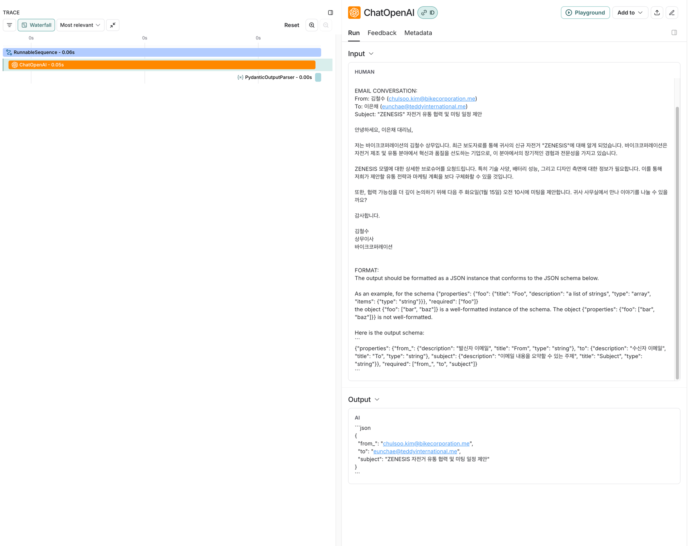
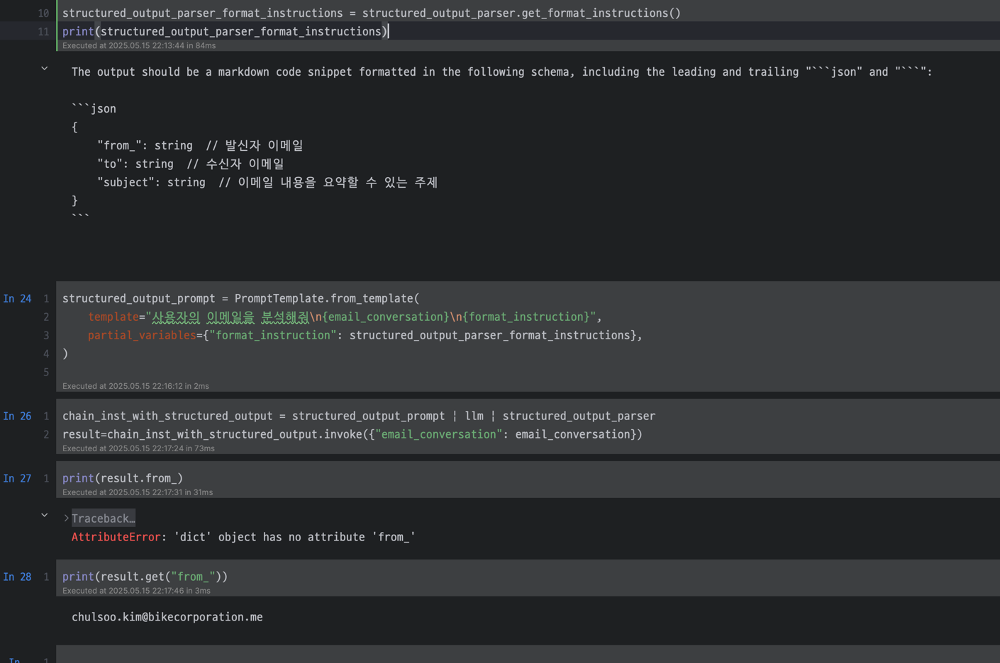
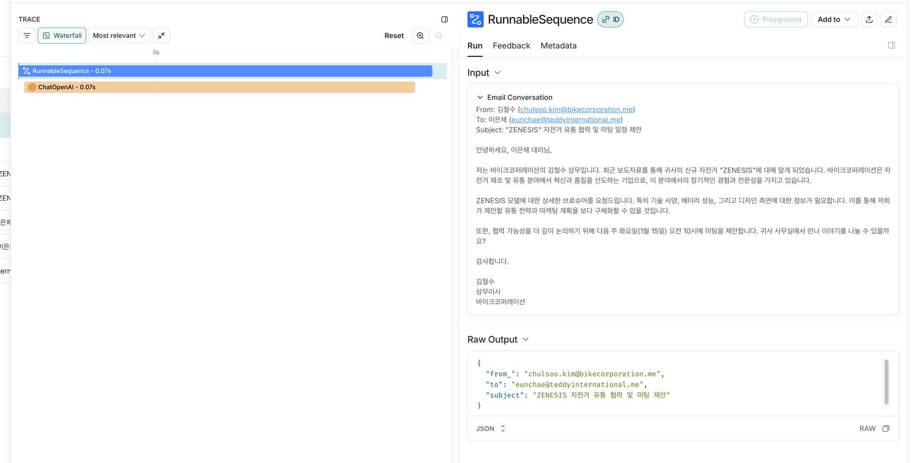

# 3장 Output Parser

```python

from pydantic import BaseModel, Field
from langchain_core.output_parsers import PydanticOutputParser

class EmailSummary(BaseModel):
    from_: str = Field(description="발신자 이메일")
    to: str = Field(description="수신자 이메일")
    subject: str = Field(description="이메일 내용을 요약할 수 있는 주제")

parser = PydanticOutputParser(pydantic_object=EmailSummary)

prompt = PromptTemplate.from_template(
    """
You are a helpful assistant. Please answer the following questions in KOREAN.

QUESTION:
{question}

EMAIL CONVERSATION:
{email_conversation}

FORMAT:
{format}
"""
)

prompt = prompt.partial(format=parser.get_format_instructions(), email_conversation=email_conversation)


```

결국 pydantic class를 넣는다면 format_instruction을 잘 가공해주는 역할을 하는거고, 단 하나의 llm 요청만 이뤄진다. 



pydantic을 안쓰고 구조화 시키고 싶다면 StructuredOutputParser를 사용하면 된다. 


# 3.2장 StructuredOutputParser

```
StructuredOutputParser
이 출력 파서는 LLM에 대한 답변을 dict 형식으로 구성하고 key/value 쌍으로 갖는 여러 필드를 반환하고자 할 때 사용할 수 있습니다.

Pydantic/JSON 파서가 더 강력하지만, 이는 덜 강력한 모델(예를 들어 로컬모델과 같은 인텔리전스가 GPT, Claude 모델보다 인텔리전스가 낮은(parameter 수가 낮은) 모델) 에 유용합니다.

참고

로컬 모델은 Pydantic 파서가 동작하지 않는 경우가 많으므로, 대안으로 StructuredOutputParser 를 사용할 수 있습니다.

```

Q. 이게 무슨 말이야? 로컬 모델이 llm 로컬모델(규모작은 모델)을 말하는건가?  Pydantic parser는 이런것처럼 format instruction만 넣는거니까 LLM이랑 상관없지 않아?

A. 

파라미터 수가 적고

추론 능력이 제한적이며

출력 형식을 정확하게 따르는 능력이 부족한 LLM을 으미한다. 

PydanticOutputParser는 모델이 정확히 JSON 형식을 출력해야 제대로 작동한다. 고성능 LLM은 이런 형식을 잘 따라주는데, 로컬 모델은 JSON형식을 제대로 출력 못할 수도 있다. 

StructuredOutputParser는 LLM에게 그냥 어떤 ` field : value `  형식으로 출력하라고 하는거니까, json 포맷에서 처럼 중괄호 안닫고 하는 문제는 안생김. 그래서 덜 엄격함

나는 그래서 StructuredOutputParser는 여러번 LLM 요청이 들어가겠다 싶었는데, 이것도 하나의 llm 요청으로 끝남 



이상하네 근데, json format 맞추라고 되어있잖아. 아 근데 pydantic은 클래스 형태로 result가 나오고, 얘는 dict형태로 결과가 나온다.


pydantic format instruction은 이러고


>The output should be formatted as a JSON instance that conforms to the JSON schema below.
As an example, for the schema {"properties": {"foo": {"title": "Foo", "description": "a list of strings", "type": "array", "items": {"type": "string"}}}, "required": ["foo"]}
the object {"foo": ["bar", "baz"]} is a well-formatted instance of the schema. The object {"properties": {"foo": ["bar", "baz"]}} is not well-formatted.
Here is the output schema:
```
{"properties": {"from_": {"description": "발신자 이메일", "title": "From", "type": "string"}, "to": {"description": "수신자 이메일", "title": "To", "type": "string"}, "subject": {"description": "이메일 내용을 요약할 수 있는 주제", "title": "Subject", "type": "string"}}, "required": ["from_", "to", "subject"]}
```

structured format instruction은 아래와 같다. 형식에 덜 민감하겠다.

>The output should be a markdown code snippet formatted in the following schema, including the leading and trailing "```json" and "```":
```json
{
	"from_": string  // 발신자 이메일
	"to": string  // 수신자 이메일
	"subject": string  // 이메일 내용을 요약할 수 있는 주제
}
```


