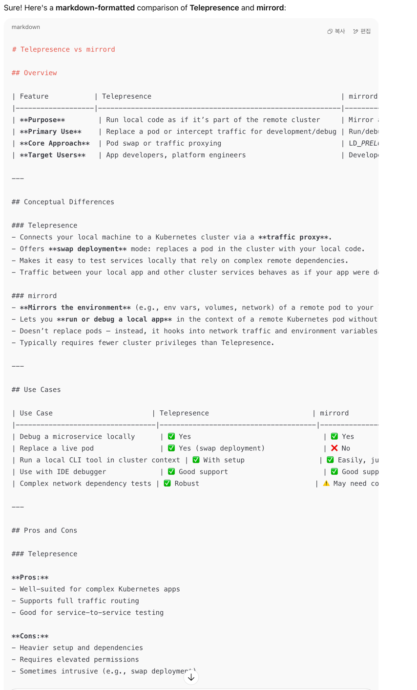
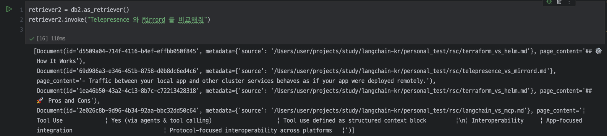

# vector database

Chroma는 개발자의 생산성과 행복에 초점을 맞춘 AI 네이티브 오픈 소스 벡터 데이터베이스입니다. Chroma는 Apache 2.0에 따라 라이선스가 부여됩니다.

일단 마크다운형태의 데이터를 만들어 놓고, 이걸 load하려고 langchain markdown loader를 사용했다. 

https://python.langchain.com/docs/how_to/document_loader_markdown/

뭔가 text split해서 넣었을때 irrelevant한 내용도 많이 나온다. '비교'에 중점이 들어가서 그런가보다

