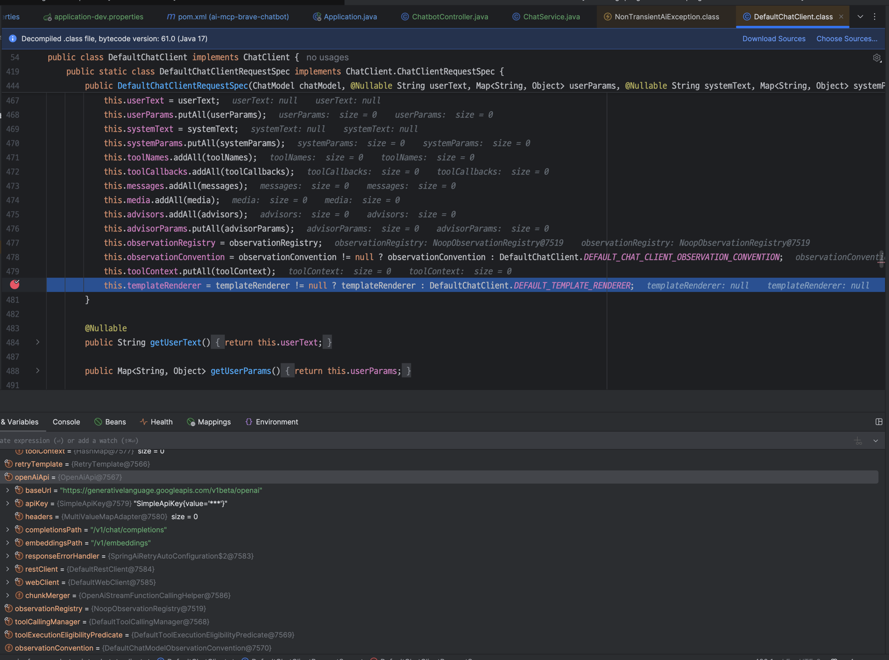
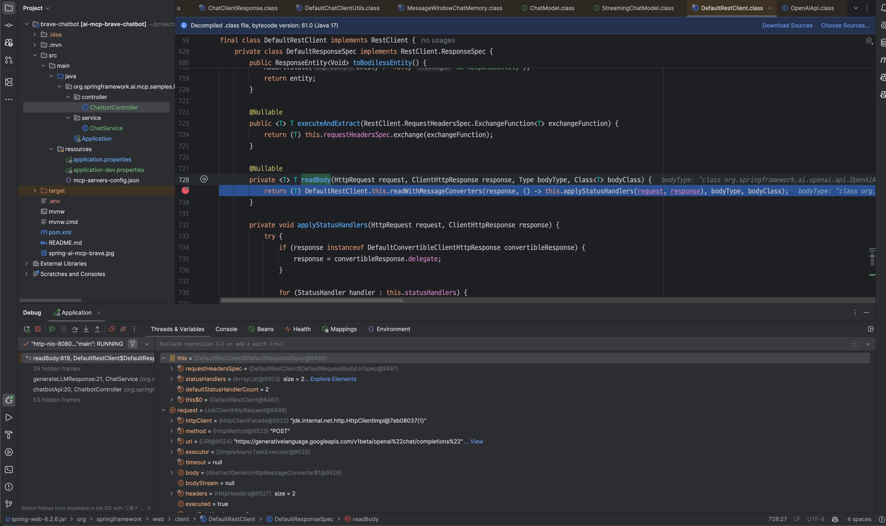
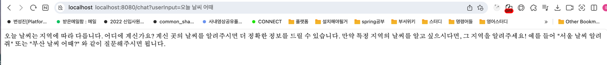
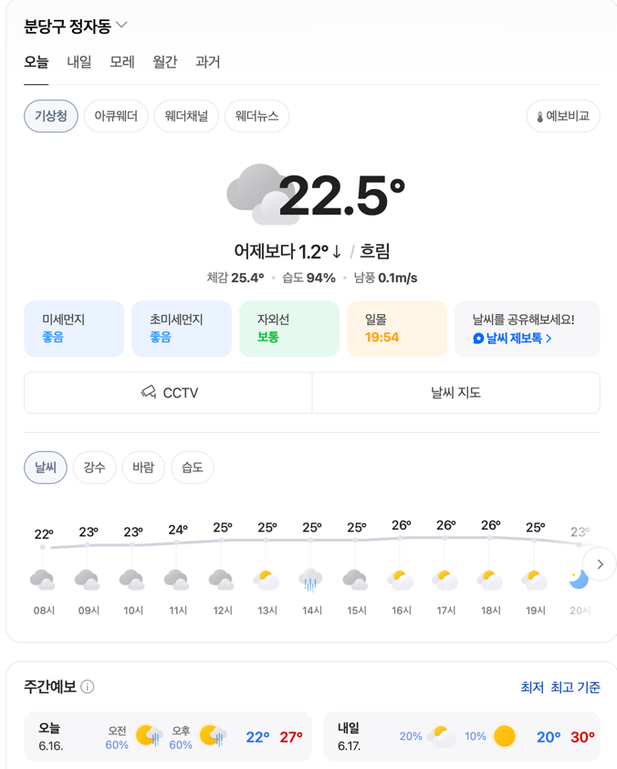

https://docs.spring.io/spring-ai/reference/1.1-SNAPSHOT/api/chat/openai-chat.html

# spring AI 


어떤 api가 필요할까? 가장 단순한 구현인 

```
			var chatClient = chatClientBuilder

					.build();

			// Start the chat loop
			System.out.println("\nI am your AI assistant.\n");
			ChatResponse response = chatClient.prompt().user("TELL me a joke").call().chatResponse();
			System.out.println("\nASSISTANT: " + response);
```

이게 막혀있는 상황이야.

아하 알고보니까 spring.ai.openai.chat.base-url 을 세팅해두어서, 일반적인 요청은 여전히 다른위치로 가고 있었다.

spring.ai.openai.base-url 을 세팅해줘야 api.openai.com 으로 요청안가는것 같다. 

```
spring.ai.openai.api-key=sk-IBabcdefghijklmnopqrstuvwxyz
#spring.ai.openai.chat.base-url=http://maas.abc.com/v1
spring.ai.openai.base-url=http://maas.abc.com
spring.ai.openai.chat.options.model=google/gemma-3-12b-it
```



디버깅은 이런식으로 DefaultChatClient.class에 디버깅을 걸면, 현재 어떤 api, url로 요청을 거는지 알 수 있다.

openai api compatible한 gemini로 요청을 보내려는데, 404에러가 떠서 보니까

https://ai.google.dev/gemini-api/docs/openai#rest gemini는 


```
curl "https://generativelanguage.googleapis.com/v1beta/openai/chat/completions" \
-H "Content-Type: application/json" \
-H "Authorization: Bearer GEMINI_API_KEY" \
-d '{
    "model": "gemini-2.0-flash",
    "messages": [
        {"role": "user", "content": "Explain to me how AI works"}
    ]
    }'
```

이런식으로 endpoint가 completions인데, chat/completions가 아니라 /v1/chat/completions 로 요청하고 있는 것을 볼 수 있다.


```
curl "https://generativelanguage.googleapis.com/v1beta/openai/v1/chat/completions" \
-H "Content-Type: application/json" \
-H "Authorization: Bearer GEMINI_API_KEY" \
-d '{
    "model": "gemini-2.0-flash",
    "messages": [
        {"role": "user", "content": "Explain to me how AI works"}
    ]
    }'
```

이렇게 요청해봐야 답변이 안온다.

```
spring.ai.openai.base-url=https://generativelanguage.googleapis.com/v1beta/openai
spring.ai.openai.chat.options.model=gemini-2.0-flash
spring.ai.openai.chat.completions-path="chat/completions"
```

이렇게 세팅을 했다. 

`org.springframework.web.client.DefaultRestClient.DefaultResponseSpec#readBody`

근데 여전히 안되어서 이 위치에 중단점을 찍고, 확인해보니까 



이상한점을 찾은사람~

request.uri 가 `openai/\"chat/completions\"` 로 되어있다."

다시 변경해서 해주면, https://generativelanguage.googleapis.com/v1beta/openaichat/completions 로 요청한다.

슬래쉬가 자동처리가 안된다. 고로 슬래쉬까지 넣어서 해보면,

```
spring.ai.openai.base-url=https://generativelanguage.googleapis.com/v1beta/openai/
spring.ai.openai.chat.options.model=gemini-2.0-flash
spring.ai.openai.chat.completions-path=chat/completions
```


내가 승리했다!

```
(base)  user  ~  curl http://localhost:8080/chat\?userInput\=%EC%98%A4%EB%8A%98%20%EB%82%A0%EC%94%A8%20%EC%96%B4%EB%95%8C ; echo
오늘 날씨에 대해 궁금하시군요! 현재 위치를 알려주시거나, 알고 싶으신 지역을 말씀해주시면 자세한 날씨 정보를 알려드릴 수 있습니다.

예를 들어, "서울 날씨 알려줘", "부산 날씨 어때?" 와 같이 질문해주시면 됩니다.

```


# MCP Client with OpenAI

gemini flash 2.0를 사용해서 mcp client식으로 요청했더니 얘는 api 쓸 줄을 모르는 것 같다.

```
        this.mcpChatClient = chatClientBuilder
					.defaultSystem("You are useful assistant and can perform web searches Brave's search API to reply to your questions.")
					.defaultToolCallbacks(new SyncMcpToolCallbackProvider(mcpSyncClients))
					.defaultAdvisors(MessageChatMemoryAdvisor.builder(MessageWindowChatMemory.builder().build()).build())//
					.build();
```
아마 api 콜하는 능력이 없는 것 같다.


> 정자동의 최고/최저 기온을 알려드릴 수 있는 직접적인 방법은 현재 없습니다. 하지만, 다음의 방법으로 정보를 얻으실 수 있습니다: 1. **날씨 웹사이트 또는 앱:** 기상청 날씨누리, AccuWeather, Weather.com과 같은 날씨 웹사이트나 앱에서 정자동의 날씨를 검색하여 최고/최저 기온을 확인합니다. 2. **Brave 검색:** Brave 검색을 사용하여 "오늘 정자동 날씨" 또는 "정자동 최고/최저 기온"과 같은 검색어로 검색합니다. 검색 결과에서 날씨 정보를 제공하는 웹사이트를 찾아 정보를 확인합니다.


정자동 최고기온 최저 기온 검색해달라고 했더니 못한다. 


✅ MCP를 지원하거나 사용할 수 있는 LLM 모델
다음은 MCP를 지원하거나 호환되도록 설계된 LLM 모델들입니다:

1. OpenAI GPT-4 (특히 GPT-4o 포함)
✅ 지원: OpenAI는 function calling / tool use 인터페이스를 공식적으로 제공하며, MCP와 매우 호환됨.

✅ LangChain MCP 통합에서 주로 사용됨.

2. Anthropic Claude 3 (Opus, Sonnet 등)
✅ Claude 모델들은 structured input/output, tool use 등에 강하며, LangChain과의 통합 시 MCP 기반으로 사용할 수 있음.

3. Google Gemini 1.5 Pro
✅ function call, tool use, 그리고 명시적 컨텍스트 유지 기능을 지원.

✅ LangChain MCP에서 사용 가능.

4. Mistral/Mixtral (via LangChain or OpenRouter)
⚠️ 모델 자체는 로우레벨 기능만 지원하지만, LangChain + MCP wrapper를 통해 사용 가능.

5. LLaMA 3 (Meta)
⚠️ 마찬가지로 자체 지원은 없지만, MCP 포맷으로 래핑하면 사용 가능.

🔧 MCP를 실질적으로 "지원"하려면?
MCP는 LLM이 직접 MCP를 이해한다기보다는, LangChain 같은 미들웨어가 LLM과 MCP 포맷을 중간에서 번역해주는 구조입니다.

즉, 다음이 중요합니다:

✅ MCP-compatible wrapper (LangChain, LangGraph)

✅ function calling 지원 LLM (OpenAI GPT-4, Claude 3 등)

✅ structured output을 잘 생성할 수 있는 모델

📦 요약: MCP 실행 가능한 LLM 모델 목록
모델 이름	MCP 직접 지원	MCP와 호환 가능	비고
GPT-4 / GPT-4o	✅ 예	✅ 예	가장 완벽한 호환
Claude 3 (Opus 등)	✅ 예	✅ 예	높은 reasoning
Gemini 1.5 Pro	✅ 예	✅ 예	빠르고 구조적
Mixtral / Mistral	❌ 직접지원 없음	✅ 예 (LangChain 통해)	open source
LLaMA 3	❌	✅ 예 (MCP wrapper 필요)	open source


흠, lanchain으로 잘 래핑이 안되어 있어서 그런가? 

openai api를 사용해보자. 


```
2025-06-16T07:55:08.702+09:00 DEBUG 73855 --- [mcp] [nio-8080-exec-1] o.s.a.m.tool.DefaultToolCallingManager   : Executing tool call: spring_ai_mcp_client_brave_search_brave_web_search
```

gpt-4.1 로 요청을 하게 했는데,

오 뭔가 나온다.

> 정자동(경기도 성남시) 오늘(2024년 6월 20일)의 정확한 최고기온과 최저기온 정보는 공식 기상청 사이트에서 바로 확인할 수 있습니다. 일반적으로 이 지역의 오늘 예상 기온은 다음과 같습니다: - 최저기온: 약 18~20도 - 최고기온: 약 26~29도 정확한 수치는 기상청 날씨누리(https://www.weather.go.kr/w/observation/land/past-obs/obs-by-day.do)에서 확인하실 수 있습니다. 또는 더 구체적인 정보가 필요하다면 알려주세요!


> 오늘 성남시 정자동의 예상 기온은 다음과 같습니다: - 최저기온: 약 18~20도 - 최고기온: 약 26~29도 정확한 수치는 기상청 날씨누리나 웨더아이 같은 공식 날씨 사이트에서 확인하실 수 있습니다. 필요하시면 해당 사이트 링크도 안내해드릴 수 있습니다!




http://localhost:8080/mcp?userInput=오늘정자동최고최저기온알려줘

대충맞는거같지? brave api로 검색을 해주는 것 같다.

# spring ai mcp client가 하는 일

https://docs.spring.io/spring-ai/reference/api/mcp/mcp-client-boot-starter-docs.html

