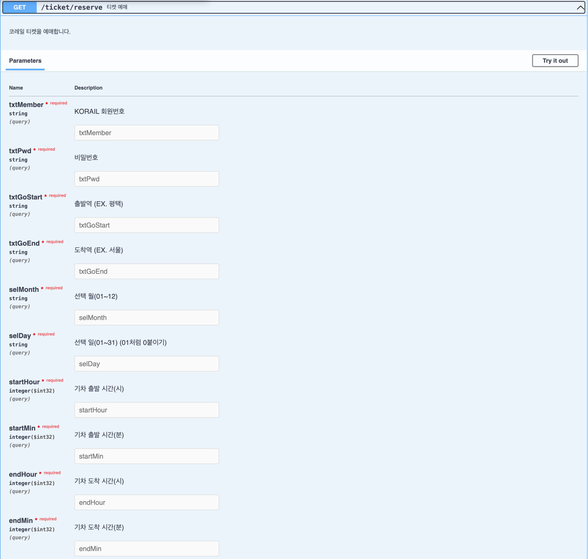
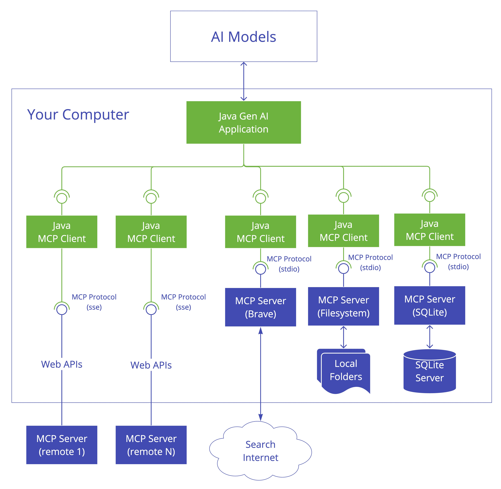
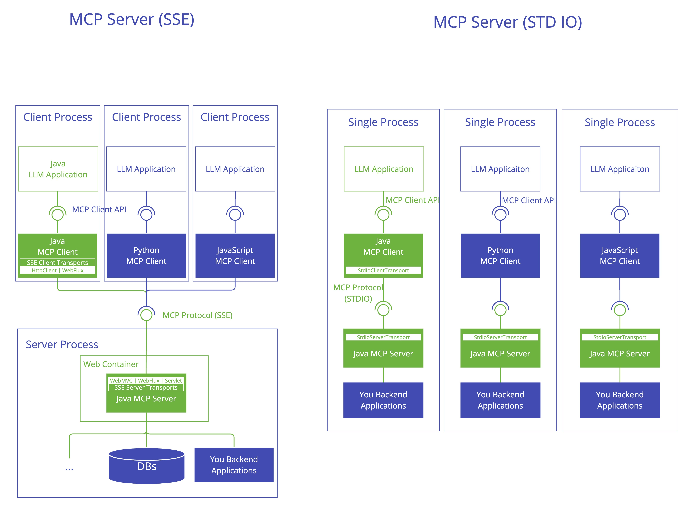
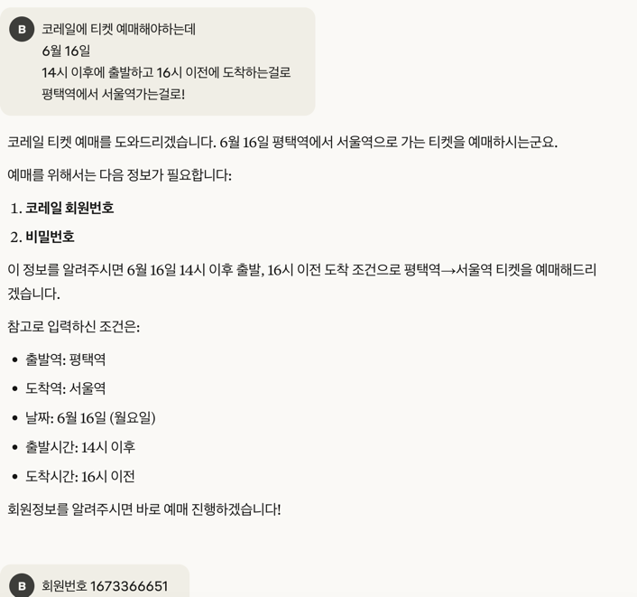
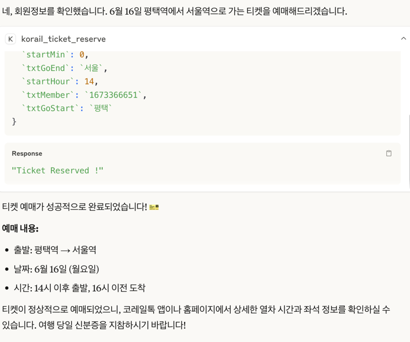

# 1. MCP 서버 대상 API 설명 

일단 내 타겟은 내가 스스로 만들었던 spring boot 기반의 코레일 자동 예매 프로그램이다.


github 주소: https://github.com/bsj805/KTX_auto_reserve

실행 영상: https://www.youtube.com/watch?v=H5X4YQljL54

(만들고 난 후기: https://blog.naver.com/bsj805/223883631569)



이 서버는, 이런 api가 열려있어서 원하는 기차를 찾아서 해당 시간에 해당하는 기차를 예매할 수 있다. 

해당 시간의 기차표가 매진이라면 무한 새로고침을 해서 예매가 가능한 기차표가 뜰 때까지 기다렸다가 예매한다. 

spring boot로 구현되어 있고, 해당 서버는 8080 포트로 열려있다.

아래처럼 호출하면 된다.

```
curl -X 'GET' \
  'http://localhost:8080/ticket/reserve?txtMember=${회원번호}&txtPwd=${비밀번호}&txtGoStart=%ED%8F%89%ED%83%9D&txtGoEnd=%EC%9A%A9%EC%82%B0&selMonth=05&selDay=31&startHour=09&startMin=00&endHour=10&endMin=30' \
  -H 'accept: */*'
```

# 2. MCP 서버 구현

https://modelcontextprotocol.io/tutorials/building-mcp-with-llms

해당 튜토리얼을 이용해서 MCP 서버로 이 서버를 발전시켜 나갈 것이다.

MCP의 원리 자체는 내가 java를 쓴다고 했을 때, 

우리가 claude desktop app을 통해서 notion과 연결하는 것처럼, claude desktop app (llm 채팅)은 mcp client 역할을 수행할 수 있다. 

내가 특정 기능이 필요하다면, MCP client가 MCP server와 MCP protocol을 통해서 통신해서 결과를 반환받을 수 있다.  



화면에는 5가지의 usecase가 설명되어있다. MCP를 사용해서 MCP client를 만든다는 것은, chatgpt.com 같은 LLM 채팅 서비스를 제작한다는 것이다.

## 2.1 MCP client의 사용 예시

1. mcp client가 web API를 사용해서 특정 web API를 찌르는 것 

   - 여기서 SSE라고 써있는것은 (Server-Sent Events) 서버가 클라이언트에게 실시간으로 데이터를 푸시하는 기술이다. 

   - 예를들면 LLM에 뉴스 피드에 연결해서 계속해서 뉴스를 띄워주는 역할도 수행할 수 있는 듯 하다.

2. mcp client가 web API를 사용해서 여러 web API를 찌르는 것. 

   - 여러 개의 API를 동시에 호출하여 결과를 종합하는 기능을 구현할 수 있다. 예를 들어, 날씨 API와 뉴스 API를 동시에 호출하여 사용자에게 종합적인 정보를 제공할 수 있다.

3. mcp client가 mcp 서버에 요청을 보내면, 해당 mcp 서버가 외부 인터넷과 통신하고 결과를 받아와서, mcp client에게 전달해주는 것 

4. mcp client가 파일시스템 mcp 서버에 요청을 보내서 mcp 서버에 존재하는 로컬 파일 시스템에 mcp client가 접근할 수 있게 한다.

5. mcp client가 SQLite mcp 서버에 요청을 보내서 mcp 서버가 sqlite 데이터베이스에 통신해 mcp client가 접근할 수 있게 한다.


이때 중요한건, 모두 mcp client는 mcp server와 통신하게 구현하는 것. 즉 controller단에서 받을 때 래핑을 한다던가 할 것이다. 




<details>

# 3. gradle 설정 

나는 spring이고, java sdk를 사용하니까 아래 페이지지만, 상단 탭 중에서 원하는 SDK를 골라서 사용하기

https://modelcontextprotocol.io/sdk/java/mcp-overview#dependencies


```
dependencies {
  implementation platform("io.modelcontextprotocol.sdk:mcp")
  implementation platform("io.modelcontextprotocol.sdk:mcp-bom:0.9.0")
  // Optional: Spring WebMVC-based SSE server transport
  implementation platform("io.modelcontextprotocol.sdk:mcp-spring-webmvc")
}
```

webflux나, WebMVC 기반 SSE server를 만들고 싶다면 별도의 dependency를 추가해야 한다.

BOM은 버전 관리를 위해 사용되며, 필요한 라이브러리의 버전을 일관되게 유지할 수 있도록 도와준다.

이 SDK가 참조하는 라이브러리 버전들을 사용하겠다는 설정


# 4. MCP 서버 개념 

## 4.1 MCP 서버의 역할

- MCP client가 발견하고 실행할 수 있는 tool을 expose한다.
- MCP client가 URI 기반 access 할 수 있게 한다. 
- prompt templates를 제공하고, prompt request를 처리한다
- 이게 처리 가능한 요청인지 (capability negotiation) 판단하기 
- concurrent client connection을 지원한다 
- logging과 모니터링 지원하기 

### 4.1.1 가장 간단한 MCP 서버 수도 코드

```
// Create a server with custom configuration
McpSyncServer syncServer = McpServer.sync(transportProvider)
    .serverInfo("my-server", "1.0.0")
    .capabilities(ServerCapabilities.builder()
        .resources(true)     // Enable resource support
        .tools(true)         // Enable tool support
        .prompts(true)       // Enable prompt support
        .logging()           // Enable logging support
        .completions()      // Enable completions support
        .build())
    .build();

// Register tools, resources, and prompts
syncServer.addTool(syncToolSpecification);
syncServer.addResource(syncResourceSpecification);
syncServer.addPrompt(syncPromptSpecification);

// Close the server when done
syncServer.close();
```

## 4.2 MCP 서버가 mcp client와의 통신하는데 사용하는 Server Transport Providers


```java
@Configuration
@EnableWebMvc
public class McpServerConfig implements WebMvcConfigurer {

    @Bean
    public HttpServletSseServerTransportProvider servletSseServerTransportProvider() {
        return new HttpServletSseServerTransportProvider(new ObjectMapper(), "/mcp/message");
    }

    @Bean
    public ServletRegistrationBean customServletBean(HttpServletSseServerTransportProvider transportProvider) {
        return new ServletRegistrationBean(transportProvider);
    }
}
```


</details>


# 3. MCP 서버 Spring AI로 구현하기

https://www.baeldung.com/spring-ai-model-context-protocol-mcp
근데 이것보다는 , 아래 3.1의 설정이 더 좋은 것 같다. 

## 3.1 MCP 서버 설정


https://modelcontextprotocol.io/quickstart/server#gradle

```
{
   "mcpServers":{
      "spring-ai-mcp-reserve-korail":{
         "command":"java",
         "args":[
            "-Dspring.ai.mcp.server.stdio=true",
            "-jar",
            "/Users/user/projects/study/KTX_auto_reserve/build/libs/KorailReserve-0.0.1-SNAPSHOT.jar"
         ]
      }
   }
}
```

```
코레일에 티켓 예매해야하는데 
6월 16일 
14시 이후에 출발하고 16시 이전에 도착하는걸로 
평택역에서 서울역가는걸로!
```





최종 결과물 유튜브:

https://www.youtube.com/watch?v=JyCBT0uThnI


