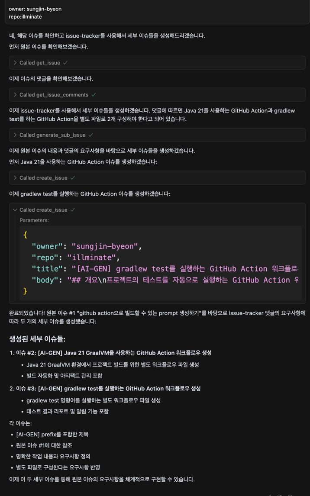
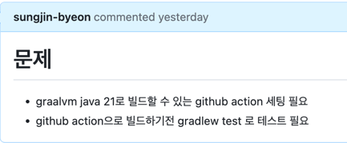
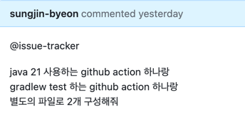
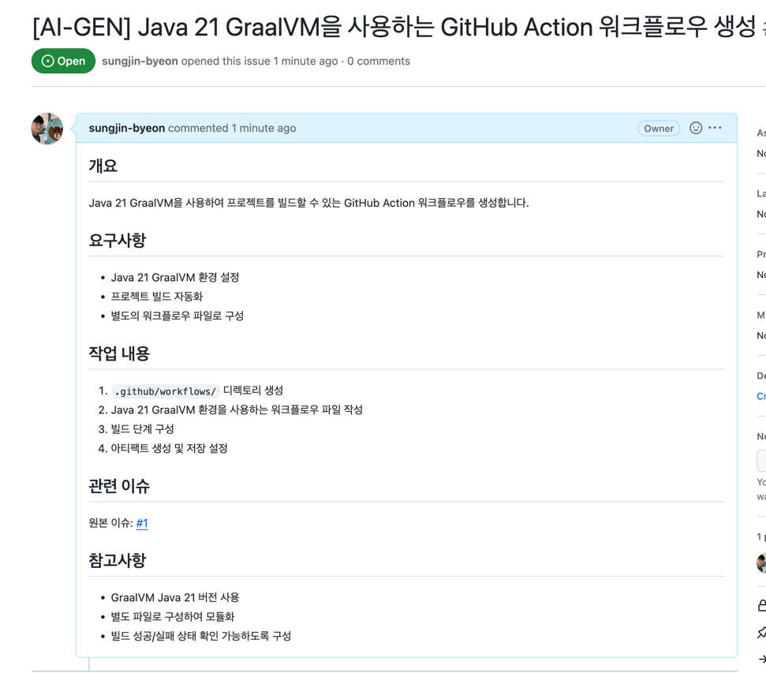
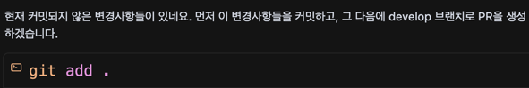

# 모델 선택

- google/medgemma-27b-text-it 같은 구글 계열의 대형 모델도, 현재 공개된 정보만 기준으로 보면 MCP(Model Context Protocol) 같은 오픈스탠더드 툴 프로토콜을 직접적으로 지원하지는 않습니다.
- google/gemma-3-27b-it 모델은 최신 구글 계열의 오픈 대형언어모델로, MCP(Model Context Protocol)와 같은 툴콜(외부 도구 활용) 생태계를 실제로 잘 지원하는 대표적인 모델입니다.
- meta-llama/llama-4-scout-17b-16e-instruct 모델은 최신 Meta Llama 4 계열로, 멀티모달(텍스트·이미지) 이해와 코딩, 다양한 언어 지원, 그리고 긴 컨텍스트 윈도우 등의 강점을 가진 모델입니다.

# 문제 

- 특정 issue에 커멘트를 달면 그걸 이용해서 다른 이슈들을 줄줄이 달아주는 mcp 서버를 만들어주고 싶다.
- https://github.com/modelcontextprotocol/servers/blob/main/src/sequentialthinking/index.ts sequential thinking의 코드를 보면, tool을 세분화해서 정의한다. 
- 나도 비슷하게 세분화해서 툴을 정의해두면, 이 명령어를 들고 cursor는 github에 추가이슈를 생성해줄 것이다.

# 해결


### 1. MCP 서버 생성

spring MCP서버를 생성해서, 간단하게 @Tool annotation을 붙이고 ,ToolCallbackProvider를 통해서 붙여준다

이 ToolCallbackProvider는 모든 ToolCallbackProvider bean을 등록해준다.

```
    @Bean
    public ToolCallbackProvider subissueTools(SubissueGeneratorService subissueGeneratorService) {
        return  MethodToolCallbackProvider.builder().toolObjects(subissueGeneratorService).build();
    }
```

```
2025-07-29 21:42:09.041 [info] user-spring-ai-issue-tracker: Connected to stdio server, fetching offerings
2025-07-29 21:42:09.048 [info] listOfferings: Found 0 tools
2025-07-29 21:42:09.049 [info] user-spring-ai-issue-tracker: Found 0 tools
```

근데, 등록했는데도 tool을 찾을 수 없다고 나온다.


### 2. TOOL에 대해서 deep dive

https://docs.spring.io/spring-ai/reference/api/tools.html#_overview

```
ChatModel chatModel = ...

String response = ChatClient.create(chatModel)
        .prompt("What day is tomorrow?")
        .tools(new DateTimeTools())
        .call()
        .content();

```

원래는 이런식으로 tool은 llm이 사용할 수 있게 제공해줘야 한다. 

이제 이걸 cursor나 claude desktop같은 mcp client에게 ToolListing으로 노출시키고, tool의 이름, description, input schema를 전달했었기 때문에 우리는 tool 코드를 굳이 LLM과 같은 서버에 두지 않아도 된다. 


이게 tool의 작동 방식이다. 

Spring에서 제공해주는 @Tool annotation은 ToolCallback interface를 제공해주는 것일 뿐이다. 

ToolCallbackResolver를 통해서 tool 이름을 받았을 때, ToolCallback함수를 부를 수 있게 한다. 


```
@Target({ ElementType.METHOD, ElementType.ANNOTATION_TYPE })
@Retention(RetentionPolicy.RUNTIME)
@Documented
public @interface Tool {

	/**
	 * The name of the tool. If not provided, the method name will be used.
	 */
	String name() default "";

	/**
	 * The description of the tool. If not provided, the method name will be used.
	 */
	String description() default "";

	/**
	 * Whether the tool result should be returned directly or passed back to the model.
	 */
	boolean returnDirect() default false;

	/**
	 * The class to use to convert the tool call result to a String.
	 */
	Class<? extends ToolCallResultConverter> resultConverter() default DefaultToolCallResultConverter.class;

}

```


returnDirect를 켜면 질문했던 모델한테 가는게 아니라, 질문자에게 바로 전달된다. 

계속 tool을 못찾아서 걱정했는데 아래에 나온 pom.xml을 사용하니까 적용됐다. 버전 호환성 문제였던 것 같다. 

https://github.com/spring-projects/spring-ai-examples/tree/main/model-context-protocol/weather/starter-stdio-server


# 결과물




function calling (generate_sub_issue) 를 실행했고, 



이런 이슈였고



이렇게 해달라고 했는데


이런 이슈들을 생성했다.

아래들은 하위 이슈들이다.





# 2. PR 생성기

이번에는 PR을 편하게 만들기 위해서 아래같은 함수를 만들었다. 

```
    @Tool(name="generate_pull_request" , description = "특정 브랜치와 비교해서 pull request를 생성하고 세부 커멘트를 달아 설명하기 위함")
    public String generatePullRequest(
            @ToolParam(description = "비교할 브랜치 이름") String baseBranch,
            @ToolParam(description = "내가 PR을 생성하고 싶은 레포지토리의 url") String targetGithubRepoUrl
    ) {
        return String.format("""
            github owner 이름은 good-service , repo 이름이 good-builder 야.
            현재 브랜치에서 %s브랜치로 pull request를 생성할거야. %s 위치에 PR을 생성할거고.
            현재 커밋되지 않은 변경사항들은 stash 해놔. 이번 PR에서 반영할 대상이 아니야.
            각 커밋별로 세부 이슈 링크가 있다면 해당 이슈를 닫는다고 본문에 작성해줘.                        
            제목은 [#109] 처럼 해결하려는 브랜치 이름에 사용된 이슈번호가 들어가 있어야해. 
            PR 올리기 전에는 ./gradlew ktlintFormat ./gradlew ktlintCheck ./gradlew test 를 순차적으로 진행한 다음에 PR을 올려야 해.
            프로젝트에 PR 템플릿이 있다면 해당 템플릿 양식을 지켜줘
            생성한 pull request를 다시 보면서 중요한 부분은 해당 코드라인영역을 잡아서 설명을 달아줘. 다른 사람들이 집중적으로 볼 수 있도록 해.                                                               
            """, baseBranch, targetGithubRepoUrl);
    }
```


`            현재 커밋되지 않은 변경사항들은 stash 해놔. 이번 PR에서 반영할 대상이 아니야.`

이걸 안붙이니까 무조건 git add 해서 전체 추가해버리더라. 



단순히 PR을 만들면 커멘트를 달아서 다른사람들이 볼 수 있게 하는 흐름은 제작하지 못하고, PR본문만 생성하고 끝나게 된다. 

`생성한 pull request를 다시 보면서 중요한 부분은 해당 코드라인영역을 잡아서 설명을 달아줘. 다른 사람들이 집중적으로 볼 수 있도록 해.`

하지만, 위 prompt를 추가해서 아래처럼 명령을 하면, 코드블럭에 대해서 설명을 하는 걸 추가할 수 있다. 


```
issue-tracker 툴의 generatePullRequest 툴을 사용해줘

@https://github.com/good-service/good-builder/pull 에 pull request를 만들어줘
develop브랜치로 머지하고 싶어 

```


# 3. MCP와 user rule의 차이 

내 생각으로는 user rule은 까먹기도 하고, 특정 task를 진행할때 어떤 단계를 따라야할 지 적는 용도보다는, 성질, 성격을 정해주는 느낌이다.

만약 어떤 순서에 따라 차례차례 뭔가를 진행하게 하기를 원한다면 mcp를 통해서 명령을 하는게 더 좋은 듯 하다. 

그리고 인자를 받아서 인자에 대해서 추가적인 가공을 할 수도 있겠지. 예를들면, 항상 이놈의 github mcp plugin쓸 때, owner이랑 repo를 못찾는다. 

우리의 경우는 owner이랑 repo가 github url 뒤에 딸려오는 것들이라는 것을 아니까, 파싱해서 owner이랑 repo를 정해줄 수 있겠다. 

다음엔 무엇을? 