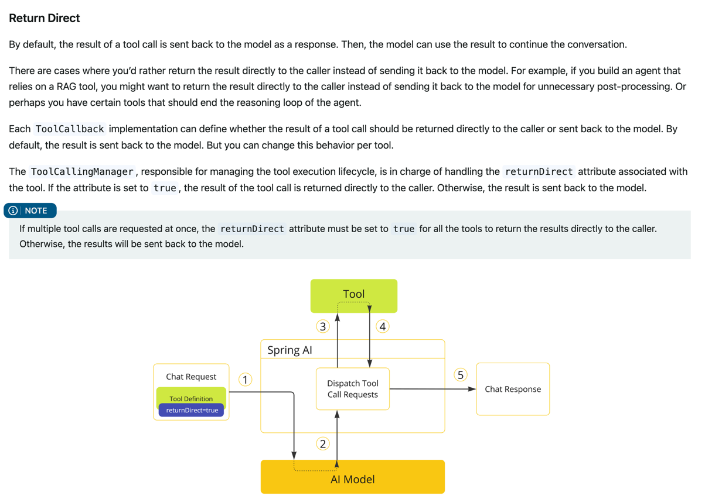
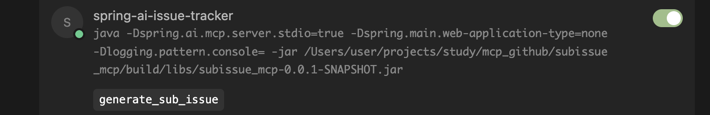
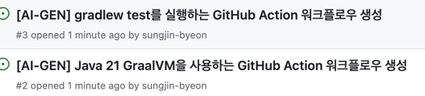
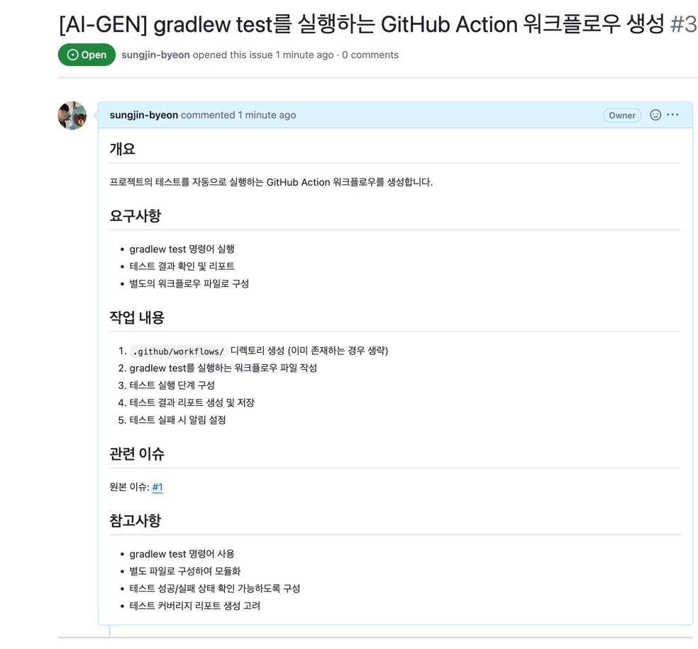

# 모델 선택

- google/medgemma-27b-text-it 같은 구글 계열의 대형 모델도, 현재 공개된 정보만 기준으로 보면 MCP(Model Context Protocol) 같은 오픈스탠더드 툴 프로토콜을 직접적으로 지원하지는 않습니다.
- google/gemma-3-27b-it 모델은 최신 구글 계열의 오픈 대형언어모델로, MCP(Model Context Protocol)와 같은 툴콜(외부 도구 활용) 생태계를 실제로 잘 지원하는 대표적인 모델입니다.
- meta-llama/llama-4-scout-17b-16e-instruct 모델은 최신 Meta Llama 4 계열로, 멀티모달(텍스트·이미지) 이해와 코딩, 다양한 언어 지원, 그리고 긴 컨텍스트 윈도우 등의 강점을 가진 모델입니다.

# 문제 

- 특정 issue에 커멘트를 달면 그걸 이용해서 다른 이슈들을 줄줄이 달아주는 mcp 서버를 만들어주고 싶다.
- https://github.com/modelcontextprotocol/servers/blob/main/src/sequentialthinking/index.ts sequential thinking의 코드를 보면, tool을 세분화해서 정의한다. 
- 나도 비슷하게 세분화해서 툴을 정의해두면, 이 명령어를 들고 cursor는 github에 추가이슈를 생성해줄 것이다.

# 해결


### 1. MCP 서버 생성

spring MCP서버를 생성해서, 간단하게 @Tool annotation을 붙이고 ,ToolCallbackProvider를 통해서 붙여준다

이 ToolCallbackProvider는 모든 ToolCallbackProvider bean을 등록해준다.

```
    @Bean
    public ToolCallbackProvider subissueTools(SubissueGeneratorService subissueGeneratorService) {
        return  MethodToolCallbackProvider.builder().toolObjects(subissueGeneratorService).build();
    }
```

```
2025-07-29 21:42:09.041 [info] user-spring-ai-issue-tracker: Connected to stdio server, fetching offerings
2025-07-29 21:42:09.048 [info] listOfferings: Found 0 tools
2025-07-29 21:42:09.049 [info] user-spring-ai-issue-tracker: Found 0 tools
```

근데, 등록했는데도 tool을 찾을 수 없다고 나온다.


### 2. TOOL에 대해서 deep dive

https://docs.spring.io/spring-ai/reference/api/tools.html#_overview

```
ChatModel chatModel = ...

String response = ChatClient.create(chatModel)
        .prompt("What day is tomorrow?")
        .tools(new DateTimeTools())
        .call()
        .content();

```

원래는 이런식으로 tool은 llm이 사용할 수 있게 제공해줘야 한다. 

이제 이걸 cursor나 claude desktop같은 mcp client에게 ToolListing으로 노출시키고, tool의 이름, description, input schema를 전달했었기 때문에 우리는 tool 코드를 굳이 LLM과 같은 서버에 두지 않아도 된다. 


이게 tool의 작동 방식이다. 

Spring에서 제공해주는 @Tool annotation은 ToolCallback interface를 제공해주는 것일 뿐이다. 

ToolCallbackResolver를 통해서 tool 이름을 받았을 때, ToolCallback함수를 부를 수 있게 한다. 


```
@Target({ ElementType.METHOD, ElementType.ANNOTATION_TYPE })
@Retention(RetentionPolicy.RUNTIME)
@Documented
public @interface Tool {

	/**
	 * The name of the tool. If not provided, the method name will be used.
	 */
	String name() default "";

	/**
	 * The description of the tool. If not provided, the method name will be used.
	 */
	String description() default "";

	/**
	 * Whether the tool result should be returned directly or passed back to the model.
	 */
	boolean returnDirect() default false;

	/**
	 * The class to use to convert the tool call result to a String.
	 */
	Class<? extends ToolCallResultConverter> resultConverter() default DefaultToolCallResultConverter.class;

}

```



returnDirect를 켜면 질문했던 모델한테 가는게 아니라, 질문자에게 바로 전달된다. 

계속 tool을 못찾아서 걱정했는데 아래에 나온 pom.xml을 사용하니까 적용됐다. 버전 호환성 문제였던 것 같다. 

https://github.com/spring-projects/spring-ai-examples/tree/main/model-context-protocol/weather/starter-stdio-server


# 결과물




function calling (generate_sub_issue) 를 실행했고, 


이런 이슈였고


이렇게 해달라고 했는데



이런 이슈들을 생성했다.

아래들은 하위 이슈들이다.





