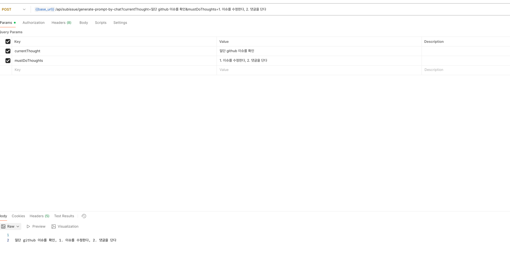

# 1. Sequential Thinking 분석

Sequential Thinking mcp는 복잡한 생각을 여러단계에 풀어서 질문할 수 있게 한다. https://github.com/modelcontextprotocol/servers/tree/main/src/sequentialthinking

내 목표: 단계를 잘 까먹는 경향이 있기 때문에, 단계별로 LLM이 당장 해야할 step만 가져가게 하고싶다. 

ex. 1. 문제를 해결한 뒤 {"finished_step": 2, "done": "./gradlew ktlintFormat ktlintCheck test 완료"} 를 요청하면 나는 다음 프롬프트를 내려주고 싶다. 

```
step 3.  제목 맨 앞에는 이슈번호를 [#123] 처럼 붙이고, 제목 맨 뒤에는 [AI-AUTOFIX]를 달아서 PR을 생성한다.

```

### 아이디어 

이슈 resolve하는 PR 제작하기 전에, web client를 통해서 사용자가 챗봇이랑 대화하면서 요구사항을 완성하듯이,

최초에는 사용자에게 계획을 한번 공유하고, 너가 기획하고 싶은 것이 이게 맞니? 하고 서로 대화하고, 시작하면 좋겠다. 


## 1.1 Sequential thinking schema

type: object
- thought(필수): 현재 thinking step
- nextThoughtNeeded(필수): 다음 step 필요한지
- thoughtNumber(필수): 현재 thought number
- totalThoughts(필수): estimated total thoughts 
- isRevision: whether this revises previous thinking
- branchFromThought: branching하는 시점 
- branchId: branch id
- needsMoreThoughts: 더 생각을 많이 해야 한다면


## 1.2 process thought 

- input을 validate한다. (인자가 잘못들어온 경우를 검증하는듯)
- thoughtHistory에 현재 input을 넣어둔다. 
- branchFromThought가 있고, branchId가 있다면 해당 branch에 현재 input을 넣어둔다. 


즉, sequential thinking은 주는 정보가 사실상 상태 요약정보만 있다.

```
{
  thoughtNumber: validatedInput.thoughtNumber,
  totalThoughts: validatedInput.totalThoughts,
  nextThoughtNeeded: validatedInput.nextThoughtNeeded,
  branches: Object.keys(this.branches),
  thoughtHistoryLength: this.thoughtHistory.length
}
```

그래서 사고 과정을 단계별로 쪼개어 관리할 수 있도록 '틀'만 제공하는 역할이다. 
심지어는 지금 무슨 생각하는지조차 돌려주지 않는다. 

# 2. 생각하는 MCP 제작하기

```
private final String systemPrompt= "CurrentThought과, Todos를 받아서 CurrentThought에 할일을 추가해줘. 여러개가 추가되어도 되고, Todo는 한글자도 변형되면 안되고 그대로 추가되어야 해. 
만약 remainingThoughts가 1개이하 라면 모든 Todos를 추가해줘. 응답은 currentThought에 Todos를 더한 답변만 출력해줘. 다른 설명이나 Todos같은 key값, 문구 모두 생략";
```

생각을 잘 확장했으면 좋겠다.



일단 내가 원하는 대로 출력이 나오는 것은 확인했다. 
     


