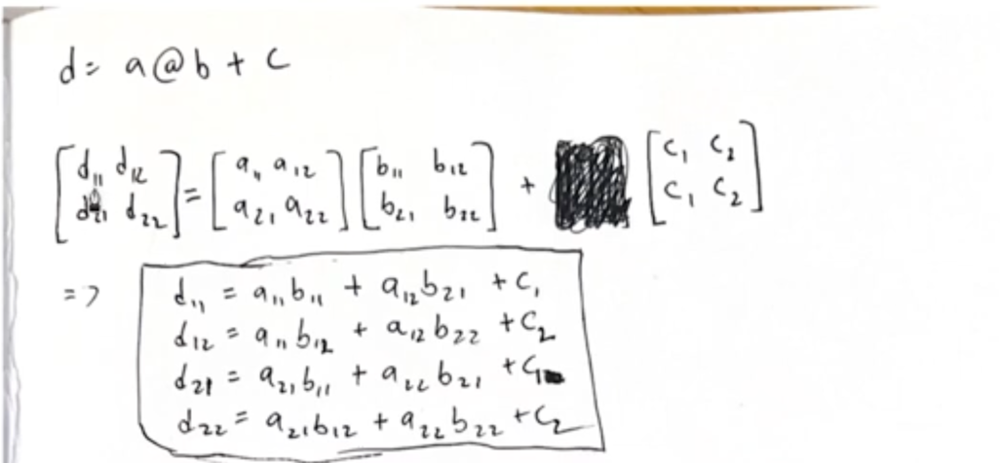

1. 왜 backprop 이해해야하는가?
https://karpathy.medium.com/yes-you-should-understand-backprop-e2f06eab496b

https://github.com/karpathy/nn-zero-to-hero/blob/master/lectures/makemore/makemore_part4_backprop.ipynb
지난번과 비슷하게 시작하지만, back propagation만 maunally

2. our model
```python
n_embd = 10 # the dimensionality of the character embedding vectors
n_hidden = 64 # the number of neurons in the hidden layer of the MLP

g = torch.Generator().manual_seed(2147483647) # for reproducibility
C  = torch.randn((vocab_size, n_embd),            generator=g)
# Layer 1
W1 = torch.randn((n_embd * block_size, n_hidden), generator=g) * (5/3)/((n_embd * block_size)**0.5)
b1 = torch.randn(n_hidden,                        generator=g) * 0.1 # using b1 just for fun, it's useless because of BN
# Layer 2
W2 = torch.randn((n_hidden, vocab_size),          generator=g) * 0.1
b2 = torch.randn(vocab_size,                      generator=g) * 0.1
# BatchNorm parameters
bngain = torch.randn((1, n_hidden))*0.1 + 1.0
bnbias = torch.randn((1, n_hidden))*0.1

# Note: I am initializating many of these parameters in non-standard ways
# because sometimes initializating with e.g. all zeros could mask an incorrect
# implementation of the backward pass.

parameters = [C, W1, b1, W2, b2, bngain, bnbias]
print(sum(p.nelement() for p in parameters)) # number of parameters in total
for p in parameters:
  p.requires_grad = True
```

W1*Cx + b1  다음에 batch normalization layer가 존재하고, W2, b2는 결과를 내는 weight들이다.

batch normalization layer가 존재하기 때문에 사실 b1은 영향을 주지 않는다. (평균만큼 빼버리기 떄문에)

https://pytorch.org/docs/stable/generated/torch.index_select.html#torch.index_select
리스트를 tensor의 index로 넣으면, list의 차례대로 "몇번째 몇번째를 달라"가 된다.

예를들면 torch.randn(3,4)[[0,2]]

이런건, 0번째행을 주고, 2번째행을 달라는게 된다.


-------------

backpropagation 주의점

만약, a 하나가 여러 연산에 쓰인다면, 각 연산에 쓰인 gradient를 합쳐야 해당 a의 gradient가 된다.

예를들면 [1,2,3] 이라는 벡터가있고, .sum()연산 떄문에 [6] 하나가 있다.

[1,2,3] *[6] 을해서 [1,2,3] * [6,6,6] 해서 [6,12,18]  이 되는 연산일 때에

6은 1*6 의 grad + 2*6의 grad + 3*6의 grad 인 것이다.

matrix같은 경우에 일부 원소만 영향을 받는다면 ex.)

[1,2,3] 벡터에서 [1,6,3] 으로 변해서 2에만 영향을 주었다면

[0,1,0] 이라는 벡터를 만들어서 여기에 gradient를 곱하도록 해라. 왜냐하면 [0]번째 항이나, [2]번째 항은 LOSS에 영향을 주지 않은 것이다.


---------------------

logits-logit_maxes 를 하면 exp()를 취할때 너무 큰 값이 나오지 않게 방지하는 것이 가능하다

exp 그래프를 보면 양수일때에는 x가 1씩만 늘어나도 너무 커져서, infinity가 나오기 쉬운데 음수이면 그렇지 않다.

그러니 차라리 모든 값에 max만큼을 빼서 음수로 만들어서 infinity 확률을 없애준다.

-----------------------

##### dlogit_maxes

그러나 dlogit_maxes는 Loss에 실제로 영향을 주지 않는다 (prob 에는 영향을 미치지 않기 때문에)
그렇기 때문에 gradient가 매우 적게 들어와야 한다. 0에 가깝지 않으면 오류가 있는 것이다.


##### @ , matrix multiplication의 gradient




https://youtu.be/q8SA3rM6ckI?t=4578 짱웃김ㅋㅋ
틀렸어 ㅋㅋ


