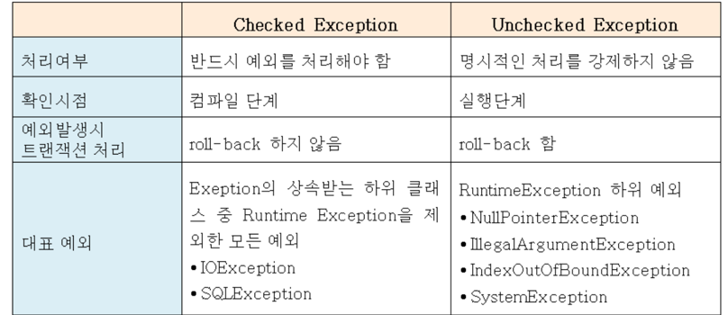
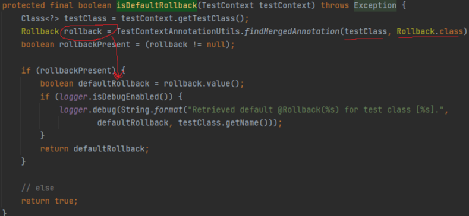

# 11장 웹_어플리케이션 제작

# 11.1 프로젝트 환경 설정

핵심 라이브러리

* 스프링 MVC
* 스프링 ORM: 스프링 프레임워크와 JPA연동 위한 라이브러리
* JAP, Hibernate(hibernate-entitymanager) : JPA표준 + 하이버네이트

스프링 MVC 프로젝트 구조

webapp 이 웹 폴더
`webapp/WEB-INF/web.xml`이 웹 어플리케이션 환경설정 파일

`reosurces/appConfig.xml`이 스프링 어플리케이션 관련 설정 - 비즈니스 로직, 도메인 계층, 서비스 계층, 데이터 저장 계층 담당
`resources/webAppConfig.xml` 이 스프링 웹 관련 설정 - 스프링 MVC 설정 등 - `viewResolver`같이

이렇게 두는 것은, 웹 계층과 비즈니스 도메인 계층을 나누어서 관리하기 위함.

## webAppConfig.xml

* <mvc:annotation-driven> 스프링 MVC 기능 활성화
* <context:component-scan> : 뒤에 basePackages를 속성값으로 주어, 해당 패키지 아래의 `@Component`, `@Service`, `@Repository` 등
  어노테이션붙은 클래스들을 스프링 빈으로 등록
* <bean> 스프링 빈 등록: 어떤 클래스가 어떤이름의 빈인지 써주어야 한다.

## appConfig.xml

* <tx:annotation-driven/> : 스프링 프레임워크의 어노테이션 기반 트랜잭션 관리자 활성화. `@Transactional` 붙은 곳에 트랙잭션 적용
* <bean id="dataSource" class="org.apache.tomcat.jdbc.pool.DataSource"> 데이터 소스 등록
    * jdbc URL등 데이터베이스 속성값 설정
* <bean id="transactionManager> : 어떤 데이터소스를 사용하는 트랜잭션 매니저 등록. `JpaTransactionManager`를 이용해 JPA 사용
* <bean> `PersistenceExceptionTransactionPostProcessor` : `@Repository` 어노테이션 붙은 스프링 빈에 예외 변환 AOP 적용
    * JPA 예외를 스프링 프레임워크가 추상화한 예외로 변환 == 직관적인 이름의 예외로 변환
* `entityManagerFactory` : 스프링 프레임워크의 JPA는 `LocalContainerEntityManagerFactoryBean`을 스프링 빈으로 등록해야.
    * 여기에서 em 을 받아서 사용한다. 스프링 컨테이너에서 JPA를 사용할 수 있게 하기 위함
    * packagesToScan: `@Entity` 붙은 클래스들 자동 검색하기 위한 시작점 지정
    * persistenceUnitName: 영속성 유닛 (em) 이름 지정. 기본값은 default라는 이름의 em 생성.
    * jpaVendorAdapter: 사용할 JPA 벤더를 지정하는데, HibernateJpaVendorAdapter 등록해서 Hibernate 사용할 수 있게.
    * jpaProperties: hashmap으로 속성값 제공. (JPA 설정값. 뭐 hibernate.hbm2ddl.auto=create 이런거)
        * hibernate.hbm2ddl.auto는 어플이 시작될 때 테이블과 기타 DDL을 자동생성하는 옵션들
            * create: DDL 제거하고 새로 생성한다.
            * create-drop: create와 같은데 어플리케이션 종료할 때 생성한 DDL 제거
            * update: 현재 DB의 DDL과 비교해서 변경사항만 수정
            * validate : 현재 엔티티 매핑 정보와 데이터베이스 스키마가 같은지 비교한다. DDL 다르면 에러 뱉어서 어플 시작 안함.

# 11.2 도메인 모델과 테이블 설계

요구사항 정리

* 회원 기능
    - 회원 등록
    - 회원 조회
* 상품 기능
    - 상품 등록
    - 상품 수정
    - 상품 조회
* 주문 기능
    - 상품 주문
    - 주문 내역 조회
    - 주문 취소
* 기타 요구사항
    - 상품 종류는 도서, 음반, 영화 . 고유 속성존재
    - 상품은 카테고리로 구분 가능
    - 상품 주문 시 배송정보 입력

## 11.2.2 도메인 모델 설계

* 회원은 여러 상품 주문 가능. 하나의 주문은 여러개의 상품 포함. 회원이 주문 여러개를 갖게 하고, 주문 하나가 여러상품을 갖게한다.
    - 회원은 임베디드 타입 Address, name, 주문을 가진다
    - 주문은 여러 `OrderItem`을 가진다.
    - OrderItem은 주문 - 상품 매핑.
    - 상품은 이름 , 가격 , 재고수량이 공통속성. 각각 이걸 상속받고 각각 새로운 속성 추가로 가짐.
    - 배송은 하나의 주문에 매핑됨.
    - 카테고리: 하나의 상품이 여러 카테고리 가질 수 있음, 반대로 하나의 카테고리도 여러개의 상품 가질 수 있음
    - 주소: 임베디드 타입으로 만들어서 엔티티는 아니지만, 회원과 배송에서 사용. `<<Value Type>>`이라고 UML에서 표현

## 11.2.3 테이블 설계

상품을 표현하기 위해 모든 개별 속성을 `ITEM` 이라는 테이블에 넣고, `DTYPE` 칼럼 값에 따라 , 도서 음반 영화를 구분. 각 속성값 중 일부가 NULL일 수도 있다.

## 11.2.4 연관관계 정리

* 회원과 주문. 한 회원이 여러 주문 갖는 일대 다 관계. 회원은 list of order, 주문은 one member. 고로 주문쪽에서 외래키 가지는 것이 편함. 연관관계의 주인은 주문

* 주문 상품과 주문: 하나의 주문이 list of 주문상품을 갖는다. 주문 상품은 하나의 주문을 갖는다. 고로 주문 상품이 연관관계의 주인. 주문 상품이 외래 키를 가지고 있어야 한다.

* 주문상품과 상품: 비슷하게 상품쪽이 여러개의 주문상품과 매핑. 주문상품은 하나의 상품을 가리킴. 주문상품이 또 주인

* 주문과 배송: 하나의 주문에 하나의 배송이 매핑된다. 하나의 배송은 하나의 주문을 갖는다. 일대일 관계이니 아무쪽이나 주인이 된다. 여기선 배송이 갖는다.

* 카테고리와 상품: Many TO Many . 일반적으로 카테고리_상품 이라는 새로운 테이블을 두어서 1:다로 풀지만, 여기서는 사용해본다.

* 상품은 상속관계로 풀어낸다. 고유 속성이 존재하고 공통 속성이 존재한다.

# 11.3 애플리케이션 구현

- 회원 기능
    - 회원 등록
    - 회원 목록 조회

회원 repository, 회원 service interface 만들고, service impl 만들 때, 회원 repo는 DB접속하는 코드만 쓰고, 비즈니스 로직 관련된 `회원 등록`
, `회원 목록 조회`는 service impl쪽에서 작성해야 한다. service impl에서는 repo에서 제작한 코드만 쓴다. service impl이 되게 짧을듯.

- 상품 기능
    - 상품 등록
    - 상품 목록 조회
    - 상품 수정

상품 repo는 조회, 저장을 하는 함수를 써놓고, service impl 쪽에서 조회 후 입력받은 값으로 수정 이런것을 구현.

- 주문 기능
    - 상품 주문
    - 주문 내역 조회
    - 주문 취소

기능 단순화를 위해

- 로그인과 권한 관리 안함 -매 조회 등 service impl에서 valid 사용자인지 처리해줘야 - AOP 사용하던가. ( 서비스 패키지의 함수 사용할때마다 AOP )
- 파라미터 검증, 예외 처리 - 역시 AOP 나, 조회 안되면 throw 된 거 처리
- 상품은 도서만 사용
- 카테고리 사용 안함
- 배송정보 사용안함.

## 11.3.1 스프링 MVC 구성

컨트롤러: MVC의 controller들. 서비스 계층(service impl)을 호출하고, 결과를 뷰(JSP)에 전달하는 역할. 서비스: 서비스 계층에는 비즈니스 로직이 있고, 트랜잭션을 시작한다.
서비스 계층은 데이터 접근 계층인 리포지토리 호출 Repository: JPA를 직접 사용하는 곳. 엔티티 매니저를 통해 엔티티를 저장하고 조회. Domain: 엔티티가 모여 있는 계층이다. 모든
계층에서 사용한다.

### 개발 순서

1. 비즈니스 로직 수행하는 서비스, repository를 먼저 개발하고,
2. 테스트 케이스를 작성해 검증한다.
3. 컨트롤러와 뷰를 개발한다.

## 11.3.2 회원 기능

```java

@Repository
public interface ImagesRepository extends JpaRepository<Images, Integer> {
    List<UseFlagDocIdOnly> findAllByImageIdIn(Collection<String> imageIdList);
}
```

이런식으로 JPA기본 제공 라이브러리로 JPA를 자연스럽게 쓸 수도 있지만, `em.createQuery` 를 통해서 JPQL로 쓸 수도 있다.

### @Repository

이 어노테이션이 붙어있으면 component-scan에 의해 빈으로 자동 등록되고, JPA 전용 예외 발생시 스프링이 추상화한 예외로 변환해준다.
`javax.persistence.NoResultException` 이 발생하면, 스프링이 추상화해서 `org.springframework.dao.EmptyResultDataAcessException`
이런식으로 변환을 해서, 서비스 계층에 추상화된 exception을 반환해서, JPA의존적인 예외처리를 하지 않아도 된다.

### @PersistenceContext

아직 JPA 관련설정을 안했지만, entityManager를 쓸 수 있다. default EntityManagerFactory가 생성되고,

```java
@PersistenceContext
EntityManager em;
```

이 어노테이션을 통해서 엔티티 매니저 팩토리에서 엔티티 매니저를 주입받을 수 있다. 커스텀 엔티티매니저 팩토리를 만들면,

```java
    @Bean
@Primary
public LocalContainerEntityManagerFactoryBean encEntityManagerFactory(
@Qualifier("encDataSource") DataSource dataSource,
@Qualifier("encJpaProperties") JpaProperties jpaProperties){
        EntityManagerFactoryBuilder builder=new EntityManagerFactoryBuilder(
        new HibernateJpaVendorAdapter(),
        new HashedMap<>(),
        null);

        return builder.dataSource(dataSource)
        .packages("com.xxxx.bbbb.mmmmm.api.entity.enc")
        .properties(jpaProperties.getProperties())
        .persistenceUnit("encEntityManager")
        .build();
```

```java

@Repository
@Log4j2
public class CustomRepositoryImpl implements CustomRepository {

    @PersistenceContext(unitName = "encEntityManager")
    private EntityManager entityManager;
```

이런식으로 특정 엔티티매니저를 팩토리를 만들때 선언해두고, 가져올 수 있다. 여러 데이터소스를 사용해 여러 엔티티매니저를 사용할 때 유용하다.

스프링 컨테이너가 관리하는 엔티티 매니저를 주입받는 어노테이션이다.

### @PersistenceUnit

@PersistenceContext를 이용하면 엔티티매니저 팩토리로부터 엔티티매니저를 받아오니까 직접 사용할일은 없겠지만,
`@PersistenceUnit` 어노테이션을 사용하면 엔티티 매니저 팩토리를 주입받는다.

```java
@PersistenceUnit
EntityManagerFactory emf;
```

## 서비스 제작

```java

@Service
@Transactional
public class MemberService {...
}
```

@Service: component-scan에 의해 스프링 빈으로 등록됨 @Transactional: 이 어노테이션이 붙어있는 클래스나 메서드에 트랜잭션 적용. 외부에서 이 클래스의 메서드를 호출 시
트랜잭션을 시작하고, 메서드 종료시 트랜잭션을 커밋한다. 예외 발생시 트랜잭션 롤백. 단
> 주의: 트랜잭션 안에서 트랜잭션 메서드를 호출할 때 rollback메커니즘이 제대로 동작하지 않을 수 있다. A->B 순으로 작동하는 트랜잭션이면 B의 실패가 A의 롤백을 호출하지 않게할 수 도 있다.

RuntimeException. 즉, Unchecked exception만 롤백한다
> 

@Transactional(rollbackFor = Exception.class) 같이 롤백할 예외를 지정가능.

### 회원 기능 테스트

JUnit으로 테스트를 작성해서 이런 서비스 비즈니스 로직을 검증해야 한다.

- 회원가입 성공하기
- 회원가입 할 때 같은 이름이 있으면 예외가 발생해야 한다.

```java

@RunWith(SpringJUnit4ClassRunner.class)
@ContextConfiguration(locations = "classpath:appConfig.xml")
@Transactional
public class memberServiceTest {}
```

> //Given, //When, //Then
> 주어진 조건, 테스트대상 실행, 결과 검증 에 붙이는 주석.

스프링 프레임워크와 테스트를 같이 실행해서 스프링 컨테이너로부터 autowire되게 하기 위해서 스프링 프레임워크와 JUnit을 통합해야 한다.

#### 스프링 프레임워크와 테스트 통합

`@RunWith(SpringJUnit4ClassRunner.class)`
JUnit으로 작성한 테스트 케이스를 스프링 프레임워크와 통합하려면 저 클래스를 지정하면 된다. 이러면 테스트가 스프링 컨테이너에서 실행되고, `@Autowired`이 가능하다.

`@ContextConfiguration(locations = "classpath:appConfig.xml)`
테스트 케이스를 실행할 때 사용할 스프링 설정 정보. 데이터 소스설정 같은것을 가져오기 위함. 회원가입 테스트 같은 거 할때 회원 데이터가 저장될 수 도 있으니까 주의해야한다.
그래서  `@Transactional` 을 사용하는데, 이걸 테스트에서 사용하면 각 테스트를 실행할 때마다 트랜잭션을 시작하고, 테스트가 끝나면 트랜잭션을 강제로 롤백한다.
> https://me-analyzingdata.tistory.com/entry/SpringTransactional%EA%B3%BC-JUnit-Test
> @Rollback이라는 어노테이션을 붙이면 Transaction이 끝나고 commit을 안하고 rollback을 시키는데,
> TransactionTestExecutionListener에 testClass에 대해서 Rollback 어노테이션을 붙여주는 부분이 존재한다.
> spring에서 Test클래스를 TransactionTestExecutionListener에서 탐색해서 롤백을 붙여버린다.
> @Test를 붙인 클래스들에 대해서 일어나는 것 같다. 아래를 보면 testContext에서 test class들을 가져온다.
> 

> 단, https://velog.io/@tmdgh0221/%EC%8A%A4%ED%94%84%EB%A7%81-%ED%85%8C%EC%8A%A4%ED%8A%B8-%EC%BC%80%EC%9D%B4%EC%8A%A4%EC%97%90%EC%84%9C%EC%9D%98-Transactional-%EC%9C%A0%EC%9D%98%EC%A0%90
> 트랜잭션을 사용할 때 유의할 것은, 영속성 컨텍스트는 한 트랜잭션 안에서는 계속된다는 것이다.
> 만약 트랜잭션 바깥에서 트랜잭션 안에서 로드된 값을 사용하려면 에러가 나야하는데, 테스트는 커다란 트랜잭션으로 감싸져있으니, 에러가 안난다.
>

또, `@Test(expected = IllegalStateException.class)` 처럼 예외 클래스를 지정하면, 결과로 지정한 예외가 발생해야 성공!

## 11.3.3 상품

addStock(재고 추가)과 같이 엔티티와 직접적인 비즈니스 로직은 엔티티에 속하는 것이 맞다. 상품 레포지토리는 DB연관된 함수를 담는다. 근데 JPA에서 수정을 할때에는, 영속된 엔티티를
merge하는 로직으로 짜 두었는데, 사실 영속 상태의 엔티티는 그냥 속성값을 .getXXX()으로 받아와서 수정을 한다.다만, 준영속 상태의 엔티티는 해당 정보들이 영속성 컨텍스트에서 사라진
상태니까. merge를 해야 한다.
> ### 3.6.1 엔티티를 준영속 상태로 전환 `detach()`
>`em.detach()`는 특정 엔티티를 준영속 상태로 만든다.
> 특정 엔티티 하나를 준영속 상태로 전환하는데,
> '1차 캐시'부터 '쓰기 지연 SQL 저장소'까지, 해당 엔티티와 관련된 모든 정보가 제거 된다.


> ## 병합: merge()
>준영속 상태를 다시 영속상태로 변경할 수 있다.</br>
> merge()는 준영속 상태의 엔티티를 받아 새로운 영속 상태의 엔티티를 반환한다.
>1. merge() 실행
>2. 파라미터로 넘어온 준영속 엔티티의 식별자 값으로 1차 캐시에서 엔티티 조회
>3. 엔티티가 없으면 DB에서 조회 후 1차 캐시에 저장
>4. 조회한 영속 엔티티에 값을 채워넣는다.
>5. 반환


그리고, 서비스 클래스가

```java
public class ItemService {
    @Autowired
    ItemRepository itemRepository;

    public List<Item> findItems() {
        return itemRepository.findAll();
    }
}
```

이런식으로 단순히 repository의 함수를 부르는 형식으로 되어 있는데, repository에게 위임을 한다고 이야기 할 수 있다.

## 11.3.4 주문 기능

엔티티에서는 repository에 접근하는 코드를 짜지 않는다.

> 서비스 계층이 엔티티에 필요한 요청을 위임하는 역할 정도만 하는 것. 이게 도메인 모델 패턴. 엔티티에 비즈니스 로직이 거의 없고,
> 이게 객체지향의 특성을 적극 활용하는 것.
> 서비스 계층에서 대부분의 비즈니스 로직을 처리하는 것이 트랜잭션 스크립트 패턴.

레포지토리의 함수가 여러 테이블을 찾아다니며 필요한 객체를 모아서 리턴해도 된다. 다만 DB에 연결된 부분만 처리한다 라는 `비즈니스 로직과의 분리` 를 명확히 해야.

```java
@RequestMapping(value = "/edit", method = RequestMethod.GET)
public String updateItemForm(@PathVariable("itemId") Long itemId,Model model){
        Item item=itemService.findOne(itemId);
        model.addAttribute("item",item)
        return"items/updateItemForm";
        }
```

```java
@RequestMapping(value = "edit", method = RequestMethod.POST)
public String updateItem(@ModelAttribute("item") Book item){
        itemService.saveItem(item);
        return"redirect:/items";
        }
```

위의 GET에서 form을 받아 post 요청으로 수정을 요청했을때, 인자로 전달된 Book item은 준영속상태이다. 같은 transaction이 아니니까 item의 값을 꺼내서 변경하더라도, 그대로
UPDATE가 일어나지 않는다.


> @ModelAttribute는 파라미터 값으로 DTO객체에 바인딩을 하는 방식이기 때문에 바인딩하려는 DTO객체에 Setter메소드가 반드시 있어야 하고, @RequestBody는 요청 본문의 body에 json이나 xml값으로 요청을 하여 HttpMessageConveter를 반드시 거쳐 DTO객체에 맞는 타입으로 바꿔서 바인딩을 시켜준다.

> 이때 @ModelAttribute() 괄호 안에 지정한 문자열(위의 경우에는 myMEM)의 의미를 알아야 한다. 이 문자열의 이름으로(이것이 객체이다) Model 객체에 자동으로 추가가 되고 따라서 JSP 뷰단으로 안전하게 넘어가게 된다 출처: https://developer-joe.tistory.com/197 [코드 조각-Android, Java, Spring, JavaScript, C#, C, C++, PHP, HTML, CSS, Delphi:티스토리]

우리가 model.addAttribute("item2141",item) 했으면, `@ModelAttribute("item2141") Model item` 인것. 이제 이걸 해결하는 방법이

변경 감지 기능 사용 -> 엔티티를 먼저 찾아서 수정 병합 사용 -> `merge` 사용

변경 감지기능은 원하는 속성만 변경되지만, 병합은 모든 속성이 변경된다. (update하는 칼럼 수가 다른듯)
근데 문제가 생길 수 있긴 할듯. 아예 없었던 엔티티가 들어와버린다면?


