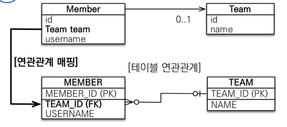

5장 연관관계 매핑 기초

엔티티는 대부분 다른 엔티티와 연관 관계가 존재. 
이전장 실습에서는 테이블처럼 객체가 외래키를 가지고 있도록 설계를 했다.
하지만,

* 객체의 모든 특성을 활용하지 못하고
* 객체 그래프 탐색이 불가능하다.

따라서 객체의 참조와 테이블의 외래 키를 매핑하는 것이 이 장의 목표이다.

키워드 정리:

* 방향: 단방향, 양방향
    * 방향은 객체에만 존재하고, (한 객체가 다른 객체를 포함 등)
    * 테이블은 항상 양방향
* 다중성: N:1 (다 대 일), 1:N, 1:1 , N:M 다중성이 있다.
* 연관관계의 주인 : 객체를 양방향 연관관계로 만들면 연관관계의 주인을 정해야 한다.
    * 속성을 어느쪽에서 갖고 있을 것인지 결정해야 한다는 뜻

# 5.1 단방향 연관관계

N:1 단방향 관계를 이해해보자.

그럼 '상품' - '주문' 의 관계처럼 여러개의 상품이 하나의 주문에 속할 수 있는 관계를 생각해볼 수 있나?

*문제:

- 회원과 팀이 있다.
- 회원은 하나의 팀에만 소속된다.
- 회원과 팀은 N:1 관계이다. 

즉, 여러개가 있을 수 있는 쪽이 N인것.

0..1 이런식으로 객체 연관관계를 나타낸다.
이 경우 회원은 단방향 연관관계를 가진다.


그림 분석해보자

* 객체 연관관계
  * 회원 객체는 Member.team 필드 (멤버변수)로 팀 객체와 연관관계를 맺는다. (나는 어떤 팀이야!)
  * 회원 -> 팀 객체 의 단방향 관계
    * 회원으로는 팀을 알 수 있지만,
    * 팀으로는 회원 알 수 없다.

* 테이블 연관관계
  * 회원 테이블은 TEAM_ID FK로 팀 테이블과 연관 관계
  * 테이블은 양방향 관계.
    * 팀테이블도 회원 테이블이랑 JOIN 가능. 
  
```sql
SELECT *
FROM MEMBER
JOIN TEAM ON MEMBER.TEAM_ID = TEAM.TEAM_ID
```
똑같이 TEAM쪽에서도
```sql
SELECT *
FROM TEAM
JOIN MEMBER ON MEMBER.TEAM_ID = TEAM.TEAM_ID
```

* 객체 연관관계와 테이블 연관관계의 가장 큰 차이

참조를 통한 연관관계는 항상 단방향. 객체 사이 연관관계를 양방향으로 만드려면 반대쪽에도 필드를 추가해서 참조를 보관해야.
즉 연관관계를 하나 더 만드는 것. ( 단방향 연관관계 2개)  

```java
class A{
    B b;
}
class B {}
```

```java
class A {
    B b;
}
class B {
    A a;
}
```

* 객체 연관관계 vs 테이블 연관관계 정리
  * 객체는 참조(주소)로 연관관계를 맺는다
  * 테이블은 외래 키로 연관관계를 맺는다.
  
이 둘은 매우 다른 특징 : 연관된 데이터 조회시 객체는 참조 사용, 테이블은 조인 사용.

## 5.1.1 순수한 객체 연관관계
객체만 사용한 버전의 코드를 상상해보자.
```java
class Member{
    Team team;
}
class Team {}
```
이런느낌이다. 
그럼 여러개의 `new Member()` 를 생성해서, `member1.setTeam(team);` 이런식으로 세팅할 수 있겠지. 
이런 경우 참조를 사용해서 연관관계를 탐색할 수 있는데, 이를 객체 그래프 탐색이라고 한다.  

member1.getTeam(); 로 연관관계탐색 가능. == 객체 그래프 탐색

## 5.1.2 테이블 연관관계
 이번에는 데이터베이스 테이블의 회원과 팀의 관계 살펴보기
 테이블을 생성해서, insert하고, JOIN을 통하면 어느쪽에서든 member나 team을 조회할 수 있다.
## 5.1.3 객체 관계 매핑

```java
@Entity
public class Member {
  @ManyToOne // (다 : 1 ) 
  @JoinColumn(name = "TEAM_ID")
  private Team team;
}
@Entity
public class Team{
    @Id
    @Column(name = "TEAM_ID")
    private String Id;
}
```
테이블은 `TEAM_ID` 라는 칼럼을 `MEMBER` 테이블에 두어서 join을 할 수 있어.

그래서 Member.team으로 접근할 수 있게 어노테이션들이 있는 것

* @ManyToOne: 다:1 관계. 
* @JoinColumn(name="TEAM_ID"): 조인 컬럼은 외래 키를 매핑할 때 사용.
  * name 속성에는 매핑할 외래 키 이름을 지정.
  * 이 어노테이션은 생략해도 된다 ( 테이블에 매핑할 때 FK인 것을 알기 때문인듯?)
    * 생략하면 기본 전략을 사용해 외래 키를 찾는다
      * 기본전략: 필드명 + _ + 참조하는 테이블 PK의 컬럼명
      * 이를테면, 
      ```java
        @JoinColumn(name = "TEAM_ID")
        private Team team;
        ```
      * team_TEAM_ID 를 조회하게 된다.
  
## 5.1.5 @ManyToOne
`@ManyToOne` 어노테이션은 다대일 관계에서 사용한다. 
```java
@OneToMany(targetEntity=Member.class)
private List members; //제너릭이 없으면 타입 정보를 알 수 없기 때문에 target을 설정해줘야.
```

# 5.2 연관관계 사용

연관관계 등록, 수정, 삭제, 조회

## 5.2.1 저장
 연관관계를 매핑한 엔티티를 어떻게 저장하는지

```java
Team team1 = new Team("team1","팀");
em.persist(team1);

Member member1 = new Member("member1", "회원1");
member1.setTeam(team1);
em.persist(member1);
```

```java
        @JoinColumn(name = "TEAM_ID")
        private Team team;
```

JPA는 참조한 팀의 식별자를 외래키로 적절한 등록 쿼리를 생성. 
SQL에서는 MEMBER 테이블에 `team1`이라는 TEAM_ID(FK)값을 집어넣는다.

## 5.2.2 조회

연관관계 있는 엔티티 조회는 2가지 방법이 있다.

- 객체 그래프 탐색(객체 연관관계 조회)
- 객체지향 쿼리 사용 (JPQL)

### 객체 그래프 탐색
  `member.getTeam()`을 사용해서 member와 연관된 team엔티티를 조회가능하다.
  
```java
Member member = em.find(Member.class, "member1");
Team team = member.getTeam(); // 객체 그래프 탐색
System.out.println(team.getTeam());
```
이렇게 객체를 통해서 연관 객체 조회하는게 객체 그래프  탐색을 통해 조회하는것.

### 객체지향 쿼리 사용
JPQL도 join 쿼리를 지원한다. 팀1에 소속된 모든 회원을 조회하려면, 

```java
private static void queryLogicJoin(EntityManager em){
    String jpql = "select m from Member m join m.team t where t.name=:teamName";
    List<Member> resultList = em.createQuery(jpql, Member.class).setParameter("teamName", "팀1").getResultList()
      
    for (Member member : resultList){
        member.getUsername();
    } 
}

```
`:teamName` 이건 `setParameter`에 의해서 대체되는 구간.
(paramter binding, paramter placeholder)

```SQL
SELECT
	m
FROM
	Member m
	JOIN m.team t
WHERE
	t.name=:teamName
  ```
이런 sql문인거다.

JPQL은 객체를 대상으로하고(??? 어딜봐서), SQL보다 간결하다는 장점. 

## 5.2.3 수정

```java

Team team2 = new Team("team2","팀2");
em.persist(team2);

Member member = em.find(Member.class, "member1")
member.setTeam(team2);
```

```java
UPDATE MEMBER
SET
    TEAM_ID='team2',
WEHERE
    ID='member1'
```
트랜잭션 commit할때 flush 일어나면서 UPDATE할때 모든 칼럼 변경하는데 여기선 일단 생략해서 작성.
id값이 바뀌는 것으로 들어간다.


## 5.2.4 연관관계 제거

`member.setTeam(null);` 해버리면,
```java
UPDATE MEMBER
SET
    TEAM_ID=null,
WEHERE
    ID='member1'
```
그냥 이렇게되는 거야. soft delete같다.

## 5.2.5 연관된 엔티티 삭제

엔티티를 삭제하려면 연관관계를 먼저 제거하고 삭제해야. 아니면 FK 제약조건 떄문에 오류

`member1.setTeam(null);`
`member2.setTeam(null);`
`em.remove(team);`

이제 여기서부턴 비영속 상태.


# 5.3 양방향 연관관계

지금까지는 단방향 매핑인데, 팀->회원으로는 접근이 불가능했음.
팀에도 추가해서 양방향 연관관계로 만들자 ( 단방향 2개 )

단, 팀은 여러 `member`를 가질 수 있으니, 컬렉션을 사용하자. `Team.members`를 List 컬렉션으로 추가한다.
객체 연관관계를 정리하면 다음과 같다.

>JPA는 List를 포함해서 Collection, Set, Map같은 다양한 컬렉션을 지원한다.

테이블의 관계는 어차피 테이블이 양방향 관계였기 때문에 기존의 FK 하나로도 충분히 소통이 가능했다.
따라서 테이블 스키마가 바뀌지는 않는다.

## 5.3.1 양방향 연관관계 매핑
회원 엔티티에는 변경한 부분이 없고 (MEMBER 클래스는 그대로 )
다만, 이제 TEAM 클래스에 컬렉션을 추가해야 한다.

```java
@Entity
public class Team {
    @Id
    @Column(name = "TEAM_ID")
    private String id;
    
    private String name;
    
    @OneToMany(mappedBy = "team")
    private List<Member> members = new ArrayList<Member>();
}
```
mappedBy 는 반대쪽 매핑의 필드값 ( 우리가 Member class에 있는 `private Team team;`에 맞추어서)

## 5.3.2 일대다 컬렉션 조회

이제 
```java
Team team = em.find(Team.class ,"team1");
List<Member> members = team.getMembers(); 
```
이렇게 객체 그래프 탐색이 가능하다

# 5.4 연관관계의 주인

`@OneToMany` 직관적으로 이해가 될 것이다. 문제는 mappedBy 속성?
왜필요하지?

객체에는 양방향 연관관계라는 것이 없으니까 
객체의 참조는 둘인데 외래키는 하나인 객체와 테이블간의 불균형을 맞추기 위해서 필요하다.

JPA에서 이제 어떤 쪽에서 외래키를 관리할지, 연관관계의 주인(owner)이 그것.

## 5.4.1 양방향 매핑의 규칙: 연관관계의 주인

두 연관관계 중 하나를 연관관계의 주인으로 정해야 한다. 연관관계의 주인만이 외래키 관리 (등록, 수정, 삭제) 할 수 있다.
주인이 아닌쪽은 읽기만 가능하다. 
즉 주인 == 외래키 가진쪽
* 주인은 mappedBy 속성을 사용하지 않는다
* 주인 아니면 mappedBy 로 연관관계의 주인 지정해야.

## 5.4.2 연관관계의 주인은 외래키가 있는 곳

주인은 지금 `Member.class`이다. FK로 `team_id`가 매핑되어있다.
외래키의 주인을 `TEAM` 으로 정해버리면 다른 테이블의 외래키를 다른 객체가 관리하는 셈이라서 안좋다.

> 다대일 관계나 일대다 관계에서는 `다` 쪽에서 외래 키를 가진다. @ManyToOne은 항상 연관관계의 주인이 된다. 컬렉션이 연관관계의 주인이 되는 경우가 없나보다.

# 5.5 양방향 연관관계 저장
양방향 연관관계를 사용해 저장해보자.
```java
Team team1 = new Team("team1","팀");
em.persist(team1);

Member member1 = new Member("member1", "회원1");
member1.setTeam(team1);
em.persist(member1);

Member member2 = new Member("member2", "회원2");
member2.setTeam(team1);
em.persist(member2);
```

`Member`가 외래키의 주인이기 때문에, (연관관계의 주인 == 외래키의 관리자) 
`team1.getMembers().add(member1)`
`team1.getMembers().add(member2)` 
이런 명령들은 무시된다. 주인이 아닌쪽에서는 값을 설정하지 않아도 외래 키 값이 정상 입력된다.
`member1.setTeam(team1)`
이런 명령에 의해서 외래키 값이 설정되게 된다.

# 5.6 양방향 연간관계의 주의점

`team1.getMembers().add(member1)` 처럼, 주인이 아닌 곳에만 값을 입력하는 실수가 발생할 수 있다.

이렇게 해도 member1의 `teamid`는 `team1`이 아니라, `null`이다.

## 5.6.1 순수한 객체까지 고려한 양방향 연관관계

그럼 `team1.getMembers().add(member1)` 처럼, 연관관계의 주인이 아닌 곳에는 값을 저장하지 말까?
아니다, 사실 객체 관점에서 양쪽 방향 모두 값을 입력해주는 것이 가장 안전하다.
양쪽 모두 입력 안하면, JPA 사용하지 않는 순수한 객체 상태에서는, team1.getMembers()로 가져온 
`Member` 객체 리스트는 `size`가 0이 나온다. 

```java
Team team1 = new Team("team1");
Member member1 = new Member("member1");
member1.setTeam(team1)

List<Member> members = team1.getMembers();
assert(members.size() == 0) // members.size == 0
```

JPA가 없을때를 생각해서라도,
`team1.getMembers().add(member1)을 추가해주어야 한다.

## 5.6.2 연관관계 편의 메서드

아예 `Member` 클래스의 `setTeam()`에서 Team쪽에서도 member를 추가하도록, 둘을 붙여놓는 것이 좋다. 
```java
public void setTeam(Team team){
    this.team = team;
    team.getMembers().add(this)
        }
```
이렇게 한번에 양방향 연관관계 설정하는 메서드를 `연관관계 편의 메서드라고 한다


## 5.6.3 연관관계 편의 메서드 작성 시 주의사항

```java
public void setTeam(Team team){
    this.team = team;
    team.getMembers().add(this)
        }
```
이렇게 쓰면 버그가 있다.
```java
member1.setTeam(team1);
member1.setTeam(team2);
```
이러면, team1에서는 여전히 member1이 자기 팀이라고 보인다.
연관관계가 이미 있었으면 삭제해줘야한다.
```java
public void setTeam(Team team){
    if (this.team !=null){
        this.team.getMembers().remove(this);
        }
    this.team = team;
    team.getMembers().add(this)
}
```
물론, JPA 연결된 상태에서
```java
member1.setTeam(team1);
member1.setTeam(team2);
```
이렇게 쓰면, 외래키는 team1 -> team2로 잘 변경되지만, team1쪽에서 객체 그래프 탐색을 할 때 문제가 생긴다는 것이다.

