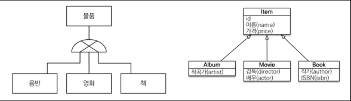
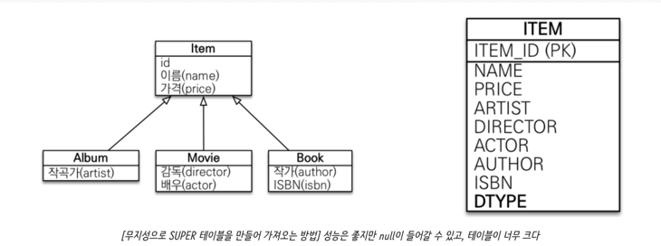
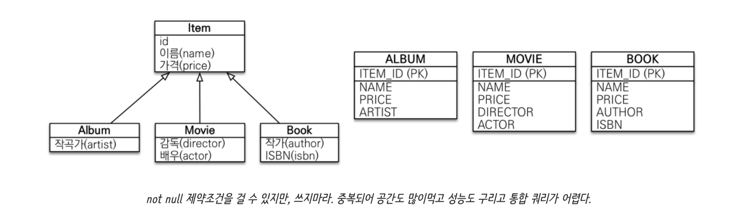
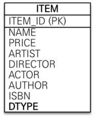
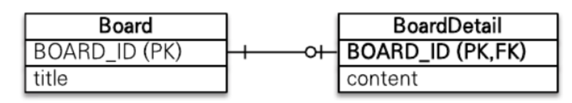

7장 고급 매핑

- 상속관계 매핑 : 객체의 상속 관계를 DB에 어떻게 매핑하는지 다룬다.
- @MappedSuperclass: 등록일, 수정일 같이 여러 엔티티에서 공용으로 사용하는 매핑 정보만 상속받고 싶으면
- 복합 키, 식별 관계 매핑 ( 식별 관계: 다른 PK를 자신의 복합 PK키로 쓰면서 외래키로 쓰는)
- 조인 테이블: 테이블은 외래 키 하나로 연관관계를 맺을 수 있지만, 연관관계를 관기하는 연결 테이블을 둬도 된다. (@ManyToMany 매핑처럼)
- 엔티티 하나에 여러 테이블 매핑하기: 엔티티 하나에 테이블 하나를 매핑하지만, 엔티티 하나에 여러 테이블 매핑할 수 있다.


# 7.1 상속 관계 매핑
 R DB에는 객체지향에서의 상속 개념이없지만, `Super-Type Sub-Type Relationship` 모델링 기법이 상속 개념과 유사하다. 

* ORM의 상속 관계 매핑 == 객체의 상속 구조와 DB의 슈퍼타입 서브타입 관계 매핑.
이 매핑에 3가지 방법이 존재한다.


* 각각의 테이블로 변환 : 그림과 같이 모두 테이블로 만들고 조회할 때 조인을 사용. JPA에선 조인 전략이라고 한다.
  

* 통합 테이블로 변환: 테이블 하나에 다 넣는다. (단일 테이블 전략) 


* 서브타입 테이블로 변환: 그림과 같이 서브타입마다 하나의 테이블 만들기. 테이블 전략


## 7.1.1 조인 전략


이거. 자식 테이블이 부모 테이블의 기본 키를 받아 기본 키 + 외래 키로 사용
조회할 때 조인 많이 필요.
또, 테이블은 이게 ALBUM 타입인지, MOVIE 타입인지 모르기 때문에, `DTYPE` 과 같이 구분 컬럼을 추가해야 해.

```java
@Entity
@Inheritance(strategy = InheritanceType.JOINED) // 조인 전략, 단일 테이블 전략, 테이블 전략
@DiscriminatorColumn (name= "DTYPE") //자식 테이블 구분하는거
public abstract class Item {
    @Id @GeneratedValue
    @Column(name = "DTYPE")
    private Long id;
}

@Entity
@DiscriminatorValue("ALBUM")
public class Album extends Item {
    private String artist;
}

@Entity
@DiscriminatorValue("MOIVE")
public class Movie extends Item {
    private String director;
}
```

자식 테이블의 ID는 기본값으로 부모 테이블의 ID 컬럼명을 그대로 사용. 
만약, 자식 테이블의 기본 키 컬럼명을 변경하고 싶으면, 
이런식으로, `@PrimaryKeyJoinColumn (name = "BOOK_ID") ` 사용.
그럼 얘의 기본 키 컬럼명은 `BOOK_ID`가 되는것.


* 장점
- 테이블이 정규화됨 (normalize , 제 1 정규화, 2, 3, BCNF 이런거)
- 외래 키 참조 무결성 제약조건 활용가능 ( FK로 지정되는 상대 테이블의 row가 있어야만 됨) 
- 저장공간을 효율적으로 사용 

* 단점
- 조회할 때 조인 많이 사용, 성능 저하
- 조회 쿼리 복잡
- 데이터 등록시 INSERT SQL 두번 실행.

## 7.1.2 단일 테이블 전략

이거 하나 쓰는 것.
Book Entity 저장하면, ITEM 테이블의 AUTHOR, ISBN 컬럼만 사용하고, ARTIST, DIRECTOR, ACTOR 컬럼은 사용안해.
null이 입력되어있다. -> null이 있으면 조회 성능 저하 ㅜㅜ

```java
@Entity
@Inheritance(strategy = InheritanceType.SINGLE_TABLE)
@DiscriminatorColumn(name = "DTYPE")

```

여전히 클래스 단의 코드는
```java
@Entity
@DiscriminatorValue("ALBUM")
public class Album extends Item {
    private String artist;
}

@Entity
@DiscriminatorValue("MOIVE")
public class Movie extends Item {
    private String director;
}
```
그대로지만, 

* 장점
- 조인 필요없어 조회 성능 빠르고
- 조회 쿼리 단순
* 단점
- 자식 칼럼이 null 허용해야
- 테이블이 너무 커질 수 있어 조회 성능 떨어진다.


# 7.1.3 구현 클래스마다 테이블 전략 (쓰지마)
자식 엔티티마다 테이블을 만들고, 자식 엔티티에 부모칼럼까지 다 집어넣어 놓은 형태
부모는 abstract class,  DTYPE같은 칼럼이 필요없는 형태.
```java
@Entity
@Inheritance(strategy = InheritanceType.TABLE_PER_CLASS)
public abstract class Item {
    @Id @GeneratedValue
    @Column(name = "ITEM_ID")
    private Long id;
    
    private String name;
    private int price;
}

@Entity
public class Album extends Item {...}
```
이런 형태.
하지만 쓰지 말란다.

장점
- 서브 타입을 구분해서 처리할 때 효과적 ( Album 자체에 대해서만 쿼리하고 이럴때)
- not null 제약조건 사용 가능. (하나의 테이블에 모든걸 때려박는 1번타입일땐 이런문제 생김)

단점
- 여러 자식 테이블 함께 조회할 때 성능이 느리다. (SQL에 UNION 사용)
- 자식 테이블 통합해서 쿼리하기 어려움. ITEM중에 이런 이름 가진 애 누구냐?

# 7.2 `@MappedSuperclass`

 부모 클래스를 그냥 매핑 정보만 제공하는 용도로 쓰려면
 `@MappedSuperclass`
 `@MappedSuperclass`는 추상 클래스랑 비슷한데, `@Entity`는 무조건 DB의 테이블과 매핑되지만,
 `@MappedSuperclass`는 실제 테이블과는 매핑되지 않는다.
 
부모클래스가 넘겨주는 필드를 사용하고 싶지 않다면 (매핑 정보를 재정의하려면)
- `@AttributeOverride(name = "id", column = @Columnm(name = "MEMBER_ID"))`
- `@AttributeOverrides`
이런건, 부모에게 상속 받은 id라는 필드명의 칼럼을 이 엔티티에서는 `MEMBER_ID` 라는 칼럼 이름으로 사용하겠다.

`@MappedSuperclass`의 특징
- 매핑정보만 상속
- 부모 클래스는 엔티티가 아니라, em.find(), JPQL에서 사용불가.
- 따라서 이 클래스는 추상 클래스로 만드는 것이 바람직

`@MappedSuperclass`는 등록일자, 수정일자, 등록자, 수정자같은 속성을 잘 관리가능.

# 7.3 복합 키와 식별 관계 매핑

## 7.3.1 식별 관계 vs 비식별 관계 매핑

*식별 관계*
부모 테이블의 기본 키를 받아서, 자식테이블의 기본키이자, 외래키로 쓰는경우. (보통 자식이 복합키를 가진다)

*비식별 관계*
부모 테이블의 기본 키를 받아서, 자식 테이블의 외래 키로 사용하는 관계 

PK에 포함되느냐 안되느냐 여부인 것.
이제 FK가 NULL도 허용되는지에 따라 `필수적 비식별 관계`, `선택적 비식별 관계`

우리는 주로 비식별 관계를 사용하는데, JPA는 식별, 비식별 둘다 지원한다.

```java
@Entity
public class Hello {
 @Id
 private String id;
 //@Id
 //private String name;
}
```
둘 이상의 컬럼으로 구성된 복합 키는 매핑 오류가 발생.
JPA에서 식별자를 둘 이상 사용하려면 식별자 클래스를 만들어야.
식별자 클래스는 equals랑 hashcode를 사용해서 동등성 비교를 해야한다. 엔티티의 비교를 지원해줘야 해.

`@IdClass`
이 방식은, 복합키가 있으면 그대로 별도의 식별자 클래스를 만드는것.
```java
@Entity
@IdClass(ParentId.class)
public class Parent {
    
    @Id
    @Column(name = "PARENT_ID1")
    private String id1; //ParentId.id1과 연결
 
    @Id
    @Column(name = "PARENT_ID2")
    private String id2; //ParentId.id2와 연결
    
    private String name;
}
```

PARENT 테이블을 매핑한 예제 7.6의 Parent클래스를 분석해보자. 먼저 기본 키 컬럼을 @Id로 매핑.
이렇게 하면

```java
public class ParentId implements Serializable {
    
    private String id1;
    private String id2;
}
```
보면, id1, id2 속성이 엔티티에도, `ParentId`에도 있는데, 이 이름을 같게 해줘야 한다.
복합키 엔티티를 어떻게 저장하지?

```java
Parent parent = new Parent();
parent.setId1("myId1");
parent.setId2("myId2");
parent.setName("parentName");
em.persist(parent);
```
이런식으로 복합키를 저장하니까 사실 비슷해. 그럼 `em.perist`를 했을 때, 식별자 클래스인 `ParentId`를 생성해서, 영속성 컨텍스트의 키로 활용한다.
복합키로 조회도
```java
ParentId parentId = new ParentId("myId1","myId2")
em.find(Parent.class, parentId);
```

이런 클래스의 자식이면, FK로 복합키를 가져야 한다.

```java
@Entity
public class Child {
    @Id
    private String id;
    
    @ManyToOne 
    @JoinColumns({
            @JoinColumn(name = "PARENT_ID1", referencedColumnName = "PARENT_ID1"),
            @JoinColumn(name = "PARENT_ID2", referencedColumnName = "PARENT_ID2")
                 })
    private Parent parent;
}
```

@EmbeddedId

`@IdClass`가 데이터베이스에 맞춘 방법. 이게 더 객체지향적인 방법

```java
@Entity
public class Parent{
    @EmbeddedId
    private ParentId id;
}
```
```java
@Embeddable
public class ParentId implements Serializable {
    @Column(name = "PARENT_ID1")
    private String id1;
    @Column(name = "PARENT_ID2")
    private String id2;
}
```
이제 엔티티저장이
```java
Parent parent = new Parent();
ParentId parentId = new ParentId("myId1","myId2")
parent.setId(parentId);
em.persist(parent);
```
이제 아예 parentId 클래스를 만들어서 넣은 뒤 `persist`를 한다.
조회는 전과 동일하다.

*복합 키와 equals(), hashCode()*

일반적으로 
id1 = new parentId();
id2 = new parentId();

id1.equals(id2)는 만약 `equals` 메서드를 적절히 오버라이드 하지 않았다면 false가 나온다.
자바의 기본 equals()는 인스턴스 참조 값 비교를 하는데, 이건 주소값 비교 같은 느낌. (동일성 비교==)
영속성 컨텍스트는 식별자 비교할때 equals()와 hashcode()를 이용해서 비교한다. 그래서 같은 복합키는 `equals()`랑 `hashcode()` 비교가 같아야.

### @IdClass vs @EmbeddedId

`@EmbeddedId` 는 JPQL이 특정 상황에 길어질 수 있다. `select p.id.id1, p.id.id2 ... ` 

## 7.3.3 복합 키 : 식별 관계 매핑

### @IdClass
이 경우 자식 테이블의 PK가 
- `PARENT_ID`
- `CHILD_ID`
의 복합 키이고, PARENT_ID는 FK이다. 
```java
//부모
@Entity
public class Parent {
    
    @Id @Column(name = "PARENT_ID")
    private String id;
}
//자식
@Entity
@IdClass (ChildId.class)
public class Child {
    @Id
    @ManyToOne
    @JoinColumn(name = "PARENT_ID")
    public Parent parent;
    
    @Id @Column(name = "CHILD_ID")
    private String childId;
}
//손자
@Entity
@IdClass(GrandChildId.class)
public class GrandCHild {
    @Id
    @ManyToOne
    @JoinColumns({
            @JoinColumn (name = "PARENT_ID"),
            @JoinColumn (name = "CHILD_ID")
                 })
    private Child child;
}   
```
지금 JoinColumn이 붙은 이유가, 부모의 PK가 자식의 FK라서, FK니까 ManyToOne 붙이고, joinColumn 쓰는 것.,
### @EmbeddedId
@MapsId를 사용해야 한다.,

```java
//부모
@Entity
public class Parent {
    
    @Id @Column(name = "PARENT_ID")
    private String id;
}
//자식
@Entity
@IdClass (ChildId.class)
public class Child {
    @EmbeddedId
    private ChildId id;
    
    @MapsId("parentId") // ChildId.parentId를 매핑시킨다.
    @ManyToOne
    @JoinColumn(name = "PARENT_ID")
    public Parent parent;
}
//손자
@Entity
@IdClass(GrandChildId.class)
public class GrandChild {
    
    @EmbeddedId
    private GrandChildId id;
    
    @MapsId("childId") //GrandChildId.childId 와 매핑이 되어라
    @ManyToOne
    @JoinColumns({
            @JoinColumn (name = "PARENT_ID"),
            @JoinColumn (name = "CHILD_ID")
                 })
    private Child child;
}   
```

@MapsId는 외래 키와 매핑한 연관관계를 기본 키와도 매핑하겠다는 뜻이다. `@MapsId`의 속성 값은 `@EmbeddedId`를 사용한 식별자 클래스의 기본 키 필드


## 7.3.4 비식별 관계로 구현
비식별관계로 하면, 별도로 매핑에 대해 특별히 신경 쓸것은 없고, FK만 잘 가리켜주면 된다.

```java
@Entity
public class Child{
    @Id @GeneratedValue //자체제작? auto_increment되는거 쓰기
    @Column (name = "CHILD_ID")
    private Long id;
    
    @ManyToOne
    @JoinColumn (name = "PARENT_ID")
    private Parent parent;
}
```
복합키도 안쓰고 좋다.

## 7.3.5 일대일 식별 관계.

일대일 식별관계는, 

이것처럼, 부모 테이블의 기본 키 값만 사용.
그래서, 부모 테이블의 기본 키가 복합 키가 아니면, 복합키로 구성 안돼. 그냥 OneToOne으로 매핑하고, 
```java
@Entity
public class BoardDetail {
    @Id
    private Long boardId;
    
    @MapsId //위의 @Id 쓴 필드인 애랑 매핑하게 돼. 즉 위의 필드가 아래 Board랑 연결하는 거.
    @OneToOne
    @JoinColumn(name="BOARD_ID")
    private Board board;
}
```
BoardDetail 처럼 식별자가 칼럼 하나면, `@MapsId` 사용하고 그냥 디폴트로 남겨둔다.
```java
Board board = new Board();
em.persist(board)

BoardDetail boardDetail = new BoardDetail();
boardDetail.setBoard(board);
em.persist(boardDetail)
```

## 7.3.6 식별, 비식별 관계의 장단점

 데이터베이스 설계에서 비식별 관계를 선호하는 이유
- 부모 테이블의 기본키가 자식 테이블의 기본 키가 되니, 자식 테이블의 기본 키 칼럼이 세대를 거치면서 계속 늘어나
- 복합키 써야되는 경우가 많다.
- 대리키를 쓰는 것이 변화가 없어 좋다.
- 테이블 구조가 유연하지 못하다. - 부모 테이블의 기본키를 그대로 써야하니까.

객체 설계 비식별 관계를 선호하는 이유

- 복합 키본키 추가적인 노력 필요
- JPA는 대리키 생성을 위한 방법 제공 (@GeneratedValue)

식별 관계를 가지면, 별도의 인덱스를 생성하지 않아도 되고,
조인 없이 부모테이블의 값까지 볼 수 있다는것. ( 부모 PK를 가지고있으니 부모테이블에 대한 접근이 쉽다.)

기본 키는 Long 타입의 대리 키를 사용하는 것을 추천한다.
그리고 null이 없어 inner join이 가능한 필수적 관계를 사용해야 한다.

# 7.4 조인 테이블

 데이터베이스 테이블의 연관관계를 설계하는 방법은 크게 2가지이다.
- 조인 컬럼 사용 (외래 키)
- 조인 테이블 사용 (테이블 사용)

조인 컬럼 사용

- 조인 컬럼 == 외래 키 사용해서 관리하는 것
- null이 있는 선택적 비식별 관계는 OUTER JOIN을 사용해야 누락을 방지할 수 있다. 

조인 테이블 사용

- 조인 컬럼을 사용하는 대신 조인 테이블 (Many TO Many 관계처럼) 을 사용해서 연관관계 관리.

가장 큰 단점은 테이블을 하나 더 추가한다는 점. 
보통 다대다 일대일 관계로 풀어내기 위해 사용하지만, 일대일, 다대다 관계에서도 사용한다.

## 7.4.1 일대일 조인 테이블
조인 테이블의 외래 키 컬럼 각각에 .unique 제약조건을 거는것이 필요하다.
(그냥 강제로 UNIQUE를 달아서 1:1로 만드는 것)

```java
@Entity
public class Parent {
    @Id @GeneratedValue
    @Column(name = "PARENT_ID")
    private Long id;
    
    @OneToOne
    @JoinTable(name = "PARENT_CHILD",
               joinColumns = @JoinColumn(name = "PARENT_ID"),
               inverseJoinColumns = @JoinColumn(name = "CHILD_ID"))
    private Child child;
}
```

이렇게하면, Child 클래스의 id를 (@Columnm(name="CHILD_ID")) 얘랑 매핑하게 된다.

## 7.4.2 일대다 조인 테이블

일 대 다 관계로 만드려면, 다(N) 쪽에 UNIQUE 제약조건을 걸어야 한다. 
```java
@Entity
public class Parent {
    @Id @GeneratedValue
    @Column(name = "PARENT_ID")
    private Long id;
    
    @OneToMany // 여기 바뀜
    @JoinTable(name = "PARENT_CHILD",
               joinColumns = @JoinColumn(name = "PARENT_ID"),
               inverseJoinColumns = @JoinColumn(name = "CHILD_ID"))
    private List<Child> child = new ArrayList<child>(); // 여러명의 child 가질 수 있게 변경됨
}
```
## 7.4.3 다대일 조인 테이블
방향만 반대라서, CHild쪽에서 @ManyTOOne 쓰는정도

## 7.4.4 다대다 조인 테이블
@ManyToMany로 바뀐거 정도. 근데 이 경우 조인되야하는 테이블에는 key값만 존재해야 PK, FK 두개.

# 7.5 엔티티 하나에 여러 테이블 매핑 

@SecondaryTable을 통해 한 엔티티에 여러 테이블을 매핑할 수 있다.

하나의 엔티티로 두개의 테이블을 매핑?

```java
@Entity
@Table(name="BOARD")
@SecondaryTable(name = "BOARD_DETAIL",
                pkJoinColumns = @PrimaryKeyJoinColumn(name = "BOARD_DETAIL_ID"))
public class Board {
    @Id 
    private Long id;
    
    private String title;
    @Column(table ="BOARD_DETAIL")
    private String content;
}

```
이렇게하면, 기존 테이블인 BOARD의 id, title 값을 쓸 수 있고, 
BOARD_DETAIL에서는 content라는 칼럼을 쓸 수 있다.
