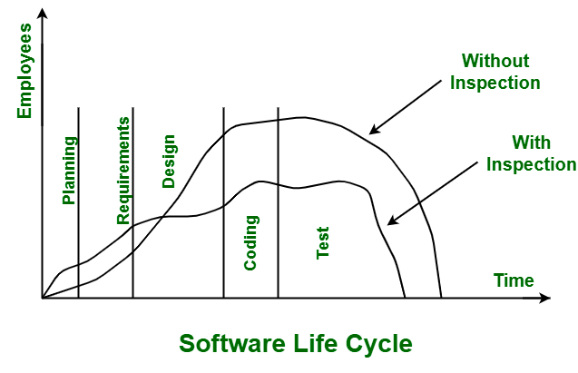

1. TDD를 진행하고 싶다. 어떤 순서로 진행하는 것이 좋을까?

<details>
<summary> 1정답: </summary>
1. 클래스 이름을 정한다  <br/>
2. 해당 클래스 이름을 이용해 test 클래스를 제작한다. ex.) `public class ProfileTest`  <br/>
3. 이 클래스가 수행해야하는 시나리오중 가장 단순한 기능에 대한 테스트를 제작한다. 이때, 테스트는 그 기능을 검증할 수 있게 제작한다 <br/>
4. 테스트에서 쓰이는 메서드들이 컴파일이 가능할 정도로 클래스의 메서드들을 선언하고 return 시킨다. python은 `NOT_IMPLEMENTED`를 return할 수 있게 제공한다.  <br/>
5. 위 테스트 실행이 가능해졌으면, 테스트가 성공하도록 메서드를 구현한다. 한 메서드의 구현이 테스트 통과하는데까지 걸리는 시간이 10분이 넘어가면 더 작은 단계의 테스트를 만들어 재시도해보라.  <br/>
</details>

1. 쓰레드를 실행시키는 함수가 존재하는 함수가 있다. Unit test를 하기 위해서는 어떻게 분리하는게 좋을까?
```java

public void executeParallelMatch(List<String> arr){
    ExecutorService executor = Executors.newFixedThreadPool(10);
    for (String st : arr){
        Runnable runnable = () -> { 
            if(st.indexOf("https://naver.com") !=-1) {
                System.out.println("hello"+st);
            }
        }   
        executor.execute(runnable);
        
    }
    executor.shutdown();
} 

```
<details>
<summary> 1정답: </summary>
1. 먼저 executor은 unittest에서 실행시간을 늘릴수도 있다. @BeforeClass 등으로 쓰레드 풀 선언해놓고 다른 unittest에서도 쓰면 좋을듯  <br/>
2. lambda 함수는 함수를 뗴어내서 제기능을 하는지 확인하는 unit test를 작성해야 할듯<br/>
3. 그리고 쓰레드가 실행되는지 테스트하는 함수를 넣어서 unit test를 제작해야한다. (쓰레드 자체를 검증) <br/>
</details>


2. 페이건 검사 기법이 뭘까요?

<details>
<summary> 2 정답: </summary>

이것처럼, 프로그램 초기에 에러를 잡도록하면 나중에 필요한 직원의 수가 적어진다.<br/>
이를테면 프로그램 초기에 버그를 제대로 못잡았는지 버그가 많은 우리 시스템 ㅜㅠ처럼<br/>
</details>

3. 코드 커버리지를 높이는 것의 문제점
<details>
<summary> 3 정답: </summary>

1. 단언 없이 쓸모없는 테스트를 제작할 수도 있다.<br/>
2. 클래스 생성자를 안거쳤다고 억지로 default 생성자를 부르는 테스트를 덜렁 제작하는 등 쓸모없는 테스트를 만들어낼 가능성 + assertion없는 테스트를 만들게 될수도 있다 <br/>
3. 물론, 테스트 작성이 불가능하다면 안좋은 설계이다.<br/>
4. 유지보수하기 어렵고, 가치있는 단언이 없다면 나쁜 테스트. 가치없는 테스트를 작성하려고 시간낭비 할 수도 있다.<br/>
</details>
