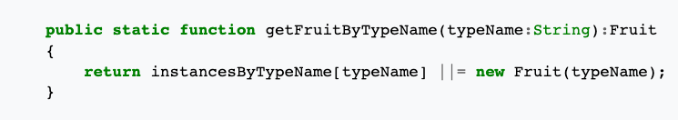

1. `java.util.Iterator` 인터페이스에서 next()메서드를 구현하면, 다음 객체에 대해 리턴하고 현재 객체 포인터를 증가시킵니다.
```java
public E next(){
                pointer++;
                E element;
                try{
                    element = list.get(pointer);
                }catch(IndexOutOfBoundsException exception){
                    throw new NoSuchElementException(exception.getMessage());
                }
                return element;
            }
```
어떤 부분이 좋지 않은 구현이 되는걸까요?

<details>
<summary> 정답: </summary>
1. 부작용 ( 인자로 들어오지 않은, 시스템의 다른 부분을 변경하게 되는 경우 ) 을 유발해 명령-질의 분리 원칙을 위반한다. (command -query separation)<br/>
어떤 메서드는 명령을 실행 ( 부작용 생성 ) 하거나, 질의에 대답 (어떤 값 반환) 할 수 있으며, 두 작업을 모두 하면 안된다.

</details>

2. 성진은 단위테스트를 만드려고 코드를 보는데, 해당 클래스를 생성해서 테스트해보려니 참조하는 클래스도 많고, <br/>
사전 설정도 많이 필요합니다. 왜 이런문제가 발생할까요?


<details>
<summary> 정답: </summary>
1. 먼저, 참조하는 클래스가 많다는 것은 SRP를 위반한 경우가 많다는 것. 설계가 잘못되었다. <br/> 너무 많은 객체가 필요한 것도 
하나의 객체가 온전히 제 책임을 다하고 있지 않기 때문일수도 있을까? 아니면 최대 참조하는 클래스 수가 3개 이정도여야 맞는 단위의 객체일수도 <br/>
책: SRP를 위반하면 클래스는 점점 커지고, 다른 클래스에 대한 의존성이 생긴다. 커다란 클래스를 분할하라<br/>

</details>
   

3. http://misko.hevery.com/code-reviewers-guide/ 코드 리뷰어's guide에 나와있는 게 뭘까요?
   (총 4가지)

<details>
<summary> 정답: </summary>
1. 생성자가 실제로 일을 해버리는 것 ( 우리의 생성자가 실제 계산을 해두는것처럼)<br/>
그래서 new keyword가 있거나, field assignment 가 아닌 다른게 껴있으면 문제가 된다. if문도 껴있으면 안된다, <br/>
2. digging into Collaborators ( 협업자의 것을 너무 많이 사용하려한다 )<br/>
- demeter 법칙 위반 - 메서드 call chain 등장시 . 하나 이상있으면 안된다.<br/>
- 단순히 다른 object를 받는 것은 다른 오브젝트의 메서드를 부르거나 오브젝트의 필드정도 사용해야할때.<br/>
3. global state와 singleton의 과도한 사용<br/>
singleton 객체를 추가하거나 사용할 때에는 주의해야 한다. <br/>
4. 하나의 클래스가 너무 많은 일을 할때.<br/>
새로운 사람이 클래스를 읽기 어려우면 이문제가 있을 수 있다.<br/>
- 일부 메서드에서만 쓰이는 필드를 클래스가 갖고있다면?<br/>
- 클래스가 static 메서드를 들고 있는데 parameter에 의해서만 작동한다면?<br/>

</details>

4. 만약 생성자에서 일을 안 시키려고 했는데 너무 성능상 안좋아진다면?
<details>
<summary> 정답: </summary>
이런식으로 lazy initialization을 해야 한다. factory 패턴과 보통 많이 쓰인다.

</details>



