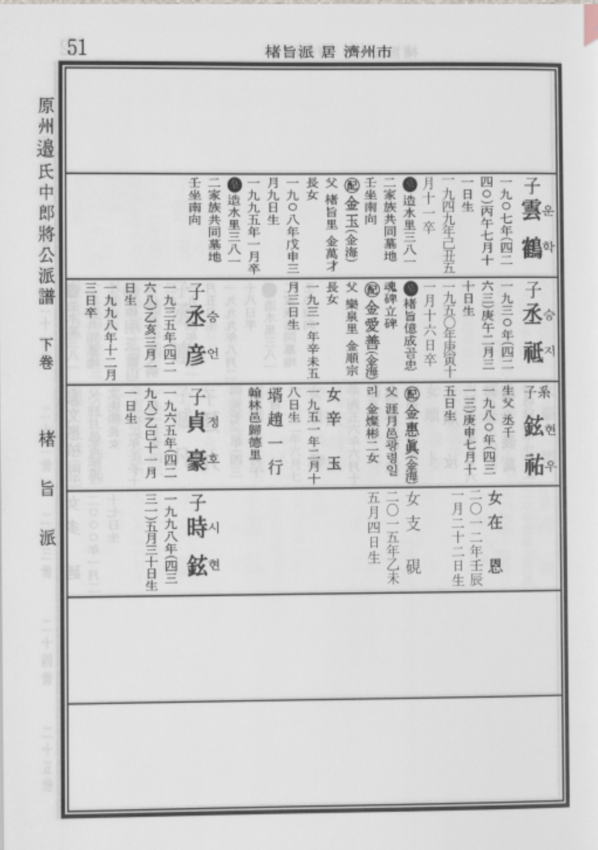
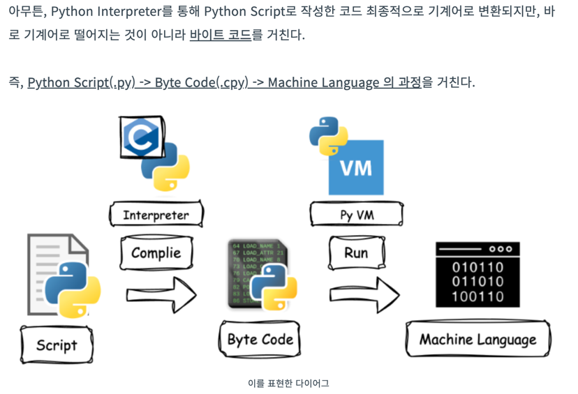
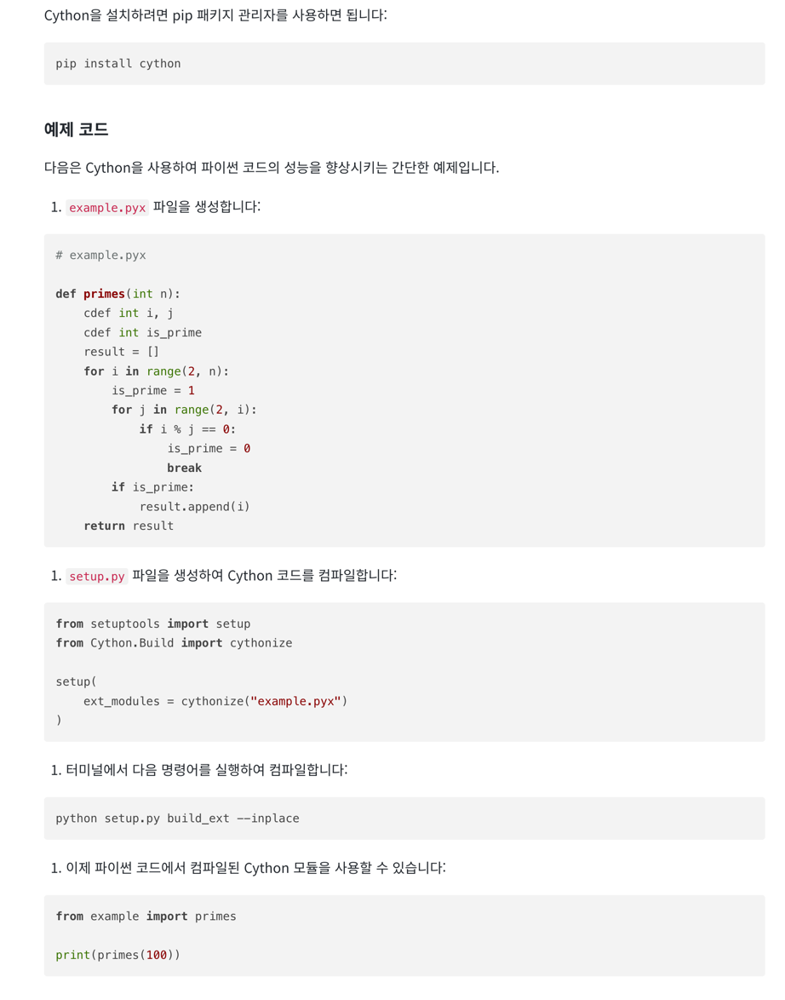

# 1.

1970년 후반에 Sru Feldman은 Fortran 77 컴파일러를 만들었는데, 그 프로그램의 크기를 64KB로 간신히 맞출 수 있었다.

그는 메모리를 절약하기 위해 중요 레코드의 일부 정수를 4비트 필드로 팩하는 방법을 사용했다.

팩 안하고 8bit에 저장하자, 데이터가 차지하는 메모리는 수백 바이트 증가했지만, 프로그램 전체의 크기는 오히려 수천 바이트나 줄었다.

왜일까?


<details>

팩해두었을 때 복호화하는데 필요한 명령어들이 더 많이 필요했을 테니까.

자주 쓰이는 int 필드는 팩하지 않는게 좋겠다.

</details>

# 4.

연감이나 다른 참고서적 등 컴퓨터가 아닌 응용분야에서 공간 절약의 예가 될 수 있는 것을 조사해보라.

<details>



족보 보면, 다 성이 똑같아서 성은 안쓰고 이름만 씀

</details>

# 7.

일반적인 형태의 프로파일러(profiler)는 프로그램 카운터의 값을 규칙적으로 표본채취한다. (9.1절 참고)

이런 값들을 저장하기 위해 시간, 공간적으로 효율적이고, 유용한 출력을 제공할 수 있는 데이터 구조를 디자인하라.


<details>

```
         88353 function calls (88134 primitive calls) in 0.067 seconds

   Ordered by: internal time
   List reduced from 92 to 10 due to restriction <10>

   ncalls  tottime  percall  cumtime  percall filename:lineno(function)
     9630    0.019    0.000    0.019    0.000 {method 'translate' of 'str' objects}
     2234    0.007    0.000    0.042    0.000 short_id2uri.py:55(is_object_type)
     9630    0.004    0.000    0.024    0.000 /envs/entity_ranking/lib/python3.9/re.py:270(escape)
      694    0.003    0.000    0.021    0.000 short_id2uri.py:99(escape_object_type)
      183    0.003    0.000    0.003    0.000 {method 'write' of '_io.TextIOWrapper' objects}
     2234    0.003    0.000    0.026    0.000 short_id2uri.py:66(<listcomp>)
      695    0.002    0.000    0.005    0.000 short_id2uri.py:167(convert_object_type)
     3695    0.002    0.000    0.006    0.000 /envs/entity_ranking/lib/python3.9/re.py:289(_compile)
    10901    0.002    0.000    0.002    0.000 {method 'startswith' of 'str' objects}
     4651    0.002    0.000    0.002    0.000 {method 'join' of 'str' objects}

```

이런값들을 저장할 때, tottime, ncall 같은걸 저장해서 percall에 tottime/ncall 을 보여주는 것이 목표.

각 함수이름별로 해당 데이터를 저장해야하니까 아래같이 dto를 만드는게 일반적일 것 같은데, 각 함수별로 ncall, tottime, cumtime 저장하도록 하는것?

하지만, 겨우 한번 등장하는 함수 (main 함수 호출, system initializing 등)를 위해서 메모리를 사용하는건 부적절할 수 있다.

```
class DataObject:
   int ncalls;
   float tottime;  
   float cumtime;

class ProfileDataObject:
    dataObjectArr : Dict[str, DataObject] 

```

따라서, ncalls에 대한 Dict가 존재하고, 나머지도 별도의 dict로 둔다면, 한번 불리는 함수들에 대해서 dto를 유지하지 않아도되서 공간절약될것.

```python


ncalls_dict = Dict[str, int]
tottime_dict = Dict[str, float]  # dict를 defaultdict로 사용해서 0.0으로 초기화하게 해야함
cumtime_dict = Dict[str, float]

if key not in ncalls_dict:
    ncalls_dict[key] = 1
else:
    ncalls_dict[key] += 1
    tottime_dict[key] += 1
    cumtime_dict[key] += 1


```

- percall 같은건 그때그때 계산하고,
- 함수명이 길면 key로 사용하면 너무 공간낭비니까 hash함수를 써서 함수명의 hash 값을 key로 사용
- hash값을 int로 매핑시킬 수 있다면, Dict 아닌 array를 사용해서 해시테이블 유지해야하는 dict보다 공간효율

</details>

# 11.

오늘날 프로그램의 큰 부분은 직접 작성한 코드가 아니라, 우리가 이용하는 코드인 경우가 종종 있다는 것을 독자가 지적했다.

링크 후에 여러분의 프로그램이 얼마나 큰지 살펴보라. 어떻게 하면 그 크기를 줄일 수 있겠는가?



https://wikidocs.net/227944



아무튼 numpy같은게 겁나 큰데, 필요한 부분만 import 해서 사용하려면 이런식으로 최적화도 가능하다. 사전 compile 통해서 executable 만들 때 필요한 부분만 포함시킬 수 있다.

```
nuitka --standalone --nofollow-import-to=numpy.some_unused_module myscript.py

```

물론 from numpy import array 만 해도 되기도 하고. 
