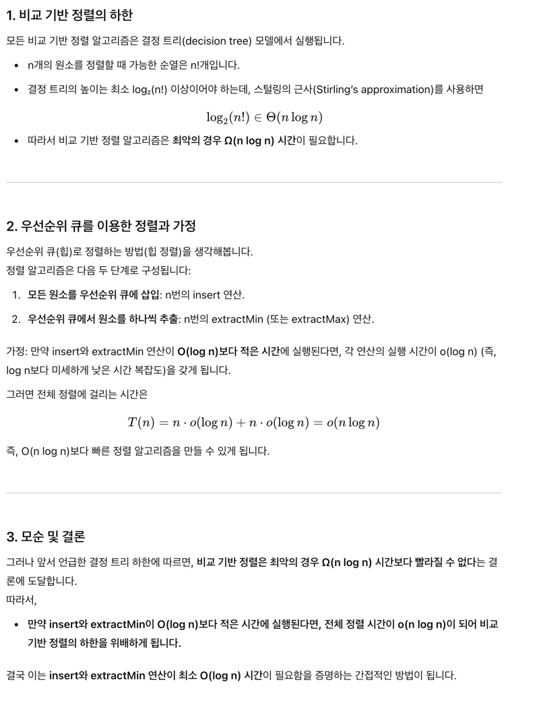

# 14장 heap

# 1.

힙 기반의 우선수위 큐를 가능한 빠르게 동작하도록 구현하라. n 값이 얼마일 때 순차적 구조를 사용한 것보다 빠른가? 


---

답: 
  - 더 빠르게 동작시키려면, 이미 배열을 사용하고 있으니, insertion이나 deletion이 빨라야 할텐데. 메모리를 더 사용하면 빨라지나? 

# 2. 

# 3. 

힙 정렬을 가능한 빠르게 동작하도록 구현하라. 11.3절의 표에 나타낸 정렬 알고리즘들과 비교하면 어떠한가.

<details>

Heap Sort Time: 0.08477997779846191
Quick Sort Time: 0.013602972030639648
Merge Sort Time: 0.027944087982177734
Insertion Sort Time: 1.3418891429901123
Radix Sort Time: 0.00857400894165039

공평하게 모두 insertion time (append) 까지 쟀다. 그래도 어느정도 우리 예상이랑 비슷하게 나온다. 

</details>

# 6. 

디스크상의 순차 파일에 대한 일반적인 구현에서는 각 블록이 다음 블록을 가리키도록 한다. 

이 방법은 블록 하나를 쓰거나, 파일의 첫 번째 블록을 읽는데 일정한 시간을 소모하고, i-1번째 블록을 이미 읽은 후라면 i번째 블록을 읽을 때에도 역시 일정한 시간을 소모한다. 

따라서 처음부터 i번째 블록을 읽으려면 i에 비례하는 시간이 필요하다. 


요약: 블록의 마지막에 다음 블록 가리키는 포인터가 있어서, i번째 블록부터 읽고 싶어도 i에 비례하는 시간이 필요 

Xerox 연구 센터에서는, 각 노드에 포인터 하나를 추가하면 i번째 블록을 log i에 비례하는 시간에 읽을 수 있음을 알아냈다. 이 아이디어를 어떻게 구현하겠는가?

또 아래 코드랑 시간단축을 시키는 유사점은 무엇인가?

```

function exp(x, n)
    if n = 0
        return 1
    elif even(n)
        return square(exp(x, n/2))
    else
        return x*exp(x, n-1)

```

<details>


각 노드에 포인터를 추가해두면, 점프를 할 수 있을 것 같다. 파일 블럭이 1에서 n까지 있다고 하면 

1블럭은 2번째 블럭 갈 수 있는 '점프 포인터' 추가 

2블럭은 4번째 블럭 갈 수 있는 '점프 포인터' 추가 

3블럭은 8번째 블럭 갈 수 있는 '점프 포인터' 추가

4블럭은 16번째 블럭 갈 수 있는 '점프 포인터' 추가

이런식으로 하면 줄일 수 있지 않을까? 

exp 코드랑 연관성부터 보면, 일단 컨셉은 x*x*x*x ... 를 n/2 씩 줄여나갈 수 있다는데에 있다.

우리도 건너뛰는횟수를 줄이자 이거다. 

### 정답

아하, i번째 블럭이 노드 2i에 대한 포인터도 갖게 하라고 한다.

생각해보니 점프 포인터 구현이 빡셀거같긴 하다. 


</details>


# 9. 

우선순위 큐를 힙으로 구현했을 때 insert와 extractmin이 가지는 로그적 실행시간이 최상의 결과에 대한 상수배임을 증명하라. 


<details>

GPT의 응답.

insert와 extractMin의 실행 시간은 **최상의 경우 O(1), 최악의 경우 O(log n)**입니다.

O(log n)은 O(1)보다 상수배만큼 큰 값이므로, insert와 extractMin의 실행 시간은 최상의 경우보다 상수배 큰 값임이 증명됩니다.

따라서, 힙에서의 insert와 extractMin 연산이 가지는 로그적 실행 시간은 최상의 결과에 대한 상수배이다.

음 이런느낌아닐까?  3(log n) == (log n의 상수배) == (log n^3)  아무리 최악의 경우도 log n의 상수배인 셈이다. 


연습문제 정답

- 정렬에서 O(n log n) 하한을 이용하라. 만약 insert와 extractmin이 모두 O(log n)보다 적은 시간에 실행된다면, O(n log n)보다 적은 시간에 정렬할 수 있다.
- 어떻게 O(nlogn)보다 빠르게 정렬할 수 있는지 보여라 


내 정답




요약

비교 기반 정렬의 하한은 Ω(n log n)입니다.

우선순위 큐를 이용해 정렬할 경우 n번의 insert와 n번의 extractMin 연산이 필요합니다.

만약 각 연산이 O(log n)보다 빠르다면, 전체 정렬 시간이 o(n log n)이 되어 하한을 위배하게 됩니다.

따라서 insert와 extractMin 연산은 **최소한 O(log n)**의 시간 복잡도를 가져야 합니다.

이로써, insert와 extractMin이 O(log n)보다 작으면 O(n log n)보다 빠른 정렬이 가능해진다는 점을 보임으로써, 결국 우선순위 큐 연산의 로그적 시간 복잡도가 최적임을 증명할 수 있습니다.


</details>
