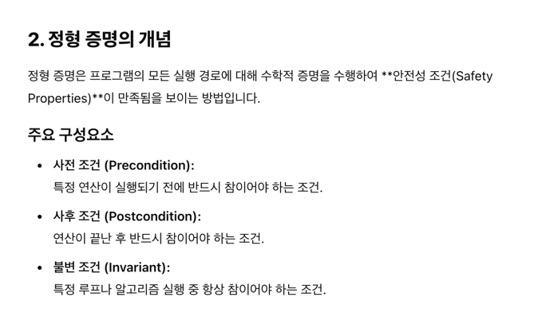
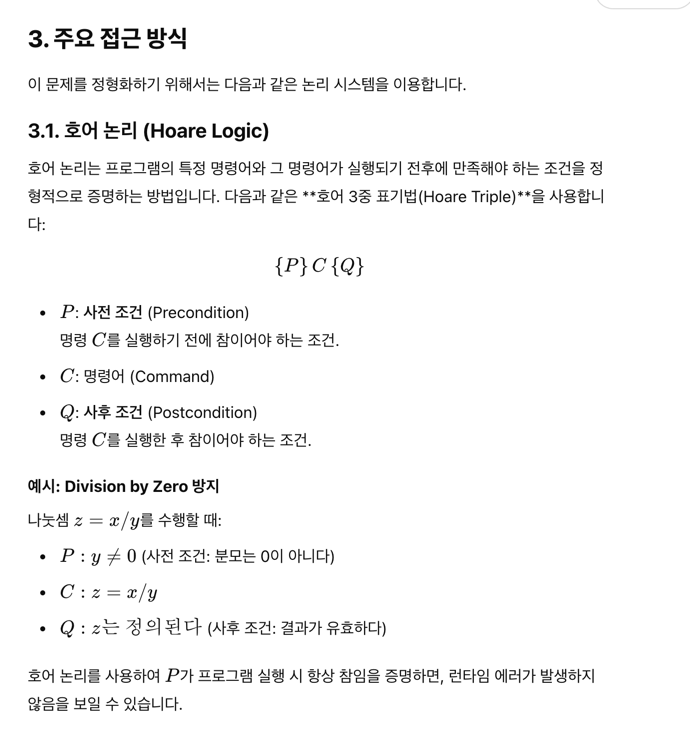
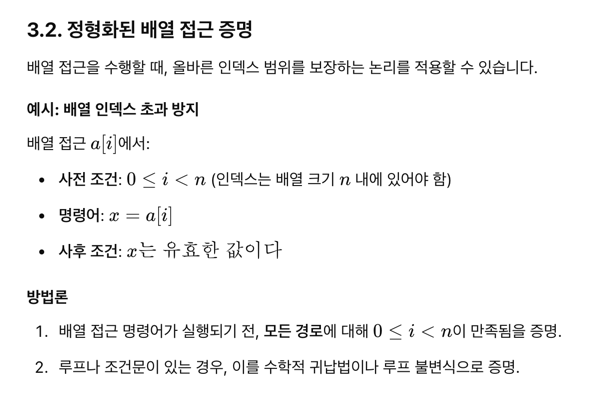
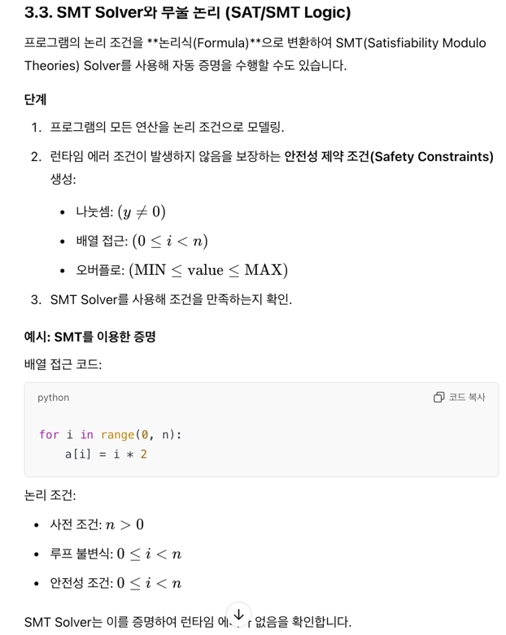

# 1. 런타임 에러는 검증 안됐다. 프로그램에 런타임 에러 없음을 증명하는 방법

- 런타임 에러는 0으로 나누거나, 오버플로, 배열 인덱스가 범위를 벗어난 경우

이산수학에 대한 배경 지식이 있다면, 논리 시스템을 이용해서 이 증명을 어떻게 정형화 할 수 있겠는가?

## 답변 1. 

- 시작할때 선언한 배열의 포인터 뒷부분에 canary 용도로 1byte 를 넣어두어서 그 byte가 변조되었다면 인덱스가 범위를 벗어났을 것.
- 위와같은걸 생각했는데, 프로그램 내에서 이런 에러가 없음을 논리적으로 증명해야 한다고 한다. 

- 즉, 매번 assertion이 일어나게 해서, X/Y 면 Y!=0을 assert 시키기? 
- 배열 사용시마다, 특정 action이 일어나게 AOP(Aspect oriented programming)를 만들수 있지 않을까?
- 나눗셈 사용시마다도 

# 4. 이진 탐색 프로그램에 비교하는 횟수를 세는 변수를 추가하고, 프로그램 검증 기법을 사용해서 실행시간이 실제로 로그에 비례함을 증명하라

## 4. 답안
binary_search.py 참고 

# 7. 

- 직선을 그리는 프로그램에서 다음과 같은 문제를 만났다.
- n개의 실수쌍 (ai, bi)로 이루어진 배열은 n개의 직선 yi= aix + bi를 정의한다. 
- x는 구간 [0,1] 에서 yi<yi+1 이도록 정렬되어있다. 

즉, ex.) [1,2,3] [4,5,6] 이라면  

y=x+4 , y=2x+5 , y=3x+6

직선들은 구간 0,1에서 만나지 않는다. 어떤점 x,y가 주어졌을때 그 점을 둘러싸는 두 직선을 구해야 했다. 어떻게 풀었을까?

## 7.답안
어떤게 있을까. 일단 x,y값이 주어져있으니까, 

lower_boundary_condition: 각 선에 x값을 넣었을 때 y값이 현재 y값보다 작아야한다.

upper_boundary_condition: 각 선에 x값을 너었을 때 y값이 현재 y값보다 커야한다. 

결국 이진탐색과 동일한 문제인것. 다만, x값을 넣어봐야지 알 수 있다. 

예를들면, 

y=x+4 , y=2x+5 , y=3x+6

x = 0.5 , y=5 라면

y=4.5, y= 6, y= 7.5

4.5와 6 사이에 들어갈 것이다. 

[4.5, 6, 7.5]

1. x를 대입한 값들로 배열을 만들어서 이진탐색을 수행하면서,

2. 가장 최근의 lower boundary와 upper boundary를 기억한다. 

3. lower boundary와 upper boundary를 조작했을 때 내 값이 사이를 벗어난다면 해당 선분들이 정답이 된다. 

# 8. 이진탐색을 더 빠르게 할 수 있나? 

## 8 답안

- 정렬된 테이블의 standard deviation을 이용해서 Z변환을 쓰면 대충 어디쯤인지 나오지 않을까? 

# 10. 이진 탐색 함수에 고의적으로 버그를 포함시키고, 검증 기법을 사용해서 그 버그가 발견되는지를 살펴보라. 

## 10. 답안

- 어떤 버그..
