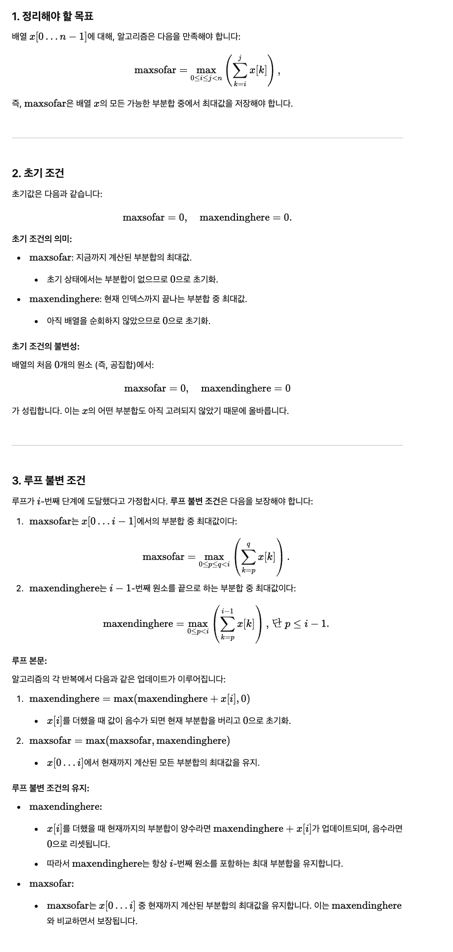
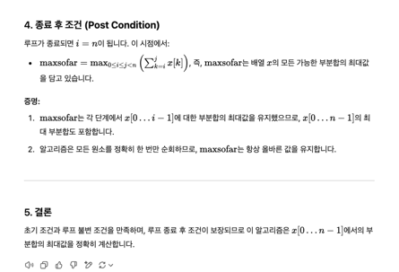
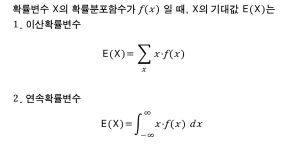
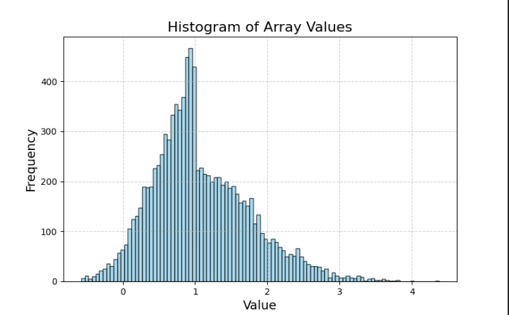

# 노하우

- 재계산을 피하기 위한 상태 저장
- 정보를 사전처리해서 데이터 저장해두기
- 나누어 푸는 알고리즘
- 스캐닝 알고리즘
- 누적
- 하한
  - lower boundary를 보이기


# 연습 문제


# 문제 1

알고리즘 3과 4는 틀리기 쉬운 미묘한 코드를 사용한다. [칼럼 4]의 프로그램 검증 기법을 사용해서 코드의 정확성을 증명하라.

특히 루프 불변식(invariant)를 신중하게 정하기 바란다. 


루프 불변식 - 이진탐색 루프를 돌 때마다 mustbe(l,u) 라고 해서, target이 a[l] a[u] 사이에 있음을 사용했었다.

루프의 처음부터 끝까지 사실인것을 의미한다.


```

float maxsum3(l, u)
    if (l > u) 
        return 0
    if (l == u)
        return max(0, x[l])
    m = (l + u) / 2 
    
    lmax = sum = 0
    for (i = m; i >=l ; i-- )
        sum += x[i]
        lmax = max(lmax, sum) 
    rmax = sum = 0
    for i = (m, u]
        sum += x[i]
        rmax = max(rmax, sum)
    return max(lmax+rmax, maxsum3(l, m) , maxsum3(m+1, u))

```


<details>

```

float maxsum3(l, u)
    if (l > u) 
        return 0
    if (l == u)
        return max(0, x[l])
    m = (l + u) / 2 
    
      
        
    lmax = sum = 0
    for (i = m; i >=l ; i-- )
        sum += x[i]
        lmax = max(lmax, sum)    
    LOOP_INVARIANT: maximum( [l,m] ) <= lmax 
     
    rmax = sum = 0
    for i = (m, u]
        sum += x[i]
        rmax = max(rmax, sum)
    LOOP_INVARIANT: maximum( [m,u] ) <= rmax
        
    LOOP_INVARIANT: maximum( [l,u] ) <= lmax+rmax
    
    return max(lmax+rmax, maxsum3(l, m) , maxsum3(m+1, u))

```

항상 l~u까지의 최대값보다 lmax+rmax값이 커야하는 loop invariant를 충족한다면, 범위 실수로 어떤 항목이 연산이 안되었다거나를 잡을 수도 있지 않을까?

확실한 invariant를 세팅하려면, l~u까지 maxsum1(l,u) (원시적인 방법) 을 사용했을 때 maxsum1(l,u) == maxsum3(l,u) 하면 되겠지만 그게 loop invariant는 아니겠지? 

(물론 범위 실수가 마침 최대값을 연산 안하는 경우이겠지만)

</details>


# 문제 1.2 


알고리즘 4

```
maxsofar = 0
maxendinghere = 0
for i = [0, n)
    invariant : maxendinghere and maxsofar are accurate for x[0..i-1] 
    maxendinghere = max(maxendinghere + x[i], 0)
    maxsofar = max(maxsofar, maxendinghere)
    
    # 실수하기 쉬운 부분이 무엇일까? 예전 항목보다 더 큰 항목만 나온다면 상관없다.  
    LOOP_INVARIANT: prev_maxsofar <= maxsofar 
    
   
```

해답: https://www.cs.cornell.edu/gries/TechReports/82-531.pdf


이론설명

```
최초에 true인 condition은 P 

loop 끝났을때 true여야 하는 condition이 R 

R의 조건을 약화시켜서, 첫 invariant를 만들어보라고 한다.
``` 

post condition은  max(arr[i],arr[j]) >= arr[i] >= arr[j] >= total_sum(i,j)

constant 시간내에 계산이 될만 한걸 loop invarant로 써야하고, 

total_sum(i,k-1) 까지의 최대값과, 그 i, k값을 안다고 치면, total_sum(i, k) 까지의 값도 constant 시간에 계산될 수 있다. 
 
ex. [1,4]까지의 최대값이 10인것을 알고있고 지금이 5번째라면 [1,5]까지의 최대값은 max(10 + arr[5], 0) 다. 이걸 전체 최대랑 비교해서 실제 부분합의 최대 이끌어낼 수 있다. 






# 문제 2. 앞 네가지 알고리즘에 대한 실행시간 측정


# 문제 3. 앞에서는 O 표기법만 사용. 각 알고리즘이 사용하는 max 함수의 횟수는? 각 알고리즘은 메모리를 얼마나 필요로 하는지?

# 문제 4. 

입력된 배열의 각 요소가 [-1, 1] 에서 균일하게 선택된 랜덤한 실수일 경우, 부분벡터의 최대합에 대한 기대값은 얼마일까? 

<details>

기댓값을 구하는 방법부터 찾아봄

기댓값은 각 사건이 벌어졌을 때의 이득과 그 사건이 벌어질 확률을 곱한 것을 전체 사건에 대해 합한 값



너무 어렵다 

단순하게 생각하면, f(x)는 실수 하나를 뽑는 일정한 확률이고, x는 해당 실수값이다. 

n이 5라면 실수하나를 균일하게 뽑을 확률 1/5라고 해보자. 아래가 a,b,c,d,e 로 이뤄진 배열을 만들게 되는 기대값이다. 

`a*1/5 + b*1/5 + c*1/5 + d*1/5 + e*1/5`

최대합에 대한 기대값은 각 요소가 1/2 확률로 최대합에 포함되느냐 안되느냐이지 않을까?  

`a*1/10 + b*1/10 + c*1/10 + d*1/10 + e*1/10`
 
단순하게 생각해봤을 때, [-1 ,0, 1] 같은 배열이 나올 수 있고, 기대값은 1에 수렴할 것 같긴 하다. [-1, 1, 0] 어찌됐던 음수는 무시할테고 [0,1] 사이의 값만 취하게 될테니까>? 이유를 모르겠네 근데. 

hint: random walk의 누적값을 그래프로 그려보라.

기대값은 평균이다. 1에 가깝다. 

1.0727177778110957





</details>
