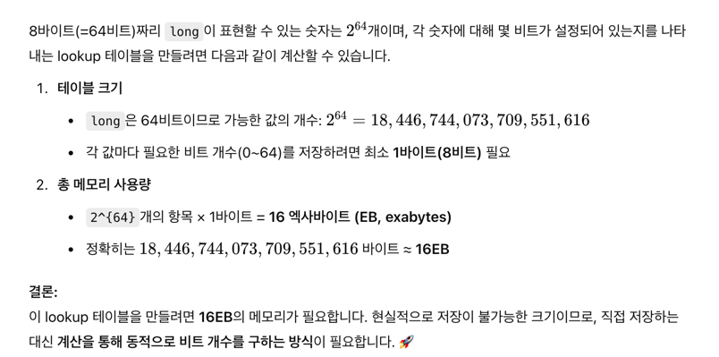

# 코드 튜닝

- 코드 튜닝 규칙들
    - Exploit Common Cases : 가장 많이 사용되는 타입의 레코드를 캐싱한다.
    - Exploit an Algebraic Identity : 비용이 많이 드는 나머지 연산을 값싼 비교연산으로 대체
    - Collapsing a Procedure Hierarchy: 함수를 매크로로 대체해 2배의 속도개선
    - Loop unrolling
    - Data structure Augmentation: 위도, 경도를 카테시안 좌표로 저장
    - Combining Tests: 루프 비교횟수를 줄인다. increment만 있게해서 (매번 종료조건 검사를 target 값을 찾는것과 동일하게)

# 1. 자신이 직접 작성한 프로그램을 프로파일링해보고, 이 칼럼에서 설명한 접근방법을 이용해서 핫스팟에서의 실행시간을 단축시켜보라

```
         88353 function calls (88134 primitive calls) in 0.067 seconds

   Ordered by: internal time
   List reduced from 92 to 10 due to restriction <10>

   ncalls  tottime  percall  cumtime  percall filename:lineno(function)
     9630    0.019    0.000    0.019    0.000 {method 'translate' of 'str' objects}
     2234    0.007    0.000    0.042    0.000 short_id2uri.py:55(is_object_type)
     9630    0.004    0.000    0.024    0.000 /envs/entity_ranking/lib/python3.9/re.py:270(escape)
      694    0.003    0.000    0.021    0.000 short_id2uri.py:99(escape_object_type)
      183    0.003    0.000    0.003    0.000 {method 'write' of '_io.TextIOWrapper' objects}
     2234    0.003    0.000    0.026    0.000 short_id2uri.py:66(<listcomp>)
      695    0.002    0.000    0.005    0.000 short_id2uri.py:167(convert_object_type)
     3695    0.002    0.000    0.006    0.000 /envs/entity_ranking/lib/python3.9/re.py:289(_compile)
    10901    0.002    0.000    0.002    0.000 {method 'startswith' of 'str' objects}
     4651    0.002    0.000    0.002    0.000 {method 'join' of 'str' objects}

```

<details>

translate는 f'{} 같은걸 많이 사용하기 때문이고, is_object_type이라는 함수를 최적화해야한다.

AS_IS

```
if re.search("<.+?wikipedia:", token):
    # wikipedia
    re_obj = re.search("<(.+?)wikipedia:", token)
    wikipedia_lang = re_obj.group(1)


```

re.search가 두번 호출되고 있다. conditional 을 줄이기.

TO_BE

```

if (re_obj := re.search(r"<(.+?)wikipedia:", val)):
    wikipedia_lang= re_obj.group(1)

```

AS_IS

```
3695    0.002    0.000    0.006    0.000 /envs/entity_ranking/lib/python3.9/re.py:289(_compile)

TO_BE
3569    0.002    0.000    0.007    0.000 envs/entity_ranking/lib/python3.9/re.py:289(_compile)
```

실제로 줄어들었다!

```
ncalls  tottime  percall  cumtime  percall filename:lineno(function)
9630    0.021    0.000    0.021    0.000 {method 'translate' of 'str' objects}
2234    0.007    0.000    0.046    0.000 short_id2uri.py:55(is_object_type)
9630    0.005    0.000    0.027    0.000 envs/entity_ranking/lib/python3.9/re.py:270(escape)
183    0.004    0.000    0.004    0.000 {method 'write' of '_io.TextIOWrapper' objects}
694    0.003    0.000    0.023    0.000 /short_id2uri.py:99(escape_object_type)
2234    0.003    0.000    0.029    0.000 short_id2uri.py:66(<listcomp>)
695    0.002    0.000    0.005    0.000 short_id2uri.py:167(convert_object_type)
3569    0.002    0.000    0.007    0.000 envs/entity_ranking/lib/python3.9/re.py:289(_compile)
10901    0.002    0.000    0.002    0.000 {method 'startswith' of 'str' objects}
4651    0.002    0.000    0.002    0.000 {method 'join' of 'str' objects}
```

</details>

4. 양의 정수 n의 최대값은 배열의 크기라고 할 때, 다음 재귀적 C 함수는 배열 x[1..n-1]의 최대값을 리턴한다.

```c
float arrmax(int n)
{
  if (n==1)
     return x[0];
  else
     return max(x[n-1], arrmax(n-1));
}

```

max를 함수로 구현했을 때 n=10,000인 벡터에서 최대값을 구하는데는 2~3ms가 걸린다. max가 다음과 같은 C 매크로라면

`# define max(a,b) ( (a) > (b) ? (a) : (b))`

이 알고리즘은 최대값을 찾는데 n=27일 때 6초가 걸리고, n=28일 때에는 12초가 걸린다. 이런 엄청난 동작이 나타나도록 입력을 주고, 실행시간을 수학적으로 분석해보라


<details>

우선, max함수를 매크로로 사용하는 이유는

일반 함수로 max를 만들면, 호출할 때마다 스택에 인자(push) -> 함수 호출 -> 리턴값 반환 과정이 필요해서 성능이 저하

반면, 매크로 함수는 단순히 코드 치환이기 때문에 함수 호출 오버헤드가 없다

그런데 이게 재귀함수가 된다면,

`return ((x[n-1]) > (arrmax(n-1)) ? (x[n-1]) : (arrmax(n-1)));`

이렇게 치환되면서, arrmax(n-1)이 앞에서도 함수값이 계산되야 하고, 뒤에서도 함수값이 계산되야 하기 때문이다.

그래서 2^n번의 operation이 진행되게 된다고 한다 (해답)

처음에는 2군데만 생기고, 그다음엔 4군데에서 계산되야하고 ...

</details>

# 7. 

매우 긴 연속된 바이트 (10억개, 1조개)가 주어졌을 때 어떻게 1로 설정된 비트의 총 개수를 효율적으로 셀 수 있겠는가? 

(전체 바이트에서 얼마나 많은 비트가 1로 되어있는가?)

<details>

`char arr[1000000000000];` 가 있다고 쳐보자. 

환경에 제약이 없다면, mapper와 reducer로 나눠서, hadoop map reduce로 word count를 수행할 것.

mapper: 현재 주어진 원소의 1개수를 리턴

reducer: 합산

반복횟수를 줄여야 하니까, long 배열(8바이트)로 변환하면 1/8만큼 반복횟수가 줄어들 것. 각 숫자별로 1이 몇개인지 룩업 테이블을 static하게 heap 메모리에 생성해두면 빠를듯.

-----------------

정답

1. 각 입력 단위 (8비트 문자 또는 32비트 정수)에서 1인 비트의 개수를 세고, 그를 합해보는 것이다. 

16비트에서 1인 비트의 개수는 각 비트를 순서대로 보거나, 1인 비트에 대해서 반복하거나 (b &= (b-1) ),

또는 2^16 개로 이뤄진 테이블을 검색해서 찾을 수 있다. 캐시의 크기가 여러분의 단위 선택에 어떤 영향을 끼치겠는가?? 

- 생각해보니 8바이트짜리 long 사용하면 캐시미스가 잦을듯하다. 




</details>


# 10. 

D.B.Lomet는 1000개의 정수를 탐색하는 문제에서 해싱이 튜닝된 이진 탐색보다 빠를 것이라고 했다. 

빠른 해싱 프로그램을 구현하고, 이를 튜닝된 이진 탐색 프로그램과 속도, 메모리 사용량 측면에서 비교해보라.


<details>

파이썬의 해싱함수는 linear probing을 통해서 해시값 겹치면 순차적으로 빈공간 찾는 방식을 선택한다.

D.B.Lomet 씨는 논문에서는 해싱(Hashing)이 튜닝된 이진 탐색보다 빠를 수 있다고 주장했는데, 이를 검증하려면 고속 해싱 기법을 사용해야 합니다.

고속 해싱이란 무조건 전체 데이터셋보다 큰 크기로 배열을 잡아두고, 무조건 O(1)에 접근할 수 있도록 하는것.


```
🔹 Number of Searches: 100
🟢 Binary Search Time: 1.75 μs per search
🔵 Hashed Search Time: 0.97 μs per search
⚡ Speedup (Hash vs Binary): 1.81x

🔹 Number of Searches: 500
🟢 Binary Search Time: 1.63 μs per search
🔵 Hashed Search Time: 0.29 μs per search
⚡ Speedup (Hash vs Binary): 5.59x

🔹 Number of Searches: 1000
🟢 Binary Search Time: 1.45 μs per search
🔵 Hashed Search Time: 0.17 μs per search
⚡ Speedup (Hash vs Binary): 8.61x
```

hash dict 만드는 비용이 있어서 search 개수가 많아질수록 search당 비용이 싸지는 현상이 발생함.  


| 구분 | 속도 | 메모리 사용량 |
| -- | -- | -- | 
| 튜닝된 이진탐색 | c*O(10) | O(1) |
| 해싱 | O(N) + c*O(1) | O(N) | 

여기서 c는 탐색횟수. 

튜닝된 이진탐색은 최악의 경우 10번 탐색하는데, 따라서 탐색횟수가 많아질수록 해싱이 효율적

</details>

