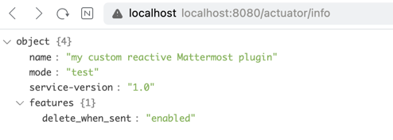

# 10장 릴리즈

실제 어플리케이션 운영시에는 
- 로그
- 메트릭 (성능 지표 등)
- 추적 (error 추적?)
- 특정 기능 on/off

## Devops 친화적인 앱의 중요성

운영 환경 시스템을 지원/유지 보수가 어렵지 않을 떄에 시스템이 데브옵스 친화적이다. == 모니터링 인프라  
- 시스템 상태 점검 가능
- 운영 지표 제공 및 성능 측정가능


IaaS, PaaS, k8s, apache mesos 같은 컨테이너 관리 시스템들이 여러 구성작업 간단히 함.

다만, 서비스 품질이 외부 요인에 의존성 가진다. 

운영 효율화할때 중요한 점

1. 서비스 식별
- 인스턴스 개수가 늘거나 줄어들 수 있다.
- 실행 시점의 컨테이너나 JAR파일은 서비스 이름 ,종류, 버전, 빌드 시간 및 커밋 리비전을 식별할 수 있어야 함.

2. 서비스 상태 확인
- 큐 크기, 오류율, 사용 가능한 디스크, ram 크기 등 단순 True,False 아님. - 서비스 가용성

3. 운영 메트릭 모니터링
- 평균 응답 시간, 오류율, 고부하 상황에서 요청 처리에 걸리는 시간
- 시스템 적절히 확장할 수 있다
- 병목 코드, 비효율적인 알고리즘 및 확장성 제한 요인 찾기 가능

4. 로그 수준 변경
- 로그는 하나의 위치에 저장하거나, 하나의 시스템으로 분석가능해야 한다 - ELK스택을 많이 쓴다. 
- DEBUG 나 TRACE 레벨 로그는 항상 남기면 별로다. - 동적으로 debug 로 변경했다가 안했다가 해야 함.

5. 사용자 요청 흐름 추적
- 프로세스를 추적하는 작업 - 요청을 실시간으로 시각화 하는 작업 등 (어떤 요청들을 지나갔는지)


스프링에서는 스프링 부트 액추에이터 적용

## 리액티브 스프링 어플리케이션 모니터링

스프링 부트 서브 프로젝트
- 서비스 정보
- 상태 확인
- 메트릭 수집
- 트래픽 추적
- 데이터베이스 상태 확인등을 포함.


info라는 endpoint하려면

```yaml
info:
  name: "my custom reactive Mattermost plugin"
  mode: "test"
  service-version: "1.0"
  features:
    delete_when_sent: "enabled"

management:
  info:
    env:
      enabled: true
  endpoints:
    web:
      exposure:
        include: health,info,beans,conditions
        exclude: threaddump, heapdump
```

이렇게 넣어주면되더라
```json
{
  "name": "my custom reactive Mattermost plugin",
  "mode": "test",
  "service-version": "1.0",
  "features": {
    "delete_when_sent": "enabled"
  }
}

```
책이랑 다른점은 info.env.enabled: true를 쓰도록 바뀜  안그러면 빈칸 {} 만 나온다.

카나리 배포 ( 특정 서버에만 새 버전 있는 배포) 할 때 info 엔드포인트를 사용할 수 있다.

### /health엔드포인트
네트워크를 통해 서비스에 엑세스 해야 한다. 단 연관되어 있는 D같은 서비스의 상태도 알 수 있어야 한다. 

`ReactiveHealthIndicator` 를 통하면 다른 세부정보를 추가할 수도 있다.
http://localhost:8080/actuator/metrics/application.ready.time
```json
{
  "name": "application.ready.time",
  "description": "Time taken (ms) for the application to be ready to service requests",
  "baseUnit": "seconds",
  "measurements": [
    {
      "statistic": "VALUE",
      "value": 1.407
    }
  ],
  "availableTags": [
    {
      "tag": "main.application.class",
      "values": [
        "com.mattermost_plugin.message_scheduler.MessageSchedulerApplication"
      ]
    }
  ]
}

```
```json


{
"names": [
"application.ready.time",
"application.started.time",
"disk.free",
"disk.total",
]
}
```
이런식으로 나오면, url바꿔서 요청한다.


### /loggers 엔드포인트
```json
{
  "levels": [
    "OFF",
    "FATAL",
    "ERROR",
    "WARN",
    "INFO",
    "DEBUG",
    "TRACE"
  ],
  "loggers": {
    "ROOT": {
      "effectiveLevel": "INFO"
    },
    "_org": {
      "effectiveLevel": "INFO"
    },
    "_org.springframework": {
      "effectiveLevel": "INFO"
    },
    "_org.springframework.web": {
      "effectiveLevel": "INFO"
```

이런정보가 있다.
아마 curl로 로그권한 바꿀수있겠지.

### 커스텀 엔드포인트 만들기

### 엔드포인트 보안

heap, thread dump 등은 엑세스 할 수 없어야 한다. 그러니 security 권한 설정을 하는게 좋다.

actuator url에 대해 securityWebFilterChain 같은걸 넣어서, role based 인증가능하다. 


### micrometer 

메트릭 수집할 수 있게 도와주는 도구. 
액추에이터에 의해 스프링부트에서 지원해주는 메트릭들을 수집하는데, webflux의 경우 threadlocal을 못써서, 특수한 webFilter를 추가한다.

요청 처리가 완료된 순간에 동작하는 ServerWebExchange에 콜백을 추가해서 요청 처리 시간을 집계할 수 있게 한다. 

Mono와 Flux에 대해서도 metric나오게하려면 `.name("temperature.stream").metrics()` 와 같이 하면

해당 flux나 mono에 대해서 subscribed, requested 카운터와, flow.duration, onNext.delay 와 같이 응답시간 등록을 해준다.


원래 RestTemplate에도 이런 메트릭을 제공했다. WebClient에서도 하려면 spring cloud sleuth 

외부로 요청하는 HTTP에 대해서 추적헤더가 추가되고, 나중에 해당 요청의 결과물이 다른 스레드에서 처리되더라도, context의 이점을 살린 이 방식 덕분에
추적이 가능하다.


### Faas를 위한 Knative
k8s에 서버리스 워크로드 배치하고 실행하기 위한거.

knative는 서비스 간 통신 라우팅위해 Istio 사용하는데, 동적 라우팅 , 카나리 배포, A/B 테스트 같은거 할 수 있는 컨테이너 관리툴이다.

lambda같은걸 프라이빗 k8s에서 사용할 수 있게 하는 것이다. 