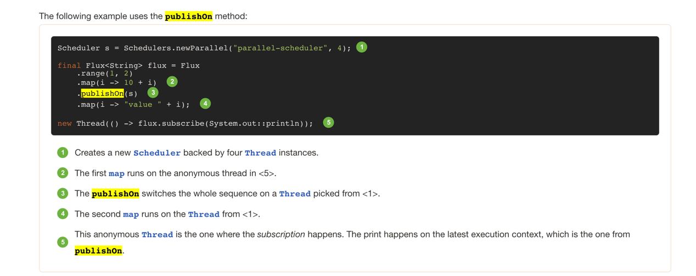
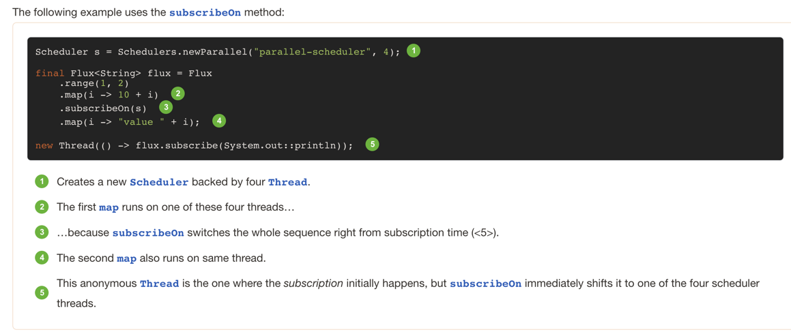
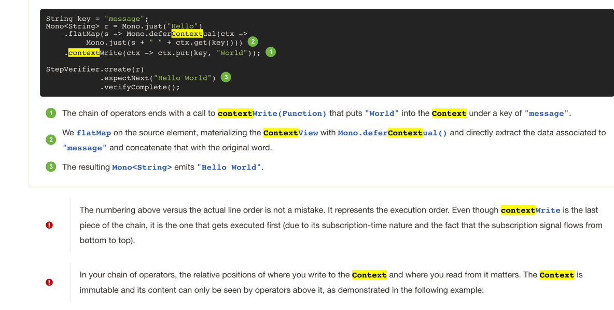
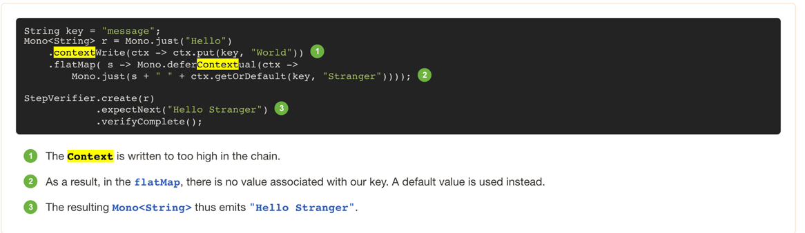
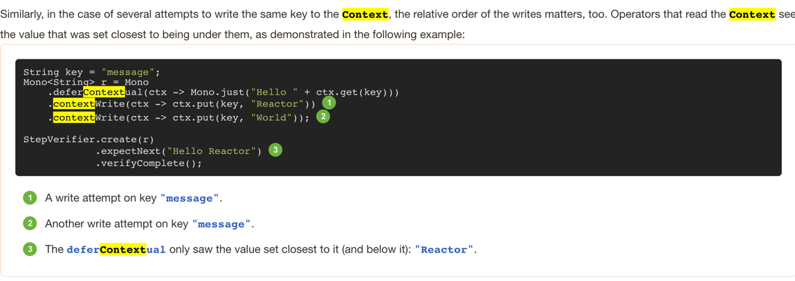

# 리액터 프로젝트 
 
- 리액터 패턴
  - 모든 이벤트는 큐에 추가 되고, 이벤트는 별도의 스레드에 의해 처리됨. 
- 함수형 프로그래밍 
- 리액티브 프로그래밍

 reactor 1.x 버전에서는 , 직접 dispatcher를 지정해서 `reactor` 인스턴스를 생성한다.
 내부적으로 이벤트가 생성될때, 세팅한 디스패처에 의해서 처리가 된 후 목적지로 보내진다. 
 Dispatcher의 선택에 따라 동기 또는 비동기 처리가 된다.
 
리액터 1.x로도 네티와 결합해서 비동기 및 논블로킹 메시지 처리가 가능했다.
다만 `subscription. request` 등을 통한 배압 조절 기능이 없었다. 
아예 producer 스레드 차단 or 이벤트 받아서 생략 외에는 배압 제어 기능 x 
오류 처리 복잡


# 리액터 프로젝트 2.x

```java
stream
        .retry()
        .onOverflowBuffer()
        .onOverflowDrop()
        .dispatchOn(new RingBufferDispatcher("test")) 
```

1. 오류 발생시 retry() == 지금까지 위에있던 작업들 다시 실행하도록 한다.
2. onOverflowBuffer(), onOverflowDrop() 로 배압 관리 가능하다
3. dispatchOn 연산자로 새로운 Dispatcher를 이용해 해당 리액티브 스트림에서 작업할 수 있다 -> 메시지를 비동기적으로 처리할 수 있다.

`reactive-stream-commons` 라이브러리가 생겼다. 
RxJava 2.0과 reactor 3.x 버전이 비슷하다.

# 리액터 프로젝트 필수 요소

1. 콜백 지옥과 깊게 중첩된 코드를 생략하자
2. 가독성을 높이고, 리액터 라이브러리에 의해 정의된 워크플로우에 조합성을 추가하자
   - 연산자를 연결해서 사용하는 것을 권장한다.
   - 실제 구독이 일어날때만 데이터 플로가 기동된다.
3. 내부데이터, 외부 데이터와 관계없이 오류가 발생할 가능성이 있는 비동기 요청의 결과를 효율적으로 처리. (복원력 있는 코드 작성)
4. 배압 지원
   - 푸시 전용 (subscription.request(Long.MAX_VALUE))
   - 풀 전용 (subscription.request(1))
   - 풀-푸시(혼합형): 구독자가 수요를 실시간 제어할 수 있고, 게시자가 데이터 소비 속도에 적응할 수 있는 경우

 리액터 프로젝트는 실행 스레드를 다양하게 관리할 수 있는 스케줄러 세트를 제공하고, 개발자가 로우 레벨 제어 기능을 갖춘 자체 스케줄러도 만들 수 있다

# 리액티브 타입 - Flux와 Mono 

리액티브 스트림 스펙에는 네가지가 정의되어 있다. 
- Publisher
- Subscriber
- Subscription
- Processor

리액터 프로젝트는 Publisher<T> 의 구현체로 Flux<T> Mono<T> 가 존재한다.

Flux는 아래와 같이 끝 신호, 0,1 또는 여러 요소 생성가능하고 무한한 요소도 만들 수 있다. 
```java
onNext x 0..N [onError | onComplete]
```
```java
Flux.range(1,5).repeat()
```
이러면 12345 가 무한으로. 
전체 스트림 생성을 완료하지 않고도 각 요소 변형, 소비할 수 있으니 OOM 안나는데, 무한인 flux를 `.collectList().block()` 하면 OOM 날 수도 있다.
block은 구독을 시작시키고, 최종 결과가 도착할때까지 실행중인 스레드를 차단하기 때문에, collectList()에서 값이 나올때까지 기다린다.


# Mono

```java
onNext x 0..1 [onError | onComplete]
```
끝, 0 또는 1 개의 원소를 반환하다. 

Mono<T>는 응용 프로그램 API가 최대 하나의 원소를 반환 . CompletableFuture처럼, Mono.get() 느낌으로 사용하게 된다. 다만 reactive stream형식으로 받을 수 있다.

또 Mono는 클라이언트에게 작업 완료 신호를 알리는데 사용할 수 있다. `Mono<Void> `를 하면, onComplete() 신호나 onError() 신호가
왔을 때, 이후 연산을 실행시킬 수 있다.

`Mono.from(Flux)` 로 간단히 상호 변환가능

# RxJava 2 의 리액티브 타입
RxJava2의 publisher는 형태가 다르다.
처음에는 Observable 하나만 존재했는데 2버전에 오면서 Single, Completable 타입이 추가되어서
- Obserbvable
  - 배압 지원 x, Publisher 인터페이스 구현x - `Flowable`로 변환해서 배압전략을 사용
- Flowable
  - Flux 타입과 동일. 리액티브 스트림의 `Publisher` 구현. Flux에서 publisher 유형의 인수 사용할 수 없으니 필요하면 Flowable을 사용해라.
- Single
  - 하나의 요소를 생성하는 스트림을 나타낸다.
  - Mono처럼 구독이 발생했을 때만 처리 시작
- Maybe (Maybe<T> == Mono<T>)
  - Mono타입과 동일한 의도를구현 but Publisher 인터페이스 구현 안해서 리액티브 스트림과 호환성 x
- Completable
  - RxJava 2.x엔 onNext 신호는 생성못하고 onError 또는 onComplete만 발생시키는 Completable.
  - Mono<Void> 와 같이 신호 제공용이다. 


# Flux와 Mono 시퀀스 만들기
Flux 및 Mono는 데이터를 기반으로 리액티브 스트림을 생성하는 많은 팩토리 메서드를 제공한다.
```java
        Flux<String> stream1 = Flux.just("Hello","world");
        Flux<Integer> stream2 = Flux.fromArray(new Integer[]{1,2,3});
        Flux<Integer> stream3 = Flux.fromIterable(Arrays.asList(9,8,7));

        stream1.subscribe(System.out::println);
        stream2.subscribe(System.out::println);
        stream3.subscribe(System.out::println);
```
ragne는 `Flux.range(2010,5);`

Mono는 주로 하나의 요소를 대상으로 한다. nullable이나 Optional 타입과 함께 사용한다.

Mono는 HTTP 요청이나 DB 쿼리와 같은 비동기 작업을 래핑하는데 매우 유용하다. 이를 위해 Mono는 
`fromCallable(Callable), fromRunnable(Runnable), fromSupplier(Supplier)`  등의 메서드를 제공한다.
오래 걸리는 HTTP요청을 다음과같이 작성한다.
```java
Mono<String> stream8 = Mono.fromCallabe(this::httpRequest);
```
일단 Mono자체는 바로 반환되기 때문에 비동기식으로 처리할 수 있다는점. onError 를 구현하면 전파되는 오류도 처리 가능.

```java
Flux.empty();
Flux.never();
Mono.error(new RuntimeException("Unknown id"));
```
이처럼, 
- 빈 인스턴스를 생성하거나
- 완료 메시지, 데이터, 오류에 대해서 신호를 안보내거나
- 항상 오류를 전파하는 시퀀스를 만들 수 있다.


`defer` 은 특이한 메서드인데, 구독하는 순간에 행동을 결정할 시퀀스를 만든다.

```java
Mono<User> requestUserData(string sessionId){
    return Mono.defer( () ->
        isValidSession(sessionId) ? Mono.fromCallable(() -> requestUser(sessionId))
        : Mono.error(new RuntimeException("Invalid user session")) );
        }
```
```java
Mono<User> requestUserData(string sessionId){
    return isValidSession(sessionId) ? Mono.fromCallable(() -> requestUser(sessionId))
        : Mono.error(new RuntimeException("Invalid user session"));
        }
```

위 아래는 Mono.defer()를 썼느냐 안썼느냐이다. 
위에는 .subscribe() 구독이 발생할 때까지 유효성 검사를 진행하지 않는데,
아래는 `requestUserData` 불리자마자 isValidSession, 인지 검사한다. 

"구독하는 시점" 에 따라 user의 validity가 변경될 수 있는 환경이라면, 위와 같이 defer을 해야한다. 

ex.) 로그인할때 Mono.defer() 로 userData를 받아올 수 있는 Mono를 받아놓는다. (클라이언트나 html 페이지에서?) 
추후, 유저가 `내 상품정보 조회` 버튼을 눌렀을때, 그 유저의 세션이 (로그인 정보가) 살아있는지 체크해서 정보를 제공해야 한다면 defer().

rxjavascript
```javascript
async componentDidMount() {
    this.setState({isLoading: true});

    const request = interval(1000).pipe( 
      startWith(0), 
      switchMap(() => 
        fetch('http://localhost:3000/profiles')
          .then((response) => response.json())
      ));

    request.subscribe((data: any) => { 
      this.setState({profiles: data, isLoading: false});
    })
  }
```
아래는 websocket
```javascript
class ProfileList extends Component<ProfileListProps, ProfileListState> {

  // constructor()

  async componentDidMount() {
    this.setState({isLoading: true});

    const response = await fetch('http://localhost:3000/profiles');
    const data = await response.json();
    this.setState({profiles: data, isLoading: false});

    const socket = new WebSocket('ws://localhost:3000/ws/profiles'); 
    socket.addEventListener('message', async (event: any) => { 
      const profile = JSON.parse(event.data);
      this.state.profiles.push(profile);
      this.setState({profiles: this.state.profiles}); 
    });
  }

  // render()
}

export default ProfileList;
```


# 리액티브 스트림 구독하기

Flux나 Mono는 구독 루틴을 훨씬 단순화하는 subscribe() 메서드를 람다 기반으로 재정의한다.

subscribe의 모든 메서드는 Disposable 인터페이스의 인스턴스를 반환하는데, 이 disposable 인스턴스는 스트림 취소가 가능하다

```java
Disposable disposable = Flux.interval(Duration.ofMillis(50))
        .subscribe(
                data -> log.info("onNext:{}", data )
        );
Thread.sleep(200);
disposable.dispose();
```
구독을 호출해서 disposable 인스턴스를 반환받고, dispose()로 구독을 취소한다. 

subscribe의 프로토타입은
```java
subscribe(Consumer<T>, Consumer<Throwable> , Runnable, Consumer<subscription>);
subscribe(Subscriber<T>);
```
즉, onNext, onError, onComplete, subscription 사용자. 이거나, 이들 모두를 가지는 Subscriber<T> 클래스를 넣는 방식이다.

근데 subscription을 직접 인자로 받아서 사용할떄
```java
Subscriber<String> subscriber = new Subscriber<String>(){
    
    volatile Subscription subscription;
    public void onSubscribe(Subscription s){
            subscription=s;
            subscription.request(1);    
            }
}
```
이런식으로 사용해야 하는데, 변수가 독특하다.
### volatile 
구독 및 데이터 처리가 다른 스레드에서 발생할 수 있으니 모든 스레드가 Subscription 인스턴스에 대한 올바른 참조를 가질 수 있도록 volatile을 사용한다.

volatile 키워드는 쓰레드들에 대한 변수의 변경의 가시성을 보장한다 고 한다.
멀티쓰레드 어플리케이션에서의 non-volatile 변수에 대한 작업은 성능상의 이유로 CPU 캐시를 이용한다. 
둘 이상의 CPU가 탑제된 컴퓨터에서 어플리케이션을 실행한다면, 각 쓰레드는 변수를 각 CPU의 캐시로 복사하여 읽어들인다.

volatile 키워드를 선언한다면 이 변수에 대한 쓰기 작업은 즉각 메인 메모리로 이루어질 것이고, 읽기 작업 또한 메인 메모리로부터 다이렉트로 이루어질 것이다.

물론 volatile이 만병통치약은 아니다.
다수의 쓰레드가 같은 counter 값을 증가시키는 상황이 바로 volatile 변수가 불완전해지는 상황이다

이를테면 두개의 쓰레드가 기존counter+1 을 volatile 변수에 저장하려는 상황. 에는 lock을 이용해야 하지, volatile로 해결불가능.


다시 본론으로 돌아와서,

subscription을 직접 사용하는건 1차원적 코드 흐름이 꺠지고, 오류 발생이 쉽다.
대신, BaseSubscriber를 상속하는게 낫다. 그러면 hookOnSubscribe 와 같이 특정 함수들에 대한 오버라이딩을 하면 된다.

# 연산자를 이용해 리액티브 시퀀스 변환

## Map 

index() 메서드나 timestamp() 메서드 같은건 map의 일종이다.

```java
Flux.range(2018,5)
        .timestamp()
        .index()
        .subscribe(e-> log.info("Index: {}, ts: {}, value: {}"), e.getT1(), e.getT2().getT1() , e.getT2().getT2());
```

## 필터링하기

- filter
- ignoreElements (다 통과 안시킴)
- take(n) 처음 n개 제외
- takeLast 마지막
- takeUntil(predicate) 조건true때까지
- elementAt(n) n번째
- single - 소스가 하나만 있어야함 (0개 x , N개 x )
- skip, take 로 특정시간까지 원소 건너뛰기

```java
Mono<?> startCommand= ...
Mono<?> stopCommand=..
Flux<UserEvent> streamOfData = ...

streamOfData
        .skipUntilOther(startCommand)
        .takeUntilOther(stopCommand)
        .subscribe(system.out::println);
```
streamOfData 에서 startcommand 들어온때부터 stopCommand 들어온때까지 받기.


## 수집하기
collectList()
collectSortedList()
하면 Mono 타입 스트림이 나온다. Mono<List<T>> 이런느낌.

.subscribe로 받아서 쓰면된다.

collectMap 은 Map<K, T>
collectMultimap Map<K, Collection<T>> 
등.
Flux.distinct()는 모든 원소를 추적한다. 그러니 스트림 원소 많으면 distinct 중복체크 함수 셀프 최적화 권장
Flux.distinctUntilChanged() 는 무한 스트림에 중단 없는 행에 나타나는 중복 제거.
(111 22 33 2 11) -> 1 2 3 2 1

## 스트림 원소 줄이기
hasElement 연산자 : 찾는 원소 발견되면 즉시 true 반환

`stream3.hasElement(9).subscribe(System.out::println); // true`

Mono<> 가 반환된다.

any 연산자는 다양하게 검사가능하다 

`stream3.any(val -> val%2 ==0).subscribe(System.out::println); // true`
다만, true or false만 나온다. 스트림에 뭐가 있냐~ 이런거

reduce는 아는 대로의 행동이지만, scan은 reduce되는 중간값을 알 수 있다.
scan은 초기값출력이후 매 stream event마다 acc의 값을 출력해준다.

```java
Flux.range(1,5)
        .scan(0, (acc,elem) -> acc +elem)
        .subscribe(result -> log.info("Result:{}",result));
```

```java
stream3.any(val -> val <0).thenMany(Flux.just(4,5)).subscribe(System.out::println); //4, 5만 나온다.
```
thenMany, then, thenEmpty 이런게 있는데, 상위 스트림에서 들어오는 원소 무시하고 완료 또는 오류 신호를 내보내거나, 자기자신에게 배정된 새 스트림 기동.

concat
merge
zip
combineLatest ( zip이랑 같지만, 하나의 원소 없어도 먼저 들어온거부터 값 생성)


## 스트림 내 원소 일괄처리

Buffering : 스트림 타입이 FLux<List<T>>
windowing : 스트림 타입이 Flux<Flux<T>> (5분동안 쌓인 스트림을 처리하겠다 이런느낌)
Flux<GroupedFlux<K,T>> : 그룹이 된다.

`Flux.range(1,7).groupBy(e -> e %2 ==0 ? "Even" :  "odd");`
식으로 하면 이걸 subscribe할때 각 subcribe 별로 다른 stream이 구독된다.

scan을 사용하면 new List<>() 로 초기화 하면 Even끼리만 쌓여서 Even: [4,  6] 다음번에 Odd: [5,7] 이런식으로 되는것을 볼 수 있다.

## flatMap, concatMap, flatMapSequential
한개의 원소가 여러개의 flux가 될 수 있다.
그래서 flatMap()의 결과로 생성되는 flux는 Flux<integer> 이런식으로 나온다.
다만 flatMap은 순서를 보장하지 않는다

concatMap, flatMapSequential은 각각 순서가 유지된다.

## sample(DUration.ofMillis(20)) 으로 샘플링 ( 특정기간 내 최근값)

## 리액티브 시퀀스를 블로킹 구조로 변경가능
toIterable 등. 
blockFirst ( 업스트림이 첫번째 값을 보내거나 완료될때까지 현재 스레드 차단)
## 시퀀스 처리하는 동안 처리내역 확인 

doOnNext(Consumer <T>) Flux나 Mono의 각 원소에 대해 뭐 해라. (subscriber에 의존적이지 않게 할 수 있는거 .뭐 로그를 찍는다거나)
doOnComplete() 
doOnSubscribe()
doOnTerminate
doOnEach (어떤 경우에도 처리됨 onSubscribe, onNext, onError, onComplete)
즉, 발행자 주체적인 뭔가 가능

## 데이터와 시그널 변환하기
signal이란 onNext(1) 이런걸 말한다. 
data는 1 이런걸 말하고.
이벤트를 Signal 클래스로 래핑해서 보내준다.
materialize() 가 signal로 변환
dematerialize() 가 data로 변환


## 적합한 연산자 찾기
https://projectreactor.io/docs/core/release/reference/#which-operator

## 코드를 통해 스트림 만들기
push, create
```java
Flux.push(emitter -> IntStream)
        .range(2000, 3000)
        .forEach(emitter::next))  # emitter.next(2001); 이런식으로 flux에게 다음 원소가 뭔지 알려주는 방식인듯하다.
        
        .delayElements(Duration.ofMillis(1))
        .subscribe(e -> logl.info("onNext: {}", e));
```
push를 사용해서 기존 API인 자바 stream api를 이용해 1000개 정수를 만들어서 배압 상황처럼  

generate 메서드로 "초기값", "(accumulated, 다음에넘길값) -> { return ... }" 두개를 선언하면, 
accumulated 값이 다음 값으로 나타난다.

## 일회성 리소스를 리액티브 스트림 라이프 사이클에 래핑시키기

이를테면 httpConnection을 만들기 위해서 `Connection`이란 객체를 만들어야 한다고 생각해보자.
그러면, flux 내부에서 connection을 생성하고 닫아줘야할텐데 닫는걸 어떻게 구현하지? 

```java
Flux<String> ioRequestResults = Flux.using(
        Connection::newConnection,
        connection -> Flux.fromIOterable(connection.getData()),
        Connection::close
        );
```
이런식으로 하면, using이 어떤 객체가 만들어져야 하고, onComplete에 사라져야 하는지 알게 된다. 

근데 using 연산자는 Callable (Connection::newConnection 과 같은) 을 사용해 관리 자원을 동기적으로 검색한다.
usingWhen 연산자를 사용하면, Publisher의 인스턴스에 해당 인스턴스를 가입시켜서 리액티브 타입으로 검색할 수 있다.
메인스트림의 성공이나 실패에 대해 각각 다른 핸들러를 사용할 수 있다 ( 멀티 스레드에 대응가능한가보다 )

둘다, 각 subscriber 하나당 하나의 resource를 만드는 것은 똑같은데, 책에서처럼 Flux.defer() 메서드를 통해
onComplete 나 onError() flux를 제공하게 되면 - 모든 쓰레드가 같은 flux를 들고 있을수 있다. (close 핸들러를 가지고 있는 flux를 나누어 가질 수 있다.)
https://projectreactor.io/docs/core/release/api/reactor/core/publisher/Flux.html#usingWhen-org.reactivestreams.Publisher-java.util.function.Function-java.util.function.Function-

그니까 실제로 onNext()를 해서 원소를 subscriber에게 건네주는 쓰레드랑, 리소스를 초기화 해주는 스레드가 다를수 있다는 장점인것 같다.


----

p169


## 에러 처리하기 

onError로 처리를 하면 된다, 다만 최종 구독자가 onError 핸들러를 정의하지 않으면 UnsupportedOperationException 이 발생한다. (onError 이 불려야 할때에)

onError은 스트림이 종료된 것으로 판단된다. 시그널을 받으면 시퀀스가 실행을 중지한다.

대응 방법 
1. sucscribe 연산자에서 onError 에 대해 핸들러 정의
2. onErrorReturn 연산자 - 예외 발생시 사전 정의된 static 값 또는 예외로 계산된 값으로 대체 (스트림의 리턴값이 저거로 바뀜)
3. onErrorResume 연산자로 예외 catch 하고 대체 워크플로 생성
4. onErrorMap 연산자로 예외를 catch해서 다른 예외로 Map
5. 오류 발생시 다시 실행 시도하는 리액티브 워크플로 정의 - retry 연산자가 소스 리액티브 시퀀스 다시 구독하는것.

또, 빈 스트림이 들어오는 경우 `defaultIfEmpty` 혹은 `switchIfEmpty` 연산자로 리액티브 스트림 반환

timeout 연산자를 사용해서 작업 대기시간 제한하고 TimeoutException 발생시킬 수 있다.

```java
public Flux<String> recommendedBooks(String userId){
    return Flux.defer(() -> {
            if(random.nextInt(10)<7){
                return Flux.<String>error(new RuntimeException("Err"))
                    .delaySequence(Duration.ofMillis(100));
            } else{
                return Flux.just("해리포터", "나미야 잡화점").delayElements(Duration.ofMillis(50));    
            }   
        }
    ) .doOnSubscribe(s->log.info("Request for {}",userId));
    
}
```

구독자는 flux를 받아가서 subscribe할때 시점의 Flux를 사용해 책추천을 받을 수 있다. (여기서는 static 값으로 해리포터를 넣어놨지만)
하지만 이 서비스는 60%확률로 오류가 난다. - error를 내보낸다
에러가 나는 경우에는 subscribe한지 100ms 이후에 onError() 함수가 호출된다.
API에서는 쓰로틀링을 걸어줘야 API를 과도하게 요청하는 케이스를 막을 수 있다. 100ms, 50ms 의 쓰롵틀링을 걸어준다.
```java
Flux.just("user-1")
        .flatMap(user -> 
                        recommendedBooks(user)
                        .retryBackoff(5, Duration.ofMillis(100))
                        .timeout(Duration.ofSeconds(5))
                        .onErrorResume(e-> Flux.just("마션"))
        )
        .subscribe(
                b-> log.info("onNext"),
                e-> log.warn("onError"),
                ()-> log.info("complete")
        );
                        
```

retryBackoff는 5번 시도하는데, 5번 시도하다가 3초이상 지나버리면 Error 시그널을 발생시킨다.  


## 배압 다루기  

리액티브 스트림 스펙에서 request를 통해 컨슈머에게 과하게 밀어넣는걸 막을 수 있다.

- onBackPressureBuffer 은 제한되지 않은 요구를 요청, 큐로 버퍼링
- onBackPressureDrop은 Integer.Max 요청, 데이터 넘치면 삭제되지만, 사용자 정의 핸들러로 삭제 원소 처리 가능
- onBackPressureLast는 위와 비슷 but 가장 최근 수신 원소 기억
- onBackPressureError - 컨슈머가 처리 못하면 Error

limitRate(n) 을 통해 n개 이상원소가 요청되지 않게 .producer를 보호 한다. ( 스트림을 닫아 버린다 )

## HOT, COLD 스트림

COLD: 구독자 나타날때마다 모든 시퀀스 데이터가 해당 구독자에 생성 (x 구독자 x data)
HOT: 데이터 broadcasting 시나리오처럼, 첫 구독자 등장전부터 원소 생성 가능. 다만 구독자가 구독한 이후의 데이터만 받을 수 있다. 
대부분의 HOT 퍼블리셔는 processor 상속. just는 게시자가 빌드될 때 값이 한번만 계산되고, 새 구독자가 도착하면 다시 계산안되는 HOT 퍼블리셔

just를 defer로 래핑하면 subscribe부터 동작하는 cold 퍼블리셔

## 스트림 원소를 여러 곳으로 보내기

cold 퍼블리셔의 결과를 hot publisher로 전환 가능하다. `connectableFlux` - 다른 모든 가입자가 데이터 처리 가능하게 캐싱된다.

```java
Flux<Integer> source = Flux.range(0,3)
        .doOnSubscribe(s -> log.info("new subscription on COLD"));

ConnectableFlux<Integer> conn = source.publish();

conn.subscribe(e->log.info("[1] onNext"));
conn.subscribe(e->log.info("[2] onNext"));

conn.connect();
```

이렇게 하면, connect()가 불린 뒤, 
"new subscription on COLD" 가 불리고,
subscriber [1], [2]는 동시에 0,1,2를 받기 시작한다.

## 스트림 내용 캐싱
ConnectableFlux 안쓰고, cache 연산자를 써도 된다. 

```java
Flux<Integer> source = Flux.range(0,3)
        .doOnSubscribe(s -> log.info("new subscription on COLD"));

Flux<Integer> cachedSource = source.cache(Duration.ofSeconds(1));
cachedSource.subscribe(e->log.info("[1] onNext"));
cachedSource.subscribe(e->log.info("[2] onNext"));
        
Thread.sleep(1200);
cachedSource.subscribe(e->log.info("[3] onNext"));

```
이렇게 하면 3이 늦게 subscribe되면서 다시 new subscription on COLD가 불린다.

[1],[2]는 캐시때문에 같이 동작하는데.


## 스트림 내용 공유

ConnectableFlux 로 여러 개의 구독자에 대한 이벤트 멀티캐스트가 가능해졌다. 다만 구독자가 나타나기전에도 hot처럼 이벤트 발생시키고 있게 하려면 `share`

`share`은 구독자가 각 신규 구독자에게 이벤트를 전파하는 방식이다.

```java
Flux<Integer> source = Flux.range(0,5)
    .delayElements(Duration.ofMillis(100))
    .doOnSubscribe(s -> log.info("New subscription cold"))

Flux<Integer> cachedSource = source.share();

cachedSource.subscribe(e->log.info("[1] onNext"));
Thread.sleep(400);
cachedSource.subscribe(e->log.info("[2] onNext"));

```
이러면 생각해보면 4초 뒤부터 시작하니까,
[1] 0
[1] 1
[1] 2
[1] 3
[2] 3

이 된다. 즉, share인거다. [1] 구독자가 [2]에게 자기가 수신한 원소를 전달했다.


## 시간 다루기

interval : 주기적 이벤트 생성
delayElements: 원소 onNext 지연
delaySequence: 모든 신호 지연

timestamp
timeout
elapsed - onNext 사이 시간간격 정보를 tuple에 담는다 .index()처럼 

근데 elapsed보면 꼭 Duration.ofMillis(100) 같지는 않아. 자바의 ScheduledExecutorService사용해서 그렇다.


## 리액티브 스트림을 조합하고 변환하기

동일한 연산자 사용하려면 transform 연산자를 써서, 공통부분을 별도의 객체로 추출할 수 있다. - 재사용이 가능


```java
Function<Flux<String>, Flux<String>> logUserInfo = 
    stream -> stream.index().doOnNext(tp -> log.info("hi{} {}",tp.getT1(), tp.getT2()))
                    .map(Tuple::getT2)

Flux.range(1000, 3)
    .transform(logUserInfo)
    .subscribe(e -> log.info("onNext{}",e));
```

이런식으로 .index().doOnNext().map()를 바깥으로 뺄 수 있게 됐다.


compose 연산자 or transform 연산자는 publisher쪽에 모든 구독자마다 동일하게 스트림 변환작업을 거칠때 사용한다.
reactor project에서 transform
RXJava에서 compose 로 사용한다.

## Processor
Publisher면서 Subscriber 
- 구독이 가능하고, 
- 시그널을 수동으로 보낼 수 있다. 
  - subscriber은 onNext시에 어떤 활동을 하는데, 이때 자기에게 등록된 subscriber의 onNext()함수를 부를수있다.

보통은 사용하지 않느걸 권장 - 대부분의 processor은 연산자 조합으로 대체 가능.

리액터에 3가지 종류 프로세서

### Direct 프로세서
프로세서 입력부를 사용자가 직접 구현해서 데이터 푸시만 가능 (unlimited 요청)
- DirectProcessor : 배압처리를 하지 않는다 , 다수 구독자에게 이벤트 게시 때에 사용
- UnicastProcessor: 하나의 구독자에

### Synchronous 프로세서
- EmitterProcessor : 1publisher, 동기적으로 여러 구독자에게 서비스 제공 
- RelayProcessor : 위 프로세서 + cache 전략
업스트림 Publisher 구독하거나, 수동 데이터 푸시 가능. (request가 가능하다)

### Asynchronous 프로세서
- WorkQueueProcessor - 리액티브 스트림의 요구사항 일부 충족 x 리소스 절약
- TopicProcessor - 리액티브 스트림과 호환, 다운스트림 Subscriber마다 별도의 스레드 생성해 처리.
여러 업스트림 publisher - 다운스트림에게 푸시 
 RingBuffer 데이터 구조


## 리액터 프로젝트 테스트 및 디버깅

`hook.onOperatorDebug()`
doOnNext().onOperatorDebug() 를 스트림에 붙이면 조립하는 모든 스트림에 대해 스택 트레이스를 수집한다. 
Flux와 Mono는 모두 log라는 메서드를 제공해서, 연산자를 통과하는 모든 신호를 기록한다. 

## 리액터 추가기능
reactor 기능확장을 위한 Addons 
reactor-adapter
reactor-logback
    고속의 비동기 로깅 제공 
reactor-extra 모듈 존재
    TupleUtils - Tuple클래스 사용 코드 단순화 
    MathFlux : 숫자 스트림 계산 클래스
    ForkJoinPoolScheduler : 리액터의 스케줄러에 자바의 ForkJoinPool 

reactor-kafka
reactor-netty
    * spring webflux : 리액터 네티 사용중 (논블로킹 웹 앱을 위함)


# 리액터 프로젝트 심화학습

## 조립단계

- 빌더처럼 조립하는데 build()를 안부른다.
- reactor API는 immutability 제공한다. 적용된 각 연산자는 새로운 객체를 생성한다.
스트림의 타입을 활용해 (FluxConCatArray인지 Flux인지) 효율화 가능

## 런타임단계
request를 받아 onNext를 호출하는 런타임 단계에서는 Subscription#request 호출이 멀티스레드를 위해 volatile 필드에 쓰기를 하게 된다. (몇 회 요청)
이 호출을 줄이는것이 주가 된다. 

## 리액터의 스레드 스케줄링 모델

다른 워커로 실행을 전환하는 네가지 연산자가 존재한다

### PublishOn 연산자
런타임 실행의 일부를 지정된 워커로 이동한다.
.publishOn(scheduler) 이후의 .map() 같은 연산자들은 publishOn에서 만들어지는 queue에 들어온값을 처리한다
이러면 publishOn() 전후로 쓰레드가 나뉘고, publishOn 전까지만 연산자의 연산이 끝나면 바로 리턴해줄 수 있어서 속도가 빨라진다.
다만 serializability는 지켜진다.

subscribe가 불린 쓰레드에서 2번 map이 불린다.
허나 publishOn때문에 1번 scheduler에서 새 쓰레드를 가져와 4번 map을 실행시킨다.
System.println() 함수는 map이불리는 저 쓰레드에서 실행하게 된다.

### subscribeOn 연산자
이번에는 Mono<Callable<T>> 라고 할때, .subscribe()를 호출하는 스레드에서 Callable.call() 이 실행되게 된다.
구독을 수행할 워커를 지정하는 subscribeOn(scheduler)를 하면, 별도의 Runnable(쓰레드) 안에서 구독을 하게 된다.

Publisher는 호출된 스레드에서 데이터를 보내기 시작할 수 있기 때문에, subscribeOn 때문에 구독자가 A쓰레드에서 구독을 하게된다면,
request도 A쓰레드에서, publisher가 호출하는 onNext도 A쓰레드에서 실행이 된다. 다만, publishOn으로 바뀌면 원소는 publishOn이 된 쓰레드 B에서 구독자의 함수를 실행하게 된다.


### parallel 연산자
flux의 workloads (event) 들을 차례로 수행한다. -> 병렬로 수행시킨다.
```java
parallel-1 -> 1
parallel-2 -> 2
parallel-1 -> 3
parallel-2 -> 4
parallel-1 -> 5
parallel-2 -> 6
parallel-1 -> 7
parallel-1 -> 9
parallel-2 -> 8
parallel-2 -> 10
```
parallelFlux를 사용한다

### Scheduler 
scheduler.schedule() : Runnable 작업 예약
createWorker : Runnable 작업 예약할 수 있는 worker 인터페이스의 인스턴스를 제공한다.

scheduler는 워커 풀인거고, worker는 Thread하나인거.

- SingleScheduler : 모든 작업이 한개 전용 워커에 예약
- ParallelScheduler: 고정된 크기의 작업자 풀에서 작동 ( CPU 코어수만큼) `Scheduler.parallel()` 
- ElasticScheduler: 동적으로 작업자 만들고, 스레드 풀 캐시 - I/O 집약적 작업에 유리하다.

### 리액터 컨텍스트

Context는 런타임단계에 필요한 컨텍스트 정보에 엑세스하기 위함이다. 이를테면 다음 스트림에게 넘길 값은 "민수"인데, id값도 쓰면좋겠다면
"민수": 12345 같은 hashmap을 넣어놓으면 나중에도 이걸 조회해서 id에따라 민수를 다르게 처리할 수 있다.
https://projectreactor.io/docs/core/release/reference/#context
contextWrite로 바뀌었다.

upstream에 context를 넣어주는 방식이다. subscription이 propagated될 때 각 operator가 사용할 수 있게 해당 operator 클래스에 저장된다.


contextWrite가 있으면 subscribe때에 가장먼저 호출이 된다. (subscription 전파와 관련된 함수라서)


그리고 subscription 전파때 사용되기 때문에, 연산자중에 자기보다 밑에있는 연산자에는 적용되지 않는다.


## 리액터 내부 구조
리액터만 잘하는 게 있다.
### 매크로 퓨전

Flux.just(1).publishOn(...).map()

이경우에는 하나의 원소를 바로 다른 쓰레드로 옮기는데, 괜히 queue를 쓰게 된다 -> subscribeOn으로 실행시킨다.

이런식으로 조립을 효율화

### 마이크로 퓨전

request()는 costly하다. ConditionalSubscriber를 통해 filter로직을 대체하면 비효율적인 request()가 없다.


