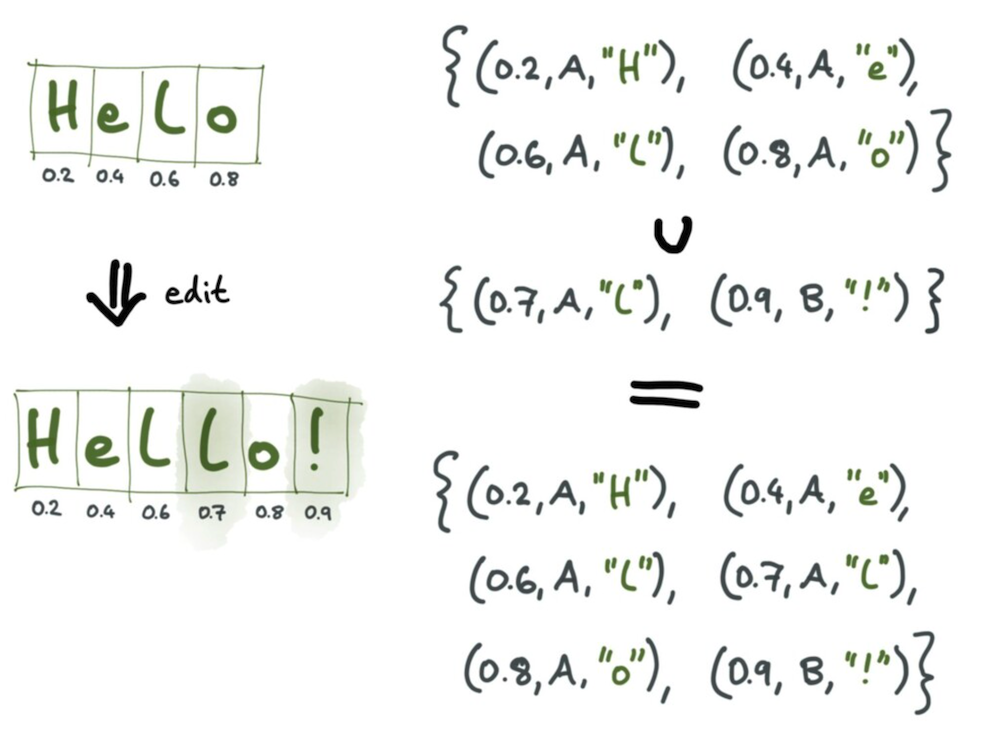
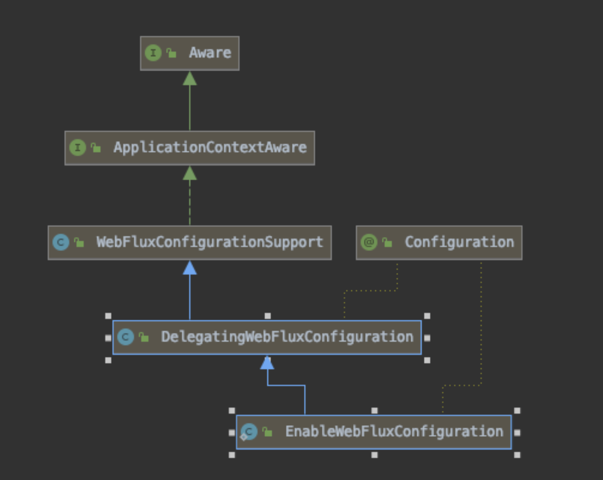

# 7장  리액티브 방식으로 DB 사용하기

# 최근 데이터 처리 패턴 

## 도메인 주도 설계
DDD관점에서 정의된 bounded context가 하나의 마이크로서비스로 매핑되야 한다. (구분된 서비스가 배달이면 배달서비스를 만들고, 회계면 회계 서비스를 만들어야)

- 엔티티
- 데이터 전달 객체
- 애그리게이트
- 리포지토리

이런 객체들은 서비스 영속 계층 (DB 계층)과 매핑해야 한다.

## 마이크로 서비스 시대의 데이터 저장소 (영속 계층)
각 서비스 사이에 DB 공유 하지 않는 것이 핵심이다.
다른 서비스의 데이터를 조회해야 한다면 해당 서비스 API를 통해 받아와야지 DB를 접근하면 안된다.

- DB 스키마와 강한 결합 없이 서비스 계속 진화시킬 수 있어야 함
- 더 섬세한 자원을 관리할 수 있어야 함
- 수평적으로 확장이 가능해야 함 (부하가는 서비스만 늘려도 되게 ex. 회원가입 등 )
- 가장 적합한 영속 계층 구현을 사용할 수 있어야 함. 

이런 원칙들을 지키기 위해 DB접근을 차단한다.

1. 하나의 DB 서버 , 서비스 별 스키마 하나씩

규칙이 무너지기 쉽다. 다른 서비스 DB접근이 쉽다.

2. 하나의 DB 서버, 다른 엑세스 권한, (즉 별개 계정)


3. 하나의 DB서버 여러개의 DB 구성
백업 작업이 복잡해진다

4. 여러 DB서버, 각서버별로 DB생성
DB별로 세부 설정 가능 - DB확장도 새로 서버에 구성하면 되는 수평, 서버 메모리 늘리는 등 수직 확장 쉬움

5. 혼합해서 사용 = polyglot persistence ( 여러 종류 DB + 여러 서버 사용) - 다중 저장소 영속화

## 다중 저장소 영속화

polyglot programming ( 다중 언어 프로그래밍 ) - 각 언어별로 잘하는게 있으니 여러 언어로 작성해서 소프트웨어를 만들자.

RDBMS는 ACID 지키지만, 그래프 저장, 인메모리 저장소, 분산 저장소 등에 대해 최상의 성능 및 관리 기능 제공 x
NOSQL는 범용 데이터 저장소지만 효율적 사용 불가. 

사용자 세션 : REDIS
상품 정보: MONGODB
사용자 활동 기록: Cassandra (event sourcing)
회계 정보 : PostgreSQL ( 어떤 장점이 있을까? )

다중 언어 영속성은 복잡성으로 인해 추가비용발생 
올바른 영속성 기술을 사용한다면 부담이 적어질 수 있다. 

스프링 프레임워크는 스프링 데이터라는 데이터 영속성 프로젝트를 가진다. 

## 서비스로서의 데이터베이스
잘 설계된 마이크로서비스는 모든 서비스가 상태 의존적이지 않다. (stateless)
즉 처리된 값은 input으로 들어온 데이터에만 연관이 되어 있다. 같은 input이면 같은 결과낼것.

클라우드 환경에서는 서비스가 상태가 없을때에 효율적 확장 가능하고, 높은 가용성을 가질 수 있다. 
대부분 클라우드 제공 업체는 DB를 서비스로 제공 (DBaaS)
클라우드 위 DB 알고리즘은
1. 클라우드가 DB, 파일 저장 영역에 대한 엑세스 요청
2. 클라우드 공급자는 데이터 영역에 접근할 수 있는 API 또는 서버 자원에 대한 권한 부여. 클라이언트는 제공되는 API 세부 구현에는 신경 x
3. 클라이언트는 엑세스 자격 증명 제공 API 또는 데이터베이스 드라이버를 사용
4. 과금

클라이언트, 즉 SW 개발자는 핵심 목표에만 집중. 관심사의 분리. (separation of concerns SOC)
AWS S3 , DynamoDB

# 마이크로 서비스 사이의 데이터 공유

두 개 이상의 서비스가 소유한 데이터 쿼리할때 join 쓰지 않는다. 
1. 주문 , 결제 서비스에 조회하는 어댑터 서비스를 구현한다
2. 너무 강결합 되어있다면 둘을 포함한 하나의 서비스로 병합

다만, 조회가 아닌 업데이트는 매우 복잡해진다. 모든 서비스에 동시에 데이터가 업뎅이트가 되야 한다면?

보통 분산 트랜잭션, 이벤트 기반 아키텍처로 풀어낸다.

## 분산 트랜잭션
네트워크가 분리된 두 개 이상의 컴퓨터 시스템에 저장된 데이터 업데이트하는 트랜잭션
여러 서비스가 동시에 업데이트를 동의 해줘야 한다.

2-phase locking을 보통 사용한다. lock만 거는 단계가 있고, lock 풀기만 하는 단계가 있다. 즉 lock -> unlock -> lock 의 흐름으로 가지 않는다.
이럼 업데이트해야하는 모든 곳에 대한 lock을 가지고서야 진행되는 것.

하지만 분산 트랜잭션은 여러개로 구성된 마이크로서비스에서는 권장 안한다. 
- 마이크로서비스 사이의 강결합이 나타난다.
- 분산 트랜잭션은 확장되지 않는다.
  - 대역폭이 제한되고 시스템 확장성이 저하된다.

## 이벤트 기반 아키텍쳐
event-driven architecture.

1. 시스템 상태 변경시 첫번째 서비스가 DB 변경후 같은 트랜잭션 안에서 이벤트를 메시지 브로커로 전달
2. 이벤트 전달받은 두번째 서비스는 이벤트 수신해서 그 data변경 - 또 메시지 전달할수도 있음.
서비스는 동시에 블로킹 x , 상호 의존성도 x

첫번째만 작동하고 있더라도 요청에 대한 처리가 계속된다. ( 분산 트랜잭션의 경우 2가 실행될때까지 무한 블로킹 )
아니면 아예 이런 동시 업데이트만 처리하는 어댑터를 둘 수 도 있다. (업데이트 되는 상태값들을 모두 받는 어댑터)

## 궁극적 일관성 

불확실성을 도메인 모델에 포함시켜야 한다. 
시스템에는 inconsistency가 언제든 발생할 수 있다.
ex.) `결제 정보 확인 중` 이라는 상태를 도입해서 결제 정보 확인 없이 주문을 생성할 수도 있다. 
그러면 결제정보 확인이 끝난 상태를 추후에 확인해서 다음 progress를 진행할 수 있다.

## SAGA 패턴
마이크로서비스에서 분산 트랜잭션에 가장 널리 사용되는 패턴 

소수의 작은 트랜잭션으로 구성되고, 각 트랜잭션은 하나의 마이크로서비스에 국한
외부요청이 saga 시작, saga의 첫번째 작은 트랜잭션 시작. 성공시 두번째 트랜잭션 시작. 중간에 성공못하면 롤백처럼 이전 트랜잭션의 보상이 기동되는 방식이다.
- events-based choreography : 별도 중재 서비스 없이 서로 직접 상호작용
- orchestration via a coordinator service : 중재서비스 있다.

## 이벤트 소싱
각 비즈니스 엔티티 상태 변화 순서를 저장한다. - 이전의 스냅샷에서 추가된 이벤트들을 확인가능 - 일정 기간마다 스냅샷 제작
상태를 지속적으로 재계산해야 해서, 쿼리가 복잡할 떄 효율적인 쿼리 수행 불가!
CQRS ( 명령 및 쿼리 분리 )
- 쓰기는 상태 변경 명령을 수신해 기본 이벤트 저장소에 저장
- 상태의 snapshot을 내보냄. 갱신 이벤트가 수신되었을 때 비동기적으로 계산

이벤트 저장소 cassandra, 쿼리 저장소 ES (상태에 대한 view를 가지고 있음- 일종의 캐시 역할)

## 충돌 없는 복제 데이터 타입 (CRDT)
글로벌 락이나 트랜잭션 일관성 없이 여러 서비스에서 동시에 업데이트 할 수도 있다 - 낙관적 복제 : 불일치를 감수하며 데이터 복제본 사용
복제본끼리 병합될 떄 consistency가 지켜지게 된다. 병합 시점에서 충돌을 해결하는데, 병합 프로세스가 항상 성공하는 수학적 속성을 가진 데이터 구조도 있다
CRDT 라고 한다. Conflict-Free-Replicated Data Types

https://channel.io/ko/blog/crdt_vs_ot

이게 google docs의 코어 알고리즘이라고 한다. 이제 여기서 문제점을 보완하는 알고리즘들이 있는 것.



Redis DB도 CRDT지원

## 데이터 저장소로서의 메시징 시스템

메시지를 저장하는 곳이 있으니 DB자체가 필요없는거 아닌가? 그렇다. DB 중요도가 낮아진다. 아파치 카프카 같은거 사용.
polyglot persistence + 메시지 브로커 + 이벤트 중심 아키텍쳐

# 데이터 조회를 위한 동기식 모델  

리액티브 이전의 데이터 엑세스 구현을 보고, 쿼리 실행시 클라이언트와 DB 통신이 어떻게 되는지, 어떤 부분을 비동기식으로 할 수 있는지 보자.

## DB 엑세스를 위한 와이어 프로토콜

어플리케이션에서 DB 드라이버를 통해 DB 서버에 요청을 보내게 되는데, 기본적으로 DB 드라이버와 DB 서버 사이의 통신을 와이어 프로토콜이라고 한다.
클라이언트와 DB 사이 전송되는 메시지의 정렬 형식을 정의한다. DB가 C++로 짜였던, 아무 상관없는 이유는 와이어 프로토콜이 언어 독립적이기 때문.

와이어 프로토콜은 TCP/IP층이라서, 블로킹 방식으로 동작할 필요는 없다. 다만 지금까지 프로그래밍 된 것이, 요청 결과 올때까지 블로킹. 
또한 TCP는 슬라이딩 윈도우에 의해 구현된 흐름 제어로 배압을 지원할 수 있는 비동기 프로토콜이다. (흐름 제어가 가능하다 TCP는) - byte 더 많이 보내라, 적게 보내라 가능 ( buffer 채워지는 거 보고 )

다만 우리에게 필요한 배압조절은, DB에서 row를 받을 때 네트워크 버퍼와 상관없이 현재 받은 row의 개수를 보고 다음 row를 보내도록 해야 하는 것이다. 
HTTP2, 웹소켓, gRPC 등이 있다. 

클라이언트가 수백만개의 행을 검색한다면 검색결과 반환은 
1. 전체 결과를 DB에서 계산해서 넘겨주기 - 클라이언트와 DB 다 큰 버퍼 필요 + 전체 쿼리 이후에 결과 받을 수 있음
2. chunk 결과 받기 - 논리적 배압 전파 가능
3. 쿼리 중 결과 얻자마자 스트림으로 보내기 - 버퍼 안필요, 클라이언트 빠르게 수신가능. but 네트워크 cpu 과하게 사용가능하다

DB는 하나 이상의 접근 방법으로 와이어 프로토콜 (driver to db) 구현 ex. mysql은 전체 or stream으로 가능.

## 데이터베이스 드라이버
드라이버는 DB용 와이어 프로토콜을 각종 프로그래밍 언어로 구현한 라이브러리이다. 파이썬용 DB-API, 자바용 JDBC 등.

mongoDB, Cassandra, Couchbase는 드라이버 API를 비동기나 리액티브 스타일로 구현했다.

### JDBC ( JAVA Database Conncectivity)

JDBC의 결과는 java.sql.ResultSet이지만 모든 행을 로드한 뒤에야 처리가 가능하다. 
JDBC는 직접사용하기보다는 스프링 데이터 JDBC, JPA 사용한다.

요즘엔 JDBC에 직접 의존 안하고 커넥션 풀 사용한다 -  hikariCP

리액티브 방식으로 RDB접근하려면 JDBC가 아닌 다른 DB ACCESS API가 필요하다.

### 스프링 JDBC (동기식)

JdbcTemplate 클래스가 있어 쿼리를 실행시키고, 테이블의 각 행을 entity로 매핑해준다. (kafkaTemplate이 kafka로 메시지를 send하는 객체이듯 template이라는 이름을 많이 쓰나보다)
Mapper class를 직접만들수도있다. (ResultSet과 int rowNum 을 받는)

### 스프링 data JDBC (동기식)
@Query 어노테이션, 객체로 매핑된 결과를 List, Stream, CompletableFuture 등으로 받을 수 있다. 
CompletableFuture <Stream> 형태는 첫 row 받을 때까지 블로킹 되지 않는다.다만, 그 다음 요청을 해서 다음 chunk를 받아와야 한다면 
stream의 원소를 처리하다가 블로킹 된다. (stream에 다음 원소가 쌓일때까지)


### 스프링 데이터 JDBC를 리액티브하게 만들기. 

R2DBC를 개발중이다. 데이터베이스와 논블로킹 방식으로 리액티브하게 동작하는 드라이버를 통합하기 위함.

JPA는 자체 API와 JPQL (Java Persistence Query Language) 로 구성된다. JPA는 자체 API와 JPQL(Java Persistence Query Language)로 구성
순수 JDBC 아닌 JPA 구현체 사용시 캐싱의 장점. Hibernate같은.

### JPA를 리액티브하게 만들기는 불가능

### 스프링 데이터 JPA
@Entity를 붙여서 DB와 매핑되는 모델을 만든다.
메서드 이름기반 쿼리를 제작하는 `CrudRepository` 상속

### Spring Data Nosql
spring data mongo 는 @Entity 대신 @Document를 사용해 특정 DB 컬렉션을 참조가능하다 ( DB > 컬렉션 > 문서)
mongoDB는 object-Document mapping에 사용되는 자바 클래스를 설명하는 _class 필드를 추가한다.

Nosql 데이터베이스는 RDB와 다르게 동기식 블로킹 API에 크게 의존적이지 않다. (최근에 나왔고 빠르게 발전중)

## 동기 모델의 한계
1. 네트워크 호출 + 외부 서비스에 데이터 검색용도로 사용하지만 논블로킹 안한다. 자원이 낭비된다.
2. JDBC는 커넥션풀로 병렬로 쿼리를 요청하는데, 그러면 HTTP2 커넥션 개수도 쿼리 개수만큼 늘어난다. HTTP2를 이용해서 동일한 TCP로 여러 리소스 동시에 보내고 받을 수 있다. 고로 논블로킹으로 전환해서 점유할 TCP 소켓 수를 줄인다.

## 동기 모델의 장점
블로킹 웹 응용 프로그램 구축에 유용하다. - 디버그, 테스트하기 쉽다.

# 스프링 데이터로 리액티브하게 데이터 접근하기
스프링 데이터 commons의 ReactiveCrudRepository를 구현하면 된다.

- 효과적 쓰레드 관리 (I/O 작업 블로킹 x)
- 첫번째 쿼리 대기시간 짧음
- 낮은 메모리 사용
- 배압 전파 - 클라이언트 처리 속도를 알려서 더 받아올 수도, 적게 받아올 수도 있다.
- 하나의 커넥션 공유 (하나의 네트워크 연결로 쿼리와 데이터 처리작업을 보낼 수 있다. 어떤 쓰레드던 쿼리 객체에 대해 권한을 가지고 있다 stateless하다.)

# 리포지토리 동작 조합하기

책의 제목만 알고 있는 상태에서, 책의 출판연도 업데이트 해야 하는 상황
1. 책 인스턴스 DB에서 얻어오기
2. 책 출판연도 바꾸기
3. 책 DB에 저장하기

책 title이 1초 뒤에 반환되는 Mono<String> title
출판연도가 2초 뒤에 반환되는 Mono<Integer> year

```java
public Mono<Book> updatedBookYearByTitle(
        Mono<String> title,
        Mono<Integer> newPublishingYear
        )
```

mono를 subscribe해야지 title과 newPublishingYear를 얻어온다

### 1번방법
title을 이용해 book을 찾은다음,  Mono<book>.flatMap으로 book 인스턴스를 접근이 가능하게 한뒤, 
새 Mono<Integer> year를 그 내부에서 구독해 Book과 year에 대한 접근이 다 가능하게 해서 
해당 flatmap안에서 book의 year수정 후 DB에저장

```java
public Mono<Book> updatedBookYearByTitle(
        Mono<String> title,
        Mono<Integer> newPublishingYear
        ){
    
    return rxBookRepository.findOneByTitle(title)
        .flatMap(book -> newPublishingYear
                        .flatMap(year -> {
                            book.setPublishingYear(year);
                            return rxBookRepository.save(book);
        }))       
}
```

다만, 책을 받아온 뒤에나 year에 대한 구독을 시작하니까, year구독 시작한지 2초 뒤에 year이 나오는 이런 경우에는 구독을 빨리시작시켜주는게 좋다.

```java
public Mono<Book> updatedBookYearByTitle(
        Mono<String> title,
        Mono<Integer> newPublishingYear
        ){
    
    return Mono.zip(title, newPublishingYear).flatMap((Tuple2<String, Integer> data) ->{
            String titleVal = data.getT1();
            Integer yearVal = data.getT2();

            return rxBookRepository.findOneByTitle(titleVal)
            .flatMap(book -> {
                book.setPublishingYear(yearVal);
                return rxBookRepository.save(book);
            })
        })       
}
```
TupleUtils를 사용하면 더 깔끔하게 변환이 가능하다. + 책 엔티티 받는건 title만 수신했을때에도 가능한데 이 경우 계속 기다린다.

```java
public Mono<Book> updatedBookYearByTitle(
        Mono<String> title,
        Mono<Integer> newPublishingYear
        ){

        return Mono.zip( newPublishingYear, rxBookRepository.findOneByTitle(title))
                .flatMap(function( (yearValue, bookValue)  ->{
        bookValue.setPublishingYear(yearVal);
        return rxBookRepository.save(book);
        })
        }))
        }
```

비즈니스 요청에 가장 적합한 옵션을 선택해야 한다. 최적화!


----

# 리액티브 리포지토리 동작원리
 
스프링 데이터 리액티브 리포지토리는 DB 드라이버의 api를 사용한다. 이런 드라이버는 동기식, 비동기식이 있지만 리액티브 API로 래핑이야 가능하다.

리액티브 스트림 호환 MongoDB 드라이버 사용한 `ReactiveMongoRepository` 
- `ReactiveSortingRepository` : ReactiveCrudRepository 인터페이스 상속하고, 쿼리 정렬가능한 findAll 메서드 추가됨
  - ReactiveCrudRepository == 엔티티 저장 및 검색, 삭제하는 메서드 가진다.  (Mono<T> save(T entity) 등 )
- `ReactiveQueryByExampleExecutor`  : QBE 언어로 쿼리가능 
두개 상속한다.


>QBE란? query만들필요없이 객체로 쿼리한다.
 ```java
Person person = new Person();                         
person.setFirstname("Dave");

Example<Person> example = Example.of(person);

1. Create a new instance of the domain object.
2. Set the properties to query.
3. Create the Example.

```

ReactiveCrudRepository와 CrudRepository의 차이는 Reactive는 페이징 안하고, 트랜잭션 동작을 허용하지 않는다.

## 페이징 

다음 페이지를 가져오려면 
1. 전체 레코드 개수 조회
2. 이전에 반환된 레코드 개수 알아야

모두 논블로킹 패러다임에 적합하지 않는다. 다만 `Pageable` 객체를 전달해서 데이터 청크를 가져올 수는 있다.

## ReactiveMongoRepository 세부 구현
스프링 데이터 mongodb의 리액티브 모듈은 ReactiveMongoRepository 인터페이스 구현체가 `SimpleReactiveMongoRepository` 클래스 하나 뿐이다.
`ReactiveMongoOperations` 인터페이스로 저수준 동작을 모두 구현한다.

이 구현체의 findAllById(Publisher<ID> id) 메서드 구현을 보자.

```java
public Flux<T> findAllById(Publisher<ID> ids){
    return Flux.from(ids).buffer().flatMap(this::findAllById);
}
```
이 메서드는 buffer 함수로 모든 ID를 수집한 다음, 메서드의 findAllById(Iterable<ID> ids) 를 재정의해 하나의 요청으로 만든다.
Flux.buffer() 하면 Flux<List<T>> 로 모아주는 역할을 하고,   

`ReactiveMongoOperations` 의 find(Query query)를 사용해 조회하게 된다.

그런데 일반적인 crudRepository의 효과적인 batch insert인 `insert(Iterable<S> entities)` 와 다르게,
`insert(Publisher<S> entities)` 메서드는 `flatMap(entity -> mongoOperations.insert(entity,...))` 형식으로 되어있어서,
DB호출이 굉장히 많아진다. 

`crudRepository`처럼 `ReactiveCrudRepository`에 대한 구현체 생성이 런타임에 생성된다.
`RepositoryFactorySupport` 클래스가 이 레포에 대한 구현체 프록시를 생성한다.


## ReactiveMongoTemplate 사용하기

`ReactiveMongoOperations` 를 직접 구현한 ReactiveMongoTemplate을 사용하면 Query 객체를 직접 생성해서 조작할 수 있다

이 MongoTemplate 클래스는 DB에 대한 설정도 들어있고 ( 서버 url, port, DB 이름 등) 스프링 컨텍스트로 등록된다.

설정한 MongoDB에 연결하기 위해서는 `ReactiveMongoDatabaseFactory` 클래스를 이용, 
MongoDB의 결과물 `org.bson.Document`를 클래스로 매핑하거나 vice versa 는 `MongoConverter` 클래스의 역할.

검색이 일어나는 방식은
1. find(query) 하면 `query.Query` 클래스를 MongoDB 클라이언트의 input 포맷인 `org.bson.Document`로 매핑해준다.
2. ReactiveMongoTemplate이 `org.bson.Document`로 데이터베이스 클라이언트 호출.
3. `com.mongodb.reactivestreams.client.MongoClient` 몽고 클라이언트가 MongoDB 드라이버의 진입점이다. reactive Publisher로 데이터 반환해준다.


## 리액티브 몽고DB 드라이버 사용하기
 
 스프링 데이터의 MongoDB 연결은 `mongoDB 리액티브 스트림 자바 드라이버`. 논블로킹 배압으로 비동기 스트림 처리 가능하게 해준다.
리액티브 MongoDB 연결을 사용하면 배치 작업 크기에 따른 배압 요구를 사용한다. ( subscribe가 계속 유지되어 있다면, 추가로 request 보낸다.)
다만, 작은 수요의 요청 사이즈 사용하면 네트워크 통신이 많이 필요해진다.

## Cassandra 비동기 드라이버

여기도 저수준은 `ReactiveCassandraOperations`, 이걸 구현한 `ReactiveCassandraTemplate` 클래스. 

# 리액티브 트랜잭션

트랜잭션은 트랜잭션 초기화 시점, 트랜잭션 객체랑 관련된 작업 진행 시점, 최종 결정(commit/rollback) 시점이 존재.

동기식에서는 ThreadLocal에 트랜잭션 객체를 보관했었다. 우리는 리액터 컨텍스트를 활용한다.

왜 명령형 프로그램에서 Transaction Management에 ThreadLocal이 필요했을까?

Transaction management는 실행중에 transactional state가 계속 추적되야해. 그래서 `ThreadLocal`에 transactional state를 저장해두었다.
그러니 Thread하나가 해당 Transactional state를 가지게 되었다. 

```java
public interface PlatformTransactionManager {

    TransactionStatus getTransaction(
            TransactionDefinition definition) throws TransactionException;

    void commit(TransactionStatus status) throws TransactionException;

    void rollback(TransactionStatus status) throws TransactionException;
}
```
우리가 @Transactional을 달면 이 PlatformTransactionManger가 관여한다.

트랜잭션의 시작과 종료지점, transaction의 종료시 commit인지 rollback인지 결정한다.

getTransaction을 하면 TransactionStatus가 반환된다.

이 `TransactionStatus`는 새로운 transaction을 나타낼 수도 있고,

현재 call stack에 참여하는 transactionId와 맞는 transaction이 있다면 존재하는 TransactionStatus를 리턴해준다.

`TransactionDefinition`은 
- Isolation level
- Propagation level : transaction context안에서 transaction 실행해야되는지 여부
- Timeout : transaction이 timeout나서 rollback할때까지 얼마나 줄지
- Read-only status: data 수정안하는 경우

이런걸 담고있으니 commit과 rollback이 가능한 것이다.

`@Transactional annotation`을 사용한다면 , 
1. @Transactional 붙은 메서드 시작전에 DB connection을 얻어와 Autocommit = False를 한다 ( rollback 때문에 매 sql문 실행마다 커밋하면 안된다. )
2. @Transactional 붙은 메서드내에서는 하나의 DB connection만 사용해서 sql문 실행
3. 메서드 종료되면 Transaction commit하고, conection 실행

이 commit할때
```java
@Override
	protected void doCommit(DefaultTransactionStatus status) {
		DataSourceTransactionObject txObject = (DataSourceTransactionObject) status.getTransaction();
		Connection con = txObject.getConnectionHolder().getConnection();
		if (status.isDebug()) {
			logger.debug("Committing JDBC transaction on Connection [" + con + "]");
		}
		try {
			con.commit();
		}
		catch (SQLException ex) {
			throw translateException("JDBC commit", ex);
		}
	}
```
이런식으로 TransactionStatus가 쓰인다. 그런데 reactive에서는 이런 transactionStatus를 불러오는곳이 Context여야 한다는 것이지.

### MongoDB 4의 리액티브 트랜잭션
기존엔 document 내부의 다른 document 있어도 하나의 document에 대해서만 원자적 업데이트가 가능했다.
다중 document transaction 사용하면 여러개 커밋 , 롤백가능하다. 

이제 송금하는 함수에 대한 트랜잭션을 작성해보면

```java
import java.time.Duration;

public class TransactionalWalletService implements WalletService {
  private final ReactiveMongoTemplate mongoTemplate;

  @Override
  public Mono<TxResult> transferMoney(
          Mono<String> fromOwner,
          Mono<String> toOwner,
          Mono<Integer> requestAmount
  ) {
    return Mono.zip(fromOwner, toOwner, requestAmount)
               .flatMap(function((from, to, amount) -> {
                 return doTransferMoney(from, to, amount)
                         .retryBackOff(20, Duration.ofMillis(1), Duration.ofMillis(500),0.1)
                         .onErrorReturn(TxResult.c);
               }));
  }
  
  private Mono<TxResult> doTransferMoney(String from, String to, Integer amount
  ){
      return mongoTemplate.inTransaction().execute(session ->
        session.findOne(queryForOwner(from), Wallet.class)
                .flatMap(fromWallet -> session
                        .findOne(queryForOwner(to), Wallet.class)
                        .flatMap(toWallet -> {
                            if (fromWallet.hasEnoughFunds(amount)){
                                fromWallet.withdraw(amount);
                                toWallet.deposit(amount);
                                return session.save(fromWallet)
                                        .then(session.save(toWallet))
                                        .then(Mono.just(TxResult.SUCCESS));
                            } else{
                                return Mono.just(TxResult.NOT_ENOUGH_FUNDS);
                            }
                        }))
                .onErrorResume(e ->
                    Mono.error(new RuntimeException("Conflict")).last()        
                )                           
      );
  }
}


```
근데 이러면 wallet하나 로드하고, wallet다음거 하나 로드하게 된다.

List<Wallet> listOfWallet 을 두어 findWalletById(Iterable<Wallet> iterable)
이런걸 사용해서 wallet을 동시에 받아오고, save도 비슷하게 iterable을 한다면 트랜잭션 충돌 비율을 감소시킬 수 있다.


## SAGA 패턴을 이용한 분산 트랜잭션
SAGA 패턴은 작은 task 성공하면 다음 task 시작. 어떤 연속적인 task라도 실패하면 맨 첫 task까지 롤백한다. 

> 로컬 트랜잭션과 글로벌 트랜잭션의 차이?
> 로컬 트랜잭션은 하나의 DB에만 접근가능, 글로벌 트랜잭션은 여러 DB 접근하는
## MongoDB 리액티브 커넥터
MongoDB 리포지토리는 QBE 지원, 메서드 명명규칙에 따른 쿼리 생성, 커서 사용 ( capped collection - 결과 다 내보내도 커넥션이 열려있어서, 새 도큐먼트가 들어오면 새 도큐먼트를 보낼 수 있다.)

# RDB용 비동기 드라이버

## ADBA(Asynchronous Database access)
자바 플랫폼용 논블로킹 DB 엑세스 api - 네트워크 호출시 메서드 호출이 블로킹 되지 않는다. 

## R2DBC(Reactive Relational Database Connectivity)
https://docs.spring.io/spring-data/r2dbc/docs/current/reference/html/
이제 나온듯?

R2DBC 프로젝트 구성
- R2DBC 서비스 제공자 인터페이스(SPI) 드라이버 구현을 위한 최소한의 API 정의. ( R2DBC사용하려면 여기 정의된 메서드들은 비동기 드라이버로 지원해줘야 한다.  )
- R2DBC Client: 사용자 요청을 SPI의 input 형식으로 변환하는.

>For most tasks, you should use R2dbcEntityTemplate or the repository support, which both use the rich mapping functionality. R2dbcEntityTemplate is the place to look for accessing functionality such as ad-hoc CRUD operations.

```java
public class R2dbcApp {

  private static final Log log = LogFactory.getLog(R2dbcApp.class);

  public static void main(String[] args) {

    ConnectionFactory connectionFactory = ConnectionFactories.get("r2dbc:h2:mem:///test?options=DB_CLOSE_DELAY=-1;DB_CLOSE_ON_EXIT=FALSE");

    R2dbcEntityTemplate template = new R2dbcEntityTemplate(connectionFactory);

    template.getDatabaseClient().sql("CREATE TABLE person" +
        "(id VARCHAR(255) PRIMARY KEY," +
        "name VARCHAR(255)," +
        "age INT)")
      .fetch()
      .rowsUpdated()
      .as(StepVerifier::create)
      .expectNextCount(1)
      .verifyComplete();

    template.insert(Person.class)
      .using(new Person("joe", "Joe", 34))
      .as(StepVerifier::create)
      .expectNextCount(1)
      .verifyComplete();

    template.select(Person.class)
      .first()
      .doOnNext(it -> log.info(it))
      .as(StepVerifier::create)
      .expectNextCount(1)
      .verifyComplete();
  }
}
```

1. 우리가 원래 쓰는 커넥션 팩토리로 `R2dbcEntityTemplate` 얻어올 수 있다. 이걸로 DB 조회가능

H2 (io.r2dbc:r2dbc-h2)
MariaDB (org.mariadb:r2dbc-mariadb)
Microsoft SQL Server (io.r2dbc:r2dbc-mssql)
jasync-sql MySQL (com.github.jasync-sql:jasync-r2dbc-mysql)
Postgres (io.r2dbc:r2dbc-postgresql)
Oracle (com.oracle.database.r2dbc:oracle-r2dbc)

이런 spi 드라이버들이 존재한다. template에 끼우면된다.
```java
Person person = new Person("John", "Doe");

Mono<Person> saved = template.insert(person);
Mono<Person> loaded = template.selectOne(query(where("firstname").is("John")),
    Person.class);
```

이런식으로 조회하고, Mono로 받아오기가 가능하다. 


```java
Mono<Person> first = template.select(Person.class)  
  .from("other_person")
  .matching(query(where("firstname").is("John")     
    .and("lastname").in("Doe", "White"))
    .sort(by(desc("id"))))                          
  .one();                                           

Selecting from a table by name returns row results using the given domain type.
The issued query declares a WHERE condition on firstname and lastname columns to filter results.
Results can be ordered by individual column names, resulting in an ORDER BY clause.
Selecting the one result fetches only a single row.
  This way of consuming rows expects the query to return exactly a single result.
Mono emits a IncorrectResultSizeDataAccessException if the query yields more than a single result.
```

```java
@Autowired
private TransactionalOperator operator;

public Mono<Void> deposit(DepositRequest request){
    return this.accountRepository.findById(request.getAccount())
            .doOnNext(ac -> ac.setBalance(ac.getBalance() + request.getAmount()))
            .flatMap(this.accountRepository::save)
            .thenReturn(toEvent(request))
            .flatMap(this.eventRepository::save)
            .doOnError(System.out::println)
            .as(operator::transactional) // add this
            .then();
}
```
transactional operator를 사용해서 transaction 안에 가둘수있다.

# 동기식 레포지토리를 리액티브 스타일로 변경하기

리액티브 커넥터 없는 DB는 리액티브 API로 매핑하면 되지만, publishOn이나 subscribeOn 등으로 다른 스레드로 실행시켜서 논블로킹하게 해야한다.
하지만 적절한 스레드풀이 없다면 publishOn에 배정한 스케줄러로부터 스레드 받으려고 블로킹상태가 되어버릴 수도 있다.

모든 블로킹 요청은 전용 스케줄러를 두어서 거기에서만 일어나게 해야 한다. 다만, DB 커넥션 풀 크기도 생각해야 한다. 스레드를 할당받았어도 DB 커넥션 풀 기다리느라 실행안될수도 있다.

### rxjava2-jdbc 라이브러리
전용 스레드 풀 + 논블로킹 커넥션 풀 - 커넥션 풀의 커넥션 기다리는게 논블로킹하게 일어난다.
DB 커넥션 받아와야 블로킹 시작.

### 동기식 CrudRepository 래핑

JPA를 사용할땐 lazy loading을 막아야 해. 프록시 객체로 일부 변수를 가져오게 된다면 나중에 사용하려고 할 때 블로킹이 일어난다.

원래의 CrudRepository를 `delegate`라는 변수로 하는 래핑 객체를 만들어서 이 문제를 풀어본다면

```java

public <S extends T> Mono<S> save(S entity){
    return Mono.fromCallable(() -> delegate.save(entity).subscribeOn(scheduler)); // 다른 스케줄러에서 실행되도록 한다.
}
```

이렇게 할때 스케줄러는 커넥션 풀 개수랑 동일하게 세팅해주는게 좋다. 커넥션 못받아서 놀고있는 스레드가 생기니까. 

다만 이렇게 매핑 잘해도, deleteAll같은거 구현할때 주의해야 하는 것이, 우리의 flux가 5개의 item을 onNext로 내보낼거라서
deleteAll(Flux) 로 했다고 치면, 5개가 5초씩 딜레이가 있다고 치면, deleteAll(Iterable<>) 을 사용하진 못한다.
그러니 flux에서 event가 들어올때마다 delete를 호출해주는 방식으로 구현해야한다.


```
2023-05-01T21:19:48.757+09:00 ERROR 27018 --- [or-http-epoll-2] a.w.r.e.AbstractErrorWebExceptionHandler : [31c561f7-1]  500 Server Error for HTTP POST "/schedule"

java.lang.IllegalStateException: Rejecting additional inbound receiver. State=[terminated=false, cancelled=false, pending=0, error=false]
        at reactor.netty.channel.FluxReceive.startReceiver(FluxReceive.java:187) ~[reactor-netty-core-1.1.6.jar!/:1.1.6]
        Suppressed: reactor.core.publisher.FluxOnAssembly$OnAssemblyException:
Error has been observed at the following site(s):
        *__checkpoint ⇢ HTTP POST "/schedule" [ExceptionHandlingWebHandler]
Original Stack Trace:
                at reactor.netty.channel.FluxReceive.startReceiver(FluxReceive.java:187) ~[reactor-netty-core-1.1.6.jar!/:1.1.6]
                at reactor.netty.channel.FluxReceive.subscribe(FluxReceive.java:145) ~[reactor-netty-core-1.1.6.jar!/:1.1.6]
                at reactor.core.publisher.InternalFluxOperator.subscribe(InternalFluxOperator.java:62) ~[reactor-core-3.5.5.jar!/:3.5.5]
                at reactor.netty.ByteBufFlux.subscribe(ByteBufFlux.java:340) ~[reactor-netty-core-1.1.6.jar!/:1.1.6]
                at reactor.core.publisher.InternalFluxOperator.subscribe(InternalFluxOperator.java:62) ~[reactor-core-3.5.5.jar!/:3.5.5]
                at reactor.netty.ByteBufFlux.subscribe(ByteBufFlux.java:340) ~[reactor-netty-core-1.1.6.jar!/:1.1.6]
                at reactor.core.publisher.InternalMonoOperator.subscribe(InternalMonoOperator.java:64) ~[reactor-core-3.5.5.jar!/:3.5.5]
                at reactor.core.publisher.MonoFlatMap$FlatMapMain.onNext(MonoFlatMap.java:165) ~[reactor-core-3.5.5.jar!/:3.5.5]
                at reactor.core.publisher.FluxOnErrorResume$ResumeSubscriber.onNext(FluxOnErrorResume.java:79) ~[reactor-core-3.5.5.jar!/:3.5.5]
                at reactor.core.publisher.FluxSwitchIfEmpty$SwitchIfEmptySubscriber.onNext(FluxSwitchIfEmpty.java:74) ~[reactor-core-3.5.5.jar!/:3.5.5]
                at reactor.core.publisher.MonoNext$NextSubscriber.onNext(MonoNext.java:82) ~[reactor-core-3.5.5.jar!/:3.5.5]
                at reactor.core.publisher.FluxConcatMapNoPrefetch$FluxConcatMapNoPrefetchSubscriber.innerNext(FluxConcatMapNoPrefetch.java:258) ~[reactor-core-3.5.5.jar!/:3.5.5]
                at reactor.core.publisher.FluxConcatMap$ConcatMapInner.onNext(FluxConcatMap.java:863) ~[reactor-core-3.5.5.jar!/:3.5.5]
                at reactor.core.publisher.FluxMap$MapSubscriber.onNext(FluxMap.java:122) ~[reactor-core-3.5.5.jar!/:3.5.5]
                at reactor.core.publisher.FluxPeek$PeekSubscriber.onNext(FluxPeek.java:200) ~[reactor-core-3.5.5.jar!/:3.5.5]
                at reactor.core.publisher.MonoNext$NextSubscriber.onNext(MonoNext.java:82) ~[reactor-core-3.5.5.jar!/:3.5.5]
                at reactor.core.publisher.FluxConcatMapNoPrefetch$FluxConcatMapNoPrefetchSubscriber.innerNext(FluxConcatMapNoPrefetch.java:258) ~[reactor-core-3.5.5.jar!/:3.5.5]
                at reactor.core.publisher.FluxConcatMap$ConcatMapInner.onNext(FluxConcatMap.java:863) ~[reactor-core-3.5.5.jar!/:3.5.5]
                at reactor.core.publisher.FluxConcatMap$WeakScalarSubscription.request(FluxConcatMap.java:479) ~[reactor-core-3.5.5.jar!/:3.5.5]
                at reactor.core.publisher.Operators$MultiSubscriptionSubscriber.request(Operators.java:2305) ~[reactor-core-3.5.5.jar!/:3.5.5]
                at reactor.core.publisher.FluxConcatMapNoPrefetch$FluxConcatMapNoPrefetchSubscriber.request(FluxConcatMapNoPrefetch.java:338) ~[reactor-core-3.5.5.jar!/:3.5.5]
                at reactor.core.publisher.MonoNext$NextSubscriber.request(MonoNext.java:108) ~[reactor-core-3.5.5.jar!/:3.5.5]
                at reactor.core.publisher.FluxPeek$PeekSubscriber.request(FluxPeek.java:138) ~[reactor-core-3.5.5.jar!/:3.5.5]
```

이런걸 보고 어떻게 디버깅을 하겠나.

내가 실수를 저지른 것 중 하나가

```java
public Mono<ServerResponse> scheduleMessage(ServerRequest request){
        System.out.println("hello world2");
        Mono<MultiValueMap<String, String>> formData = request.formData();
        
        formData.subscribe(e-> System.out::println);
        return ServerResponse.ok().bodyValue("Ok");
```
이렇게 한 거였는데, 이러면 {} 만 프린트 된다.
알고보니,
https://stackoverflow.com/questions/72555832/body-in-serverrequest-is-null-with-serverrequestspring-webflux

runtime에는 debug모드가 아니면 왜 오류나는지 안보이고,
subscribe가 async이기 때문에, 내 코드는 저 쓰레드에서 이미 OK를 내보낼때까지 출력을 못하고 끝나버린다. 
그러니까, subscribe 자체가 다른 스레드에서 실행되도록 되어있는것.

무조건 return할때 
```java
public Mono<ServerResponse> scheduleMessage(ServerRequest request){
        System.out.println("hello world2");
        Mono<MultiValueMap<String, String>> formData = request.formData();
        Mono<ScheduledMessage> message = userRequestParseService.parseMap2ScheduledMessage(formData);


        return request.bodyToMono(String.class)
                .doOnNext(System.out::println)
                .flatMap(body -> ServerResponse.ok()
                        .bodyValue("ok"));
    }
```

이런거 해야지만 결과를 볼 수 있다.


```java
   public Mono<ServerResponse> scheduleMessage(ServerRequest request) {
        System.out.println("hello world2");
        Mono<MultiValueMap<String, String>> formData = request.formData();
        Mono<ScheduledMessage> scheduledMessage = userRequestParseService.parseMap2ScheduledMessage(formData);
        Mono<ResponseModel> successResponse = scheduledMessage
                .flatMap(message -> Mono.just(new ResponseModel(onlyVisibleToSender, message)))
                .doOnNext(System.out::println);

        return scheduledMessage
                .doOnNext(System.out::println)
                .flatMap(message -> ServerResponse
                        .ok()
                        .contentType(MediaType.APPLICATION_JSON)
                        .body(successResponse, ResponseModel.class));
```
이런식으로 하면 ResponseModel이라는게 @getter가 있어서 json으로 바꿀수있다면 json응답을 받을 수 있다.


그리고 또 재밌는건 reactiveMongoRepository에 save를 호출했는데도 저장이 안된다. 
구독할때까지 아무일이 안 일어난다는게 중요하다.


https://stackoverflow.com/questions/57070561/reactivemongorepository-not-saving-my-data


```java
    public Mono<ServerResponse> scheduleMessage(ServerRequest request) {
        System.out.println("hello world2");
        Mono<MultiValueMap<String, String>> formData = request.formData();
        Mono<ScheduledMessage> scheduledMessage = userRequestParseService.parseMap2ScheduledMessage(formData);
        Mono<ResponseModel> successResponse = scheduleMessageService
                                                    .saveMessage(scheduledMessage)
                                                    .flatMap(message -> Mono.just(new ResponseModel(onlyVisibleToSender, message)));

        return scheduledMessage
                .doOnNext(System.out::println)
                .flatMap(message -> ServerResponse
                        .ok()
                        .contentType(MediaType.APPLICATION_JSON)
                        .body(successResponse, ResponseModel.class));
```

이런코드를 효율화해보니

```java
public Mono<ServerResponse> scheduleMessage(ServerRequest request) {
        System.out.println("hello world2");
        Mono<MultiValueMap<String, String>> formData = request.formData();
        return userRequestParseService
                .parseMap2ScheduledMessage(formData)
                .flatMap(scheduleMessageService::saveMessage)
                .doOnNext(System.out::println)
                .flatMap(message -> {
                    var successResponse = Mono.just(new ResponseModel(onlyVisibleToSender, message));

                    return ServerResponse
                            .ok()
                            .contentType(MediaType.APPLICATION_JSON)
                            .body(successResponse, ResponseModel.class);
                });
```
이런식으로 되어서 놀랍다.


# 질문: Mono<ServerResponse> 를 반환하면 subscribe는 누가하냐. 저거 봐도 mono 생성만 하고 subscribe는 안하는데?

handler를 정의해서 
```java
    @Bean
    public RouterFunction<ServerResponse> mainRouter(ScheduleHandler scheduleHandler){
        return RouterFunctions.route()
                .GET("/", scheduleHandler::healthCheck)
                .POST("/schedule", scheduleHandler::scheduleMessage)
                .build();
    }
```
이런식으로 RouterFunction<ServerResponse>을 반환하는 Router를 정의했었는데, HTTP 서버 (Tomcat, undertow, Netty) 들은

`RouterFunctions.toHttpHandler(RouterFunction)` 을 한 HttpHandler를 받게 된다. 

이 HttpHandler는 adapter에 붙이면 되고, adapter은 HTTP 서버 specific 하다. 

서버에 따라 등록방법이 조금씩 다른데, netty의 경우 아래와 같다.

```java
HttpHandler handler = ...
ReactorHttpHandlerAdapter adapter = new ReactorHttpHandlerAdapter(handler);
HttpServer.create().host(host).port(port).handle(adapter).bind().block();
```

스프링 부트에서 사용하는 방식은, RouterFunction<ServerResponse> 컴포넌트를 빈으로 등록해두고, DispatcherHandler와 함께 사용한다.

스프링은 HandlerFunctionAdapter를 두어서, DispatcherHandler가 이 Adapter를 갖고 있게 함으로써, request가 왔을때 어떻게 처리할지 정의.

ServerResponseHandler는 ServerResponse의 writeTo 메소드를 불러서 HandlerFunction의 결과를 처리한다.

https://godekdls.github.io/Reactive%20Spring/springwebflux/#13-dispatcherhandler

DispatcherHandler 에서 HandlerFunctionAdapter 불러서 실행을 완료하면 실행 결과랑 컨텍스트 정보를 감싼 `HandlerResult`를 반환한다.
이 HandlerResult는 `HandlerResultHandler`가 처리하는데,

`ResponseEntityResultHandler`- ResponseEntity 리턴 - @Controller에서 보통 반환 (클래스를 반환한다던지)
`ServerResponseResultHandler`- ServerResponse 리턴 - 함수형엔드포인트에서 보통 반환
`ResponseBodyResultHandler` - @ResponseBody 메서드(json으로 나갈때 쓰는거), @RestController에서 리턴한 값 처리
`ViewResolutionResultHandler` - CharSequence, View, Model, Map, Rendering이나 다른 Object를 model attribute로 처리. 

ServerResponseResultHandler 는 뭘 할까?

WebFluxAutoConfiguration이 우리의 ServerResponseResultHandler를 설정할것이다.

얘는 EnableSpringBootApplication에 들어있을 것이다. 

```java
public class WebFluxConfigurationSupport implements ApplicationContextAware {
[출처] Spring Webflux CodecConfigurer의 내부 속으로 - 2 고급편 (HTTP message readers and writers 동작 원리)|작성자 호식이

```
여기 있다.


여기의 ServerResponseResultHandler를 보자. ( ResponseEntityResultHandler랑 ResponseBodyResultHandler 도 여기있다.)

```java
  @Bean
	public ServerResponseResultHandler serverResponseResultHandler(
			ServerCodecConfigurer serverCodecConfigurer) {
		List<ViewResolver> resolvers = getViewResolverRegistry().getViewResolvers();
		ServerResponseResultHandler handler = new ServerResponseResultHandler();
		handler.setMessageWriters(serverCodecConfigurer.getWriters());
		handler.setViewResolvers(resolvers);
		return handler;
	}
[출처] Spring Webflux CodecConfigurer의 내부 속으로 - 2 고급편 (HTTP message readers and writers 동작 원리)|작성자 호식이


```

책에서 봤듯이 Mono<String>으로 반환하더라도, viewResolver가 받아서 사용할 수 있다. 그래서 viewResolver들을 등록해놔야 하고.

messageWriter가 우리의 메시지를 처리하는 듯 하다. 

```java
public class ServerResponseResultHandler implements HandlerResultHandler, InitializingBean, Ordered {
	@Override
	public Mono<Void> handleResult(ServerWebExchange exchange, HandlerResult result) {
		ServerResponse response = (ServerResponse) result.getReturnValue();
		Assert.state(response != null, "No ServerResponse");
		return response.writeTo(exchange, new ServerResponse.Context() {
			@Override
			public List<HttpMessageWriter<?>> messageWriters() {
				return messageWriters;
			}
			@Override
			public List<ViewResolver> viewResolvers() {
				return viewResolvers;
			}
		});
	}

}
```
ServerWebExchange 는 이렇게 3개가 존재한다.
```java
interface ServerWebExchange {
  ServerHttpRequest getRequest();

  ServerHttpResponse getResponse();

  Mono<WebSession> getSession();
}
```

```java
interface ServerHttpRequest{
    Flux<DataBuffer> getBody();
}
interface ServerHttpResponse{
  Mono<Void> writeWith(Publisher<? extends DataBuffer> body);
}
```

즉 얘가 처음 요청을 받는애고, 요청을 되돌려주는 역할을 한다.
ServerHttpResponse의 return 타입이 Mono<Void>인것만 봐도 알 수 있듯이, 이 Mono<Void>를 구독하는 경우에만 데이터를 보내는 프로세스가 실행된다.

다시 `ServerResponseResultHandler`의 `handleResult` 로 돌아가서, response.writeTo(ServerWebExchange, new ServerResponse.Context())
writeTo를 실행하는데, ServerResponse의 종류가 다양해서 각각 맞는 클래스가 있다.

우리가 자주 사용하는 ServerResponse.body(BodyInserters) 는 `private static final class BodyInserterResponse<T> extends AbstractServerResponse`
형태이다.

```java
abstract static class AbstractServerResponse implements ServerResponse {

	@Override
    public final Mono<Void> writeTo(ServerWebExchange exchange, Context context) {
		writeStatusAndHeaders(exchange.getResponse());
		Instant lastModified = Instant.ofEpochMilli(headers().getLastModified());
		HttpMethod httpMethod = exchange.getRequest().getMethod();
		if (SAFE_METHODS.contains(httpMethod) && exchange.checkNotModified(headers().getETag(), lastModified)) {
			return exchange.getResponse().setComplete();
		}
		else {
			return writeToInternal(exchange, context);
		}
	}
}
```

```java
private static final class BodyInserterResponse<T> extends AbstractServerResponse {
        @Override
		protected Mono<Void> writeToInternal(ServerWebExchange exchange, Context context) {
			return this.inserter.insert(exchange.getResponse(), new BodyInserter.Context() {
				@Override
				public List<HttpMessageWriter<?>> messageWriters() {
					return context.messageWriters();
				}
				@Override
				public Optional<ServerHttpRequest> serverRequest() {
					return Optional.of(exchange.getRequest());
				}
				@Override
				public Map<String, Object> hints() {
					hints.put(Hints.LOG_PREFIX_HINT, exchange.getLogPrefix());
					return hints;
				}
			});
		}
}
```

this.inserter이 BodyInserter 클래스인데
```java
  public Mono<ServerResponse> hello(ServerRequest request) {
    return ServerResponse.ok().contentType(MediaType.TEXT_PLAIN)
            .body(BodyInserters.fromValue("Hello, Spring!"));
  }
[출처] Spring Webflux CodecConfigurer의 내부 속으로 - 2 고급편 (HTTP message readers and writers 동작 원리)|작성자 호식이
```
이런 body를 만들때 body에 `bodyInserters` 를 사용해서 메시지를 갖고 있는 `BodyInserter`를 리턴받는다. 즉, `BodyInserter`클래스를 생성한다.

그 body inserter는 이런 람다식이다. (BodyInserter#Insert 메서드인) `Mono<Void> insert(M outputMessage, Context context);` 이게 writeWithMessageWriters를 return하도록 선언된것.

```java
(message, context) ->
            writeWithMessageWriters(message, context, publisher, ResolvableType.forClass(elementClass), null);
```

즉, insert함수에 message랑 context를 제공하면, writeWithMessageWriters를 호출한다.


ServerWebExchange가 가지고 있는 비어있는 `exchange.getResponse()` 에 BodyInserter가 갖고있는 정보를 넣게 된다. (insert 메서드) 

(사실 비어있는건 아니고, `AbstractServerResponse#writeTo` 때문에 `writeStatusAndHeaders(exchange.getResponse())`는 실행된 상태)

이를통해 `ReactiveHttpOutputMessage` body를 채우게 된다.  

```java
 .body(BodyInserters.fromPublisher(
                    scheduledMessageMono, ScheduledMessage.class
                ))
```

```java
public abstract class BodyInserters {
  public static <T, P extends Publisher<T>> BodyInserter<P, ReactiveHttpOutputMessage> fromPublisher(P publisher, Class<T> elementClass) {

    Assert.notNull(publisher, "'publisher' must not be null");
    Assert.notNull(elementClass, "'elementClass' must not be null");
    return (message, context) ->
            writeWithMessageWriters(message, context, publisher, ResolvableType.forClass(elementClass), null);
  }
  private static <M extends ReactiveHttpOutputMessage> Mono<Void> writeWithMessageWriters(
          M outputMessage, BodyInserter.Context context, Object body, ResolvableType bodyType, @Nullable ReactiveAdapter adapter) {

    Publisher<?> publisher;
    if (body instanceof Publisher<?> publisherBody) {
      publisher = publisherBody;
    }
    else if (adapter != null) {
      publisher = adapter.toPublisher(body);
    }
    else {
      publisher = Mono.just(body);
    }
    MediaType mediaType = outputMessage.getHeaders().getContentType();
    for (HttpMessageWriter<?> messageWriter : context.messageWriters()) {
      if (messageWriter.canWrite(bodyType, mediaType)) {
        HttpMessageWriter<Object> typedMessageWriter = cast(messageWriter);
        return write(publisher, bodyType, mediaType, outputMessage, context, typedMessageWriter);
      }
    }
    return Mono.error(unsupportedError(bodyType, context, mediaType));
  }
}
```

1. `Dispatcherhandler` 에서 요청을 받으면 `HandlerFunctionAdapter`로 넘겨서 걸맞는 `RouterFunction<ServerResponse>`을 실행시킨다.

2. `HandlerFunctionAdapter`은 저 `RouterFunction<ServerResponse>` 의 결과로 `HandlerResult`를 반환하고,

3. `HandlerResultHandler`로 `HandlerResult`를 처리한다.
우리는 `ServerResponseResultHandler`- ServerResponse 리턴 - 함수형엔드포인트에서 보통 반환

3.1 `ServerResponseResultHandler`는 `ServerWebExchange` 와 `HandlerResult`를 받아서 `ServerWebExchange`안의 비어있는 `ServerResponse#writeTo`를 호출한다.

우리가 사용하는 ServerResponse.body(BodyInserter) 에서 writeTo는 

3.1.1 writeStatusAndHeaders로 ServerResponse를 채우고

3.1.2 BodyInserter.insert 메서드를 호출해서 `BodyInserters#*` 함수에서 얻어지는 body를 채우는 함수들을 실행시킨다.

3.1.3 그럼 이 결과는 Mono<Void>로 나오게 되고, 

즉, 우리가 handler에서 Mono<ServerResponse>를 보낼때 bodyInserters.fromxxx() 로 bodyInserter를 넣어서 만든다.

HttpMessageWriter.write(... , serverRequest, serverResponse, ...) (요청 보낸 사람정보랑, 보내야할 요청 인스턴스를 넣어주면)

하나의 writer인 EncoderHttpMessageWriter를 보면, 결국 메시지 안에 잘 넣어준다 느낌이다.
```java
public class EncoderHttpMessageWriter<T> implements HttpMessageWriter<T> {
  @Override
  public Mono<Void> write(Publisher<? extends T> inputStream,
                          ResolvableType elementType,
                          @Nullable MediaType mediaType,
                          ReactiveHttpOutputMessage message,
                          Map<String, Object> hints) {

    MediaType contentType = updateContentType(message, mediaType);

    Flux<DataBuffer> body = this.encoder.encode(
            inputStream, message.bufferFactory(), elementType, contentType, hints);

    if (inputStream instanceof Mono) {
      return body
              .singleOrEmpty()
              .switchIfEmpty(Mono.defer(() -> {
                message.getHeaders().setContentLength(0);
                return message.setComplete().then(Mono.empty());
              }))
              .flatMap(buffer -> {
                Hints.touchDataBuffer(buffer, hints, logger);
                message.getHeaders().setContentLength(buffer.readableByteCount());
                return message.writeWith(Mono.just(buffer)
                                             .doOnDiscard(DataBuffer.class, DataBufferUtils::release));
              })
              .doOnDiscard(DataBuffer.class, DataBufferUtils::release);
    }

    if (isStreamingMediaType(contentType)) {
      return message.writeAndFlushWith(body.map(buffer -> {
        Hints.touchDataBuffer(buffer, hints, logger);
        return Mono.just(buffer).doOnDiscard(DataBuffer.class, DataBufferUtils::release);
      }));
    }

    if (logger.isDebugEnabled()) {
      body = body.doOnNext(buffer -> Hints.touchDataBuffer(buffer, hints, logger));
    }
    return message.writeWith(body);
  }
}
```

4. HandlerFunctionAdapter에서 등록했던 `handlerFunction` 에 의해 Mono<ServerResponse>가 오면, 이걸 매핑해서 새 Mono<HandlerResult>로 나오게 한건데,
이걸,  HandlerResultHandler 가 처리해서 (ServerResponseResultHandler#handleResult) Mono<Void>를 반환하기 때문에,

dispatcher handler가 

```java
public class HandlerFunctionAdapter implements HandlerAdapter {

	private static final MethodParameter HANDLER_FUNCTION_RETURN_TYPE;

	static {
		try {
			Method method = HandlerFunction.class.getMethod("handle", ServerRequest.class);
			HANDLER_FUNCTION_RETURN_TYPE = new MethodParameter(method, -1);
		}
		catch (NoSuchMethodException ex) {
			throw new IllegalStateException(ex);
		}
	}


	@Override
	public boolean supports(Object handler) {
		return handler instanceof HandlerFunction;
	}

	@Override
	public Mono<HandlerResult> handle(ServerWebExchange exchange, Object handler) {
		HandlerFunction<?> handlerFunction = (HandlerFunction<?>) handler;
		ServerRequest request = exchange.getRequiredAttribute(RouterFunctions.REQUEST_ATTRIBUTE);
		return handlerFunction.handle(request)
				.map(response -> new HandlerResult(handlerFunction, response, HANDLER_FUNCTION_RETURN_TYPE));
	}
}
```

이걸 부르는건 dispatcher handler인데, 여기도 결국 이 결과를 받는것이다.  

```java
public class DispatcherHandler implements WebHandler, PreFlightRequestHandler, ApplicationContextAware {
    
  @Override
  public Mono<Void> handle(ServerWebExchange exchange) {
    if (this.handlerMappings == null) {
      return createNotFoundError();
    }
    if (CorsUtils.isPreFlightRequest(exchange.getRequest())) {
      return handlePreFlight(exchange);
    }
    return Flux.fromIterable(this.handlerMappings)
               .concatMap(mapping -> mapping.getHandler(exchange))
               .next()
               .switchIfEmpty(createNotFoundError())
               .onErrorResume(ex -> handleDispatchError(exchange, ex))
               .flatMap(handler -> handleRequestWith(exchange, handler));
  }
  
  private Mono<Void> handleRequestWith(ServerWebExchange exchange, Object handler) {
    if (ObjectUtils.nullSafeEquals(exchange.getResponse().getStatusCode(), HttpStatus.FORBIDDEN)) {
      return Mono.empty();  // CORS rejection
    }
    if (this.handlerAdapters != null) {
      for (HandlerAdapter adapter : this.handlerAdapters) {
        if (adapter.supports(handler)) {
          return adapter.handle(exchange, handler)
                        .flatMap(result -> handleResult(exchange, result));
        }
      }
    }
    return Mono.error(new IllegalStateException("No HandlerAdapter: " + handler));
  }

  private Mono<Void> handleResult(ServerWebExchange exchange, HandlerResult result) {
    Mono<Void> resultMono = doHandleResult(exchange, result, "Handler " + result.getHandler());
    if (result.getExceptionHandler() != null) {
      resultMono = resultMono.onErrorResume(ex ->
                                                    result.getExceptionHandler().handleError(exchange, ex).flatMap(result2 ->
                                                                                                                           doHandleResult(exchange, result2, "Exception handler " +
                                                                                                                                                             result2.getHandler() + ", error=\"" + ex.getMessage() + "\"")));
    }
    return resultMono;
  }
}
```

usage를 찾아가보니 아마도, HttpHandler가 dispatcher를 호출한다. 그리고 이보다 윗단은 Netty같은 HTTP 서버 엔진인데, 
ReactorHttpHandlerAdapter 가 이 httpHandler들고 있으니까, 
```java
public class HttpWebHandlerAdapter extends WebHandlerDecorator implements HttpHandler {
  @Override
  public Mono<Void> handle(ServerHttpRequest request, ServerHttpResponse response) {
    if (this.forwardedHeaderTransformer != null) {
      try {
        request = this.forwardedHeaderTransformer.apply(request);
      }
      catch (Throwable ex) {
        if (logger.isDebugEnabled()) {
          logger.debug("Failed to apply forwarded headers to " + formatRequest(request), ex);
        }
        response.setStatusCode(HttpStatus.BAD_REQUEST);
        return response.setComplete();
      }
    }
    ServerWebExchange exchange = createExchange(request, response);

    LogFormatUtils.traceDebug(logger, traceOn ->
            exchange.getLogPrefix() + formatRequest(exchange.getRequest()) +
            (traceOn ? ", headers=" + formatHeaders(exchange.getRequest().getHeaders()) : ""));

    return getDelegate().handle(exchange)
                        .doOnSuccess(aVoid -> logResponse(exchange))
                        .onErrorResume(ex -> handleUnresolvedError(exchange, ex))
                        .then(cleanupMultipart(exchange))
                        .then(Mono.defer(response::setComplete));
  }
}
```


```java
public class ReactorHttpHandlerAdapter implements BiFunction<HttpServerRequest, HttpServerResponse, Mono<Void>> {

  @Override
  public Mono<Void> apply(HttpServerRequest reactorRequest, HttpServerResponse reactorResponse) {
    NettyDataBufferFactory bufferFactory = new NettyDataBufferFactory(reactorResponse.alloc());
    try {
      ReactorServerHttpRequest request = new ReactorServerHttpRequest(reactorRequest, bufferFactory);
      ServerHttpResponse response = new ReactorServerHttpResponse(reactorResponse, bufferFactory);

      if (request.getMethod() == HttpMethod.HEAD) {
        response = new HttpHeadResponseDecorator(response);
      }

      return this.httpHandler.handle(request, response)
                             .doOnError(ex -> logger.trace(request.getLogPrefix() + "Failed to complete: " + ex.getMessage()))
                             .doOnSuccess(aVoid -> logger.trace(request.getLogPrefix() + "Handling completed"));
    } catch (URISyntaxException ex) {
      if (logger.isDebugEnabled()) {
        logger.debug("Failed to get request URI: " + ex.getMessage());
      }
      reactorResponse.status(HttpResponseStatus.BAD_REQUEST);
      return Mono.empty();
    }
  }
}
```

흠, 그러면 이건 누가부르나. 결국 netty 서버 코드 https://stackoverflow.com/questions/74880928/content-type-application-json-not-supported-for-bodytype-when-using-native-ima
에러나고서 스택을보라.